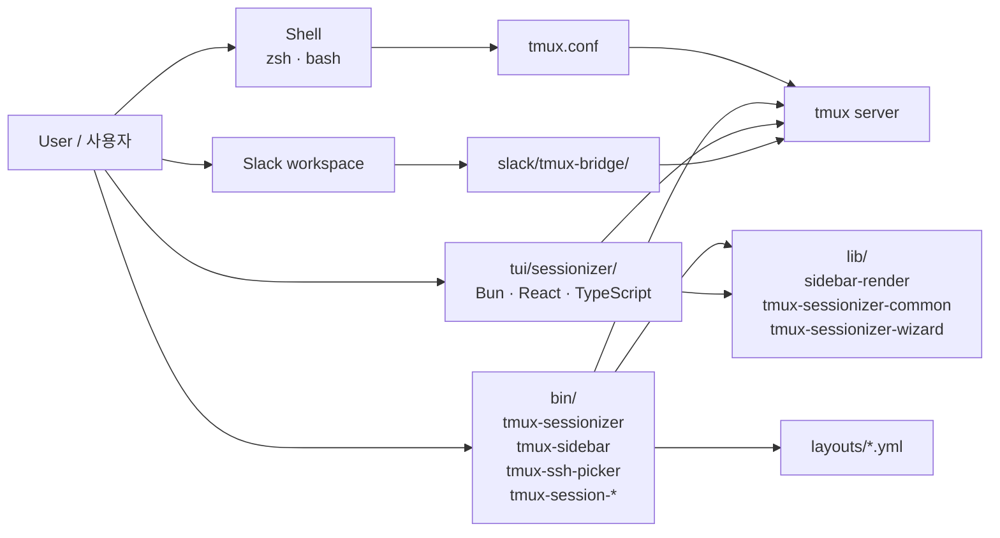

# tmux Productivity Suite / tmux 생산성 도구 모음

> A curated, opinionated tmux configuration plus a complete ecosystem of companion tools, shared libraries, declarative YAML layouts, a Bun/React/TypeScript TUI, and a Slack bridge — all designed for power users working across many projects and remote hosts.
>
> 큐레이션된 tmux 설정과 함께 동작하는 풍부한 생태계(보조 도구, 공유 라이브러리, 선언적 YAML 레이아웃, Bun/React/TypeScript 기반 TUI, Slack 브리지)를 한 저장소에 담은, 다수 프로젝트와 원격 호스트를 다루는 파워 유저용 환경입니다.

---

## Table of Contents / 목차

- [Overview / 개요](#overview--개요)
- [Features / 기능](#features--기능)
- [Architecture / 아키텍처](#architecture--아키텍처)
- [Repository Layout / 저장소 구조](#repository-layout--저장소-구조)
- [Quick Start / 빠른 시작](#quick-start--빠른-시작)
- [Configuration / 설정](#configuration--설정)
- [Commands Reference / 명령어 레퍼런스](#commands-reference--명령어-레퍼런스)
- [Layouts / 레이아웃](#layouts--레이아웃)
- [TUI Sessionizer / 터미널 UI 세션나이저](#tui-sessionizer--터미널-ui-세션나이저)
- [Slack Bridge / 슬랙 브리지](#slack-bridge--슬랙-브리지)
- [Local Development / 로컬 개발](#local-development--로컬-개발)
- [Testing / 테스트](#testing--테스트)
- [Contributing / 기여](#contributing--기여)
- [License / 라이선스](#license--라이선스)

---

## Overview / 개요

This repository bundles a battle-tested `tmux.conf`, a `sessionizer.conf` for project discovery, and a curated set of companion binaries under `bin/`. It ships shared shell libraries under `lib/`, project-style window layouts under `layouts/`, a modern Terminal UI (`tui/sessionizer/`), and a Slack ↔ tmux bridge (`slack/tmux-bridge/`).

이 저장소는 실전에서 검증된 `tmux.conf`, 프로젝트 검색을 위한 `sessionizer.conf`, 그리고 `bin/` 디렉터리의 큐레이션된 보조 바이너리들을 함께 제공합니다. `lib/`의 공유 셸 라이브러리, `layouts/`의 프로젝트형 윈도우 레이아웃, 모던 터미널 UI(`tui/sessionizer/`), 그리고 Slack ↔ tmux 브리지(`slack/tmux-bridge/`)가 한 곳에서 동작합니다.

### Who is this for? / 사용 대상

| Audience / 대상 | Use case / 활용 사례 |
| --- | --- |
| Multi-project developers / 다수 프로젝트 개발자 | Jump between repos, save layouts per project, fast session creation / 저장소 간 빠른 이동, 프로젝트별 레이아웃, 빠른 세션 생성 |
| DevOps / SRE engineers / DevOps·SRE 엔지니어 | SSH picker, per-host layouts, system stats, sidebar remote switching / SSH 픽커, 호스트별 레이아웃, 시스템 통계, 원격 사이드바 전환 |
| Long-running command users / 장시간 명령 사용자 | Notifications when commands finish, command palette, clipboard history / 명령 종료 알림, 커맨드 팔레트, 클립보드 히스토리 |
| Collaborative teams / 협업 팀 | Slack bridge for shared tmux sessions, exported session logs / 공유 tmux 세션을 위한 Slack 브리지, 세션 로그 내보내기 |
| TUI enthusiasts / TUI 애호가 | A modern React-based sessionizer with fuzzy search and previews / 퍼지 검색과 프리뷰를 갖춘 모던 React 기반 세션나이저 |

---

## Features / 기능

- **Curated tmux config / 큐레이션된 tmux 설정** — A single `tmux.conf` tuned for status bar, prefix, mode-style, mouse, and copy-mode ergonomics. / 상태 표시줄, 프리픽스, 모드 스타일, 마우스, 복사 모드 사용성에 최적화된 단일 `tmux.conf`.
- **Project discovery / 프로젝트 검색** — `sessionizer.conf` controls roots, ignore globs, and heuristics used by both the shell and TUI sessionizers. / `sessionizer.conf`는 셸 세션나이저와 TUI 세션나이저가 함께 사용하는 루트, 무시 글롭, 휴리스틱을 정의합니다.
- **Session management / 세션 관리** — create, rename, jump, cycle, kill, sync, branch-log, order, icon, export, dashboard, sidebar, jump. / 생성, 이름 변경, 점프, 순환, 종료, 동기화, 브랜치 로그, 순서, 아이콘, 내보내기, 대시보드, 사이드바, 점프.
- **Layouts as YAML / YAML 레이아웃** — Declarative window/pane layouts per project archetype (`default`, `proxmox`, `splunk`, `safework*`, `resume`, `blacklist`). / 프로젝트 유형별 선언적 윈도우/페인 레이아웃 (`default`, `proxmox`, `splunk`, `safework*`, `resume`, `blacklist`).
- **TUI Sessionizer / TUI 세션나이저** — A Bun + React + TypeScript terminal UI with fuzzy filter, live preview, create wizard, rename dialog, and kill confirmation. / 퍼지 필터, 라이브 프리뷰, 생성 마법사, 이름 변경 다이얼로그, 종료 확인을 갖춘 Bun + React + TypeScript TUI.
- **Slack bridge / 슬랙 브리지** — Wire a tmux session into Slack so a shared thread becomes a remote terminal surface. / tmux 세션을 슬랙과 연결해 공유 스레드를 원격 터미널로 활용.
- **Productivity helpers / 생산성 보조** — auto-attach, bash preexec, command palette, command-notification, copy-word, file-open, URL open, responsive resizes, sidebar toggle. / 자동 attach, bash preexec, 커맨드 팔레트, 명령 알림, 단어 복사, 파일 열기, URL 열기, 반응형 리사이즈, 사이드바 토글.
- **System awareness / 시스템 인지** — `tmux-sys-stats`, `tmux-git-status`, `tmux-git-uncommitted` for live status hooks. / 상태 표시줄 훅을 위한 `tmux-sys-stats`, `tmux-git-status`, `tmux-git-uncommitted`.

---

## Architecture / 아키텍처

The suite is organized in layers. The `tmux` server runs on top of the user's shell; `tmux.conf` defines its key bindings and status hooks. The `bin/` executables are the user-facing tools; they delegate reusable logic to `lib/`. The `tui/sessionizer/` Bun app is an alternative frontend that talks to the same `tmux` server via the shell pipeline. The `slack/tmux-bridge/` component connects an external messaging client to a tmux session. Declarative `layouts/*.yml` files are read by `tmux-layout-apply` to instantiate named pane configurations.

전체 구조는 계층적으로 설계되었습니다. `tmux` 서버는 사용자 셸 위에서 동작하며 `tmux.conf`가 키 바인딩과 상태 훅을 정의합니다. `bin/` 실행 파일들이 사용자가 직접 호출하는 도구이며, 재사용 가능한 로직은 `lib/`로 위임합니다. `tui/sessionizer/` Bun 앱은 동일한 `tmux` 서버에 셸 파이프라인을 통해 접근하는 대안 프런트엔드입니다. `slack/tmux-bridge/`는 외부 메신저를 tmux 세션에 연결합니다. 선언적 `layouts/*.yml` 파일은 `tmux-layout-apply`가 읽어 명명된 페인 구성을 인스턴스화합니다.



---

## Repository Layout / 저장소 구조

```
/
├── AGENTS.md                       # Contributor / agent notes / 기여자·에이전트 메모
├── CONTRIBUTING.md                 # Contribution guidelines / 기여 가이드
├── LICENSE                         # Project license / 라이선스
├── OWNERS                          # Code ownership / 코드 오너십
├── README.md                       # This document / 본 문서
├── sessionizer.conf                # Project discovery config / 프로젝트 검색 설정
├── tmux.conf                       # Main tmux configuration / tmux 메인 설정
│
├── bin/                            # Executable companion tools / 실행 가능한 보조 도구
│   ├── tmux-auto-attach            # Auto-attach to a session / 세션 자동 attach
│   ├── tmux-bash-preexec           # bash preexec hooks / bash preexec 훅
│   ├── tmux-cheatsheet             # Cheatsheet popup / 단축키 시트 팝업
│   ├── tmux-clipboard-history      # Clipboard history / 클립보드 히스토리
│   ├── tmux-command-palette        # Command palette / 커맨드 팔레트
│   ├── tmux-config-reload          # Live reload tmux.conf / tmux.conf 실시간 리로드
│   ├── tmux-copy-word              # Copy word under cursor / 커서 아래 단어 복사
│   ├── tmux-file-open              # Open file under cursor / 커서 아래 파일 열기
│   ├── tmux-git-status             # Git status hook / Git 상태 훅
│   ├── tmux-git-uncommitted        # Uncommitted-changes hook / 미커밋 변경 훅
│   ├── tmux-layout-apply           # Apply a YAML layout / YAML 레이아웃 적용
│   ├── tmux-notify-long-command    # Notify on long commands / 장시간 명령 알림
│   ├── tmux-opencode               # Open the local project / 로컬 프로젝트 열기
│   ├── tmux-pane-sync              # Synchronize panes / 페인 동기화
│   ├── tmux-responsive             # Responsive resize helper / 반응형 리사이즈 도우미
│   ├── tmux-session-branch-log     # Branch-aware session log / 브랜치 인지 세션 로그
│   ├── tmux-session-cycle          # Cycle between sessions / 세션 순환
│   ├── tmux-session-dashboard      # Session dashboard / 세션 대시보드
│   ├── tmux-session-export         # Export session metadata / 세션 메타데이터 내보내기
│   ├── tmux-session-icon           # Session icon helper / 세션 아이콘 도우미
│   ├── tmux-session-jump           # Jump to a session / 세션으로 점프
│   ├── tmux-session-kill           # Kill a session / 세션 종료
│   ├── tmux-session-order          # Reorder sessions / 세션 순서 변경
│   ├── tmux-session-rename         # Rename a session / 세션 이름 변경
│   ├── tmux-session-sync           # Sync a session across clients / 클라이언트 간 세션 동기화
│   ├── tmux-sessionizer            # Shell sessionizer / 셸 세션나이저
│   ├── tmux-sessionizer-tui        # Launcher for the TUI / TUI 실행기
│   ├── tmux-sidebar                # Sidebar renderer / 사이드바 렌더러
│   ├── tmux-sidebar-init           # Sidebar bootstrap / 사이드바 부트스트랩
│   ├── tmux-sidebar-toggle         # Sidebar show/hide / 사이드바 표시/숨김
│   ├── tmux-slack-bridge-setup     # Bridge installer / 브리지 설치기
│   ├── tmux-slack-bridge-start     # Bridge runner / 브리지 실행기
│   ├── tmux-ssh-picker             # Pick SSH host / SSH 호스트 선택
│   ├── tmux-sys-stats              # System stats hook / 시스템 통계 훅
│   ├── tmux-template-create        # Create from template / 템플릿에서 생성
│   ├── tmux-url-open               # Open URL under cursor / 커서 아래 URL 열기
│   └── tmux-web-terminal           # Web terminal entry / 웹 터미널 진입
│
├── lib/                            # Shared shell libraries / 공유 셸 라이브러리
│   ├── sidebar-colors
│   ├── sidebar-render
│   ├── tmux-sessionizer-common
│   └── tmux-sessionizer-wizard
│
├── layouts/                        # Declarative project layouts / 선언적 프로젝트 레이아웃
│   ├── blacklist.yml               # Excluded paths / 제외 경로
│   ├── default.yml                 # Default 3-pane layout / 기본 3-페인 레이아웃
│   ├── proxmox.yml                 # Proxmox-oriented layout / Proxmox 전용 레이아웃
│   ├── resume.yml                  # Resume-focused layout / 이력서 작업용 레이아웃
│   ├── safework.yml                # Safe-work environment / 안전 작업 환경
│   ├── safework2.yml               # Safe-work variant / 안전 작업 환경 변형
│   └── splunk.yml                  # Splunk workspace / Splunk 워크스페이스
│
├── tui/                            # TUI sessionizer
│   └── sessionizer/                # Bun + React + TypeScript app
│       ├── AGENTS.md
│       ├── package.json
│       ├── bunfig.toml
│       ├── tsconfig.json
│       ├── src/                    # Components, hooks, actions, lib
│       └── __tests__/              # Bun test suite
│
├── docs/                           # Design notes / 설계 메모
│   ├── session-persistence-brainstorming.md
│   └── supermemory-governance.md
│
└── slack/                          # Slack integration
    └── tmux-bridge/                # Slack ↔ tmux bridge
        └── AGENTS.md
```

---

## Quick Start / 빠른 시작

### Prerequisites / 사전 요구사항

- `tmux` 3.x or newer / `tmux` 3.x 이상
- A POSIX shell (`bash` or `zsh`)
- `git`, `fzf` (recommended for picking), `ssh`
- For the TUI: [Bun](https://bun.sh) ≥ 1.0
- For the Slack bridge: a workspace bot token with the scopes required by your bridge config / 브리지 설정에 명시된 스코프를 가진 워크스페이스 봇 토큰

### Install / 설치

1. Clone the repository into `~/.tmux` (or any location you prefer). / 저장소를 `~/.tmux` (또는 원하는 위치)로 클론합니다.

   ```sh
   git clone <repo-url> ~/.tmux
   ```

2. Add a single line to your shell rc to load the suite. / 셸 rc에 다음 한 줄을 추가합니다.

   ```sh
   # ~/.zshrc or ~/.bashrc
   export TMUX_SUITE="$HOME/.tmux"
   source "$TMUX_SUITE/tmux.conf"   # inside tmux, prefer `tmux source-file`
   ```

3. Inside tmux, source the configuration. / tmux 내부에서 설정을 다시 로드합니다.

   ```sh
   tmux source-file ~/.tmux/tmux.conf
   ```

4. Make the binaries executable on first use. / 최초 사용 시 실행 권한을 부여합니다.

   ```sh
   chmod +x ~/.tmux/bin/* ~/.tmux/lib/*
   ```

5. (Optional) Build the TUI. / (선택) TUI를 빌드합니다.

   ```sh
   cd ~/.tmux/tui/sessionizer
   bun install
   bun run build
   ```

### First session / 첫 세션 만들기

```sh
# From a tmux session:
prefix + S          # default binding for tmux-sessionizer
# Or run the TUI:
~/.tmux/bin/tmux-sessionizer-tui
# Or call the shell sessionizer directly:
~/.tmux/bin/tmux-sessionizer
```

---

## Configuration / 설정

### `tmux.conf`

The main file controls the prefix, status-line hooks, key bindings, and copies-mode styling. Most options are documented inline in the file. / 메인 파일은 프리픽스, 상태 표시줄 훅, 키 바인딩, 복사 모드 스타일을 제어합니다. 대부분의 옵션은 파일 내부에 주석으로 설명되어 있습니다.

### `sessionizer.conf`

Drives both `bin/tmux-sessionizer` and the TUI. Typical keys:

| Key | Purpose / 용도 | Example |
| --- | --- | --- |
| `roots` | Directories to search / 검색 대상 디렉터리 | `~/code`, `~/work` |
| `ignore` | Glob patterns to skip / 건너뛸 글롭 패턴 | `node_modules`, `.git` |
| `depth` | Recursion depth / 재귀 깊이 | `4` |
| `max` | Maximum candidates / 최대 후보 수 | `500` |
| `preview_cmd` | Command used by the TUI preview / TUI 프리뷰에 사용할 명령 | `ls -la` |

### Environment variables / 환경 변수

| Variable | Purpose / 용도 |
| --- | --- |
| `TMUX_SUITE` | Root path of this repository / 저장소 루트 경로 |
| `TMUX_LAYOUTS_DIR` | Override `layouts/` location / `layouts/` 위치 재정의 |
| `TMUX_SIDEBAR_HOSTS` | Comma-separated host list for the sidebar / 사이드바에 표시할 호스트 목록 |
| `TMUX_SLACK_TOKEN` | Slack bridge token / Slack 브리지 토큰 |

---

## Commands Reference / 명령어 레퍼런스

All `bin/` scripts are designed to run either from inside tmux or from a plain shell. They print a single line of usage on `-h` / `--help`. / 모든 `bin/` 스크립트는 tmux 내부 또는 일반 셸에서 실행할 수 있으며, `-h` / `--help` 시 한 줄 사용법을 출력합니다.

### Session lifecycle / 세션 생명주기

| Command / 명령 | Purpose / 용도 |
| --- | --- |
| `tmux-sessionizer` | Fuzzy-pick a project and create/attach a session / 프로젝트를 퍼지로 골라 세션 생성 또는 attach |
| `tmux-sessionizer-tui` | Launch the React/Bun sessionizer / React/Bun 세션나이저 실행 |
| `tmux-auto-attach` | Auto-attach on shell startup / 셸 시작 시 자동 attach |
| `tmux-session-rename <name>` | Rename the current session / 현재 세션 이름 변경 |
| `tmux-session-kill <name>` | Kill a named session / 명명된 세션 종료 |
| `tmux-session-jump` | Jump to a session by partial name / 부분 이름으로 세션 점프 |
| `tmux-session-cycle` | Cycle through active sessions / 활성 세션 순환 |
| `tmux-session-order` | Reorder sessions interactively / 세션 순서 대화형 변경 |
| `tmux-session-icon` | Set a per-session icon / 세션별 아이콘 설정 |
| `tmux-session-dashboard` | Open a session dashboard / 세션 대시보드 열기 |
| `tmux-session-export` | Export session metadata as JSON/YAML / 세션 메타데이터를 JSON/YAML로 내보내기 |
| `tmux-session-branch-log` | Append git branch to session log / git 브랜치를 세션 로그에 기록 |
| `tmux-session-sync` | Replicate session state across clients / 클라이언트 간 세션 상태 복제 |

### Pane & layout / 페인·레이아웃

| Command / 명령 | Purpose / 용도 |
| --- | --- |
| `tmux-layout-apply <name>` | Apply a YAML layout from `layouts/` / `layouts/`의 YAML 레이아웃 적용 |
| `tmux-pane-sync` | Toggle synchronized panes / 동기화된 페인 토글 |
| `tmux-responsive` | Recompute pane sizes for new terminal dimensions / 새 터미널 크기에 맞춰 페인 재계산 |
| `tmux-template-create` | Scaffold a new layout from a template / 템플릿에서 새 레이아웃 스캐폴드 |

### Sidebar / 사이드바

| Command / 명령 | Purpose / 용도 |
| --- | --- |
| `tmux-sidebar` | Render the sidebar / 사이드바 렌더링 |
| `tmux-sidebar-init` | One-time sidebar bootstrap / 1회성 사이드바 부트스트랩 |
| `tmux-sidebar-toggle` | Show or hide the sidebar / 사이드바 표시/숨김 |

### Productivity / 생산성

| Command / 명령 | Purpose / 용도 |
| --- | --- |
| `tmux-command-palette` | Open the command palette / 커맨드 팔레트 열기 |
| `tmux-cheatsheet` | Show binding cheatsheet / 키 바인딩 시트 표시 |
| `tmux-clipboard-history` | Browse clipboard history / 클립보드 히스토리 탐색 |
| `tmux-copy-word` | Copy word under cursor / 커서 아래 단어 복사 |
| `tmux-file-open` | Open path under cursor / 커서 아래 경로 열기 |
| `tmux-url-open` | Open URL under cursor / 커서 아래 URL 열기 |
| `tmux-web-terminal` | Start a web terminal entrypoint / 웹 터미널 진입점 시작 |
| `tmux-opencode` | Open a local project quickly / 로컬 프로젝트 빠르게 열기 |
| `tmux-notify-long-command` | Desktop-notify when a long command finishes / 장시간 명령 종료 시 데스크톱 알림 |
| `tmux-config-reload` | Reload `tmux.conf` without detaching / detach 없이 `tmux.conf` 리로드 |
| `tmux-ssh-picker` | Pick and SSH to a known host / 등록된 호스트를 골라 SSH 접속 |
| `tmux-sys-stats` | Print system stats (status hook) / 시스템 통계 출력 (상태 훅) |

### Git hooks / Git 훅

| Command / 명령 | Purpose / 용도 |
| --- | --- |
| `tmux-git-status` | Display git status for the current path / 현재 경로의 git 상태 표시 |
| `tmux-git-uncommitted` | Show uncommitted-change indicator / 미커밋 변경 표시 |

### Slack bridge / 슬랙 브리지

| Command / 명령 | Purpose / 용도 |
| --- | --- |
| `tmux-slack-bridge-setup` | One-time bridge configuration / 1회성 브리지 설정 |
| `tmux-slack-bridge-start` | Start the bridge against a session / 세션에 대해 브리지 시작 |

---

## Layouts / 레이아웃

Each file under `layouts/` is a YAML document describing windows and panes. They are interpreted by `tmux-layout-apply`. / `layouts/` 아래 각 파일은 윈도우와 페인을 기술한 YAML 문서이며 `tmux-layout-apply`가 해석합니다.

| Layout | Intended use / 용도 |
| --- | --- |
| `default.yml` | Generic 3-pane: editor / shell / logs / 일반 3-페인(에디터·셸·로그) |
| `proxmox.yml` | Proxmox nodes and cluster operations / Proxmox 노드·클러스터 운영 |
| `splunk.yml` | SPL searches and dashboards / SPL 검색·대시보드 |
| `safework.yml` | Isolated, read-only workspace / 격리된 읽기 전용 작업 공간 |
| `safework2.yml` | Variant of `safework.yml` / `safework.yml` 변형 |
| `resume.yml` | Resume/CV authoring workspace / 이력서 작성 워크스페이스 |
| `blacklist.yml` | Negative list applied during session discovery / 세션 검색 시 차단 목록 |

Example layout shape / 예시 형태:

```yaml
name: default
windows:
  - name: editor
    panes:
      - cmd: "$EDITOR"
      - cmd: "git status -sb; watch -n 5 git fetch --all"
        split: vertical
  - name: logs
    panes:
      - cmd: "tail -F /tmp/app.log"
```

---

## TUI Sessionizer / 터미널 UI 세션나이저

`tui/sessionizer/` is a Bun + React + TypeScript terminal app. It is launched by `bin/tmux-sessionizer-tui` and reads the same `sessionizer.conf` as the shell sessionizer. / `tui/sessionizer/`는 Bun + React + TypeScript 터미널 앱이며 `bin/tmux-sessionizer-tui`로 실행되며 셸 세션나이저와 동일한 `sessionizer.conf`를 읽습니다.

### Highlights / 주요 기능

- Fuzzy filter on discovered directories / 검색된 디렉터리의 퍼지 필터
- Live preview panel that runs a preview command in the focused candidate / 포커스된 후보에서 미리보기 명령을 실행하는 라이브 프리뷰 패널
- Multi-step create wizard: name → directory → layout / 다단계 생성 마법사: 이름 → 디렉터리 → 레이아웃
- Rename dialog and kill-confirmation dialog / 이름 변경·종료 확인 다이얼로그
- Theme and color overrides via `theme.ts` / `theme.ts`를 통한 테마·색상 재정의

### Layout / 구조

```
tui/sessionizer/
├── src/
│   ├── App.tsx                    # Root component / 루트 컴포넌트
│   ├── index.tsx                  # Entry point / 진입점
│   ├── components/                # UI components / UI 컴포넌트
│   ├── hooks/                     # Keyboard and lifecycle hooks / 키보드·생명주기 훅
│   ├── actions/                   # Imperative actions / 명령형 액션
│   └── lib/                       # Config, tmux bridge, theme / 설정·tmux 브리지·테마
└── __tests__/                     # Bun test suites / Bun 테스트 스위트
```

### Running / 실행

```sh
cd tui/sessionizer
bun install
bun run dev          # development with HMR
bun run build        # production build
bun run start        # run the built TUI
bun test             # run the test suite
```

---

## Slack Bridge / 슬랙 브리지

`slack/tmux-bridge/` wires a tmux session to a Slack channel or thread. Incoming messages become tmux input; tmux output is streamed back into Slack. / `slack/tmux-bridge/`는 tmux 세션을 슬랙 채널 또는 스레드에 연결합니다. 수신 메시지는 tmux 입력이 되고 tmux 출력은 슬랙으로 다시 스트리밍됩니다.

### Setup / 설정

```sh
# 1. Configure the bridge
~/.tmux/bin/tmux-slack-bridge-setup

# 2. Source your token (do not commit it)
export TMUX_SLACK_TOKEN="xoxb-..."

# 3. Attach a session
~/.tmux/bin/tmux-slack-bridge-start --session myproject
```

See `slack/tmux-bridge/AGENTS.md` for the implementation contract and message-routing notes. / 구현 계약과 메시지 라우팅 메모는 `slack/tmux-bridge/AGENTS.md`를 참고하세요.

---

## Local Development / 로컬 개발

### Edit a script / 스크립트 수정

The scripts in `bin/` and `lib/` are POSIX shell. Most include a small `usage()` function that prints on `-h`. You can iterate like this: / `bin/`과 `lib/` 스크립트는 POSIX 셸로 작성되었으며 대부분 `-h` 시 사용법을 출력하는 `usage()` 함수를 포함합니다. 다음과 같이 반복 개발합니다.

```sh
# In one shell
watch -n 1 ~/.tmux/bin/tmux-sessionizer

# In another
tmux source-file ~/.tmux/tmux.conf
```

### Edit the TUI / TUI 수정

```sh
cd tui/sessionizer
bun install
bun run dev
```

HMR reloads components on save; the tmux command path is exercised through `src/lib/tmux.ts` and `src/actions/session-actions.ts`. / HMR은 저장 시 컴포넌트를 다시 로드하며 tmux 명령 경로는 `src/lib/tmux.ts`와 `src/actions/session-actions.ts`를 통해 검증됩니다.

### Edit a layout / 레이아웃 수정

Modify a YAML file under `layouts/` and reload with `tmux-layout-apply <name>`. / `layouts/` 아래 YAML 파일을 수정한 뒤 `tmux-layout-apply <name>`으로 다시 적용합니다.

---

## Testing / 테스트

- Shell tooling: smoke-test the relevant script with `-h` and a representative path; no formal unit harness ships with the shell layer. / 셸 도구: `-h`와 대표 경로로 스모크 테스트합니다. 셸 계층에는 정식 단위 하네스가 포함되어 있지 않습니다.
- TUI: / TUI:
  ```sh
  cd tui/sessionizer
  bun test
  ```
  The provided suites cover config parsing (`config.test.ts`) and tmux bridging helpers (`tmux.test.ts`). / 제공된 스위트는 설정 파싱(`config.test.ts`)과 tmux 브리지 헬퍼(`tmux.test.ts`)를 다룹니다.
- Layouts: apply each layout against a throwaway session and visually verify pane geometry. / 레이아웃: 임시 세션에 각 레이아웃을 적용하고 페인 형식을 시각적으로 검증합니다.

---

## Contributing / 기여

Please read [`CONTRIBUTING.md`](./CONTRIBUTING.md) and the project-specific notes in [`AGENTS.md`](./AGENTS.md), `tui/sessionizer/AGENTS.md`, and `slack/tmux-bridge/AGENTS.md` before opening a pull request. / Pull Request를 열기 전에 [`CONTRIBUTING.md`](./CONTRIBUTING.md)와 [`AGENTS.md`](./AGENTS.md), `tui/sessionizer/AGENTS.md`, `slack/tmux-bridge/AGENTS.md`의 프로젝트별 메모를 먼저 읽어 주세요.

Code ownership is tracked in [`OWNERS`](./OWNERS). When in doubt, route reviews through the listed owners for the area you are touching. / 코드 오너십은 [`OWNERS`](./OWNERS)에 기록되어 있습니다. 변경 영역의 오너에게 리뷰를 요청하세요.

---

## License / 라이선스

Released under the terms described in [`LICENSE`](./LICENSE). / [`LICENSE`](./LICENSE)에 명시된 조건에 따라 배포됩니다.