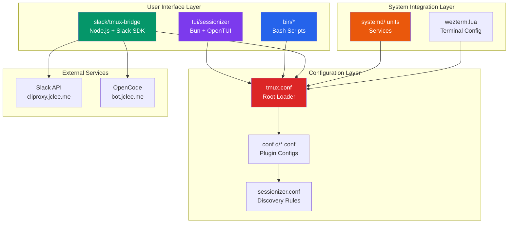

# TMUX SESSIONIZER

<!-- Logo Tagline -->
> bash-first tmux configuration and session-management toolkit

---

## Overview

**TMUX SESSIONIZER** is a comprehensive tmux configuration system designed for developers who work with multiple projects and sessions. It provides a unified interface for session discovery, creation, and management, with deep integrations for Slack, system services, and terminal UI applications.

The project is structured as a symlinked `~/.tmux` directory with a plugin-style architecture where core behavior lives in `conf.d/*.conf` and `bin/*` scripts. A nested Bun/OpenTUI sessionizer TUI runs at `tui/sessionizer`, and a Node.js Slack bridge operates at `slack/tmux-bridge`.

---

## 개요 (Korean)

**TMUX SESSIONIZER**는 여러 프로젝트와 세션으로 작업하는 개발자를 위해 설계된 종합 tmux 구성 시스템입니다. Slack, 시스템 서비스 및 터미널 UI 애플리케이션과의 심층 통합을 통해 세션 검색, 생성 및 관리를 위한 통합 인터페이스를 제공합니다.

프로젝트는 심볼릭 링크된 `~/.tmux` 디렉토리로 구조화되어 있으며, 플러그인 스타일 아키텍처에서 핵심 동작은 `conf.d/*.conf` 및 `bin/*` 스크립트에 있습니다. 중첩된 Bun/OpenTUI 세션라이저 TUI는 `tui/sessionizer`에서 실행되고, Node.js Slack 브리지는 `slack/tmux-bridge`에서 운영됩니다.

---

## Features

### Session Management

- **Intelligent Session Discovery**: Auto-scan configured directories for git repositories and project folders
- **Fuzzy Session Picker**: fzf-based session selection with preview and instant filtering
- **Session Creation Wizard**: Interactive multi-step wizard for new session setup
- **MRU Session Jump**: Quickly access most recently used sessions
- **Session Templates**: Create sessions from predefined layout templates
- **Session Export/Import**: Save and restore session window/pane layouts as YAML

### Terminal UI (TUI) Application

- **OpenTUI-based Interface**: Modern terminal user interface built with Bun and OpenTUI
- **Preview Panel**: Real-time preview of session contents and windows
- **Kill Confirmation**: Safe session termination with confirmation dialogs
- **Rename Support**: Rename existing sessions with validation
- **Layout Selection**: Visual layout picker for new sessions

### Slack Integration

- **Real-time Sync**: Bi-directional tmux session ↔ Slack channel synchronization
- **Desktop Notifications**: Get notified of important events in sessions
- **Modal Interactions**: Interactive Slack modals for session management
- **Command Interface**: Slash commands for tmux operations from Slack

### System Services

- **Automatic Session Restore**: Rescue sessions after system reboot
- **Session Watcher**: Monitor and react to session changes
- **Web Terminal**: ttyd-based web terminal for remote access
- **Idle Detection**: Track idle time and auto-archive stale sessions

---

## Architecture



---

## Repository Structure

```
tmux-sessionizer/
├── AGENTS.md                    # Project knowledge base
├── CONTRIBUTING.md              # Contribution guidelines
├── LICENSE                      # MIT License
├── OWNERS                       # Code ownership
├── README.md                    # This file
├── sessionizer.conf             # Session discovery configuration
├── tmux.conf                    # Root tmux configuration
│
├── tui/
│   └── sessionizer/
│       ├── AGENTS.md
│       ├── bun.lock
│       ├── bunfig.toml
│       ├── package.json
│       ├── tsconfig.json
│       ├── __tests__/
│       │   ├── config.test.ts
│       │   └── tmux.test.ts
│       └── src/
│           ├── App.tsx
│           ├── index.tsx
│           ├── lib/
│           │   ├── config.ts
│           │   ├── create-session.ts
│           │   ├── dirs.ts
│           │   ├── state.ts
│           │   ├── theme.ts
│           │   └── tmux.ts
│           ├── actions/
│           │   └── session-actions.ts
│           ├── hooks/
│           │   └── use-keyboard-handler.ts
│           └── components/
│               ├── create-wizard.tsx
│               ├── filter-input.tsx
│               ├── kill-confirm-dialog.tsx
│               ├── preview-panel.tsx
│               ├── rename-dialog.tsx
│               ├── session-list.tsx
│               ├── wizard-step-dir.tsx
│               ├── wizard-step-layout.tsx
│               └── wizard-step-name.tsx
│
├── wezterm/
│   └── wezterm.lua
│
├── systemd/
│   ├── tmux-resurrect-save.service
│   ├── tmux-resurrect-save.sh
│   ├── tmux-server.service
│   ├── tmux-session-watch.path
│   ├── tmux-session-watch.service
│   ├── tmux-slack-bridge.service
│   ├── tmux-web-terminal.service
│
└── slack/
    └── tmux-bridge/
        ├── AGENTS.md
        ├── SETUP.md
        ├── bun.lock
        ├── package-lock.json
        ├── package.json
        ├── tsconfig.json
        ├── vitest.config.ts
        └── src/
            ├── index.ts
            ├── types.ts
            ├── __tests__/
            ├── lib/
            │   ├── channels.ts
            │   ├── config.ts
            │   ├── idle-monitor.ts
            │   ├── opencode.ts
            │   ├── tmux.ts
            │   └── formatter/
            ├── actions/
            │   ├── handler.ts
            │   ├── helpers.ts
            │   ├── index.ts
            │   └── handlers/
            └── commands/
                ├── handler.ts
                ├── index.ts
                └── parser.ts
```

---

## Automation Inventory

### CI/CD Workflows

| Workflow File | Purpose |
|---------------|---------|
| `01_branch-to-pr.yml` | Convert feature branches to pull requests |
| `02_issue-to-branch.yml` | Create branches from issue assignments |
| `03_pr-checks.yml` | Run PR validation checks |
| `04_actionlint.yml` | Lint GitHub Actions workflow files |
| `05_gitleaks.yml` | Scan for secrets/credentials in code |
| `06_codeql.yml` | GitHub CodeQL security analysis |
| `07_dependency-review.yml` | Review dependency changes for vulnerabilities |
| `08_scorecard.yml` | OpenSSF Scorecard security assessment |
| `09_semantic-pr.yml` | Enforce semantic PR title format |
| `10_pr-review.yml` | AI-powered PR review automation |
| `12_dependabot-auto-merge.yml` | Auto-merge Dependabot updates |
| `13_pr-auto-merge.yml` | Auto-merge approved PRs |
| `14_bot-auto-fix.yml` | Automatic bug fixing via AI |
| `15_merged-pr-cleanup.yml` | Cleanup after PR merge |
| `18_issue-management.yml` | Issue lifecycle automation |
| `19_issue-backfill.yml` | Backfill issue metadata |
| `20_readme-gen.yml` | Generate/update README documentation |
| `21_docs-sync.yml` | Synchronize documentation across repos |
| `24_release-notes.yml` | Generate release notes |
| `25_release-publish.yml` | Publish releases |
| `29_downstream-health-check.yml` | Monitor downstream dependencies |
| `37_ci-failure-issues.yml` | Create issues from CI failures |
| `42_reusable-docs-sync.yml` | Reusable docs sync workflow |
| `43_reusable-issue-management.yml` | Reusable issue management |
| `44_reusable-pr-checks.yml` | Reusable PR checks |
| `45_reusable-gitleaks.yml` | Reusable gitleaks scan |
| `60_ci-auto-heal.yml` | Self-healing CI pipeline |
| `auto-merge.yml` | Generic auto-merge workflow |
| `ci.yml` | Main CI pipeline |
| `labeler.yml` | Auto-label issues/PRs |
| `welcome.yml` | Welcome new contributors |
| `security/11_pr-review.yml` | Security-focused PR review |

### Automation Tools

| Tool | Purpose |
|------|---------|
| **GitHub Actions** | Core CI/CD and automation platform |
| **OpenTUI** | Terminal UI framework for tui/sessionizer |
| **Bun** | JavaScript runtime for TUI and Slack bridge |
| **fzf** | Fuzzy finder for session picking |
| **gitleaks** | Secrets detection in code |
| **CodeQL** | Semantic code analysis engine |
| **Dependabot** | Automated dependency updates |
| **tsup** / **tsx** | TypeScript execution for Slack bridge |

---

## Quick Start

### Prerequisites

- tmux (≥ 3.0)
- bash (≥ 4.0)
- fzf (for CLI session picker)
- Bun (for TUI and Slack bridge)
- Git

### Installation

```bash
# Clone the repository
git clone https://github.com/<owner>/tmux-sessionizer.git ~/.tmux

# Create symlink (optional - enables ~/.tmux as actual config directory)
ln -sf ~/.tmux ~/.tmux

# Install TUI dependencies
cd ~/.tmux/tui/sessionizer && bun install

# Install Slack bridge dependencies
cd ~/.tmux/slack/tmux-bridge && bun install

# Reload tmux configuration
tmux source-file ~/.tmux/tmux.conf
```

### Basic Usage

```bash
# Launch fzf-based session picker
~/.tmux/bin/tmux-sessionizer

# Launch TUI sessionizer
~/.tmux/bin/tmux-sessionizer-tui

# Jump to most recent session
~/.tmux/bin/tmux-session-jump

# Create new session with wizard
~/.tmux/bin/tmux-sessionizer --create

# Kill a session
~/.tmux/bin/tmux-session-kill

# Export session layout
~/.tmux/bin/tmux-session-export > my-layout.yaml

# Apply layout template
~/.tmux/bin/tmux-layout-apply my-layout.yaml
```

---

## Local Development

### Setting Up Development Environment

```bash
# Install tmux (macOS)
brew install tmux

# Install tmux (Ubuntu/Debian)
sudo apt install tmux

# Install fzf
brew install fzf      # macOS
sudo apt install fzf  # Ubuntu/Debian

# Install Bun
curl -fsSL https://bun.sh/install | bash

# Install tmux-resurrect for session persistence
git clone https://github.com/tmux-plugins/tmux-resurrect ~/.tmux/plugins/resurrect
```

### Running Tests

```bash
# TUI tests
cd tui/sessionizer
bun test

# Slack bridge tests
cd slack/tmux-bridge
bun test

# Run with coverage
bun test --coverage
```

### Systemd Service Setup

```bash
# Copy service files to user systemd directory
mkdir -p ~/.config/systemd/user
cp systemd/*.service ~/.config/systemd/user/
cp systemd/*.path ~/.config/systemd/user/

# Reload systemd
systemctl --user daemon-reload

# Enable services
systemctl --user enable tmux-server.service
systemctl --user enable tmux-session-watch.service
systemctl --user enable tmux-resurrect-save.service
```

### Slack Bridge Configuration

```bash
# Run the interactive setup wizard
~/.tmux/bin/tmux-slack-bridge-setup

# Start the bridge manually
~/.tmux/bin/tmux-slack-bridge-start

# Or use the systemd service
systemctl --user start tmux-slack-bridge.service
```

---

## Commands Reference

### Core Session Management

| Command | Description |
|---------|-------------|
| `tmux-sessionizer` | Main fzf-based session picker with creation wizard |
| `tmux-sessionizer-tui` | Launch the OpenTUI-based sessionizer |
| `tmux-session-jump` | Quick MRU session switcher |
| `tmux-session-kill` | Terminate session with confirmation |
| `tmux-session-rename` | Rename existing session |
| `tmux-session-sync` | Sync sessions with Slack channels |
| `tmux-session-export` | Export session layout to YAML |
| `tmux-session-order` | Sort sessions by last activity |

### Session Creation

| Command | Description |
|---------|-------------|
| `tmux-template-create` | Create session from preset template |
| `tmux-layout-apply` | Apply YAML layout to session |
| `tmux-opencode` | Launch OpenCode session |
| `tmux-auto-attach` | Login shell auto-attach flow |

### Sidebar & Navigation

| Command | Description |
|---------|-------------|
| `tmux-sidebar` | Tree sidebar display engine |
| `tmux-sidebar-toggle` | Toggle sidebar visibility |
| `tmux-sidebar-init` | Initialize sidebar on session create |
| `tmux-session-cycle` | PgUp/PgDn session rotation |

### Git Integration

| Command | Description |
|---------|-------------|
| `tmux-git-status` | Show branch + dirty/ahead/behind/stash |
| `tmux-git-uncommitted` | Track uncommitted changes |
| `tmux-session-branch-log` | Log session→branch associations |

### Utilities

| Command | Description |
|---------|-------------|
| `tmux-command-palette` | fzf action picker |
| `tmux-cheatsheet` | Keybinding reference popup |
| `tmux-dashboard` | Formatted session table |
| `tmux-sys-stats` | CPU/MEM for status bar |
| `tmux-url-open` | Extract and open URLs |
| `tmux-file-open` | Extract and open file paths |
| `tmux-ssh-picker` | SSH config host picker |
| `tmux-clipboard-history` | Browse tmux buffer ring |
| `tmux-copy-word` | Copy word under cursor |
| `tmux-pane-sync` | Toggle synchronize-panes |
| `tmux-config-reload` | Reload with settings diff |
| `tmux-notify-long-command` | Desktop notification for long commands |
| `tmux-responsive` | Width-tiered statusbar rendering |
| `tmux-session-icon` | Nerd Font icon mapper |

---

## Contribution Guide

### Getting Started

1. Fork the repository
2. Clone your fork: `git clone https://github.com/<your-username>/tmux-sessionizer.git`
3. Create a feature branch: `git checkout -b feat/my-feature`
4. Make your changes
5. Run tests: `bun test` in respective subdirectories
6. Commit using conventional commits format
7. Push and create a PR

### Code Style

- **Bash scripts**: Follow Google Shell Style Guide
- **TypeScript**: Use strict mode, follow project tsconfig settings
- **Configuration**: conf.d files use numbered prefix for load order

### Pull Request Process

1. Ensure all CI checks pass (see `03_pr-checks.yml`)
2. Update documentation if needed
3. PR title must follow conventional commits (e.g., `feat:`, `fix:`, `docs:`)
4. Request review from code owners
5. Squash and merge after approval

### Reporting Issues

- Use issue templates for bug reports and feature requests
- Include tmux version and OS information
- Attach reproduction steps and relevant logs

### License

This project is licensed under the MIT License - see [LICENSE](LICENSE) for details.

---

## Links

- **AI PR Review**: [qodo-ai/pr-agent](https://github.com/qodo-ai/pr-agent)
- **TUI Backend**: [cliproxy.jclee.me](https://cliproxy.jclee.me)
- **Bot Service**: [bot.jclee.me](https://bot.jclee.me)
