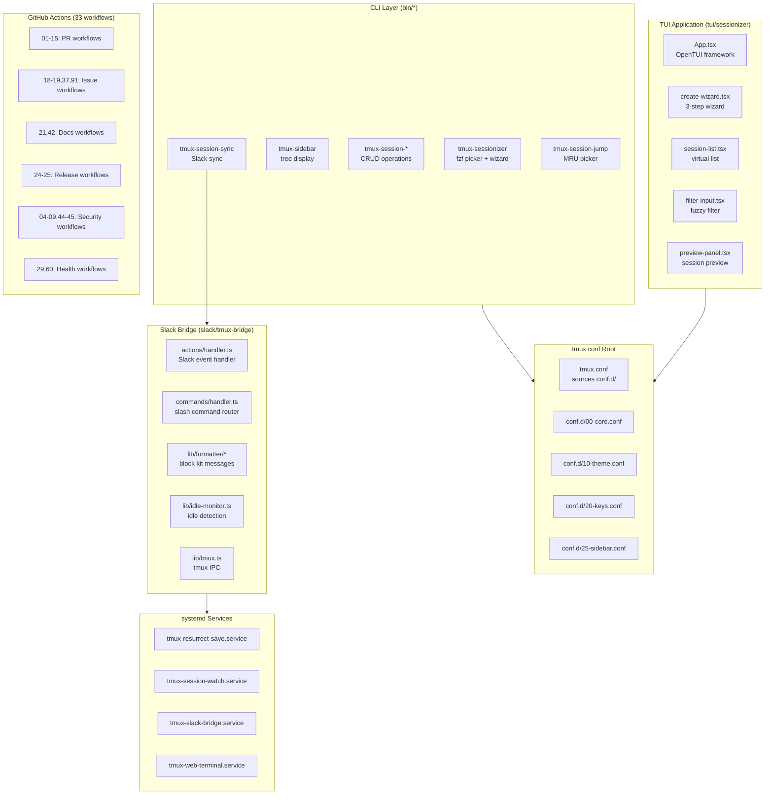
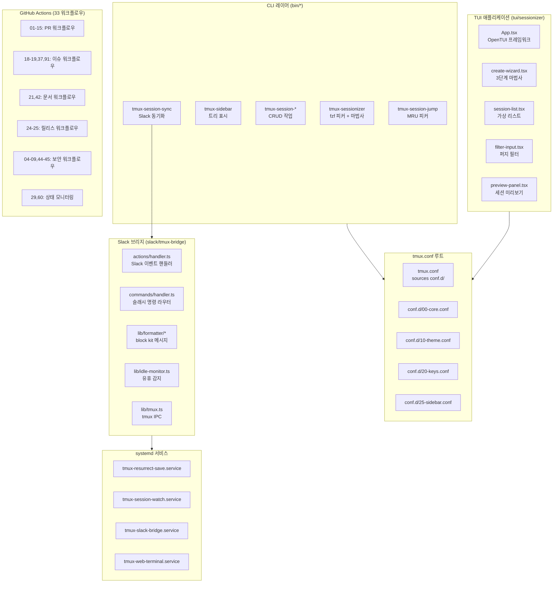

# TMUX SESSIONIZER

[](https://github.com/jclee941/.github/actions/workflows/ci.yml)
[](https://github.com/jclee941/.github/releases)
[](LICENSE)
[](https://bun.sh)
[](https://www.typescriptlang.org/)

> Bash-first tmux configuration and session-management toolkit

---

## Table of Contents

- [Overview](#overview)
- [Features](#features)
- [Architecture](#architecture)
- [Automation Inventory](#automation-inventory)
- [Quick Start](#quick-start)
- [Local Development](#local-development)
- [Commands Reference](#commands-reference)
- [Contribution Guide](#contribution-guide)
- [개요](#개요)
- [기능](#기능)
- [아키텍처](#아키텍처)
- [자동화 인벤토리](#자동화-인벤토리)
- [빠른 시작](#빠른-시작)
- [로컬 개발](#로컬-개발)
- [명령어 참고자료](#명령어-참고자료)
- [기여 가이드](#기여-가이드)

---

## Overview

**TMUX SESSIONIZER** is a comprehensive tmux configuration system designed for developers who work with multiple projects and sessions. It provides a unified interface for session discovery, creation, and management, with deep integrations for Slack, system services, and terminal UI applications.

The project is structured as a symlinked `~/.tmux` directory with a plugin-style architecture where core behavior lives in `conf.d/*.conf` and `bin/*` scripts. A nested Bun/OpenTUI sessionizer TUI runs at `tui/sessionizer`, and a Node.js Slack bridge operates at `slack/tmux-bridge`.

### Key Components

| Component | Technology | Purpose |
|-----------|------------|---------|
| Core Config | tmux.conf | Root loader, sources conf.d/*.conf |
| Session Discovery | Bash + fzf | bin/tmux-sessionizer for picker + wizard |
| TUI Application | Bun + React + OpenTUI | Interactive sessionizer at tui/sessionizer |
| Slack Bridge | Node.js + TypeScript | Real-time session↔Slack sync at slack/tmux-bridge |
| Systemd Services | systemd units | Auto-save, session watch, web terminal |
| Automation | GitHub Actions | 33 workflows for PR, issues, releases, security |

---

## Features

### Core Session Management

- fzf-based session picker with fuzzy search
- Interactive creation wizard (name → directory → layout)
- Session kill with confirmation dialog
- Session rename with validation
- MRU (Most Recently Used) session jump
- Session cycling with PgUp/PgDn

### Sidebar & Visual

- Tree-based sidebar display
- Tokyo Night color theme
- Responsive status bar (width-tiered)
- Pane border status indicators
- Nerd Font icon mapping for sessions

### Slack Integration

- Real-time session↔Slack channel sync
- Interactive modal for session creation from Slack
- Desktop notifications for long-running commands
- Idle monitoring with configurable thresholds

### System Integration

- Systemd services for auto-save, session watch
- ttyd web terminal launcher
- tmux-resurrect automatic save/restore
- Clipboard history browser

### Developer Tools

- Git branch + status in status bar
- Uncommitted change tracking per session
- SSH config host picker
- URL/file path extraction from panes
- Layout export/import (YAML)
- Command palette (fzf action picker)

---

## Architecture



---

## Automation Inventory

### Workflow Files (33 total)

#### PR & Merge Automation

| File | Purpose |
|------|---------|
| `01_branch-to-pr.yml` | Create PR from branch |
| `02_issue-to-branch.yml` | Create branch from issue |
| `03_pr-checks.yml` | Run PR validation checks |
| `09_semantic-pr.yml` | Enforce semantic PR titles |
| `10_pr-review.yml` | AI-powered PR review (qodo-ai/pr-agent) |
| `12_dependabot-auto-merge.yml` | Auto-merge Dependabot PRs |
| `13_pr-auto-merge.yml` | Auto-merge qualified PRs |
| `14_bot-auto-fix.yml` | Auto-fix from bot PRs |
| `15_merged-pr-cleanup.yml` | Cleanup after PR merge |
| `security/11_pr-review.yml` | Security-focused PR review |

#### Issue Automation

| File | Purpose |
|------|---------|
| `18_issue-management.yml` | Issue lifecycle management |
| `19_issue-backfill.yml` | Backfill issue metadata |
| `37_ci-failure-issues.yml` | Create issues from CI failures |
| `43_reusable-issue-management.yml` | Reusable issue management workflow |
| `91_issue-classification.yml` | Classify issues with AI |

#### Documentation Automation

| File | Purpose |
|------|---------|
| `20_readme-gen.yml` | Generate README (this document) |
| `21_docs-sync.yml` | Sync documentation across repos |
| `42_reusable-docs-sync.yml` | Reusable docs sync workflow |

#### Release Automation

| File | Purpose |
|------|---------|
| `24_release-notes.yml` | Generate release notes |
| `25_release-publish.yml` | Publish releases |

#### Security & Compliance

| File | Purpose |
|------|---------|
| `04_actionlint.yml` | Lint GitHub Actions |
| `05_gitleaks.yml` | Scan secrets in code |
| `06_codeql.yml` | CodeQL security analysis |
| `07_dependency-review.yml` | Review dependency changes |
| `08_scorecard.yml` | OpenSSF Scorecard |
| `44_reusable-pr-checks.yml` | Reusable PR checks |
| `45_reusable-gitleaks.yml` | Reusable gitleaks workflow |

#### Health & Monitoring

| File | Purpose |
|------|---------|
| `29_downstream-health-check.yml` | Check downstream repos |
| `60_ci-auto-heal.yml` | Auto-heal CI failures |

#### Utilities

| File | Purpose |
|------|---------|
| `auto-merge.yml` | Generic auto-merge workflow |
| `ci.yml` | Main CI workflow |
| `labeler.yml` | Auto-label PRs/Issues |
| `welcome.yml` | Welcome new contributors |

### Go Automation Tools

None currently configured.

---

## Quick Start

### Prerequisites

- tmux (>= 3.0)
- Bash (>= 4.0)
- fzf (>= 0.30)
- Bun (>= 1.0) — for TUI and Slack bridge
- Git

### Installation

```bash
# Clone repository
git clone https://github.com/jclee941/.github ~/.tmux

# Symlink to home directory
ln -snf ~/.tmux ~/.tmux

# Install TUI dependencies
cd ~/.tmux/tui/sessionizer && bun install

# Install Slack bridge dependencies
cd ~/.tmux/slack/tmux-bridge && bun install
```

### Basic Usage

```bash
# Launch session picker (fzf)
tmux-sessionizer

# Create new session via wizard
tmux-sessionizer-tui

# Jump to MRU session
tmux-session-jump

# Cycle sessions
tmux-session-cycle

# Kill session with confirmation
tmux-session-kill

# Sync with Slack
tmux-session-sync

# Toggle sidebar
tmux-sidebar-toggle
```

---

## Local Development

### Repository Structure

```
tmux-sessionizer/
├── AGENTS.md                # Project knowledge base
├── CONTRIBUTING.md          # Contribution guidelines
├── LICENSE                  # MIT license
├── OWNERS                   # Code owners
├── README.md                # This file
├── sessionizer.conf         # Session discovery config
├── tmux.conf                # Root tmux configuration
├── tui/
│   └── sessionizer/         # Bun/OpenTUI TUI application
│       ├── package.json
│       ├── bunfig.toml
│       ├── tsconfig.json
│       ├── src/
│       │   ├── App.tsx
│       │   ├── index.tsx
│       │   ├── lib/
│       │   │   ├── config.ts
│       │   │   ├── create-session.ts
│       │   │   ├── dirs.ts
│       │   │   ├── state.ts
│       │   │   └── theme.ts
│       │   ├── actions/
│       │   │   └── session-actions.ts
│       │   ├── components/
│       │   │   ├── create-wizard.tsx
│       │   │   ├── filter-input.tsx
│       │   │   ├── kill-confirm-dialog.tsx
│       │   │   ├── preview-panel.tsx
│       │   │   ├── rename-dialog.tsx
│       │   │   ├── session-list.tsx
│       │   │   ├── wizard-step-dir.tsx
│       │   │   ├── wizard-step-layout.tsx
│       │   │   └── wizard-step-name.tsx
│       │   └── hooks/
│       │       └── use-keyboard-handler.ts
│       └── __tests__/
│           ├── config.test.ts
│           └── tmux.test.ts
├── wezterm/
│   └── wezterm.lua           # WezTerm terminal config
├── systemd/
│   ├── tmux-resurrect-save.service
│   ├── tmux-resurrect-save.sh
│   ├── tmux-server.service
│   ├── tmux-session-watch.path
│   ├── tmux-session-watch.service
│   ├── tmux-slack-bridge.service
│   └── tmux-web-terminal.service
└── slack/
    └── tmux-bridge/          # Slack bridge application
        ├── package.json
        ├── tsconfig.json
        ├── vitest.config.ts
        ├── src/
        │   ├── index.ts
        │   ├── types.ts
        │   ├── lib/
        │   │   ├── channels.ts
        │   │   ├── config.ts
        │   │   ├── idle-monitor.ts
        │   │   ├── opencode.ts
        │   │   ├── tmux.ts
        │   │   └── formatter/
        │   │       ├── blocks.ts
        │   │       ├── capture.ts
        │   │       ├── index.ts
        │   │       ├── modal.ts
        │   │       ├── notify.ts
        │   │       ├── opencode.ts
        │   │       ├── session.ts
        │   │       └── time.ts
        │   ├── actions/
        │   │   ├── handler.ts
        │   │   ├── helpers.ts
        │   │   ├── index.ts
        │   │   └── handlers/
        │   │       ├── index.ts
        │   │       ├── modal-open.ts
        │   │       ├── modal-submit.ts
        │   │       └── session.ts
        │   └── commands/
        │       ├── handler.ts
        │       ├── index.ts
        │       └── parser.ts
        └── __tests__/
            ├── channels.test.ts
            ├── commands.test.ts
            ├── config.test.ts
            ├── formatter.test.ts
            ├── parser.test.ts
            └── types.test.ts
```

### Running Tests

```bash
# TUI tests
cd tui/sessionizer && bun test

# Slack bridge tests
cd slack/tmux-bridge && bun test

# Or run all tests from root
bun test ./tui/sessionizer ./slack/tmux-bridge
```

### Running Linters

```bash
# Action lint (workflows)
actionlint

# TypeScript lint (TUI)
cd tui/sessionizer && bun lint

# TypeScript lint (Slack bridge)
cd slack/tmux-bridge && bun lint
```

---

## Commands Reference

### Core Session Commands

| Command | Description |
|---------|-------------|
| `tmux-sessionizer` | Launch fzf session picker with creation wizard |
| `tmux-sessionizer-tui` | Launch Bun/OpenTUI sessionizer TUI |
| `tmux-session-jump` | Jump to most recently used session |
| `tmux-session-cycle` | Cycle through sessions (PgUp/PgDn) |
| `tmux-session-kill` | Kill session with confirmation |
| `tmux-session-rename` | Rename session with validation |
| `tmux-session-sync` | Sync sessions with Slack channels |
| `tmux-session-export` | Export session layout to YAML |
| `tmux-session-dashboard` | Show formatted session table popup |

### Sidebar Commands

| Command | Description |
|---------|-------------|
| `tmux-sidebar` | Display tree sidebar |
| `tmux-sidebar-init` | Initialize sidebar on session create |
| `tmux-sidebar-toggle` | Toggle sidebar visibility |

### Git & Developer Commands

| Command | Description |
|---------|-------------|
| `tmux-git-status` | Show git branch + dirty/ahead/behind/stash |
| `tmux-git-uncommitted` | Track uncommitted changes per session |
| `tmux-session-branch-log` | Log session→branch on switch |
| `tmux-template-create` | Quick-create session from preset templates |
| `tmux-layout-apply` | Apply YAML layout templates |
| `tmux-command-palette` | fzf action picker for common operations |

### Utility Commands

| Command | Description |
|---------|-------------|
| `tmux-url-open` | Extract and open URLs from pane |
| `tmux-file-open` | Extract and open file paths from pane |
| `tmux-ssh-picker` | Pick SSH config host via fzf |
| `tmux-clipboard-history` | Browse tmux buffer ring |
| `tmux-copy-word` | Smart word copy under cursor |
| `tmux-pane-sync` | Toggle synchronize-panes |
| `tmux-config-reload` | Reload config with diff |
| `tmux-notify-long-command` | Desktop notification for long commands |
| `tmux-cheatsheet` | Categorized keybinding reference |
| `tmux-opencode` | Launch OpenCode session |
| `tmux-web-terminal` | Launch ttyd web terminal |

### Slack Bridge Commands

| Command | Description |
|---------|-------------|
| `tmux-slack-bridge-start` | Start bridge (dual mode: socket/cloudflared) |
| `tmux-slack-bridge-setup` | Interactive Slack app setup wizard |

---

## Contribution Guide

See [CONTRIBUTING.md](CONTRIBUTING.md) for detailed guidelines.

### Quick Guidelines

1. **Fork and branch**: Create a feature branch from `main`
2. **Follow naming**: Workflows use `NN_name.yml` format
3. **Test changes**: Run `bun test` before submitting
4. **Lint workflows**: Run `actionlint` on any workflow changes
5. **Update docs**: Keep AGENTS.md in sync with code changes
6. **Be descriptive**: Commit messages should explain *why*, not just *what*

### Automation Contributions

When adding new GitHub Actions workflows:

1. Use the `NN_name.yml` naming convention
2. Add to the appropriate category in README
3. Update AGENTS.md with workflow details
4. Test with `actionlint -color`

---

# 개요

**TMUX SESSIONIZER**는 여러 프로젝트와 세션에서 작업하는 개발자를 위해 설계된 종합 tmux 구성 시스템입니다. 세션 검색, 생성, 관리에 대한 통합 인터페이스를 제공하며 Slack, 시스템 서비스, 터미널 UI 애플리케이션과 긴밀하게 통합됩니다.

프로젝트는 `~/.tmux`로 심볼릭 링크되는 디렉토리로 구조화되어 있으며, 플러그인 스타일 아키텍처를采用합니다. 핵심 동작은 `conf.d/*.conf`와 `bin/*` 스크립트에 있으며, Bun/OpenTUI 세션라이저 TUI가 `tui/sessionizer`에서, Node.js Slack 브리지가 `slack/tmux-bridge`에서 작동합니다.

---

# 기능

## 핵심 세션 관리

- fzf 기반 세션 피커 및 퍼지 검색
- 대화형 생성 마법사 (이름 → 디렉토리 → 레이아웃)
- 확인 대화상자가 있는 세션 종료
- 검증이 포함된 세션 이름 변경
- MRU (가장 최근 사용) 세션 점프
- PgUp/PgDn으로 세션 순환

## 사이드바 및 시각적 요소

- 트리 기반 사이드바 표시
- Tokyo Night 컬러 테마
- 응답형 상태바 (너비 계층)
- 창|border 상태 표시기
- 세션용 Nerd Font 아이콘 매핑

## Slack 통합

- 실시간 세션↔Slack 채널 동기화
- Slack에서 세션 생성을 위한 대화형 모달
- 오래 실행되는 명령에 대한桌面 알림
- 구성 가능한 유휴 모니터링

## 시스템 통합

- 자동 저장, 세션 감시, 웹 터미널용 systemd 서비스
- ttyd 웹 터미널 런처
- tmux-resurrect 자동 저장/복원
- 클립보드 히스토리 브라우저

## 개발자 도구

- 상태바의 Git 브랜치 + 상태
- 세션당 커밋되지 않은 변경 추적
- SSH config 호스트 피커
- 창에서 URL/파일 경로 추출
- 레이아웃 내보내기/가져오기 (YAML)
- 명령 팔레트 (fzf 액션 피커)

---

# 아키텍처



---

# 자동화 인벤토리

## 워크플로우 파일 (총 33개)

### PR 및 병합 자동화

| 파일 | 용도 |
|------|------|
| `01_branch-to-pr.yml` | 브랜치에서 PR 생성 |
| `02_issue-to-branch.yml` | 이슈에서 브랜치 생성 |
| `03_pr-checks.yml` | PR 검증 checks 실행 |
| `09_semantic-pr.yml` | 시맨틱 PR 제목 적용 |
| `10_pr-review.yml` | AI 기반 PR 리뷰 (qodo-ai/pr-agent) |
| `12_dependabot-auto-merge.yml` | Dependabot PR 자동 병합 |
| `13_pr-auto-merge.yml` | 자격 있는 PR 자동 병합 |
| `14_bot-auto-fix.yml` | 봇 PR의 자동 수정 |
| `15_merged-pr-cleanup.yml` | PR 병합 후 정리 |
| `security/11_pr-review.yml` | 보안 중심 PR 리뷰 |

### 이슈 자동화

| 파일 | 용도 |
|------|------|
| `18_issue-management.yml` | 이슈 생명주기 관리 |
| `19_issue-backfill.yml` | 이슈 메타데이터 백필 |
| `37_ci-failure-issues.yml` | CI 실패에서 이슈 생성 |
| `43_reusable-issue-management.yml` | 재사용 가능 이슈 관리 워크플로우 |
| `91_issue-classification.yml` | AI로 이슈 분류 |

### 문서 자동화

| 파일 | 용도 |
|------|------|
| `20_readme-gen.yml` | README 생성 (이 문서) |
| `21_docs-sync.yml` | 리포지토리 간 문서 동기화 |
| `42_reusable-docs-sync.yml` | 재사용 가능 문서 동기화 워크플로우 |

### 릴리스 자동화

| 파일 | 용도 |
|------|------|
| `24_release-notes.yml` | 릴리스 노트 생성 |
| `25_release-publish.yml` | 릴리스 게시 |

### 보안 및 컴플라이언스

| 파일 | 용도 |
|------|------|
| `04_actionlint.yml` | GitHub Actions 린트 |
| `05_gitleaks.yml` | 코드에서 시크릿 스캔 |
| `06_codeql.yml` | CodeQL 보안 분석 |
| `07_dependency-review.yml` | 의존성 변경 검토 |
| `08_scorecard.yml` | OpenSSF Scorecard |
| `44_reusable-pr-checks.yml` | 재사용 가능 PR checks |
| `45_reusable-gitleaks.yml` | 재사용 가능 gitleaks 워크플로우 |

### 상태 및 모니터링

| 파일 | 용도 |
|------|------|
| `29_downstream-health-check.yml` | 다운스트림 리포지토리 확인 |
| `60_ci-auto-heal.yml` | CI 실패 자동 복구 |

### 유틸리티

| 파일 | 용도 |
|------|------|
| `auto-merge.yml` | 범용 자동 병합 워크플로우 |
| `ci.yml` | 메인 CI 워크플로우 |
| `labeler.yml` | PR/이슈 자동 라벨링 |
| `welcome.yml` | 새로운 기여자 환영 |

### Go 자동화 도구

현재 구성된 것이 없습니다.

---

# 빠른 시작

## 전제 조건

- tmux (>= 3.0)
- Bash (>= 4.0)
- fzf (>= 0.30)
- Bun (>= 1.0) — TUI 및 Slack 브리지용
- Git

## 설치

```bash
# 리포지토리 클론
git clone https://github.com/jclee941/.github ~/.tmux

# 홈 디렉토리에 심볼릭 링크
ln -snf ~/.tmux ~/.tmux

# TUI 의존성 설치
cd ~/.tmux/tui/sessionizer && bun install

# Slack 브리지 의존성 설치
cd ~/.tmux/slack/tmux-bridge && bun install
```

## 기본 사용법

```bash
# 세션 피커 실행 (fzf)
tmux-sessionizer

# 마법사로 새 세션 생성
tmux-sessionizer-tui

# MRU 세션으로 점프
tmux-session-jump

# 세션 순환
tmux-session-cycle

# 확인 후 세션 종료
tmux-session-kill

# Slack과 동기화
tmux-session-sync

# 사이드바 토글
tmux-sidebar-toggle
```

---

# 로컬 개발

## 저장소 구조

상단의 영문 섹션과 동일합니다.

## 테스트 실행

```bash
# TUI 테스트
cd tui/sessionizer && bun test

# Slack 브리지 테스트
cd slack/tmux-bridge && bun test

# 루트에서 모든 테스트 실행
bun test ./tui/sessionizer ./slack/tmux-bridge
```

## 린터 실행

```bash
# Action 린트 (워크플로우)
actionlint

# TypeScript 린트 (TUI)
cd tui/sessionizer && bun lint

# TypeScript 린트 (Slack 브리지)
cd slack/tmux-bridge && bun lint
```

---

# 명령어 참고자료

상단의 영문 섹션과 동일한 테이블을 참조하세요.

---

# 기여 가이드

자세한 가이드라인은 [CONTRIBUTING.md](CONTRIBUTING.md)를 참조하세요.

## 빠른 지침

1. **포크 및 브랜치**: `main`에서 피처 브랜치 생성
2. **명명 규칙 따르기**: 워크플로우는 `NN_name.yml` 형식 사용
3. **변경 사항 테스트**: 제출 전 `bun test` 실행
4. **워크플로우 린트**: 워크플로우 변경 시 `actionlint` 실행
5. **문서 업데이트**: 코드 변경과 함께 AGENTS.md 동기화
6. **설명적으로 작성**: 커밋 메시지는 *무엇*이 아닌 *왜*를 설명해야 함

## 자동화 기여

새 GitHub Actions 워크플로우 추가 시:

1. `NN_name.yml` 명명 규칙 사용
2. README의 적절한 카테고리에 추가
3. 워크플로우 세부정보로 AGENTS.md 업데이트
4. `actionlint -color`로 테스트

---

*This README is auto-generated by [pr-agent](https://qodo-ai/pr-agent) via CLIProxy (<homelab-host>:8317) on merge to main. Last generated by README-gen model: minimax-m2.7.*
