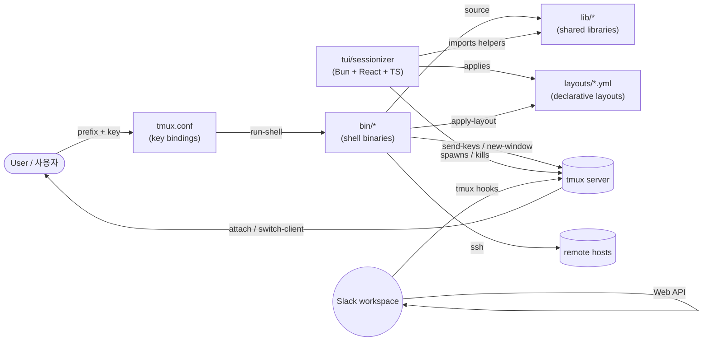
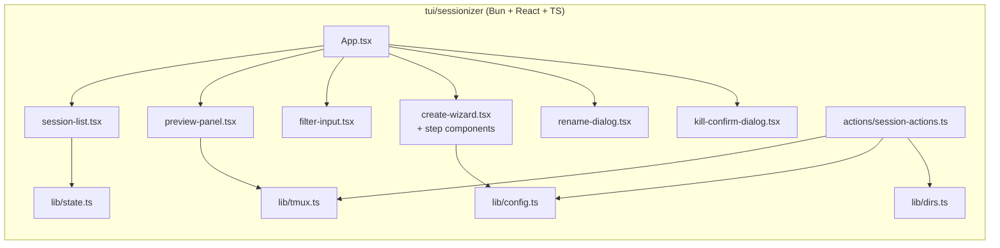

# tmux Productivity Suite / tmux 생산성 도구 모음

> A curated, opinionated tmux configuration plus a complete ecosystem of companion tools, shared libraries, declarative YAML layouts, a Bun/React/TypeScript TUI, and a Slack bridge — all designed for power users working across many projects and remote hosts.
>
> 큐레이션된 tmux 설정과 함께 동작하는 풍부한 생태계(보조 도구, 공유 라이브러리, 선언적 YAML 레이아웃, Bun/React/TypeScript 기반 TUI, Slack 브리지)를 한 저장소에 담은, 다수 프로젝트와 원격 호스트를 다루는 파워 유저용 환경입니다.

---

## Table of Contents / 목차

- [Overview / 개요](#overview--개요)
- [Features / 기능](#features--기능)
- [Architecture / 아키텍처](#architecture--아키텍처)
- [Repository Layout / 저장소 구조](#repository-layout--저장소-구조)
- [Quick Start / 빠른 시작](#quick-start--빠른-시작)
- [Configuration / 설정](#configuration--설정)
- [Commands Reference / 명령어 레퍼런스](#commands-reference--명령어-레퍼런스)
- [Layouts / 레이아웃](#layouts--레이아웃)
- [TUI Sessionizer / 터미널 UI 세션나이저](#tui-sessionizer--터미널-ui-세션나이저)
- [Slack Bridge / 슬랙 브리지](#slack-bridge--슬랙-브리지)
- [Local Development / 로컬 개발](#local-development--로컬-개발)
- [Testing / 테스트](#testing--테스트)
- [Contributing / 기여](#contributing--기여)
- [License / 라이선스](#license--라이선스)

---

## Overview / 개요

This repository bundles a battle-tested `tmux.conf`, a `sessionizer.conf` for project discovery, and a curated set of companion binaries under `bin/`. It ships shared shell libraries under `lib/`, project-style window layouts under `layouts/`, a modern Terminal UI (`tui/sessionizer/`), and a Slack ↔ tmux bridge (`slack/tmux-bridge/`).

이 저장소는 실전에서 검증된 `tmux.conf`, 프로젝트 검색을 위한 `sessionizer.conf`, 그리고 `bin/` 디렉터리의 큐레이션된 보조 바이너리들을 함께 제공합니다. `lib/`의 공유 셸 라이브러리, `layouts/`의 프로젝트형 윈도우 레이아웃, 모던 터미널 UI(`tui/sessionizer/`), 그리고 Slack ↔ tmux 브리지(`slack/tmux-bridge/`)가 한 곳에서 동작합니다.

### Who is this for? / 사용 대상

| Audience / 대상 | Use case / 활용 사례 |
| --- | --- |
| Multi-project developers / 다수 프로젝트 개발자 | Jump between repos, save layouts per project, fast session creation / 저장소 간 빠른 이동, 프로젝트별 레이아웃, 빠른 세션 생성 |
| DevOps / SRE engineers / DevOps · SRE | SSH picker, system stats, remote session management, declarative YAML layouts / SSH picker, 시스템 통계, 원격 세션 관리, 선언적 YAML 레이아웃 |
| Security / blue-team analysts / 보안 · 블루팀 | Splunk, Proxmox, SafeWork layout presets, long-command notifications / Splunk·Proxmox·SafeWork 프리셋, 장시간 명령 알림 |
| Power terminal users / 터미널 파워 유저 | Sidebar, command palette, responsive pane resizing, session dashboard / 사이드바, 커맨드 팔레트, 반응형 패널 리사이즈, 세션 대시보드 |

---

## Features / 기능

- **Declarative project sessionizing** — fuzzy-search across configured directories and spawn a tmux session per project with a YAML layout applied automatically.
  - 선언적 프로젝트 세셔나이저 — 설정된 디렉터리를 퍼지 검색하여 프로젝트별 tmux 세션을 생성하고 YAML 레이아웃을 자동 적용합니다.
- **40+ companion binaries** under `bin/` covering session lifecycle, git helpers, layout application, clipboard history, URL opening, file opening, system stats, and more.
  - `bin/` 디렉터리의 40개 이상의 보조 바이너리 — 세션 라이프사이클, Git 헬퍼, 레이아웃 적용, 클립보드 히스토리, URL/파일 열기, 시스템 통계 등을 다룹니다.
- **Shared libraries** in `lib/` (`sidebar-colors`, `sidebar-render`, `tmux-sessionizer-common`, `tmux-sessionizer-wizard`) so that multiple binaries can reuse the same UI primitives.
  - `lib/`의 공유 라이브러리(`sidebar-colors`, `sidebar-render`, `tmux-sessionizer-common`, `tmux-sessionizer-wizard`)로 여러 바이너리가 동일한 UI 프리미티브를 재사용합니다.
- **YAML-driven layouts** — `default`, `resume`, `splunk`, `proxmox`, `safework`, `safework2`, plus a `blacklist` for opt-out.
  - YAML 기반 레이아웃 — `default`, `resume`, `splunk`, `proxmox`, `safework`, `safework2`와 옵트아웃용 `blacklist`를 제공합니다.
- **Bun / React / TypeScript TUI** (`tui/sessionizer/`) with a keyboard-first session list, preview pane, and a multi-step create wizard.
  - Bun · React · TypeScript 기반 TUI(`tui/sessionizer/`) — 키보드 우선 세션 리스트, 프리뷰 패널, 다단계 생성 위저드를 제공합니다.
- **Slack bridge** (`slack/tmux-bridge/`) for sending tmux events and command output to Slack, and posting Slack replies back into tmux panes.
  - 슬랙 브리지(`slack/tmux-bridge/`) — tmux 이벤트와 명령 출력을 Slack으로 전송하고, Slack 답글을 tmux 패널로 다시 전달합니다.
- **Sidebar, command palette, responsive panes** for an IDE-like terminal experience.
  - 사이드바, 커맨드 팔레트, 반응형 패널로 IDE에 가까운 터미널 환경을 구성합니다.
- **Long-command desktop notifications** so `make build`, `cargo test`, etc. don't slip by silently.
  - 장시간 명령에 대한 데스크톱 알림으로 `make build`, `cargo test` 같은 명령을 놓치지 않습니다.

---

## Architecture / 아키텍처

The suite is organized as a thin shell layer around `tmux` plus a richer TUI written in TypeScript. Everything below `bin/` and `lib/` is intentionally dependency-light and Unix-pipeable so that one binary can call another, and so that the TUI can wrap or replace them.

이 제품군은 `tmux`을 중심으로 한 얇은 셸 레이어와 TypeScript로 작성된 풍부한 TUI로 구성됩니다. `bin/`과 `lib/`의 모든 구성 요소는 의존성을 최소화하고 Unix 파이프 친화적으로 설계되어, 한 바이너리가 다른 바이너리를 호출하거나 TUI가 그것을 감싸거나 대체할 수 있습니다.



Layers, top-down / 상위에서 하위 레이어:

1. **`tmux.conf`** — the source of truth for key bindings. Every binding resolves to a `run-shell` call into `bin/`.
   - `tmux.conf` — 키 바인딩의 진실 공급원. 모든 바인딩은 `bin/`으로의 `run-shell` 호출로 해소됩니다.
2. **`bin/`** — thin shell entry points. Each script is small, composable, and lives behind a meaningful name.
   - `bin/` — 얇은 셸 진입점. 각 스크립트는 작고 조합 가능하며 의미 있는 이름을 가집니다.
3. **`lib/`** — reusable Bash helpers (`source`-able). Keeps visual primitives consistent between the sidebar, the wizard, and the TUI host.
   - `lib/` — 재사용 가능한 Bash 헬퍼(`source` 가능). 사이드바, 위저드, TUI 호스트 간 시각적 일관성을 유지합니다.
4. **`layouts/`** — pure data. YAML is loaded by `tmux-layout-apply` and by the TUI wizard, never executed directly.
   - `layouts/` — 순수 데이터. YAML은 `tmux-layout-apply`와 TUI 위저드가 읽기만 하며 직접 실행되지 않습니다.
5. **`tui/sessionizer/`** — the interactive alternative to the CLI sessionizer. Calls back into the same `bin/` scripts.
   - `tui/sessionizer/` — CLI 세셔나이저의 대화형 대안. 동일한 `bin/` 스크립트를 다시 호출합니다.
6. **`slack/tmux-bridge/`** — a separate daemon process that watches tmux hooks and forwards events to Slack.
   - `slack/tmux-bridge/` — tmux 훅을 감시하여 이벤트를 Slack으로 전달하는 독립 데몬 프로세스입니다.

---

## Repository Layout / 저장소 구조

```
.
├── AGENTS.md                      # agent / contributor notes
├── CONTRIBUTING.md                # contribution guide
├── LICENSE                        # project license
├── OWNERS                         # code ownership
├── README.md                      # this file
├── sessionizer.conf               # project discovery config
├── tmux.conf                      # main tmux configuration
├── bin/                           # companion shell binaries (entry points)
│   ├── tmux-auto-attach
│   ├── tmux-bash-preexec
│   ├── tmux-cheatsheet
│   ├── tmux-clipboard-history
│   ├── tmux-command-palette
│   ├── tmux-config-reload
│   ├── tmux-copy-word
│   ├── tmux-file-open
│   ├── tmux-git-status
│   ├── tmux-git-uncommitted
│   ├── tmux-layout-apply
│   ├── tmux-notify-long-command
│   ├── tmux-opencode
│   ├── tmux-pane-sync
│   ├── tmux-responsive
│   ├── tmux-session-branch-log
│   ├── tmux-session-cycle
│   ├── tmux-session-dashboard
│   ├── tmux-session-export
│   ├── tmux-session-icon
│   ├── tmux-session-jump
│   ├── tmux-session-kill
│   ├── tmux-session-order
│   ├── tmux-session-rename
│   ├── tmux-session-sync
│   ├── tmux-sessionizer
│   ├── tmux-sessionizer-tui
│   ├── tmux-sidebar
│   ├── tmux-sidebar-init
│   ├── tmux-sidebar-toggle
│   ├── tmux-slack-bridge-setup
│   ├── tmux-slack-bridge-start
│   ├── tmux-ssh-picker
│   ├── tmux-sys-stats
│   ├── tmux-template-create
│   ├── tmux-url-open
│   └── tmux-web-terminal
├── lib/                           # shared shell helpers
│   ├── sidebar-colors
│   ├── sidebar-render
│   ├── tmux-sessionizer-common
│   └── tmux-sessionizer-wizard
├── layouts/                       # declarative YAML window layouts
│   ├── blacklist.yml
│   ├── default.yml
│   ├── proxmox.yml
│   ├── resume.yml
│   ├── safework.yml
│   ├── safework2.yml
│   └── splunk.yml
├── tui/
│   └── sessionizer/               # Bun + React + TypeScript TUI
│       ├── AGENTS.md
│       ├── bun.lock
│       ├── bunfig.toml
│       ├── package.json
│       ├── tsconfig.json
│       ├── src/
│       │   ├── App.tsx
│       │   ├── bun-env.d.ts
│       │   ├── index.tsx
│       │   ├── actions/session-actions.ts
│       │   ├── components/
│       │   │   ├── create-wizard.tsx
│       │   │   ├── filter-input.tsx
│       │   │   ├── kill-confirm-dialog.tsx
│       │   │   ├── preview-panel.tsx
│       │   │   ├── rename-dialog.tsx
│       │   │   ├── session-list.tsx
│       │   │   ├── wizard-step-dir.tsx
│       │   │   ├── wizard-step-layout.tsx
│       │   │   └── wizard-step-name.tsx
│       │   ├── hooks/use-keyboard-handler.ts
│       │   └── lib/
│       │       ├── config.ts
│       │       ├── create-session.ts
│       │       ├── dirs.ts
│       │       ├── state.ts
│       │       ├── theme.ts
│       │       └── tmux.ts
│       └── __tests__/
│           ├── config.test.ts
│           └── tmux.test.ts
├── slack/
│   └── tmux-bridge/               # Slack ↔ tmux bridge daemon
│       └── AGENTS.md
└── docs/
    ├── session-persistence-brainstorming.md
    └── supermemory-governance.md
```

---

## Quick Start / 빠른 시작

### Prerequisites / 사전 요구 사항

- `tmux` 3.x or newer / `tmux` 3.x 이상
- `bash`, `fzf`, `git`, `ssh`, and standard Unix utilities (`awk`, `sed`, `grep`, `cut`)
- Optional / 선택: `bun` (>=1.0) to run the TUI, `slack-cli` or a Slack bot token for the bridge
- Optional / 선택: desktop notification daemon for `tmux-notify-long-command`

### Install / 설치

```sh
# 1. Clone / 클론
git clone <this-repo-url> ~/.tmux-suite
cd ~/.tmux-suite

# 2. Symlink the config / 설정 파일 심볼릭 링크
ln -sf "$(pwd)/tmux.conf"        ~/.tmux.conf
ln -sf "$(pwd)/sessionizer.conf" ~/.sessionizer.conf

# 3. Add bin/ and lib/ to PATH (example for bash) / PATH에 bin/과 lib/ 추가
cat >> ~/.bashrc <<'EOF'
export PATH="$HOME/.tmux-suite/bin:$PATH"
export TMUX_SUITE_HOME="$HOME/.tmux-suite"
for f in "$TMUX_SUITE_HOME"/lib/*; do source "$f"; done
EOF

# 4. Reload tmux / tmux 리로드
tmux source-file ~/.tmux.conf
```

### First session / 첫 세션

```sh
# Open the sessionizer picker (default key: prefix + s) / 세셔나이저 실행(기본 키: prefix + s)
tmux-sessionizer

# Or launch the Bun-based TUI / 또는 Bun 기반 TUI 실행
tmux-sessionizer-tui
```

---

## Configuration / 설정

### `tmux.conf`

The main configuration. Key bindings call into `bin/` scripts via `run-shell`. Customize by editing the file or sourcing additional fragments from `~/.tmux.conf.local` (not created automatically).

주요 설정 파일입니다. 키 바인딩은 `run-shell`을 통해 `bin/` 스크립트를 호출합니다. 파일을 직접 수정하거나 `~/.tmux.conf.local`(자동 생성되지 않음)에서 추가 조각을 source 하세요.

### `sessionizer.conf`

Tells `tmux-sessionizer` which directories to search and how to label sessions. Variables are typically shell-style key=value pairs, for example:

`tmux-sessionizer`가 검색할 디렉터리와 세션 레이블 방식을 정의합니다. 일반적으로 셸 스타일 key=value 형식입니다:

```sh
SESSIONIZER_DIRS="$HOME/work $HOME/personal $HOME/sandbox"
SESSIONIZER_DEPTH=4
SESSIONIZER_IGNORE="node_modules .git target dist .venv"
SESSIONIZER_DEFAULT_LAYOUT="default"
```

### Layout selection / 레이아웃 선택

Layouts are pure YAML files in `layouts/`. A layout describes windows, panes, and startup commands. `blacklist.yml` is opt-out and removes windows from other layouts.

`layouts/`의 YAML은 순수 데이터입니다. 윈도우, 패널, 시작 명령을 정의합니다. `blacklist.yml`은 옵트아웃으로 다른 레이아웃의 윈도우를 제거합니다.

### Long-running command notifications / 장시간 명령 알림

`tmux-notify-long-command` is sourced into your shell via `tmux-bash-preexec`. It watches command durations above a threshold (default 10s) and pings the desktop notification daemon. Tune via env vars:

`tmux-notify-long-command`는 `tmux-bash-preexec`을 통해 셸에 로드됩니다. 일정 시간(기본 10초) 이상 실행되는 명령을 감지하여 데스크톱 알림 데몬으로 알립니다. 환경 변수로 조정합니다:

```sh
export TMUX_NOTIFY_THRESHOLD=15
export TMUX_NOTIFY_ICON="terminal"
```

---

## Commands Reference / 명령어 레퍼런스

This section lists the canonical entry points shipped under `bin/`. Each is callable directly from your shell or wired to a key binding in `tmux.conf`.

이 섹션은 `bin/`에서 제공하는 공식 진입점을 정리합니다. 각 명령은 셸에서 직접 실행하거나 `tmux.conf`의 키 바인딩과 연결할 수 있습니다.

### Session management / 세션 관리

| Command / 명령 | Description / 설명 |
| --- | --- |
| `tmux-sessionizer` | Fuzzy-pick a project directory and create or attach a tmux session for it, applying the default layout. / 프로젝트 디렉터리를 퍼지 검색하여 세션을 생성·연결하고 기본 레이아웃을 적용합니다. |
| `tmux-sessionizer-tui` | Launch the Bun/React/TypeScript TUI alternative to the CLI sessionizer. / CLI 세셔나이저의 Bun/React/TypeScript 기반 TUI를 실행합니다. |
| `tmux-session-dashboard` | Print an at-a-glance overview of all sessions, windows, and git status. / 모든 세션·윈도우·Git 상태를 한눈에 보여주는 대시보드를 출력합니다. |
| `tmux-session-cycle` | Cycle through sessions in a configurable order (alphabetical, recent, or `tmux-session-order`). / 설정된 순서(알파벳, 최근 사용, `tmux-session-order`)로 세션을 순환합니다. |
| `tmux-session-jump` | Jump directly to a session by typing a substring. / 부분 입력으로 세션으로 바로 이동합니다. |
| `tmux-session-kill` | Interactively pick and kill one or more sessions. / 세션을 선택하여 종료합니다. |
| `tmux-session-order` | Reorder sessions by recency, activity, or explicit pin. / 최근 사용·활동·고정 기준으로 세션 순서를 재정렬합니다. |
| `tmux-session-rename` | Rename the current session with a single keystroke. / 현재 세션을 한 번에 이름 변경합니다. |
| `tmux-session-sync` | Sync the current pane's input across multiple panes. / 현재 패널 입력을 여러 패널에 동기화합니다. |
| `tmux-session-export` | Dump session metadata (windows, panes, commands) as JSON or YAML. / 세션 메타데이터를 JSON/YAML로 덤프합니다. |
| `tmux-session-icon` | Render a Nerd Font icon per session based on the project type. / 프로젝트 종류에 따라 세션별 Nerd Font 아이콘을 표시합니다. |
| `tmux-session-branch-log` | Log the git branch of every session at session start. / 세션 시작 시 Git 브랜치를 기록합니다. |
| `tmux-auto-attach` | On shell login, attach to a chosen session or start the sessionizer. / 셸 로그인 시 세션 연결 또는 세셔나이저를 시작합니다. |

### Layouts & templates / 레이아웃과 템플릿

| Command / 명령 | Description / 설명 |
| --- | --- |
| `tmux-layout-apply` | Apply a named layout (e.g., `splunk`, `proxmox`) to the current session. / 명명된 레이아웃(예: `splunk`, `proxmox`)을 현재 세션에 적용합니다. |
| `tmux-template-create` | Scaffold a new layout YAML from a guided prompt. / 안내에 따라 새 레이아웃 YAML을 생성합니다. |
| `tmux-pane-sync` | Toggle input synchronization across a window's panes. / 윈도우 내 패널 간 입력 동기화를 토글합니다. |
| `tmux-responsive` | Auto-resize panes based on terminal dimensions. / 터미널 크기에 따라 패널을 자동 리사이즈합니다. |

### Productivity helpers / 생산성 헬퍼

| Command / 명령 | Description / 설명 |
| --- | --- |
| `tmux-command-palette` | Fuzzy palette of every command in this suite. / 본 제품군의 모든 명령을 퍼지 팔레트로 표시합니다. |
| `tmux-cheatsheet` | Render an in-terminal cheatsheet of the active key bindings. / 현재 키 바인딩을 터미널 내부에 표시합니다. |
| `tmux-config-reload` | Source `tmux.conf` without restarting tmux. / tmux를 재시작하지 않고 `tmux.conf`를 다시 로드합니다. |
| `tmux-clipboard-history` | Browse a ring buffer of recent copy/paste payloads. / 최근 복사·붙여넣기 페이로드의 링 버퍼를 탐색합니다. |
| `tmux-copy-word` | Yank the word under the cursor into the paste buffer. / 커서 위치의 단어를 paste buffer로 yank합니다. |
| `tmux-url-open` | Open the URL under the cursor (or picked from a list) in your browser. / 커서 위치 또는 선택한 URL을 브라우저에서 엽니다. |
| `tmux-file-open` | Open the file path under the cursor in `$EDITOR`. / 커서 위치의 파일 경로를 `$EDITOR`로 엽니다. |
| `tmux-git-status` | Show a one-line git status for the current pane's working directory. / 현재 패널 작업 디렉터리의 한 줄 Git 상태를 표시합니다. |
| `tmux-git-uncommitted` | Warn if the current pane's repo has uncommitted changes. / 현재 패널 저장소에 커밋되지 않은 변경이 있으면 경고합니다. |
| `tmux-notify-long-command` | Hook into bash preexec to notify after long-running commands. / 장시간 명령 실행 후 알림을 위한 bash preexec 훅입니다. |
| `tmux-sys-stats` | Show CPU, memory, and load stats in the status line. / 상태표시줄에 CPU·메모리·부하 통계를 표시합니다. |
| `tmux-opencode` | Launch the [opencode](https://opencode.ai) agent inside the active pane. / 현재 패널에서 opencode 에이전트를 실행합니다. |
| `tmux-ssh-picker` | Fuzzy-pick an SSH host from `~/.ssh/config` and open a new pane. / `~/.ssh/config`에서 SSH 호스트를 퍼지 선택하여 새 패널을 엽니다. |
| `tmux-web-terminal` | Expose the current tmux session over a local web terminal. / 현재 tmux 세션을 로컬 웹 터미널로 노출합니다. |
| `tmux-bash-preexec` | A small bash preexec shim used by `tmux-notify-long-command`. / `tmux-notify-long-command`에서 사용하는 bash preexec 셰임입니다. |

### Sidebar / 사이드바

| Command / 명령 | Description / 설명 |
| --- | --- |
| `tmux-sidebar-init` | One-time setup for the sidebar overlay (creates dedicated window and helpers). / 사이드바 오버레이를 1회 초기 설정합니다(전용 윈도우와 헬퍼 생성). |
| `tmux-sidebar` | Render the sidebar content (sessions, windows, git, system stats). / 사이드바 콘텐츠를 렌더링합니다(세션·윈도우·Git·시스템 통계). |
| `tmux-sidebar-toggle` | Toggle the sidebar overlay on or off. / 사이드바 오버레이를 켜거나 끕니다. |

### Slack bridge / 슬랙 브리지

| Command / 명령 | Description / 설명 |
| --- | --- |
| `tmux-slack-bridge-setup` | Interactive setup: writes tokens and channel mappings to `~/.config/tmux-suite/slack.env`. / 토큰과 채널 매핑을 `~/.config/tmux-suite/slack.env`에 기록합니다. |
| `tmux-slack-bridge-start` | Start the bridge daemon in the background. / 브리지 데몬을 백그라운드로 시작합니다. |

---

## Layouts / 레이아웃

Layouts live in `layouts/*.yml`. Each YAML describes a session's windows and panes. `blacklist.yml` is special — it removes windows from any other layout that match its keys.

레이아웃은 `layouts/*.yml`에 있습니다. 각 YAML은 세션의 윈도우와 패널을 정의합니다. `blacklist.yml`은 특수 파일로, 다른 레이아웃에서 키가 일치하는 윈도우를 제거합니다.

| Layout / 레이아웃 | Typical use / 일반적 용도 |
| --- | --- |
| `default` | Reasonable baseline: editor + shell + git status. / 합리적인 기본값: 에디터 + 셸 + Git 상태. |
| `resume` | Resume work: shows git log, recent files, running watchers. / 작업 재개: Git 로그, 최근 파일, 실행 중인 워처 표시. |
| `splunk` | Splunk dashboards + ad-hoc search panes. / Splunk 대시보드 + 임시 검색 패널. |
| `proxmox` | Proxmox web UI in one pane, ssh console in another. / 한 패널은 Proxmox 웹 UI, 다른 패널은 SSH 콘솔. |
| `safework` / `safework2` | Blue-team workflow presets. / 블루팀 워크플로 프리셋. |
| `blacklist` | Opt-out list; entries here are removed from any other layout. / 옵트아웃 목록; 다른 레이아웃에서 일치 항목이 제거됩니다. |

Apply a layout explicitly / 명시적으로 레이아웃 적용:

```sh
tmux-layout-apply splunk
```

Pick a layout interactively from the TUI create wizard (`wizard-step-layout.tsx`). It calls the same underlying loader.

TUI 생성 위저드(`wizard-step-layout.tsx`)에서도 인터랙티브로 선택할 수 있으며, 동일한 로더를 호출합니다.

---

## TUI Sessionizer / 터미널 UI 세션나이저

The TUI lives in `tui/sessionizer/` and is a Bun + React + TypeScript application. It is a keyboard-first alternative to the CLI `tmux-sessionizer` and reuses the same `lib/` helpers and `layouts/*.yml`.

TUI는 `tui/sessionizer/`에 있는 Bun + React + TypeScript 애플리케이션입니다. CLI `tmux-sessionizer`의 키보드 우선 대안이며, 동일한 `lib/` 헬퍼와 `layouts/*.yml`을 재사용합니다.

### Running / 실행

```sh
cd tui/sessionizer
bun install
bun start          # or: bun run src/index.tsx
```

### Architecture / 내부 구조



### Key bindings inside the TUI / TUI 내부 키 바인딩

The TUI is keyboard-driven; refer to `use-keyboard-handler.ts` for the full map. Highlights:

TUI는 키보드 우선입니다. 전체 매핑은 `use-keyboard-handler.ts`를 참조하세요. 주요 항목:

- `↑` / `↓` — move selection in the session list / 세션 리스트 선택 이동
- `Enter` — attach to the selected session / 선택한 세션에 연결
- `c` — open the create wizard / 생성 위저드 열기
- `r` — rename the selected session / 선택한 세션 이름 변경
- `k` — open the kill confirmation dialog / 종료 확인 대화상자 열기
- `/` — focus the filter input / 필터 입력에 포커스
- `q` or `Ctrl-C` — quit the TUI / TUI 종료

---

## Slack Bridge / 슬랙 브리지

`slack/tmux-bridge/` is a small daemon that:

`slack/tmux-bridge/`는 다음과 같은 기능을 가진 작은 데몬입니다:

1. Listens to tmux hooks (`session-created`, `session-closed`, `pane-focus-in`).
   - tmux 훅(`session-created`, `session-closed`, `pane-focus-in`)을 감시합니다.
2. Forwards summarized events to a configured Slack channel.
   - 요약된 이벤트를 설정된 Slack 채널로 전달합니다.
3. Optionally routes Slack thread replies back into a designated tmux pane.
   - Slack 스레드 답글을 지정된 tmux 패널로 다시 라우팅할 수도 있습니다.

Setup / 설정:

```sh
tmux-slack-bridge-setup     # writes ~/.config/tmux-suite/slack.env
tmux-slack-bridge-start     # runs as a background daemon
```

See `slack/tmux-bridge/AGENTS.md` for daemon lifecycle details.

데몬 라이프사이클 세부 사항은 `slack/tmux-bridge/AGENTS.md`를 참조하세요.

---

## Local Development / 로컬 개발

### Shell layer / 셸 레이어

- Each script in `bin/` is intentionally small. Add a new binary by:
  - `bin/`의 각 스크립트는 의도적으로 작게 유지됩니다. 새 바이너리는 다음 절차로 추가합니다:
  1. Creating `bin/tmux-<name>` with a shebang of `#!/usr/bin/env bash` and `set -euo pipefail`.
     - `#!/usr/bin/env bash`와 `set -euo pipefail`로 `bin/tmux-<name>`을 작성합니다.
  2. Sourcing any helpers you need from `lib/`.
     - 필요한 헬퍼를 `lib/`에서 source 합니다.
  3. Wiring it into `tmux.conf` via `bind-key ... run-shell "tmux-<name>"`.
     - `tmux.conf`에서 `bind-key ... run-shell "tmux-<name>"` 형태로 연결합니다.
  4. Documenting it under "Commands Reference" in this README.
     - 본 README의 "Commands Reference"에 문서화합니다.

### TUI / TUI

```sh
cd tui/sessionizer
bun install
bun start          # run the TUI
bun run typecheck  # type-check the TypeScript sources
```

The TUI uses Bun's built-in test runner. See the next section.

TUI는 Bun의 내장 테스트 러너를 사용합니다. 다음 섹션을 참조하세요.

### Layouts / 레이아웃

- YAML files are pure data. Validate them with any YAML linter (e.g., `yamllint layouts/`).
- YAML은 순수 데이터입니다. 임의의 YAML 린터(예: `yamllint layouts/`)로 검증하세요.

---

## Testing / 테스트

### Shell / 셸

Smoke-test the suite in an existing tmux session:

기존 tmux 세션에서 스모크 테스트:

```sh
# Re-source the config without disconnecting / 연결 해제 없이 설정 다시 로드
tmux-config-reload

# Run the dashboard and confirm it prints / 대시보드가 정상 출력되는지 확인
tmux-session-dashboard

# Apply each layout and visually verify windows/pane counts / 각 레이아웃을 적용하여 윈도우·패널 수를 시각적으로 확인
for L in default resume splunk proxmox safework safework2; do
  tmux-layout-apply "$L"
done
```

### TUI unit tests / TUI 단위 테스트

The TUI ships with unit tests under `tui/sessionizer/__tests__/`:

TUI에는 `tui/sessionizer/__tests__/`에 단위 테스트가 포함되어 있습니다:

```sh
cd tui/sessionizer
bun test
```

Two test files are present: `config.test.ts` and `tmux.test.ts`. They cover configuration parsing and the tmux command wrappers used by the TUI.

두 개의 테스트 파일이 있습니다: `config.test.ts`와 `tmux.test.ts`. 설정 파싱과 TUI가 사용하는 tmux 명령 래퍼를 다룹니다.

### Manual integration / 수동 통합

The suite is intended to be exercised interactively. Recommended manual flows:

대화형으로 실행하는 것을 권장합니다. 권장 수동 흐름:

1. Cold-start a session with the wizard / 위저드로 세션을 처음부터 생성
2. Apply a layout, kill a window, reapply / 레이아웃 적용 → 윈도우 종료 → 재적용
3. Toggle the sidebar at different terminal widths / 다양한 터미널 너비에서 사이드바 토글
4. Start the Slack bridge, change session, observe channel events / Slack 브리지 시작 → 세션 변경 → 채널 이벤트 확인

---

## Contributing / 기여

Contributions are welcome. Please read `CONTRIBUTING.md` for the full process, then:

기여를 환영합니다. 전체 절차는 `CONTRIBUTING.md`를 읽어 주세요. 그 다음:

1. Fork the repository and create a feature branch.
   - 저장소를 포크하고 기능 브랜치를 만듭니다.
2. Keep `bin/` scripts small and `set -euo pipefail`-strict.
   - `bin/` 스크립트는 작게 유지하고 `set -euo pipefail`을 사용하세요.
3. Reuse `lib/` helpers instead of duplicating logic.
   - 로직 중복 대신 `lib/` 헬퍼를 재사용하세요.
4. Add or update tests in `tui/sessionizer/__tests__/` for any TUI change.
   - TUI 변경 시 `tui/sessionizer/__tests__/`의 테스트를 추가하거나 업데이트하세요.
5. Update this README's "Commands Reference" for any new binary.
   - 새 바이너리를 추가하면 본 README의 "Commands Reference"를 갱신하세요.

Code ownership is tracked in `OWNERS`. Please tag the listed owners for review on substantial changes.

코드 소유권은 `OWNERS`에 기록되어 있습니다. 대규모 변경에는 등록된 소유자를 리뷰어로 태그해 주세요.

---

## License / 라이선스

This project is released under the terms described in `LICENSE`.

본 프로젝트는 `LICENSE`에 명시된 조건 하에 배포됩니다.