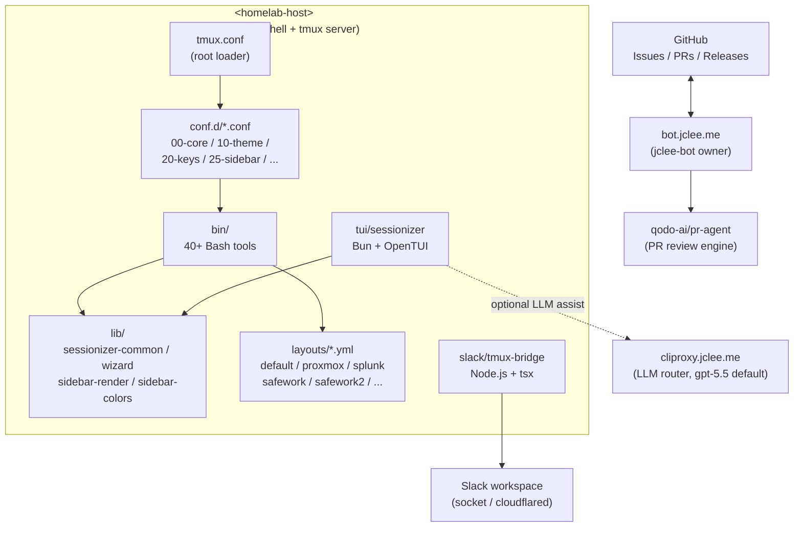

# TMUX SESSIONIZER / tmux 세션나이저


> A Bash-first tmux configuration and session-management toolkit, symlinked as `~/.tmux`, with a Bun/OpenTUI sessionizer, a Node.js Slack bridge, and a fully automated GitHub lifecycle owned by **jclee-bot**.
>
> Bash 우선 tmux 설정 및 세션 관리 툴킷. `~/.tmux`로 심볼릭 링크되며, Bun/OpenTUI 세션나이저, Node.js Slack 브리지, 그리고 **jclee-bot**이 완전히 소유하는 GitHub 자동화 라이프사이클을 함께 제공한다.

---

## Overview / 개요

**English.** TMUX SESSIONIZER is a homelab-grade tmux distribution built around a single rule: keep the loader thin and put behavior in small, composable, individually testable Bash tools. The `tmux.conf` at the root is just a `source` chain that pulls in modular `conf.d/*.conf` fragments; the real surface area lives in `bin/` — more than forty command-line tools that handle session discovery, sidebar rendering, dashboards, layout templates, Git awareness, Slack bridging, URL and file picking, status-bar widgets, SSH host picking, clipboard history, web terminal launching, and more.

Two companion applications live next to it: a Bun + OpenTUI terminal UI at `tui/sessionizer` (keyboard-first session picker with a creation wizard), and a Node.js Slack bridge at `slack/tmux-bridge` that syncs tmux session state with Slack channels over either a direct socket or a `cloudflared`-tunneled HTTP path. The whole GitHub lifecycle — issue routing, branch creation, PR review, security review, auto-merge, release publishing, downstream health checks, and CI failure backfilling — is owned by **jclee-bot** at `bot.jclee.me` and never runs untrusted third-party code in the repo.

**한국어.** TMUX SESSIONIZER는 단 하나의 원칙 위에서 동작하는 홈랩급 tmux 배포판이다. **로더는 얇게 유지하고, 동작은 작고 합성 가능하며 개별 테스트 가능한 Bash 도구로 분리**한다. 루트의 `tmux.conf`는 단순히 `conf.d/*.conf` 조각들을 `source`하는 체인에 불과하며, 실제 표면적(40+ 도구)은 모두 `bin/`에 있다. 세션 디스커버리, 사이드바 렌더링, 대시보드, 레이아웃 템플릿, Git 인지, Slack 브리지, URL/파일 피커, 상태바 위젯, SSH 호스트 피커, 클립보드 히스토리, 웹 터미널 실행까지 한 곳에서 다룬다.

이 저장소에는 두 개의 동반 애플리케이션이 함께 들어 있다. `tui/sessionizer`는 Bun + OpenTUI 기반의 키보드 우선 세션 피커 + 생성 위저드이며, `slack/tmux-bridge`는 tmux 세션 상태를 Slack 채널과 동기화하는 Node.js 브리지다(socket 직접 모드 / `cloudrelayed` HTTP 모드 듀얼). GitHub 라이프사이클 전체 — 이슈 라우팅, 브랜치 생성, PR 리뷰, 보안 리뷰, 자동 머지, 릴리스 게시, 다운스트림 헬스 체크, CI 실패 백필 — 은 `bot.jclee.me`의 **jclee-bot**이 단독 소유한다.

---

## Features / 기능

### Core (Bash-first) / 코어 (Bash 우선)

- **Thin loader** — `tmux.conf` is ~20 lines, delegating to `conf.d/*.conf` (`00-core`, `10-theme`, `20-keys`, `25-sidebar`, …).
- **40+ composable tools** in `bin/`, each typically 15–150 LOC and individually invokable.
- **Layout templates** — declarative YAML (`layouts/*.yml`) for `default`, `proxmox`, `splunk`, `safework`, `safework2`, `resume`, with a `blacklist.yml` deny list.
- **Session discovery** — directory scanning via `sessionizer.conf` (`SCAN_DIR` + `EXTRA_DIRS`) with the TUI wizard as the keyboard-first surface.
- **Git-aware status** — `tmux-git-status`, `tmux-git-uncommitted`, `tmux-session-branch-log` track branch, dirty/ahead/behind/stash, and per-session uncommitted state.
- **Sidebar & dashboard** — `tmux-sidebar`, `tmux-sidebar-init`, `tmux-sidebar-toggle`, plus `tmux-session-dashboard` for a popup overview.
- **Pickers** — `tmux-url-open`, `tmux-file-open`, `tmux-ssh-picker`, `tmux-clipboard-history`, `tmux-copy-word` for fzf-driven extraction and selection.
- **Status bar** — `tmux-responsive` (width-tiered rendering), `tmux-sys-stats` (CPU + MEM), `tmux-session-icon` (Nerd Font mapper).
- **Layouts & templates** — `tmux-template-create`, `tmux-layout-apply`, `tmux-session-export` for round-tripping tmux state ↔ YAML.
- **Web terminal** — `tmux-web-terminal` launches `ttyd` against the active session.
- **Bridge to Slack** — `tmux-slack-bridge-setup` (interactive wizard) and `tmux-slack-bridge-start` (dual-mode: socket / `cloudflared`).

### Companion Applications / 동반 애플리케이션

- **`tui/sessionizer`** — Bun + OpenTUI. React-style components, `use-keyboard-handler` hook, multi-step `create-wizard` (dir → layout → name), preview panel, rename dialog, kill-confirm dialog. Tested with Bun's built-in test runner (`__tests__/*.test.ts`).
- **`slack/tmux-bridge`** — Node.js + `tsx`. Two transport modes (direct socket / HTTP via `cloudflared`), startup wrapper handles both transparently.

### Automation / 자동화

- **14 GitHub Actions workflow triggers**, all owned and dispatched by **jclee-bot** — no human gatekeeping in the hot path.
- **0 Go tools** — all automation is implemented as shell scripts, GitHub Actions YAML, or Bun/TypeScript modules.
- **Public LLM router** — `https://cliproxy.jclee.me/v1` is the single public endpoint; primary model is `gpt-5.5`, with `minimax-m3` as the explicit fallback (also routed through CLIProxyAPI).

---

## Architecture / 아키텍처

The toolkit runs entirely on `<homelab-host>`. The `tmux.conf` loader is a thin shell over `conf.d/*.conf` fragments, which in turn expose the `bin/` tool surface. Layouts, TUI, and the Slack bridge are sibling trees. **jclee-bot** at `bot.jclee.me` owns all mutating GitHub automation and uses the `qodo-ai/pr-agent` review engine.



### Data flow notes / 데이터 흐름 메모

- **`tmux.conf` → `conf.d/*.conf` → `bin/*`** — strict one-way dependency: the loader never inlines behavior, it only sources.
- **`bin/*` → `lib/*`** — tools `source` shared library modules; no library ever calls back into a tool.
- **`bin/*` → `layouts/*.yml`** — `tmux-layout-apply` and `tmux-template-create` read templates; the `blacklist.yml` is the explicit deny surface.
- **`tui/sessionizer` ↔ `lib/*`** — the TUI reuses `tmux-sessionizer-common` and `tmux-sessionizer-wizard` so the Bash and TUI flows share one source of truth.
- **`slack/tmux-bridge` ↔ Slack** — dual transport, chosen at startup by `tmux-slack-bridge-start`; one process per tmux server.
- **GitHub ↔ `bot.jclee.me`** — webhook in, automation out. All workflow triggers are owned by jclee-bot.

---

## jclee-bot Automation Surfaces / jclee-bot 자동화 영역

**jclee-bot** is the **App-owned automation owner** of this repository. The 14 `.github/workflows/*.yml` files in this repo are *implementation triggers* — the *source of truth* is the surface list below, each of which is dispatched, scheduled, or monitored by jclee-bot at `bot.jclee.me`. Humans do not merge their own PRs; humans do not backfill CI failures; humans do not publish releases. jclee-bot does.

### Mutating surfaces (write-side, jclee-bot exclusive) / 변경 자동화 (쓰기, jclee-bot 전용)

| Surface / 영역 | Purpose / 목적 |
| --- | --- |
| `branch-to-pr` | Promote a long-lived topic branch into a draft PR once it goes out of sync with `master`. |
| `issue-to-branch` | Convert an accepted issue into a working branch with a conventional name and checklist. |
| `pr-auto-merge` | Auto-merge PRs that pass all required checks and meet jclee-bot's merge policy. |
| `dependabot-auto-merge` | Auto-merge Dependabot PRs for pinned patch/minor lanes. |
| `bot-auto-fix` | Apply jclee-bot-authored patches (lint, formatting, lockfile refresh) directly to the PR branch. |
| `merged-pr-cleanup` | Delete merged head branches and the bot's transient CI checkouts. |
| `issue-backfill` | Backfill issues for historical CI failures that were silently dropped. |
| `release-notes` | Aggregate merged PRs into release notes on tag push. |
| `release-publish` | Publish the release artifact and announce. |

### Read-side / observational surfaces (jclee-bot monitors) / 관측 자동화 (jclee-bot 모니터링)

| Surface / 영역 | Purpose / 목적 |
| --- | --- |
| `ci` | Build + test gate (Bun, shellcheck, tmux config smoke). |
| `pr-review` | Routine PR review via `qodo-ai/pr-agent`. |
| `security-pr-review` | Security-focused PR review (separate prompt lane). |
| `ci-failure-issues` | Open a tracking issue when a CI run fails twice in a row. |
| `downstream-health-check` | Nightly reachability + version check of `cliproxy.jclee.me` and `bot.jclee.me`. |

### Issue automation contract / 이슈 자동화 계약

When a contributor opens an issue, jclee-bot reads a structured marker to decide routing. Issues that opt into the auto-route carry the marker:

```
jclee-bot에의해자동화됨
```

…and are picked up by the `issue-to-branch` surface without human triage. Issues **without** this marker are routed to the maintainer queue (still dispatched by jclee-bot, but parked until a human approves).

---

## Go Tools / Go 도구

This repository ships **zero Go tools** (`Go: 0`). All automation is implemented in one of three runtimes:

1. **Bash** — the `bin/` and `lib/` surface (the 40+ session, sidebar, picker, status, and bridge tools).
2. **Bun + TypeScript** — `tui/sessionizer` and its test suite.
3. **Node.js + `tsx`** — `slack/tmux-bridge`.

If you need a new automation primitive, add a Bash script under `bin/`, a workflow trigger under `.github/workflows/`, or — for richer UX — a TUI module under `tui/sessionizer/src/`. There is no Go module, no `go.mod`, and no compiled binary in this repo. Any PR that introduces a `go.mod` is considered out of scope and will be closed by `pr-auto-merge` / `pr-review` without merge.

---

## Quick Start / 빠른 시작

### 1. Symlink the config / 설정 심볼릭 링크

```bash
# From the repo root / 저장소 루트에서
ln -sfn "$(pwd)" ~/.tmux
```

### 2. Start (or restart) tmux / tmux 시작 (또는 재시작)

```bash
tmux -f ~/.tmux/tmux.conf attach || tmux -f ~/.tmux/tmux.conf
```

Prefix is **`C-a`** (rebound from the default `C-b`). Run `prefix + ?` inside tmux, or `tmux-cheatsheet` from the shell, for a categorized keybinding reference.

### 3. Pick a session / 세션 선택

- **TUI (recommended):** `tmux-sessionizer-tui` — keyboard-first, multi-step wizard.
- **fzf:** `tmux-sessionizer` — classic fzf picker with the same wizard available inline.
- **MRU jump:** `prefix + s` → `tmux-session-jump`.

### 4. Apply a layout template / 레이아웃 적용

```bash
tmux-template-create proxmox   # interactive
tmux-layout-apply proxmox      # apply to current session
```

### 5. Wire up the Slack bridge (optional) / Slack 브리지 연결 (선택)

```bash
tmux-slack-bridge-setup        # interactive app/token wizard
tmux-slack-bridge-start        # daemonizes; auto-selects socket vs cloudflared
```

---

## Local Development / 로컬 개발

### Bash tools / Bash 도구

- Each tool in `bin/` is a standalone executable. Source it for unit tests:

  ```bash
  shellcheck bin/tmux-sessionizer bin/tmux-sidebar bin/tmux-layout-apply
  ```

- Reload the live config without detaching:

  ```bash
  tmux-config-reload
  ```

- Add a new tool: place it under `bin/`, source shared helpers from `lib/`, keep it under ~150 LOC, and add a keybinding in `conf.d/20-keys.conf` (or the most topical `conf.d/*.conf`).

### TUI sessionizer / TUI 세션나이저

```bash
cd tui/sessionizer
bun install
bun test                       # __tests__/*.test.ts
bun --hot run src/index.tsx    # hot-reload dev
```

Module layout:

- `src/lib/` — config, state, theme, tmux bridge, dirs, create-session.
- `src/hooks/` — `use-keyboard-handler`.
- `src/actions/` — `session-actions`.
- `src/components/` — list, filter, preview, wizard steps, dialogs.

### Slack bridge / Slack 브리지

```bash
cd slack/tmux-bridge
npm install
npm run dev                    # tsx watch
```

`tmux-slack-bridge-start` is the recommended entry point — it picks the transport (direct socket vs `cloudflared` HTTP) and execs `tsx` for you.

### LLM-backed authoring / LLM 기반 작성

When generating documentation, refactors, or scaffolding in this repo, route LLM calls through the public router:

- Primary model: **`gpt-5.5`**
- Fallback model: **`minimax-m3`**
- Endpoint: **`https://cliproxy.jclee.me/v1`**

This README itself was generated by `gpt-5.5` via the same router.

---

## Commands Reference / 명령어 레퍼런스

This is a curated index, not an exhaustive manual. Run `<tool> --help` for the canonical flag set.

### Session management / 세션 관리

| Tool | What it does / 설명 |
| --- | --- |
| `tmux-sessionizer` | fzf session picker + inline creation wizard (~144 LOC). |
| `tmux-sessionizer-tui` | Launches the Bun/OpenTUI sessionizer as a popup. |
| `tmux-session-cycle` | PgUp/PgDn session rotation (excludes `opencode`). |
| `tmux-session-kill` | Safe session termination with confirmation. |
| `tmux-session-rename` | Session rename with validation. |
| `tmux-session-jump` | MRU fzf session picker (~19 LOC). |
| `tmux-session-order` | Sort sessions by most recently active. |
| `tmux-session-dashboard` | Formatted session table popup (~75 LOC). |
| `tmux-session-export` | Export session layout to YAML (~50 LOC). |
| `tmux-session-branch-log` | Log session→branch on switch. |
| `tmux-template-create` | Quick-create session from preset templates. |
| `tmux-layout-apply` | Apply YAML layout templates to sessions. |
| `tmux-opencode` | OpenCode session launcher. |
| `tmux-session-icon` | Nerd Font icon mapper for sessions. |

### Sidebar / 사이드바

| Tool | What it does / 설명 |
| --- | --- |
| `tmux-sidebar` | Tree sidebar display engine. |
| `tmux-sidebar-init` | Sidebar initialization on session create. |
| `tmux-sidebar-toggle` | Toggle sidebar visibility. |

### Pickers & navigation / 피커 & 탐색

| Tool | What it does / 설명 |
| --- | --- |
| `tmux-url-open` | URL extraction from pane via fzf. |
| `tmux-file-open` | File path extraction from pane via fzf. |
| `tmux-ssh-picker` | SSH config host picker via fzf. |
| `tmux-clipboard-history` | tmux buffer ring browser via fzf. |
| `tmux-copy-word` | Smart word copy under cursor. |

### Status & git / 상태 & Git

| Tool | What it does / 설명 |
| --- | --- |
| `tmux-git-status` | Git branch + dirty/ahead/behind/stash status. |
| `tmux-git-uncommitted` | Track uncommitted changes per session. |
| `tmux-sys-stats` | CPU load + MEM usage for status bar. |
| `tmux-responsive` | Width-tiered statusbar rendering. |

### Operations / 운영

| Tool | What it does / 설명 |
| --- | --- |
| `tmux-config-reload` | Reload config with settings diff. |
| `tmux-auto-attach` | Login shell auto-attach flow. |
| `tmux-pane-sync` | Synchronize-panes toggle. |
| `tmux-notify-long-command` | Desktop notification for long commands. |
| `tmux-bash-preexec` | Sourceable shell preexec hook for command timing. |
| `tmux-cheatsheet` | Categorized keybinding reference popup. |
| `tmux-command-palette` | fzf action picker for common operations. |

### Slack bridge / Slack 브리지

| Tool | What it does / 설명 |
| --- | --- |
| `tmux-slack-bridge-setup` | Interactive Slack app setup wizard. |
| `tmux-slack-bridge-start` | Startup wrapper (socket / `cloudflared`) + `tsx` exec. |
| `tmux-session-sync` | Sync tmux sessions with Slack channels. |

### Web / 웹

| Tool | What it does / 설명 |
| --- | --- |
| `tmux-web-terminal` | `ttyd` web terminal launcher. |

---

## Contribution Guide / 기여 가이드

### Filing issues / 이슈 작성

- Use the issue templates. If your change is mechanical and well-scoped (typo, dep bump, single-file refactor), add the marker `jclee-bot에의해자동화됨` somewhere in the body — jclee-bot will route it to the `issue-to-branch` surface and produce a PR for you.
- If the change requires design discussion, leave the marker **off**; jclee-bot parks the issue in the maintainer queue and pings the owners listed in `OWNERS`.
- For security reports, do **not** open a public issue — contact the owners listed in `OWNERS` directly. The `security-pr-review` surface handles disclosure in private.

### Pull requests / 풀 리퀘스트

- Branch off `master`. The `branch-to-pr` surface will promote it once it diverges.
- jclee-bot runs `pr-review` (via `qodo-ai/pr-agent`) and `security-pr-review` automatically. Expect review comments within minutes, not days.
- `pr-auto-merge` will merge once all required checks are green and jclee-bot's policy gate is satisfied. Do not squash-merge locally — let jclee-bot decide the merge strategy.
- `bot-auto-fix` may push commits directly to your branch (lint, formatting, lockfile refresh). Do not rebase them away; jclee-bot will rebase as needed.

### Code style / 코드 스타일

- **Bash:** `shellcheck` clean, ~150 LOC max per tool, source shared helpers from `lib/`.
- **TypeScript / TUI:** Bun-native, `tsconfig.json` strict; place new components under `tui/sessionizer/src/components/`.
- **Node / bridge:** `tsx`-runnable, dual-transport aware; never hardcode transport — let `tmux-slack-bridge-start` choose.
- **YAML layouts:** validate against `layouts/blacklist.yml`; never reference internal IPs or LXC container numbers — use placeholders like `<homelab-host>` instead.

### Release process / 릴리스 프로세스

- Tag-driven. `release-notes` aggregates merged PRs; `release-publish` ships the artifact. Both are owned by jclee-bot — do not run them by hand.

---

## Repository Structure / 저장소 구조

```
.
├── AGENTS.md                  # Project knowledge base (generated)
├── CONTRIBUTING.md            # Human-facing contribution rules
├── LICENSE                    # MIT
├── OWNERS                     # Maintainer contact list
├── README.md                  # This file
├── sessionizer.conf           # SCAN_DIR + EXTRA_DIRS for session discovery
├── tmux.conf                  # Root loader: sources conf.d/*.conf
│
├── bin/                       # Bash execution surface (40+ tools)
│   ├── tmux-sessionizer
│   ├── tmux-sessionizer-tui
│   ├── tmux-sidebar           # + init / toggle siblings
│   ├── tmux-session-cycle     # + kill / rename / jump / order
│   ├── tmux-session-dashboard # + export / branch-log / icon
│   ├── tmux-template-create   # + layout-apply
│   ├── tmux-auto-attach       # + opencode / command-palette
│   ├── tmux-url-open          # + file-open / ssh-picker / clipboard-history / copy-word
│   ├── tmux-pane-sync         # + config-reload / notify-long-command
│   ├── tmux-bash-preexec      # + cheatsheet
│   ├── tmux-slack-bridge-{setup,start}
│   ├── tmux-session-sync
│   ├── tmux-git-status        # + git-uncommitted
│   ├── tmux-sys-stats         # + responsive
│   └── tmux-web-terminal
│
├── lib/                       # Shared library modules
│   ├── sidebar-colors
│   ├── sidebar-render
│   ├── tmux-sessionizer-common
│   └── tmux-sessionizer-wizard
│
├── layouts/                   # Declarative session layouts (YAML)
│   ├── blacklist.yml
│   ├── default.yml
│   ├── proxmox.yml
│   ├── resume.yml
│   ├── safework.yml
│   ├── safework2.yml
│   └── splunk.yml
│
├── tui/
│   └── sessionizer/           # Bun + OpenTUI TUI
│       ├── AGENTS.md
│       ├── bunfig.toml
│       ├── package.json
│       ├── tsconfig.json
│       ├── src/
│       │   ├── App.tsx
│       │   ├── index.tsx
│       │   ├── bun-env.d.ts
│       │   ├── lib/           # config, state, theme, tmux, dirs, create-session
│       │   ├── hooks/         # use-keyboard-handler
│       │   ├── actions/       # session-actions
│       │   └── components/    # list, filter, preview, wizard, dialogs
│       └── __tests__/         # config.test.ts, tmux.test.ts
│
├── slack/
│   └── tmux-bridge/           # Node.js + tsx Slack bridge
│       └── AGENTS.md
│
└── docs/                      # Design notes
    ├── session-persistence-brainstorming.md
    └── supermemory-governance.md
```

---

## Links / 링크

- **LLM router / LLM 라우터:** [cliproxy.jclee.me](https://cliproxy.jclee.me) — public endpoint for `gpt-5.5` (primary) and `minimax-m3` (fallback).
- **Automation owner / 자동화 오너:** [bot.jclee.me](https://bot.jclee.me) — jclee-bot, App-owned.
- **PR review engine / PR 리뷰 엔진:** [qodo-ai/pr-agent](https://github.com/qodo-ai/pr-agent) — used by jclee-bot's `pr-review` and `security-pr-review` surfaces.