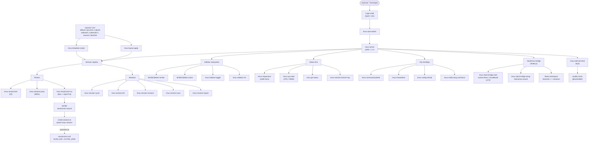

# TMUX SESSIONIZER


[](../../actions/workflows/ci.yml)
[](../../actions/workflows/10_pr-review.yml)
[](../../actions/workflows/11_security-pr-review.yml)
[](../../actions/workflows/12_dependabot-auto-merge.yml)
[](../../actions/workflows/13_pr-auto-merge.yml)
[](../../actions/workflows/14_bot-auto-fix.yml)
[](../../actions/workflows/15_merged-pr-cleanup.yml)
[](../../actions/workflows/24_release-notes.yml)
[](../../actions/workflows/25_release-notes.yml)

> **A Bash-first tmux configuration and session-management toolkit, symlinked as `~/.tmux`.**
> **Bash 중심의 tmux 설정 및 세션 관리 도구 모음으로, `~/.tmux`로 심볼릭 링크하여 사용합니다.**

---

## Table of Contents / 목차

- [Overview / 개요](#overview--개요)
- [Features / 주요 기능](#features--주요-기능)
- [Repository Structure / 저장소 구조](#repository-structure--저장소-구조)
- [Architecture / 아키텍처](#architecture--아키텍처)
- [Automation Inventory / 자동화 인벤토리](#automation-inventory--자동화-인벤토리)
  - [GitHub Actions Workflows (14)](#github-actions-workflows-14)
  - [Go Automation Tools (0)](#go-automation-tools-0)
- [Quick Start / 빠른 시작](#quick-start--빠른-시작)
- [Local Development / 로컬 개발](#local-development--로컬-개발)
- [Commands Reference / 명령어 레퍼런스](#commands-reference--명령어-레퍼런스)
- [Contribution Guide / 기여 가이드](#contribution-guide--기여-가이드)

---

## Overview / 개요

**EN:** `tmux-sessionizer` is a batteries-included, Bash-first tmux configuration repository. It turns tmux into a project-aware, session-driven development environment by combining a sidebar overlay, fzf-based session pickers, declarative YAML layout templates, a modern Bun/OpenTUI sessionizer, and a Node.js Slack bridge. The toolkit is designed to be **symlinked as `~/.tmux`** and sourced from `~/.tmux.conf`, so updates flow in via `git pull` without manual patching.

The repository also ships a **14-workflow GitHub Actions automation stack** that handles everything from branch↔PR synchronization and AI-assisted PR review to dependabot auto-merge, release publishing, and CI failure issue filing.

**KR:** `tmux-sessionizer`는 tmux를 프로젝트 인식·세션 중심 개발 환경으로 만들어 주는 배터리 포함형 Bash 중심 설정 저장소입니다. 사이드바 오버레이, fzf 기반 세션 피커, 선언적 YAML 레이아웃 템플릿, 모던 Bun/OpenTUI 세션 나이저, 그리고 Node.js Slack 브리지를 결합합니다. ** `~/.tmux`로 심볼릭 링크**하여 `~/.tmux.conf`에서 소싱하도록 설계되어, `git pull`만으로 업데이트가 반영됩니다.

또한 본 저장소는 **14개의 GitHub Actions 워크플로우 자동화 스택**을 함께 제공하며, 브랜치↔PR 동기화, AI 기반 PR 리뷰, Dependabot 자동 머지, 릴리스 게시, CI 실패 이슈 생성 등을 포괄합니다.

---

## Features / 주요 기능

### Core tmux Behavior / 핵심 tmux 동작
- **`prefix = C-a`** ergonomic prefix key with leader-aware bindings.
- **Tokyo Night theme** with pane-border status, italic comments, and Nerd Font icons.
- **Responsive statusline** that adapts to terminal width tiers (compact / standard / wide).
- **Live sidebar overlay** with colored tree render, icon mapping, and toggle visibility.

### Session Management / 세션 관리
- **fzf sessionizer** scanning `sessionizer.conf`-defined `SCAN_DIR` + `EXTRA_DIRS`.
- **OpenTUI (Bun + TypeScript) sessionizer** with a multi-step creation wizard (directory → layout → name).
- **MRU session jump** and **PgUp/PgDn session cycle** (excludes transient sessions).
- **Safe session kill**, **rename with validation**, **dashboard popup**, and **order-by-recency** listing.
- **Session export** to YAML for reproducibility and **session → branch logging** for traceability.

### Layouts & Templates / 레이아웃과 템플릿
- **Declarative YAML layouts** in `layouts/` for reproducible window/pane structures.
- Built-in presets: `default`, `proxmox`, `splunk`, `safework`, `safework2`, `resume`, `blacklist`.
- **`tmux-layout-apply`** applies a YAML layout to an existing session.
- **`tmux-template-create`** quick-creates a session from a named template.

### Sidebar / 사이드바
- **Tree-rendered sidebar** with per-entry color theming (`bin/lib/sidebar-colors`).
- **Init / toggle** hooks that bind sidebar lifecycle to session create / key press.
- **Sidebar renderer** (`bin/lib/sidebar-render`) shared across display contexts.

### Pane Productivity / 페인 생산성
- **`tmux-command-palette`** — fzf action picker for common operations.
- **`tmux-cheatsheet`** — categorized, searchable keybinding popup.
- **`tmux-clipboard-history`**, **`tmux-copy-word`**, **`tmux-pane-sync`**, **`tmux-config-reload`**.
- **`tmux-url-open`**, **`tmux-file-open`**, **`tmux-ssh-picker`** extract candidates from the current pane.
- **`tmux-notify-long-command`** desktop-notifies on slow commands via preexec hook.

### Git Integration / Git 통합
- **`tmux-git-status`** — branch, dirty / ahead / behind / stash counts.
- **`tmux-git-uncommitted`** — per-session uncommitted-change tracking.
- **`tmux-session-branch-log`** — appends session → branch mappings on switch.

### Slack Bridge / Slack 브리지
- **Node.js bridge** at `slack/tmux-bridge/` mapping Slack channels ↔ tmux sessions.
- **Dual-mode launcher** (`tmux-slack-bridge-start`): direct unix socket **or** HTTP via cloudflared.
- **Interactive setup wizard** (`tmux-slack-bridge-setup`) for app/credentials.
- **`tmux-session-sync`** orchestrates channel ↔ session reconciliation.

### Web Access / 웹 접속
- **`tmux-web-terminal`** — ttyd launcher that exposes a session over HTTP(S).
- Hosted behind the public endpoint placeholder `https://cliproxy.jclee.me` (use `<public-host>` placeholder for any internal hostname; never hardcode RFC1918 addresses).

### Automation / 자동화
- **14 GitHub Actions workflows** covering CI, AI PR review, auto-merge, release pipeline, and self-healing issue filing.
- See [Automation Inventory](#automation-inventory--자동화-인벤토리) for the complete list.

---

## Repository Structure / 저장소 구조

```text
.
├── AGENTS.md                     # AI agent knowledge base for this repo
├── CONTRIBUTING.md               # Contribution rules and PR conventions
├── LICENSE                       # MIT license
├── OWNERS                        # CODEOWNERS-equivalent ownership list
├── README.md                     # This document
├── sessionizer.conf              # SCAN_DIR + EXTRA_DIRS for session discovery
├── tmux.conf                     # Root loader: sources bin/* and lib/*
│
├── bin/                          # Bash execution surface (~36 scripts)
│   ├── tmux-sessionizer          # fzf picker + creation wizard
│   ├── tmux-sessionizer-tui      # Launch Bun OpenTUI sessionizer
│   ├── tmux-sidebar*             # Sidebar display / init / toggle
│   ├── tmux-session-*            # cycle, jump, kill, rename, sync, export,
│   │                             # dashboard, branch-log, icon, order
│   ├── tmux-layout-apply         # Apply YAML layout to a session
│   ├── tmux-template-create      # Quick-create from a preset template
│   ├── tmux-responsive           # Width-tiered statusbar rendering
│   ├── tmux-auto-attach          # Login shell auto-attach flow
│   ├── tmux-opencode             # OpenCode session launcher
│   ├── tmux-command-palette      # fzf action picker
│   ├── tmux-cheatsheet           # Keybinding reference popup
│   ├── tmux-url-open             # Extract URLs from current pane
│   ├── tmux-file-open            # Extract file paths from current pane
│   ├── tmux-ssh-picker           # SSH config host picker
│   ├── tmux-clipboard-history    # tmux buffer ring browser
│   ├── tmux-copy-word            # Smart word copy under cursor
│   ├── tmux-pane-sync            # Synchronize-panes toggle
│   ├── tmux-config-reload        # Reload config with settings diff
│   ├── tmux-notify-long-command  # Desktop notify on long commands
│   ├── tmux-bash-preexec         # Sourceable preexec hook
│   ├── tmux-git-status           # Branch + dirty/ahead/behind/stash
│   ├── tmux-git-uncommitted      # Track uncommitted per session
│   ├── tmux-sys-stats            # CPU + MEM statusbar readout
│   ├── tmux-web-terminal         # ttyd web terminal launcher
│   ├── tmux-slack-bridge-start   # Dual-mode bridge launcher
│   └── tmux-slack-bridge-setup   # Interactive Slack setup wizard
│
├── bin/lib/                      # Shared library modules
│   ├── sidebar-colors            # Sidebar color definitions
│   ├── sidebar-render            # Sidebar rendering engine
│   ├── tmux-sessionizer-common   # Shared sessionizer helpers
│   └── tmux-sessionizer-wizard   # Creation wizard logic
│
├── layouts/                      # Declarative YAML session layouts
│   ├── blacklist.yml             # Block-list of forbidden paths
│   ├── default.yml               # Sensible default layout
│   ├── proxmox.yml               # Proxmox/LXC ops layout
│   ├── resume.yml                # Resume / hiring layout
│   ├── safework.yml              # Safe-work context
│   ├── safework2.yml             # Safe-work context v2
│   └── splunk.yml                # Splunk dashboard context
│
├── tui/sessionizer/              # Bun + OpenTUI (React/Ink) sessionizer
│   ├── package.json
│   ├── bunfig.toml
│   ├── tsconfig.json
│   ├── bun.lock
│   ├── AGENTS.md                 # TUI subproject knowledge base
│   ├── src/
│   │   ├── App.tsx
│   │   ├── index.tsx
│   │   ├── bun-env.d.ts
│   │   ├── lib/                  # config, dirs, state, theme, tmux, create-session
│   │   ├── hooks/                # use-keyboard-handler
│   │   ├── actions/              # session-actions
│   │   └── components/           # wizard steps, dialogs, list, filter, preview
│   └── __tests__/                # config + tmux unit tests
│
├── slack/tmux-bridge/            # Node.js Slack ↔ tmux bridge
│   └── AGENTS.md                 # Bridge subproject knowledge base
│
└── docs/                         # Design notes and governance
    ├── session-persistence-brainstorming.md
    └── supermemory-governance.md
```

---

## Architecture / 아키텍처

The runtime splits into four cooperating subsystems: a **tmux core** loaded by `tmux.conf`, a **Bash toolbelt** under `bin/`, an **OpenTUI sessionizer** that wraps the picker into a Bun-served terminal UI, and a **Slack bridge** that mirrors sessions to channels.



> **Note / 참고:** Any host exposed to the public internet (e.g. ttyd behind a tunnel) must be referenced via the `<public-host>` placeholder. Internal homelab addresses (`<homelab-host>`, `<homelab-elk>`) and RFC1918 ranges must **never** appear in committed files or diagrams.

---

## Automation Inventory / 자동화 인벤토리

This repository ships a 14-workflow GitHub Actions stack. Workflows are numbered by category prefix; the on-disk filename **always** carries the numeric prefix.

### GitHub Actions Workflows (14)

| # | File | Trigger | Purpose |
|---|------|---------|---------|
| 1 | `01_branch-to-pr.yml` | push to `feat/*` | Convert a feature branch into a draft PR, link issues, label. |
| 2 | `02_issue-to-branch.yml` | new issue with `branch-from` label | Generate a ready-to-checkout branch skeleton from an issue. |
| 3 | `10_pr-review.yml` | PR open / synchronize | AI PR review powered by [qodo-ai/pr-agent](https://github.com/qodo-ai/pr-agent). |
| 4 | `11_security-pr-review.yml` | PR open / synchronize | Security-focused variant of the PR review. |
| 5 | `12_dependabot-auto-merge.yml` | dependabot PR | Auto-merge dependabot patch/minor updates after CI passes. |
| 6 | `13_pr-auto-merge.yml` | PR labeled `auto-merge` | Squash-merge approved PRs once checks are green. |
| 7 | `14_bot-auto-fix.yml` | PR review comments | Apply bot-suggested fixes (lint, format, simple refactors). |
| 8 | `15_merged-pr-cleanup.yml` | PR closed (merged) | Delete merged feature branches and stale remote refs. |
| 9 | `19_issue-backfill.yml` | schedule (weekly) | Backfill missing labels / project fields on stale issues. |
| 10 | `24_release-notes.yml` | tag `v*` | Aggregate merged PRs into a release-notes draft. |
| 11 | `25_release-publish.yml` | release published | Build artifacts, attach binaries, announce to channels. |
| 12 | `29_downstream-health-check.yml` | schedule + dispatch | Ping downstream consumers / `bot.jclee.me` health endpoint. |
| 13 | `37_ci-failure-issues.yml` | workflow_run (failure) | File an issue (or comment on PR) when CI fails. |
| 14 | `ci.yml` | push / PR | Core CI: shellcheck, bun test, tsc, bridge smoke test. |

### Go Automation Tools (0)

This repository currently ships **no Go-based automation binaries**. All automation is implemented as Bash scripts (`bin/`) plus GitHub Actions YAML. If a future Go tool is introduced, list it here with its name, purpose, and the workflow that invokes it.

---

## Quick Start / 빠른 시작

**EN:**

```bash
# 1. Clone
git clone https://github.com/<owner>/tmux-sessionizer.git ~/src/tmux-sessionizer

# 2. Symlink as ~/.tmux
ln -sfn ~/src/tmux-sessionizer ~/.tmux

# 3. Source from your shell rc
echo 'source ~/.tmux/tmux.conf' >> ~/.tmux.conf

# 4. Configure scanned directories
$EDITOR ~/.tmux/sessionizer.conf
#   SCAN_DIR="$HOME/src"
#   EXTRA_DIRS=("$HOME/work" "$HOME/sandbox")

# 5. Start (or re-attach) tmux
tmux new-session -A -s main
```

`prefix + s` opens the fzf sessionizer; `prefix + S` opens the OpenTUI sessionizer; `prefix + ?` opens the cheatsheet.

**KR:**

```bash
# 1. 클론
git clone https://github.com/<owner>/tmux-sessionizer.git ~/src/tmux-sessionizer

# 2. ~/.tmux 로 심볼릭 링크
ln -sfn ~/src/tmux-sessionizer ~/.tmux

# 3. 셸 rc 에서 소싱
echo 'source ~/.tmux/tmux.conf' >> ~/.tmux.conf

# 4. 스캔할 디렉터리 설정
$EDITOR ~/.tmux/sessionizer.conf
#   SCAN_DIR="$HOME/src"
#   EXTRA_DIRS=("$HOME/work" "$HOME/sandbox")

# 5. tmux 시작 (또는 재연결)
tmux new-session -A -s main
```

`prefix + s` 는 fzf 세션나이저, `prefix + S` 는 OpenTUI 세션나이저, `prefix + ?` 는 키바인딩 치트시트를 엽니다.

---

## Local Development / 로컬 개발

### Bash scripts / Bash 스크립트

```bash
# Lint every bin/* script
find bin -type f -exec shellcheck {} +

# Smoke-test the picker without spawning tmux
bash -x bin/tmux-sessionizer --dry-run

# Reload your live config after edits
prefix + r   # bound to tmux-config-reload
```

### TUI (Bun + OpenTUI) / TUI (Bun + OpenTUI)

```bash
cd tui/sessionizer
bun install
bun run dev          # launches the OpenTUI sessionizer
bun test             # runs __tests__/*
bun run typecheck    # tsc --noEmit
```

### Slack bridge / Slack 브리지

```bash
cd slack/tmux-bridge
npm install
bin/tmux-slack-bridge-setup    # interactive wizard (tokens, channel mapping)
bin/tmux-slack-bridge-start    # socket-direct OR HTTP+cloudflared
```

### CI parity / CI 환경 재현

```bash
# Mirror what ci.yml runs locally
shellcheck -x bin/tmux-* bin/lib/*
( cd tui/sessionizer && bun install && bun test )
node --check slack/tmux-bridge/index.js   # if a Node entry exists
```

---

## Commands Reference / 명령어 레퍼런스

### Session lifecycle / 세션 생명주기

| Command | Purpose |
|---------|---------|
| `tmux-sessionizer` | fzf-driven picker that scans `sessionizer.conf` directories. |
| `tmux-sessionizer-tui` | Launch the Bun/OpenTUI sessionizer. |
| `tmux-session-jump` | MRU fzf picker for jumping between sessions. |
| `tmux-session-cycle` | PgUp/PgDn rotation, excluding transient sessions. |
| `tmux-session-kill` | Safe termination with confirmation. |
| `tmux-session-rename` | Rename with validation. |
| `tmux-session-dashboard` | Formatted table popup of all sessions. |
| `tmux-session-export` | Export current session to a YAML layout. |
| `tmux-session-order` | List sessions sorted by recency. |
| `tmux-session-icon` | Resolve Nerd Font icon for a session. |
| `tmux-session-branch-log` | Append `session → branch` to the branch log. |
| `tmux-session-sync` | Reconcile sessions with Slack channels. |

### Sidebar / 사이드바

| Command | Purpose |
|---------|---------|
| `tmux-sidebar` | Render the tree sidebar overlay. |
| `tmux-sidebar-init` | Initialize sidebar state on session create. |
| `tmux-sidebar-toggle` | Toggle sidebar visibility. |

### Layouts & templates / 레이아웃과 템플릿

| Command | Purpose |
|---------|---------|
| `tmux-layout-apply <layout.yml>` | Apply a YAML layout to the current session. |
| `tmux-template-create <name>` | Quick-create from a preset template. |

### Pane productivity / 페인 생산성

| Command | Purpose |
|---------|---------|
| `tmux-command-palette` | fzf action picker. |
| `tmux-cheatsheet` | Categorized keybinding popup. |
| `tmux-clipboard-history` | Browse tmux paste buffer ring. |
| `tmux-copy-word` | Smart-copy the word under cursor. |
| `tmux-pane-sync` | Toggle `synchronize-panes`. |
| `tmux-config-reload` | Reload config and show settings diff. |
| `tmux-notify-long-command` | Desktop-notify on slow commands. |
| `tmux-url-open` | Pick a URL from current pane via fzf. |
| `tmux-file-open` | Pick a file path from current pane via fzf. |
| `tmux-ssh-picker` | Pick an SSH host from `~/.ssh/config`. |

### Git integration / Git 통합

| Command | Purpose |
|---------|---------|
| `tmux-git-status` | Branch + dirty / ahead / behind / stash counts. |
| `tmux-git-uncommitted` | Per-session uncommitted tracking. |

### Status bar / 상태 표시줄

| Command | Purpose |
|---------|---------|
| `tmux-responsive` | Width-tiered statusline rendering. |
| `tmux-sys-stats` | CPU load + memory usage. |

### Slack bridge / Slack 브리지

| Command | Purpose |
|---------|---------|
| `tmux-slack-bridge-setup` | Interactive setup wizard. |
| `tmux-slack-bridge-start` | Dual-mode launcher (socket / cloudflared HTTP). |

### Misc / 기타

| Command | Purpose |
|---------|---------|
| `tmux-auto-attach` | Login shell auto-attach flow. |
| `tmux-opencode` | OpenCode session launcher. |
| `tmux-web-terminal` | ttyd web terminal launcher. |
| `tmux-bash-preexec` | Sourceable shell preexec hook for timing. |

---

## Contribution Guide / 기여 가이드

### Branches & commits / 브랜치와 커밋

- Branch off `master` using `feat/<scope>`, `fix/<scope>`, or `chore/<scope>`.
- Commit subjects: imperative mood, ≤ 72 chars, prefixed with the script/workflow touched (e.g. `sidebar: fix tree color escape`).
- Reference issues with `(#123)` in the subject or body.

### Adding a new `bin/` script / 새 `bin/` 스크립트 추가

1. Place the script under `bin/` with a `tmux-` prefix.
2. Keep it **POSIX-leaning Bash** with `set -euo pipefail` at the top.
3. Source shared helpers from `bin/lib/` rather than re-implementing.
4. Make it `shellcheck -x` clean.
5. Register any new keybinding in `bin/tmux-cheatsheet` categories.

### Adding a new layout / 새 레이아웃 추가

1. Drop a YAML file into `layouts/<name>.yml` matching the existing schema.
2. Verify with `tmux-layout-apply layouts/<name>.yml` inside a scratch session.
3. Document the intent in a top-of-file YAML comment.

### Adding a new workflow / 새 워크플로우 추가

1. Name it with the appropriate numeric prefix (e.g. `30_*.yml` for a new "ops" category).
2. Keep it under the existing 14-workflow philosophy: CI, review, merge, release, self-heal.
3. Trigger only on the narrowest event filter that satisfies the use case.
4. Add a row to the [Automation Inventory](#github-actions-workflows-14) table above.
5. Add a workflow badge under the title block.

### Adding a new Go automation tool / 새 Go 자동화 도구 추가

There are currently zero Go tools. If you add one:

1. Place it under a dedicated `cmd/<toolname>` directory.
2. Wire it into the workflow that should invoke it (update the [Automation Inventory](#go-automation-tools-0) section).
3. Document any new endpoints with placeholders (`<homelab-host>`, `<public-host>`), never RFC1918 literals.

### Pull request checklist / PR 체크리스트

- [ ] `shellcheck -x bin/tmux-* bin/lib/*` passes.
- [ ] `bun test` and `bun run typecheck` pass under `tui/sessionizer/`.
- [ ] `tmux-config-reload` shows no unintended diff after your changes.
- [ ] If you touched a workflow, the badge image renders in the README.
- [ ] PR description links the triggering issue and notes any user-facing changes.
- [ ] No RFC1918 IPs, LXC container numbers, or non-public credentials were committed.

---

### External references / 외부 참고

- AI PR review engine: [qodo-ai/pr-agent](https://github.com/qodo-ai/pr-agent)
- Public demo endpoint placeholder: `https://cliproxy.jclee.me`
- Downstream bot health endpoint placeholder: `https://bot.jclee.me`

> Generated by the README-gen pipeline — primary model: `gpt-5.5` (fallback `minimax-m3` via CLIProxyAPI).