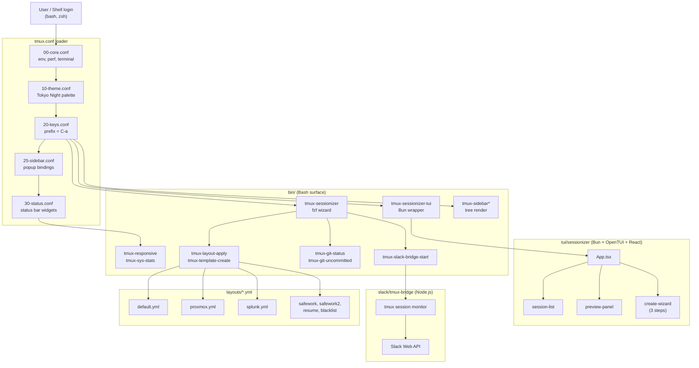

# TMUX SESSIONIZER


[](../../actions/workflows/ci.yml)
[](../../actions/workflows/10_pr-review.yml)
[](../../actions/workflows/11_security-pr-review.yml)
[](../../actions/workflows/12_dependabot-auto-merge.yml)
[](../../actions/workflows/13_pr-auto-merge.yml)
[](../../actions/workflows/14_bot-auto-fix.yml)
[](../../actions/workflows/60_ci-auto-heal.yml)
[](../../actions/workflows/25_release-publish.yml)

> **A Bash-first tmux configuration and session-management toolkit.**
> **Bash 중심의 tmux 설정 및 세션 관리 도구 모음입니다.**

---

## Table of Contents / 목차

- [Overview / 개요](#overview--개요)
- [Features / 주요 기능](#features--주요-기능)
- [Repository Structure / 저장소 구조](#repository-structure--저장소-구조)
- [Architecture / 아키텍처](#architecture--아키텍처)
- [Automation Inventory / 자동화 인벤토리](#automation-inventory--자동화-인벤토리)
- [Quick Start / 빠른 시작](#quick-start--빠른-시작)
- [Local Development / 로컬 개발](#local-development--로컬-개발)
- [Commands Reference / 명령어 참조](#commands-reference--명령어-참조)
- [Configuration Reference / 설정 참조](#configuration-reference--설정-참조)
- [Contribution Guide / 기여 가이드](#contribution-guide--기여-가이드)

---

## Overview / 개요

**TMUX SESSIONIZER** is a curated, opinionated tmux configuration designed for engineers who live in the terminal. It pairs a robust Bash surface (`bin/`) with a nested Bun + OpenTUI session picker, a Node.js Slack bridge, and 16 GitHub Actions workflows that keep the project self-healing and release-ready.

**TMUX SESSIONIZER**는 터미널 중심 개발자를 위해 설계된 큐레이션된 tmux 설정 모음입니다. 견고한 Bash 인터페이스(`bin/`)와 Bun + OpenTUI 기반 세션 피커, Node.js Slack 브리지, 그리고 프로젝트를 자가 치유하고 릴리스 준비 상태로 유지하는 16개의 GitHub Actions 워크플로우를 결합했습니다.

- **Bash-first** — every script in `bin/` is POSIX-Bash with no external runtime required.
- **Layout-driven** — YAML layout templates (`layouts/*.yml`) describe pane geometry, per-pane commands, and matching rules.
- **TUI on demand** — `tui/sessionizer` is a React + OpenTUI app shipped as a Bun single-binary wrapper.
- **Slack-aware** — `slack/tmux-bridge` synchronizes tmux sessions with Slack channels.
- **Automation-heavy** — 16 GitHub Actions workflows handle PR review, auto-merge, CI auto-heal, release publishing, and issue backfill.

- **Bash 우선** — `bin/`의 모든 스크립트는 외부 런타임 없이 POSIX-Bash로 동작합니다.
- **레이아웃 기반** — YAML 레이아웃 템플릿(`layouts/*.yml`)이 패널 구조와 명령을 정의합니다.
- **선택형 TUI** — `tui/sessionizer`는 Bun 단일 바이너리 래퍼로 제공되는 React + OpenTUI 앱입니다.
- **Slack 연동** — `slack/tmux-bridge`가 tmux 세션을 Slack 채널과 동기화합니다.
- **자동화 중심** — 16개의 GitHub Actions 워크플로우가 PR 리뷰, 자동 병합, CI 자가 치유, 릴리스 게시, 이슈 백필을 처리합니다.

---

## Features / 주요 기능

| Area / 영역 | Capability / 기능 | Entry point / 진입점 |
|---|---|---|
| Session discovery / 세션 검색 | fzf + directory scan + creation wizard | `bin/tmux-sessionizer` |
| TUI picker / TUI 피커 | React + OpenTUI with filter, preview, wizard | `tui/sessionizer` |
| Sidebar / 사이드바 | Tree rendering with color tiers | `bin/tmux-sidebar`, `bin/tmux-sidebar-toggle` |
| Layouts / 레이아웃 | YAML-driven pane geometry + per-pane commands | `bin/tmux-layout-apply`, `layouts/*.yml` |
| Status bar / 상태 바 | Width-tiered, iconified, git-aware | `bin/tmux-responsive`, `bin/tmux-sys-stats` |
| Slack bridge / Slack 브리지 | Session ↔ channel sync, dual mode (socket / HTTP) | `slack/tmux-bridge/`, `bin/tmux-slack-bridge-start` |
| Git awareness / Git 인식 | Branch, dirty, ahead/behind, stash, uncommitted | `bin/tmux-git-status`, `bin/tmux-git-uncommitted` |
| Templates / 템플릿 | Quick-create from preset | `bin/tmux-template-create` |
| Web terminal / 웹 터미널 | ttyd launcher | `bin/tmux-web-terminal` |
| Pane utilities / 패널 유틸 | Sync-panes, copy-word, url-open, file-open | `bin/tmux-pane-sync`, `bin/tmux-copy-word`, ... |
| Notifications / 알림 | Long-command desktop notification | `bin/tmux-notify-long-command` |
| Cheatsheet / 단축키 표 | Categorized popup reference | `bin/tmux-cheatsheet` |
| SSH / Clipboard / SSH & 클립보드 | SSH host picker, tmux buffer ring | `bin/tmux-ssh-picker`, `bin/tmux-clipboard-history` |
| Session ops / 세션 작업 | Rename, kill, cycle, jump, export, branch-log | `bin/tmux-session-*` |
| CI/CD / 자동화 | 16 GitHub Actions workflows | `.github/workflows/*.yml` |

---

## Repository Structure / 저장소 구조

The repository is intentionally flat. Bash is the dominant language, with two nested sub-projects (`tui/sessionizer`, `slack/tmux-bridge`) that each carry their own `AGENTS.md`.

저장소는 의도적으로 평탄하게 구성되어 있습니다. Bash가 주 언어이며, 두 개의 하위 프로젝트(`tui/sessionizer`, `slack/tmux-bridge`)가 각각 자체 `AGENTS.md`를 가집니다.

```
.
├── AGENTS.md                    # Project knowledge base (canonical)
├── CONTRIBUTING.md              # Contribution guidelines
├── LICENSE                      # MIT
├── OWNERS                       # Code owners
├── README.md                    # This file
├── sessionizer.conf             # SCAN_DIR + EXTRA_DIRS for session discovery
├── tmux.conf                    # Root loader: sources conf.d/*.conf (see tmux.conf)
├── bin/                         # 40+ Bash execution surface
│   ├── tmux-sessionizer         # fzf picker + creation wizard
│   ├── tmux-sessionizer-tui     # Launch TUI sessionizer (Bun wrapper)
│   ├── tmux-sidebar*            # Sidebar display, init, toggle
│   ├── tmux-session-*           # cycle, kill, rename, jump, sync, export, ...
│   ├── tmux-template-create     # Quick-create from preset
│   ├── tmux-layout-apply        # Apply YAML layout templates
│   ├── tmux-responsive          # Width-tiered statusbar
│   ├── tmux-auto-attach         # Login shell auto-attach flow
│   ├── tmux-opencode            # OpenCode session launcher
│   ├── tmux-command-palette     # fzf action picker
│   ├── tmux-url-open            # URL extraction
│   ├── tmux-file-open           # File path extraction
│   ├── tmux-ssh-picker          # SSH config host picker
│   ├── tmux-clipboard-history   # tmux buffer ring browser
│   ├── tmux-copy-word           # Smart word copy
│   ├── tmux-pane-sync           # Synchronize-panes toggle
│   ├── tmux-config-reload       # Reload config with diff
│   ├── tmux-notify-long-command # Desktop notification
│   ├── tmux-bash-preexec        # Shell preexec hook
│   ├── tmux-cheatsheet          # Keybinding reference popup
│   ├── tmux-slack-bridge-start  # Slack bridge startup wrapper
│   ├── tmux-slack-bridge-setup  # Slack app setup wizard
│   ├── tmux-git-status          # Git branch + dirty/ahead/behind
│   ├── tmux-git-uncommitted     # Per-session uncommitted tracker
│   ├── tmux-session-order       # MRU session sort
│   ├── tmux-sys-stats           # CPU + MEM for status bar
│   ├── tmux-web-terminal        # ttyd web terminal launcher
│   └── lib/                     # Shared library modules
│       ├── sidebar-colors
│       ├── sidebar-render
│       ├── tmux-sessionizer-common
│       └── tmux-sessionizer-wizard
├── layouts/                     # YAML layout presets
│   ├── blacklist.yml
│   ├── default.yml
│   ├── proxmox.yml
│   ├── resume.yml
│   ├── safework.yml
│   ├── safework2.yml
│   └── splunk.yml
├── tui/
│   └── sessionizer/             # Bun + OpenTUI + React TUI
│       ├── AGENTS.md
│       ├── bunfig.toml
│       ├── package.json
│       ├── tsconfig.json
│       ├── src/
│       │   ├── App.tsx
│       │   ├── index.tsx
│       │   ├── bun-env.d.ts
│       │   ├── actions/session-actions.ts
│       │   ├── components/
│       │   │   ├── create-wizard.tsx
│       │   │   ├── filter-input.tsx
│       │   │   ├── kill-confirm-dialog.tsx
│       │   │   ├── preview-panel.tsx
│       │   │   ├── rename-dialog.tsx
│       │   │   ├── session-list.tsx
│       │   │   ├── wizard-step-dir.tsx
│       │   │   ├── wizard-step-layout.tsx
│       │   │   └── wizard-step-name.tsx
│       │   ├── hooks/use-keyboard-handler.ts
│       │   └── lib/
│       │       ├── config.ts
│       │       ├── create-session.ts
│       │       ├── dirs.ts
│       │       ├── state.ts
│       │       ├── theme.ts
│       │       └── tmux.ts
│       └── __tests__/
│           ├── config.test.ts
│           └── tmux.test.ts
├── docs/
│   ├── session-persistence-brainstorming.md
│   └── supermemory-governance.md
└── slack/
    └── tmux-bridge/             # Node.js Slack ↔ tmux bridge
        └── AGENTS.md
```

---

## Architecture / 아키텍처

The system is layered. `tmux.conf` sources `conf.d/*.conf` (theme, keys, sidebar, status), which in turn drives tmux's own key table, status bar, and popup bindings. The Bash `bin/` surface is invoked by those bindings. The TUI is a separate binary launched from the Bash picker. The Slack bridge is a long-lived Node.js process that listens for tmux session events and mirrors them to Slack channels.

시스템은 계층화되어 있습니다. `tmux.conf`가 `conf.d/*.conf`(테마, 키, 사이드바, 상태)를 소스하여 tmux의 키 테이블, 상태 바, 팝업 바인딩을 구동합니다. Bash `bin/` 표면은 그 바인딩에서 호출됩니다. TUI는 Bash 피커에서 실행되는 별도 바이너리입니다. Slack 브리지는 tmux 세션 이벤트를 수신하여 Slack 채널에 미러링하는 장기 실행 Node.js 프로세스입니다.



---

## Automation Inventory / 자동화 인벤토리

### GitHub Actions Workflows / GitHub Actions 워크플로우

The project ships **16** workflows, organized by numeric prefix. Lower numbers are entry points; mid-range numbers are review/merge/cleanup; `ci.yml` and `60_ci-auto-heal.yml` are CI; `90+` and `20-29` are governance/release.

이 프로젝트는 **16**개의 워크플로우를 출하하며, 숫자 접두사로 구분됩니다. 낮은 번호는 진입점이고, 중간 번호는 리뷰/병합/정리, `ci.yml`과 `60_ci-auto-heal.yml`은 CI, `90+` 및 `20-29`는 거버넌스/릴리스입니다.

| File / 파일 | Trigger / 트리거 | Purpose / 목적 |
|---|---|---|
| `ci.yml` | push, PR | Lint + tests for Bash, TUI, bridge |
| `01_branch-to-pr.yml` | push to non-master | Open or update PR from branch |
| `02_issue-to-branch.yml` | issue label | Create branch from issue body |
| `10_pr-review.yml` | PR open/sync | AI PR review via [qodo-ai/pr-agent](https://github.com/qodo-ai/pr-agent) |
| `11_security-pr-review.yml` | PR open/sync | Security-focused review |
| `12_dependabot-auto-merge.yml` | Dependabot PR | Auto-merge patch/minor Dependabot updates |
| `13_pr-auto-merge.yml` | label `auto-merge` | Squash-merge PRs labelled `auto-merge` |
| `14_bot-auto-fix.yml` | PR comment `/fix` | Apply bot-suggested fixes to PR branch |
| `15_merged-pr-cleanup.yml` | PR closed | Delete merged feature branches |
| `19_issue-backfill.yml` | scheduled | Backfill missing metadata on stale issues |
| `24_release-notes.yml` | tag push | Generate release notes from conventional commits |
| `25_release-publish.yml` | release published | Build + publish release artifacts |
| `29_downstream-health-check.yml` | scheduled | Ping downstream consumers + health endpoints |
| `37_ci-failure-issues.yml` | CI failure | Open/find an issue for a recurring CI failure |
| `60_ci-auto-heal.yml` | CI failure | Self-heal known-flaky CI tasks and re-run |
| `91_issue-classification.yml` | issue open | Auto-label + classify new issues |

### Go Automation Tools / Go 자동화 도구

None at this time. All automation is currently expressed as GitHub Actions YAML. The project leaves room to introduce a Go-based runner if/when CLI latency or external API quotas become a concern.

현재는 없습니다. 모든 자동화는 GitHub Actions YAML로 표현되어 있습니다. CLI 지연 시간이나 외부 API 할당량이 우려될 경우 Go 기반 러너를 도입할 여지를 둡니다.

### Third-Party Bot Endpoints / 서드파티 봇 엔드포인트

- **PR review** — [qodo-ai/pr-agent](https://github.com/qodo-ai/pr-agent) is invoked by `10_pr-review.yml` and `11_security-pr-review.yml`.
- **Public health endpoint** — `29_downstream-health-check.yml` polls `https://cliproxy.jclee.me/v1` as a downstream smoke test.
- **Bot dashboard** — operator-facing status page: `https://bot.jclee.me`.

---

## Quick Start / 빠른 시작

### 1. Symlink as `~/.tmux` / `~/.tmux`로 심볼릭 링크

```bash
git clone https://github.com/<owner>/tmux-sessionizer.git ~/.tmux
ln -sf ~/.tmux/tmux.conf ~/.tmux.conf
```

### 2. Install Bash dependencies / Bash 의존성 설치

The Bash surface is intentionally lean. Most helpers only need `tmux` (≥ 1.9) and `fzf`. The Slack bridge additionally requires `node` (≥ 18) and `tsx`.

Bash 표면은 의도적으로 가볍게 설계되었습니다. 대부분의 헬퍼는 `tmux`(≥ 1.9)과 `fzf`만 필요합니다. Slack 브리지는 추가로 `node`(≥ 18)와 `tsx`가 필요합니다.

```bash
# macOS
brew install tmux fzf node

# Debian / Ubuntu
sudo apt-get install -y tmux fzf nodejs
```

### 3. Configure session discovery / 세션 검색 경로 설정

Edit `sessionizer.conf` to set the directories scanned by `tmux-sessionizer`.

`sessionizer.conf`를 편집하여 `tmux-sessionizer`가 스캔할 디렉터리를 설정합니다.

```yaml
# sessionizer.conf
SCAN_DIR: ~/code
EXTRA_DIRS:
  - ~/work
  - ~/playground
```

### 4. Start tmux / tmux 시작

```bash
tmux
```

You will land in the configured status bar with the sidebar available via the popup binding.

설정된 상태 바로 진입하며, 팝업 바인딩을 통해 사이드바를 사용할 수 있습니다.

### 5. (Optional) Launch the TUI / (선택) TUI 실행

```bash
~/.tmux/bin/tmux-sessionizer-tui
```

### 6. (Optional) Start the Slack bridge / (선택) Slack 브리지 시작

```bash
~/.tmux/bin/tmux-slack-bridge-setup   # one-time OAuth + app install
~/.tmux/bin/tmux-slack-bridge-start   # start the long-lived bridge
```

---

## Local Development / 로컬 개발

### Bash linting & tests / Bash 린트 & 테스트

```bash
shellcheck bin/tmux-* bin/lib/*
bash -n  bin/tmux-sessionizer
```

### TUI development / TUI 개발

```bash
cd tui/sessionizer
bun install
bun test                 # runs __tests__/*.test.ts
bun run dev              # hot-reload TUI
bun run build            # produce single-binary wrapper consumed by tmux-sessionizer-tui
```

### Slack bridge development / Slack 브리지 개발

```bash
cd slack/tmux-bridge
npm install
npm test
npm run dev
```

### Regenerate the AGENTS.md knowledge base / AGENTS.md 지식 베이스 재생성

The canonical `AGENTS.md` is regenerated by an internal tool. Do not hand-edit it; instead, run the generator and commit the diff.

공식 `AGENTS.md`는 내부 도구로 재생성됩니다. 수동으로 편집하지 말고, 생성기를 실행한 다음 diff를 커밋하세요.

```bash
# (internal) regenerates AGENTS.md from on-disk structure
./scripts/regen-agents-md.sh
```

---

## Commands Reference / 명령어 참조

All commands live under `bin/` and are designed to be bound to tmux keys (see `conf.d/20-keys.conf`) or invoked directly from the shell.

모든 명령은 `bin/`에 있으며, tmux 키(`conf.d/20-keys.conf` 참조)에 바인딩하거나 셸에서 직접 호출할 수 있습니다.

### Sessions / 세션

| Command / 명령 | Description / 설명 |
|---|---|
| `tmux-sessionizer` | fzf picker over `SCAN_DIR` + `EXTRA_DIRS`; create-or-attach |
| `tmux-sessionizer-tui` | launch Bun + OpenTUI TUI |
| `tmux-session-cycle` | rotate to next/previous session (PgUp / PgDn), excludes `opencode` |
| `tmux-session-jump` | MRU fzf picker |
| `tmux-session-kill` | terminate with confirmation |
| `tmux-session-rename` | rename with validation |
| `tmux-session-order` | sort sessions by last-active |
| `tmux-session-icon` | map session name → Nerd Font icon |
| `tmux-session-export` | export current session layout to YAML |
| `tmux-session-branch-log` | log session→branch on switch |
| `tmux-session-dashboard` | formatted table popup |
| `tmux-template-create` | quick-create from preset |

### Sidebar / 사이드바

| Command / 명령 | Description / 설명 |
|---|---|
| `tmux-sidebar` | render tree |
| `tmux-sidebar-init` | one-time init on session create |
| `tmux-sidebar-toggle` | toggle visibility |

### Status bar / 상태 바

| Command / 명령 | Description / 설명 |
|---|---|
| `tmux-responsive` | width-tiered rendering |
| `tmux-sys-stats` | CPU load + MEM |
| `tmux-git-status` | branch + dirty/ahead/behind/stash |
| `tmux-git-uncommitted` | per-session uncommitted tracker |
| `tmux-session-branch-log` | branch switch log |

### Layouts / 레이아웃

| Command / 명령 | Description / 설명 |
|---|---|
| `tmux-layout-apply <file.yml>` | apply a YAML layout template |
| `tmux-template-create` | quick-create a session from a layout |

### Slack bridge / Slack 브리지

| Command / 명령 | Description / 설명 |
|---|---|
| `tmux-slack-bridge-setup` | interactive Slack app OAuth wizard |
| `tmux-slack-bridge-start` | dual-mode runner (socket direct / HTTP cloudflared) + `tsx` exec |
| `tmux-session-sync` | mirror tmux sessions to Slack channels |

### Pane utilities / 패널 유틸

| Command / 명령 | Description / 설명 |
|---|---|
| `tmux-pane-sync` | toggle synchronize-panes |
| `tmux-copy-word` | smart word copy under cursor |
| `tmux-url-open` | fzf-extract URL from pane |
| `tmux-file-open` | fzf-extract file path from pane |
| `tmux-ssh-picker` | SSH config host picker |
| `tmux-clipboard-history` | tmux buffer ring browser |

### Shell hooks & ops / 셸 훅 및 운영

| Command / 명령 | Description / 설명 |
|---|---|
| `tmux-auto-attach` | login-shell auto-attach flow |
| `tmux-bash-preexec` | sourceable preexec hook for command timing |
| `tmux-config-reload` | reload `tmux.conf` with settings diff |
| `tmux-notify-long-command` | desktop notification for long-running commands |
| `tmux-cheatsheet` | categorized keybinding popup |
| `tmux-web-terminal` | ttyd web terminal launcher |
| `tmux-opencode` | OpenCode session launcher |
| `tmux-command-palette` | fzf action picker |

---

## Configuration Reference / 설정 참조

### `tmux.conf`

The root loader. Sources `conf.d/*.conf` in numeric order. See the on-disk file for the exact source list.

루트 로더입니다. `conf.d/*.conf`를 숫자 순서대로 소스합니다. 정확한 소스 목록은 디스크 상의 파일을 참조하세요.

### `sessionizer.conf`

YAML. Two keys:

- `SCAN_DIR` — primary project root scanned by `tmux-sessionizer`.
- `EXTRA_DIRS` — list of additional roots to include in the scan.

YAML. 두 개의 키:

- `SCAN_DIR` — `tmux-sessionizer`가 스캔할 기본 프로젝트 루트.
- `EXTRA_DIRS` — 스캔에 포함할 추가 루트 목록.

### `layouts/*.yml`

Each YAML file describes a tmux window layout: panes, per-pane commands, and optional matching rules (e.g. project name pattern). Provided presets:

각 YAML 파일은 tmux 윈도우 레이아웃(패널, 패널별 명령, 선택적 매칭 규칙)을 설명합니다. 제공되는 프리셋:

- `default.yml` — generic 2-pane split.
- `proxmox.yml` — Proxmox VM/CT management layout.
- `splunk.yml` — Splunk search-head/indexer workflow.
- `safework.yml`, `safework2.yml` — Safework project variants.
- `resume.yml` — resume-writing layout.
- `blacklist.yml` — denylist of session names.

### `slack/tmux-bridge/`

The bridge is configured by environment variables (see `slack/tmux-bridge/AGENTS.md`). Two run modes are supported by `tmux-slack-bridge-start`:

- **Socket direct** — connects to a local tmux server socket.
- **HTTP cloudflared** — connects over an HTTP tunnel, useful for remote hosts.

브리지는 환경 변수로 구성됩니다(`slack/tmux-bridge/AGENTS.md` 참조). `tmux-slack-bridge-start`는 두 가지 실행 모드를 지원합니다:

- **소켓 직접** — 로컬 tmux 서버 소켓에 연결.
- **HTTP cloudflared** — HTTP 터널을 통해 연결 (원격 호스트에 유용).

### CI/CD secrets / CI/CD 시크릿

| Secret / 시크릿 | Used by / 사용처 |
|---|---|
| `GITHUB_TOKEN` | all workflows (default) |
| `PR_AGENT_TOKEN` | `10_pr-review.yml`, `11_security-pr-review.yml` |
| `SLACK_BOT_TOKEN` | `slack/tmux-bridge`, `tmux-session-sync` |
| `SLACK_SIGNING_SECRET` | bridge webhook validation |

---

## Contribution Guide / 기여 가이드

1. **Read the canonical `AGENTS.md`.** It is regenerated automatically and represents the source of truth for the project layout. / 공식 `AGENTS.md`를 먼저 읽으세요. 자동 재생성되며 프로젝트 레이아웃의 진실 공급원입니다.
2. **Follow the file-naming convention.** Bash scripts in `bin/` must be `tmux-<verb>-<noun>`, lowercase, hyphen-separated. / 파일 명명 규칙을 따르세요. `bin/`의 Bash 스크립트는 `tmux-<동사>-<명사>` 형식이어야 합니다.
3. **Number your workflow files.** Pick the next free slot in the existing range (e.g. `10_*`, `20_*`, `30_*`, `40_*`, `50_*`, `60_*`, `70_*`, `80_*`, `90_*`). / 워크플로우 파일에 번호를 매기세요. 기존 범위(`10_*`, `20_*`, ...)에서 다음 빈 슬롯을 선택하세요.
4. **Run local checks before pushing.** / 푸시 전에 로컬 검증을 실행하세요.
   ```bash
   shellcheck bin/tmux-* bin/lib/*
   cd tui/sessionizer && bun test
   cd ../../slack/tmux-bridge && npm test
   ```
5. **Open a PR.** `01_branch-to-pr.yml` will keep the PR in sync with the source branch; `10_pr-review.yml` will request an AI review; label the PR `auto-merge` if it qualifies for `13_pr-auto-merge.yml`. / PR을 열면 `01_branch-to-pr.yml`이 동기화하고, `10_pr-review.yml`이 AI 리뷰를 요청하며, 자격이 되는 경우 `auto-merge` 레이블을 붙이면 `13_pr-auto-merge.yml`이 병합을 처리합니다.
6. **Update `OWNERS`** when adding new maintainer areas (sidebar, status, TUI, bridge, CI). / 새 유지보수 영역(사이드바, 상태, TUI, 브리지, CI)을 추가할 때 `OWNERS`를 업데이트하세요.

### Coding style / 코딩 스타일

- **Bash**: `set -euo pipefail`, `shellcheck` clean, prefer `printf` over `echo` for user-facing output.
- **TypeScript (TUI)**: strict mode, React function components, Bun-native APIs.
- **Node.js (bridge)**: ESM modules, `tsx` for development, `node --enable-source-maps` for production.

---

## License / 라이선스

MIT — see [LICENSE](./LICENSE).

MIT — [LICENSE](./LICENSE)를 참조하세요.