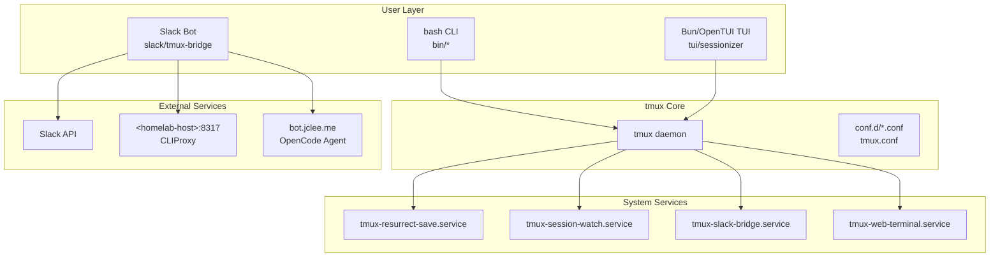

# TMUX SESSIONIZER

<!-- Logo Tagline -->
> bash-first tmux configuration and session-management toolkit

---

## Overview

**TMUX SESSIONIZER** is a comprehensive tmux configuration system designed for developers who work with multiple projects and sessions. It provides a unified interface for session discovery, creation, and management, with deep integrations for Slack, system services, and terminal UI applications.

The project is structured as a symlinked `~/.tmux` directory with a plugin-style architecture where core behavior lives in `conf.d/*.conf` and `bin/*` scripts. A nested Bun/OpenTUI sessionizer TUI runs at `tui/sessionizer`, and a Node.js Slack bridge operates at `slack/tmux-bridge`.

---

## 개요 (Korean)

**TMUX SESSIONIZER**는 여러 프로젝트와 세션으로 작업하는 개발자를 위해 설계된 종합 tmux 구성 시스템입니다. Slack, 시스템 서비스 및 터미널 UI 애플리케이션과의 심층 통합을 통해 세션 검색, 생성 및 관리를 위한 통합 인터페이스를 제공합니다.

프로젝트는 심볼릭 링크된 `~/.tmux` 디렉토리로 구조화되어 있으며, 플러그인 스타일 아키텍처에서 핵심 동작은 `conf.d/*.conf` 및 `bin/*` 스크립트에 있습니다. 중첩된 Bun/OpenTUI 세션라이저 TUI는 `tui/sessionizer`에서 실행되고, Node.js Slack 브리지는 `slack/tmux-bridge`에서 운영됩니다.

---

## Features

### Session Management

- **Intelligent Session Discovery**: Auto-scan configured directories for git repositories and project folders
- **Fuzzy Session Picker**: fzf-based session selection with preview and instant filtering
- **Session Creation Wizard**: Interactive multi-step wizard for new session setup
- **MRU Session Jump**: Quickly access most recently used sessions
- **Session Templates**: Create sessions from predefined layout templates
- **Session Export/Import**: Save and restore session window/pane layouts as YAML

### Terminal UI (TUI) Application

- **OpenTUI-based Interface**: Modern terminal user interface built with Bun and OpenTUI
- **Preview Panel**: Real-time preview of session contents and windows
- **Kill Confirmation**: Safe session termination with confirmation dialogs
- **Rename Support**: Rename existing sessions with validation
- **Layout Selection**: Visual layout picker during session creation
- **Filter Input**: Real-time fuzzy filtering across sessions

### Slack Integration

- **Bi-directional Bridge**: Sync tmux sessions with Slack channels
- **Interactive Commands**: Handle Slack modal submissions and button clicks
- **Channel Notifications**: Post session activity updates to Slack
- **Session Logging**: Capture and format session output for Slack
- **OpenCode Integration**: Launch sessions via Slack commands

### System Services

- **tmux-resurrect**: Save and restore tmux sessions across reboots
- **tmux-session-watch**: Monitor session state and auto-restart
- **tmux-slack-bridge**: Persistent bridge service with cloudflared tunnel
- **tmux-web-terminal**: Browser-based terminal via ttyd

---

## Architecture



---

## Repository Structure

```
tmux-sessionizer/
├── AGENTS.md                      # Project knowledge base
├── CONTRIBUTING.md                # Contribution guidelines
├── LICENSE                        # MIT License
├── OWNERS                         # Repository ownership
├── README.md                      # This file
├── sessionizer.conf              # Session discovery configuration
├── tmux.conf                      # Root tmux configuration
├── tui/
│   └── sessionizer/               # Bun/OpenTUI TUI application
│       ├── AGENTS.md
│       ├── bunfig.toml
│       ├── package.json
│       ├── tsconfig.json
│       ├── __tests__/
│       │   ├── config.test.ts
│       │   └── tmux.test.ts
│       └── src/
│           ├── App.tsx
│           ├── index.tsx
│           ├── lib/
│           │   ├── config.ts
│           │   ├── create-session.ts
│           │   ├── dirs.ts
│           │   ├── state.ts
│           │   └── theme.ts
│           ├── actions/
│           │   └── session-actions.ts
│           ├── hooks/
│           │   └── use-keyboard-handler.ts
│           └── components/
│               ├── create-wizard.tsx
│               ├── filter-input.tsx
│               ├── kill-confirm-dialog.tsx
│               ├── preview-panel.tsx
│               ├── rename-dialog.tsx
│               ├── session-list.tsx
│               ├── wizard-step-dir.tsx
│               ├── wizard-step-layout.tsx
│               └── wizard-step-name.tsx
├── wezterm/
│   └── wezterm.lua                # WezTerm terminal configuration
├── systemd/
│   ├── tmux-resurrect-save.service
│   ├── tmux-resurrect-save.sh
│   ├── tmux-server.service
│   ├── tmux-session-watch.path
│   ├── tmux-session-watch.service
│   ├── tmux-slack-bridge.service
│   └── tmux-web-terminal.service
└── slack/
    └── tmux-bridge/               # Node.js Slack bridge
        ├── AGENTS.md
        ├── SETUP.md
        ├── package-lock.json
        ├── package.json
        ├── tsconfig.json
        ├── vitest.config.ts
        └── src/
            ├── index.ts
            ├── types.ts
            ├── __tests__/
            │   ├── channels.test.ts
            │   ├── commands.test.ts
            │   ├── config.test.ts
            │   ├── formatter.test.ts
            │   ├── parser.test.ts
            │   └── types.test.ts
            ├── lib/
            │   ├── channels.ts
            │   ├── config.ts
            │   ├── idle-monitor.ts
            │   ├── opencode.ts
            │   ├── tmux.ts
            │   └── formatter/
            │       ├── blocks.ts
            │       ├── capture.ts
            │       ├── index.ts
            │       ├── modal.ts
            │       ├── notify.ts
            │       ├── opencode.ts
            │       ├── session.ts
            │       └── time.ts
            ├── actions/
            │   ├── handler.ts
            │   ├── helpers.ts
            │   ├── index.ts
            │   └── handlers/
            │       ├── index.ts
            │       ├── modal-open.ts
            │       ├── modal-submit.ts
            │       └── session.ts
            └── commands/
                ├── handler.ts
                ├── index.ts
                └── parser.ts
```

---

## Automation Inventory

### GitHub Actions Workflows

#### Pull Request Workflows

| File | Purpose |
|------|---------|
| `01_branch-to-pr.yml` | Create PR from branch with auto-description |
| `03_pr-checks.yml` | Run tests, lint, and build on PR |
| `09_semantic-pr.yml` | Enforce semantic PR title format |
| `10_pr-review.yml` | AI-powered PR review via CLIProxy |
| `13_pr-auto-merge.yml` | Auto-merge PRs on green |
| `14_bot-auto-fix.yml` | Auto-fix linting/code style issues |
| `15_merged-pr-cleanup.yml` | Clean up branches after merge |
| `security/11_pr-review.yml` | Security-focused PR review |

#### Issue Management Workflows

| File | Purpose |
|------|---------|
| `02_issue-to-branch.yml` | Create branch from issue |
| `18_issue-management.yml` | Manage issue lifecycle |
| `19_issue-backfill.yml` | Backfill issue details |
| `37_ci-failure-issues.yml` | Create issues on CI failures |
| `91_issue-classification.yml` | Classify and label issues |
| `43_reusable-issue-management.yml` | Reusable issue management |

#### Documentation Workflows

| File | Purpose |
|------|---------|
| `20_readme-gen.yml` | Auto-generate README updates |
| `21_docs-sync.yml` | Sync documentation across repos |
| `42_reusable-docs-sync.yml` | Reusable doc sync workflow |

#### Release Workflows

| File | Purpose |
|------|---------|
| `24_release-notes.yml` | Generate release notes |
| `25_release-publish.yml` | Publish releases |

#### Dependency Management

| File | Purpose |
|------|---------|
| `07_dependency-review.yml` | Review dependency changes |
| `12_dependabot-auto-merge.yml` | Auto-merge Dependabot PRs |

#### Security & Compliance

| File | Purpose |
|------|---------|
| `04_actionlint.yml` | Lint GitHub Actions workflows |
| `05_gitleaks.yml` | Scan for secrets in code |
| `06_codeql.yml` | CodeQL security analysis |
| `08_scorecard.yml` | OpenSSF Scorecard assessment |
| `45_reusable-gitleaks.yml` | Reusable gitleaks scanner |

#### CI/CD & Health Monitoring

| File | Purpose |
|------|---------|
| `29_downstream-health-check.yml` | Monitor downstream dependencies |
| `44_reusable-pr-checks.yml` | Reusable PR checks |
| `60_ci-auto-heal.yml` | Auto-heal broken CI |
| `auto-merge.yml` | Generic auto-merge workflow |
| `ci.yml` | Main CI workflow |
| `labeler.yml` | Auto-label PRs/issues |
| `welcome.yml` | Welcome new contributors |

### Go Automation Tools

**None** — This project does not use Go-based automation. All tooling is bash scripts, Node.js (Bun), and GitHub Actions.

### External Automation Services

| Service | Endpoint | Purpose |
|---------|----------|---------|
| CLIProxy | `https://cliproxy.jclee.me/v1` | AI PR reviews via minimax-m2.7 model |
| OpenCode Agent | `bot.jclee.me` | Interactive code assistant integration |
| cloudflared tunnel | `<homelab-host>` | Slack bridge cloud access |

---

## Quick Start

### Prerequisites

- **tmux** ≥ 3.0
- **bash** ≥ 4.0
- **fzf** ≥ 0.25
- **Bun** ≥ 1.0 (for TUI and Slack bridge)
- **git** (for session discovery)

### Installation

```bash
# Clone repository
git clone https://github.com/jclee941/.github ~/.tmux

# Create symlink
ln -sf ~/.tmux/tmux.conf ~/.tmux.conf
ln -sf ~/.tmux/sessionizer.conf ~/.sessionizer.conf

# Reload tmux
tmux source-file ~/.tmux.conf
```

### Initial Setup

```bash
# Configure session discovery directories
export SCAN_DIRS="$HOME/projects $HOME/work"
export EXTRA_DIRS="$HOME/sandbox"

# Install TUI dependencies
cd tui/sessionizer && bun install

# Install Slack bridge dependencies
cd slack/tmux-bridge && bun install

# Configure Slack app
./bin/tmux-slack-bridge-setup
```

---

## Local Development

### TUI Development

```bash
cd tui/sessionizer

# Install dependencies
bun install

# Run in development mode
bun run dev

# Run tests
bun test

# Build for production
bun run build
```

### Slack Bridge Development

```bash
cd slack/tmux-bridge

# Install dependencies
bun install

# Run with hot-reload
bun --watch src/index.ts

# Run tests
bun test

# Type check
bun run typecheck
```

### System Services Development

```bash
# Install systemd user services
mkdir -p ~/.config/systemd/user
ln -sf ~/.tmux/systemd/tmux-*.service ~/.config/systemd/user/
ln -sf ~/.tmux/systemd/tmux-*.path ~/.config/systemd/user/

# Reload systemd
systemctl --user daemon-reload

# Enable services
systemctl --user enable tmux-session-watch.service
systemctl --user enable tmux-slack-bridge.service

# Start services
systemctl --user start tmux-session-watch.service
systemctl --user start tmux-slack-bridge.service
```

### Running Tests

```bash
# TUI tests
cd tui/sessionizer && bun test

# Slack bridge tests
cd slack/tmux-bridge && bun test

# All tests (from repo root)
bun test ./tui/sessionizer ./slack/tmux-bridge
```

---

## Commands Reference

### Session Management

| Command | Description |
|---------|-------------|
| `tmux-sessionizer` | Main fzf session picker with creation wizard |
| `tmux-session-jump` | MRU-based session jump |
| `tmux-session-kill` | Kill session with confirmation |
| `tmux-session-rename` | Rename session with validation |
| `tmux-session-sync` | Sync sessions with Slack channels |
| `tmux-session-export` | Export session layout to YAML |
| `tmux-session-import` | Import session layout from YAML |
| `tmux-template-create` | Create session from template |
| `tmux-layout-apply` | Apply YAML layout to session |
| `tmux-session-dashboard` | Display session table popup |

### Sidebar Commands

| Command | Description |
|---------|-------------|
| `tmux-sidebar-toggle` | Toggle sidebar visibility |
| `tmux-sidebar-init` | Initialize sidebar on session create |

### Utility Commands

| Command | Description |
|---------|-------------|
| `tmux-session-cycle` | Cycle sessions with PgUp/PgDn |
| `tmux-session-icon` | Get Nerd Font icon for session |
| `tmux-command-palette` | fzf action picker |
| `tmux-url-open` | Extract and open URLs from pane |
| `tmux-file-open` | Extract and open file paths from pane |
| `tmux-ssh-picker` | Pick SSH config hosts |
| `tmux-clipboard-history` | Browse tmux buffer ring |
| `tmux-copy-word` | Smart word copy under cursor |
| `tmux-pane-sync` | Toggle synchronize-panes |
| `tmux-config-reload` | Reload config with diff |
| `tmux-notify-long-command` | Desktop notification for long commands |
| `tmux-cheatsheet` | Display keybinding cheatsheet |
| `tmux-git-status` | Show git branch and status |
| `tmux-git-uncommitted` | Track uncommitted changes |
| `tmux-session-order` | Order sessions by recent activity |
| `tmux-sys-stats` | Show CPU/MEM in status bar |
| `tmux-opencode` | Launch OpenCode session |
| `tmux-auto-attach` | Login shell auto-attach |
| `tmux-web-terminal` | Launch ttyd web terminal |

### Slack Bridge Commands

| Command | Description |
|---------|-------------|
| `tmux-slack-bridge-start` | Start bridge in dual mode |
| `tmux-slack-bridge-setup` | Interactive Slack app setup |

---

## Configuration

### sessionizer.conf

```bash
# Directories to scan for sessions
SCAN_DIRS="$HOME/projects $HOME/work"

# Additional directories
EXTRA_DIRS="$HOME/sandbox $HOME/demo"

# Session naming patterns
SESSION_NAME_PATTERN="[{git_branch}] {dir_name}"

# Auto-attach on session create
AUTO_ATTACH=true

# Slack bridge mode: socket | cloudflare
SLACK_BRIDGE_MODE=socket
```

### Environment Variables

| Variable | Default | Description |
|----------|---------|-------------|
| `SCAN_DIRS` | `$HOME` | Colon-separated directories to scan |
| `EXTRA_DIRS` | empty | Additional directories |
| `TMUX_SESSIONIZER_THEME` | `default` | Color theme |
| `SLACK_BRIDGE_MODE` | `socket` | Bridge connection mode |
| `CLIPROXY_API_KEY` | required | API key for AI reviews |
| `OPENCODE_API_KEY` | required | API key for OpenCode |

---

## Contribution Guide

### Contributing to TMUX Sessionizer

1. **Fork** the repository
2. **Create** a feature branch: `git checkout -b feat/my-feature`
3. **Commit** changes: `git commit -am 'Add new feature'`
4. **Push** to branch: `git push origin feat/my-feature`
5. **Open** a Pull Request

### Development Standards

- **Shell scripts**: Run `shellcheck` before committing
- **Bun packages**: Ensure all tests pass before PR
- **GitHub Actions**: Use `actionlint` to validate workflows
- **Commits**: Follow conventional commit format

### Code Style

```bash
# Lint shell scripts
shellcheck bin/*

# Format Bun code
bun fmt

# Type check Bun code
bun run typecheck
```

### Testing

```bash
# TUI tests
bun test ./tui/sessionizer/__tests__/

# Slack bridge tests
bun test ./slack/tmux-bridge/__tests__/

# All tests with coverage
bun test --coverage
```

---

## Links

- **Documentation**: [AGENTS.md](./AGENTS.md)
- **Slack Bridge Setup**: [slack/tmux-bridge/SETUP.md](./slack/tmux-bridge/SETUP.md)
- **Contributing**: [CONTRIBUTING.md](./CONTRIBUTING.md)

---

## License

MIT License — see [LICENSE](./LICENSE) for details.
