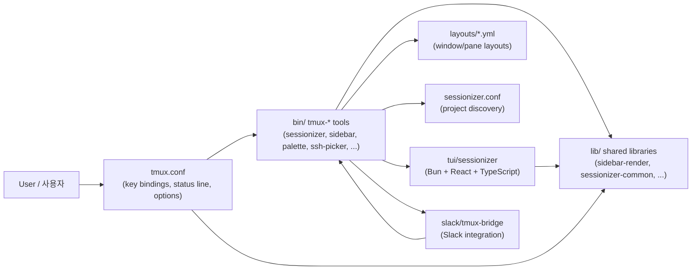

# tmux Productivity Suite / tmux 생산성 도구 모음

> A curated, opinionated tmux configuration plus a complete ecosystem of companion tools, shared libraries, declarative YAML layouts, a Bun/React/TypeScript TUI, and a Slack bridge — all designed for power users working across many projects and remote hosts.
>
> 큐레이션된 tmux 설정과, 함께 동작하는 풍부한 생태계(보조 도구, 공유 라이브러리, 선언적 YAML 레이아웃, Bun/React/TypeScript 기반 TUI, Slack 브리지)를 한 저장소에 담은, 다수 프로젝트와 원격 호스트를 다루는 파워 유저용 환경입니다.

---

## Overview / 개요

This repository bundles a battle-tested `tmux.conf`, a `sessionizer.conf` for project discovery, and a curated set of companion binaries under `bin/`. It ships shared shell libraries under `lib/`, project-style window layouts under `layouts/`, a modern Terminal UI (`tui/sessionizer/`), and a Slack ↔ tmux bridge (`slack/tmux-bridge/`).

이 저장소는 실전에서 검증된 `tmux.conf`, 프로젝트 검색을 위한 `sessionizer.conf`, 그리고 `bin/` 디렉터리의 큐레이션된 보조 바이너리들을 함께 제공합니다. `lib/`의 공유 셸 라이브러리, `layouts/`의 프로젝트형 윈도우 레이아웃, 모던 터미널 UI(`tui/sessionizer/`), 그리고 Slack ↔ tmux 브리지(`slack/tmux-bridge/`)가 한 곳에서 동작합니다.

### Who is this for? / 사용 대상

| Audience / 대상 | Use case / 활용 사례 |
| --- | --- |
| Multi-project developers / 다수 프로젝트 개발자 | Jump between repos, save layouts per project, fast session creation / 저장소 간 빠른 이동, 프로젝트별 레이아웃 |
| DevOps / SRE engineers / DevOps·SRE 엔지니어 | SSH picker, per-host layouts, system stats, long-command notifications |
| Remote-first teams / 원격 우선 팀 | Slack bridge for sharing terminal access from chat / 채팅에서 터미널 공유 |
| tmux power users / tmux 파워 유저 | TUI sessionizer, sidebar, command palette, pane synchronization |

---

## Features / 기능

### Session management / 세션 관리
- **`tmux-sessionizer`** — project-aware session creation; fuzzy-find a directory and attach or create a tmux session.
- **`tmux-sessionizer-tui`** — Bun + React + TypeScript TUI with live preview, create wizard, kill-confirm and rename dialogs.
- **`tmux-session-cycle`**, **`tmux-session-jump`**, **`tmux-session-kill`**, **`tmux-session-rename`**, **`tmux-session-order`**, **`tmux-session-sync`** — fast cycle, jump, kill, rename, reorder, and synchronization helpers.
- **`tmux-session-dashboard`** — at-a-glance overview of all active sessions.
- **`tmux-session-export`** / **`tmux-session-branch-log`** — capture session state and per-branch activity logs.
- **`tmux-session-icon`** — assign per-session icons/colors used by the sidebar.

### Sidebar, command palette & navigation / 사이드바 · 명령 팔레트 · 탐색
- **`tmux-sidebar`**, **`tmux-sidebar-init`**, **`tmux-sidebar-toggle`** — popup sidebar with sessions, windows, panes, git status and system stats.
- **`tmux-command-palette`** — fuzzy command launcher inside tmux.
- **`tmux-cheatsheet`** — in-session keybinding reference.
- **`tmux-layout-apply`**, **`tmux-template-create`** — apply or define declarative YAML window layouts.

### Git, SSH & system integration / Git · SSH · 시스템 통합
- **`tmux-git-status`**, **`tmux-git-uncommitted`** — git awareness in the status line and sidebar.
- **`tmux-ssh-picker`** — fuzzy picker for SSH hosts; pairs with the `layouts/*.yml` files for host-specific layouts.
- **`tmux-sys-stats`** — CPU/memory/load status-line widget.
- **`tmux-notify-long-command`** — desktop notification when long-running commands finish.
- **`tmux-responsive`** — adaptive tweaks for terminal resize.
- **`tmux-pane-sync`** — synchronize input across panes.
- **`tmux-clipboard-history`**, **`tmux-copy-word`**, **`tmux-url-open`**, **`tmux-file-open`** — clipboard, word-copy, URL opener and file opener helpers.
- **`tmux-auto-attach`**, **`tmux-config-reload`**, **`tmux-bash-preexec`**, **`tmux-opencode`**, **`tmux-web-terminal`** — startup, config reload, pre-exec hooks, AI coding and web terminal integrations.

### Collaboration / 협업
- **`tmux-slack-bridge-setup`**, **`tmux-slack-bridge-start`** — share a tmux session with teammates via Slack.
- The bridge implementation lives under `slack/tmux-bridge/`.

---

## Repository layout / 저장소 구조

```text
.
├── AGENTS.md
├── CONTRIBUTING.md
├── LICENSE
├── OWNERS
├── README.md
├── sessionizer.conf        # project discovery configuration
├── tmux.conf               # main tmux configuration
├── bin/                    # executable companion tools (tmux-*)
│   ├── tmux-sessionizer
│   ├── tmux-sessionizer-tui
│   ├── tmux-sidebar / tmux-sidebar-init / tmux-sidebar-toggle
│   ├── tmux-session-cycle / -jump / -kill / -rename / -order / -sync
│   ├── tmux-session-dashboard / -export / -branch-log / -icon
│   ├── tmux-command-palette / tmux-cheatsheet
│   ├── tmux-layout-apply / tmux-template-create
│   ├── tmux-git-status / tmux-git-uncommitted
│   ├── tmux-ssh-picker / tmux-sys-stats
│   ├── tmux-clipboard-history / tmux-copy-word
│   ├── tmux-url-open / tmux-file-open
│   ├── tmux-pane-sync / tmux-responsive
│   ├── tmux-notify-long-command
│   ├── tmux-auto-attach / tmux-config-reload
│   ├── tmux-bash-preexec / tmux-opencode / tmux-web-terminal
│   └── tmux-slack-bridge-setup / tmux-slack-bridge-start
├── lib/                    # shared shell libraries
│   ├── sidebar-colors
│   ├── sidebar-render
│   ├── tmux-sessionizer-common
│   └── tmux-sessionizer-wizard
├── layouts/                # declarative YAML window layouts
│   ├── blacklist.yml       # directories to ignore
│   ├── default.yml
│   ├── proxmox.yml
│   ├── resume.yml
│   ├── safework.yml
│   ├── safework2.yml
│   └── splunk.yml
├── tui/
│   └── sessionizer/        # Bun + React + TypeScript TUI
│       ├── AGENTS.md
│       ├── package.json
│       ├── tsconfig.json
│       ├── bunfig.toml
│       ├── bun.lock
│       ├── src/
│       │   ├── App.tsx
│       │   ├── index.tsx
│       │   ├── bun-env.d.ts
│       │   ├── actions/
│       │   ├── components/
│       │   ├── hooks/
│       │   └── lib/
│       └── __tests__/
├── docs/                   # design notes
│   ├── session-persistence-brainstorming.md
│   └── supermemory-governance.md
└── slack/
    └── tmux-bridge/        # Slack ↔ tmux bridge
        └── AGENTS.md
```

---

## Architecture / 아키텍처



Entry points at a glance / 주요 진입점:

| Entry / 진입점 | Purpose / 역할 |
| --- | --- |
| `tmux.conf` | Loaded by `tmux` on server start; binds keys to binaries in `bin/` |
| `sessionizer.conf` | Drives `tmux-sessionizer` directory discovery |
| `bin/tmux-sessionizer` | CLI sessionizer; fuzzy-find a project and attach/create |
| `bin/tmux-sessionizer-tui` | TUI entry that launches the Bun/React app |
| `tui/sessionizer/src/index.tsx` | TUI application root |
| `bin/tmux-sidebar` / `tmux-sidebar-toggle` | Sidebar popup entry points |
| `slack/tmux-bridge/` | Slack ↔ tmux integration code |

---

## Quick start / 빠른 시작

### 1. Clone / 클론

```bash
git clone <REPO_URL> ~/projects/tmux-suite
cd ~/projects/tmux-suite
```

Replace `<REPO_URL>` with your fork or clone URL.

### 2. Install dependencies / 의존성 설치

Required / 필수:

- `tmux` (3.x recommended / 3.x 권장)
- `bash`, `find`, `fzf` (or compatible fuzzy finder wired by `tmux-sessionizer`)
- `git`

For the TUI / TUI용:

- [Bun](https://bun.sh) runtime

```bash
cd tui/sessionizer
bun install
cd -
```

### 3. Wire the configuration / 설정 연결

Symlink (or copy) the configuration files into your home directory / 설정 파일을 홈 디렉터리에 심볼릭 링크 또는 복사:

```bash
ln -sf "$PWD/tmux.conf"        "$HOME/.tmux.conf"
ln -sf "$PWD/sessionizer.conf" "$HOME/.config/tmux/sessionizer.conf"  # or wherever your tool expects it
```

Make the tools executable / 도구를 실행 가능하게 설정:

```bash
chmod +x bin/* tui/sessionizer/src/*.tsx 2>/dev/null || true
chmod +x bin/*
```

### 4. Launch tmux / tmux 실행

```bash
tmux new-session \; source-file ~/.tmux.conf
```

On most setups, just running `tmux` will pick up `~/.tmux.conf` automatically.

### 5. Try the core workflows / 핵심 워크플로 시험

```bash
# Pick or create a project session
bin/tmux-sessionizer

# Open the TUI sessionizer
bin/tmux-sessionizer-tui

# Toggle the sidebar popup
bin/tmux-sidebar-toggle

# Pick an SSH host
bin/tmux-ssh-picker
```

---

## Configuration / 설정

### `tmux.conf`
Main tmux configuration. Source it from `~/.tmux.conf`. It sets status-line options, key bindings (prefix-style), and references all binaries in `bin/`.

### `sessionizer.conf`
Drives project discovery for `tmux-sessionizer` and `tmux-sessionizer-tui`:

- Roots to scan for projects
- Ignore patterns (mirrored by `layouts/blacklist.yml`)
- Per-project naming, layout hints, and tags

### `layouts/*.yml`
Declarative window/pane layouts applied with `tmux-layout-apply`. Available files:

- `default.yml` — fallback for generic projects
- `proxmox.yml`, `splunk.yml` — host/tool-specific layouts
- `safework.yml`, `safework2.yml`, `resume.yml` — personal workflow presets
- `blacklist.yml` — directories ignored by the sessionizer

Each YAML describes a tree of windows, panes, commands to run on creation, and optional hooks.

### Per-tool configuration / 도구별 설정
Each binary in `bin/` reads environment variables or XDG-style config files (see the script header for the exact variable names). Common variables:

| Variable / 변수 | Used by / 사용처 | Purpose / 용도 |
| --- | --- | --- |
| `SESSIONIZER_CONFIG` | `tmux-sessionizer*` | Path to `sessionizer.conf` |
| `TMUX_SUITE_HOME` | most `bin/*` tools | Repository root |
| `LAYOUTS_DIR` | `tmux-layout-apply` | Directory holding `*.yml` layouts |
| `SLACK_BRIDGE_*` | `tmux-slack-bridge-*` | Tokens, channel and target session |

---

## Commands reference / 명령어 레퍼런스

> The exact key bindings live in `tmux.conf`. The list below maps the binary to its purpose.

### Sessionizers / 세션나이저
- `bin/tmux-sessionizer` — CLI: fuzzy pick a directory, then attach-or-create.
- `bin/tmux-sessionizer-tui` — TUI version (Bun + React + TypeScript).

### Sidebar / 사이드바
- `bin/tmux-sidebar` — render the sidebar popup.
- `bin/tmux-sidebar-init` — one-time setup (colors, hooks).
- `bin/tmux-sidebar-toggle` — toggle the popup.

### Sessions / 세션
- `bin/tmux-session-cycle` — cycle through sessions.
- `bin/tmux-session-jump` — jump to a session.
- `bin/tmux-session-kill` — kill one or more sessions (with confirm UI from TUI).
- `bin/tmux-session-rename` — rename current session.
- `bin/tmux-session-order` — reorder sessions.
- `bin/tmux-session-sync` — sync session metadata.
- `bin/tmux-session-dashboard` — show overview of all sessions.
- `bin/tmux-session-export` — export session state.
- `bin/tmux-session-branch-log` — per-branch activity log.
- `bin/tmux-session-icon` — set session icon/color.

### Layouts & templates / 레이아웃 · 템플릿
- `bin/tmux-layout-apply <file.yml>` — apply a YAML layout to the current session.
- `bin/tmux-template-create` — scaffold a new layout template.

### Git, SSH & system / Git · SSH · 시스템
- `bin/tmux-git-status`
- `bin/tmux-git-uncommitted`
- `bin/tmux-ssh-picker`
- `bin/tmux-sys-stats`

### Productivity / 생산성
- `bin/tmux-command-palette`
- `bin/tmux-cheatsheet`
- `bin/tmux-clipboard-history`
- `bin/tmux-copy-word`
- `bin/tmux-url-open`
- `bin/tmux-file-open`
- `bin/tmux-pane-sync`
- `bin/tmux-responsive`
- `bin/tmux-notify-long-command`

### Lifecycle / 수명주기
- `bin/tmux-auto-attach`
- `bin/tmux-config-reload`
- `bin/tmux-bash-preexec`
- `bin/tmux-opencode`
- `bin/tmux-web-terminal`

### Slack bridge / Slack 브리지
- `bin/tmux-slack-bridge-setup` — first-time setup.
- `bin/tmux-slack-bridge-start` — start the bridge (see `slack/tmux-bridge/AGENTS.md`).

---

## Local development / 로컬 개발

### Editing the shell tools / 셸 도구 편집
The `bin/` and `lib/` scripts are plain POSIX/Bash. After editing:

```bash
# reload tmux configuration without restarting
prefix + r         # or: bin/tmux-config-reload
```

Make sure new tools are `chmod +x`-ed and (if added) referenced from `tmux.conf`.

### Working on the TUI / TUI 작업

```bash
cd tui/sessionizer
bun install
bun run dev      # if a dev script is defined; otherwise:
bun run src/index.tsx
```

Source layout under `tui/sessionizer/`:

- `src/App.tsx`, `src/index.tsx` — entry and shell.
- `src/components/` — `session-list`, `preview-panel`, `create-wizard`, `filter-input`, `rename-dialog`, `kill-confirm-dialog`.
- `src/hooks/use-keyboard-handler.ts` — keyboard routing.
- `src/actions/session-actions.ts` — side effects against tmux.
- `src/lib/` — `config.ts`, `create-session.ts`, `dirs.ts`, `state.ts`, `theme.ts`, `tmux.ts`.

### Working on the Slack bridge / Slack 브리지 작업
See `slack/tmux-bridge/AGENTS.md` for bridge-specific guidance and run:

```bash
bin/tmux-slack-bridge-setup   # one-time configuration
bin/tmux-slack-bridge-start   # start the bridge process
```

### Design notes / 설계 노트
- `docs/session-persistence-brainstorming.md` — ideas for session state recovery.
- `docs/supermemory-governance.md` — governance notes for shared memory/state.

---

## Testing / 테스트

### TUI unit tests / TUI 단위 테스트

```bash
cd tui/sessionizer
bun test                  # runs __tests__/*.test.ts
```

The `__tests__/` directory contains `config.test.ts` and `tmux.test.ts`.

### Shell smoke tests / 셸 스모크 테스트
There is no formal shell test runner in this repo. Recommended manual checks / 이 저장소에는 정식 셸 테스트 러너가 없으므로 다음 수동 점검을 권장합니다:

```bash
shellcheck bin/* lib/*
bash -n bin/tmux-sessionizer
```

### Verifying a tool end-to-end / 도구 종단 검증

```bash
# Start tmux
tmux new -d -s suite-smoke
tmux send-keys -t suite-smoke "bin/tmux-sessionizer" Enter
tmux capture-pane -t suite-smoke -p
tmux kill-session -t suite-smoke
```

---

## Contribution guide / 기여 가이드

1. Read `CONTRIBUTING.md` for the project's contribution rules.
2. Check `OWNERS` for the current reviewers/maintainers.
3. Read the relevant `AGENTS.md` before working on a subsystem:
   - root `AGENTS.md` — overall agent guidance
   - `tui/sessionizer/AGENTS.md` — TUI conventions
   - `slack/tmux-bridge/AGENTS.md` — bridge conventions
4. Keep new tools small, composable, and consistent with existing naming (`tmux-<verb>-<noun>`).
5. Add or update tests under `tui/sessionizer/__tests__/` for TUI changes.
6. Update `README.md` and `docs/` if behavior changes.
7. Open a pull request; reference any related issues.

Style reminders / 스타일 유의사항:

- Bash: prefer `#!/usr/bin/env bash`, `set -euo pipefail`, and source helpers from `lib/`.
- TypeScript: follow the existing structure under `tui/sessionizer/src/`.
- YAML layouts: validate against an existing layout before opening a PR.

---

## License / 라이선스

See `LICENSE` for full license text.

전체 라이선스 전문은 `LICENSE` 파일을 참고하세요.