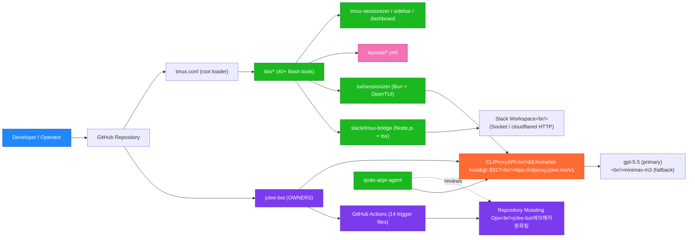

# TMUX SESSIONIZER / tmux 세션나이저


> A Bash-first tmux configuration and session-management toolkit, symlinked as `~/.tmux`, with a Bun/OpenTUI sessionizer, a Node.js Slack bridge, and a fully automated GitHub lifecycle owned by **jclee-bot**.
>
> Bash 우선 tmux 설정 및 세션 관리 툴킷. `~/.tmux`로 심볼릭 링크되며, Bun/OpenTUI 세션나이저, Node.js Slack 브리지, **jclee-bot**이 소유하는 완전 자동화된 GitHub 라이프사이클을 함께 제공한다.

---

## Overview / 개요

**English.** TMUX SESSIONIZER is a homelab-grade tmux distribution. Its `tmux.conf` is a thin loader; the real behavior lives in a `bin/` surface of more than forty small, composable Bash tools (session discovery, sidebar rendering, dashboard, layout templates, Git awareness, Slack bridging, URL/file pickers, status bar widgets, and more). Two companion applications extend the surface: a Bun + OpenTUI terminal UI for interactive session creation and a Node.js bridge that synchronizes tmux sessions with a Slack workspace over a direct socket or a `cloudflared` HTTP tunnel. All mutating GitHub automation is owned by `jclee-bot`, which routes large-language-model calls through CLIProxyAPI and runs the repository's automation triggers (CI, review, merge, release, cleanup, backfill) declaratively.

**한국어.** TMUX SESSIONIZER는 홈랩급 tmux 배포판이다. `tmux.conf`는 얇은 로더이며, 실제 동작은 40개가 넘는 작고 조합 가능한 Bash 도구로 구성된 `bin/` 표면에 산다(세션 탐색, 사이드바 렌더링, 대시보드, 레이아웃 템플릿, Git 인식, Slack 브리지, URL/파일 피커, 상태바 위젯 등). 두 개의 동반 애플리케이션이 표면을 확장한다: Bun + OpenTUI 기반 터미널 UI(대화형 세션 생성)와, tmux 세션을 Slack 워크스페이스와 동기화하는 Node.js 브리지(직접 소켓 또는 `cloudflared` HTTP 터널 사용). 모든 변형(mutating) GitHub 자동화는 `jclee-bot`이 소유하며, 대규모 언어 모델 호출은 CLIProxyAPI를 통해 라우팅되고, 저장소의 자동화 트리거(CI, 리뷰, 머지, 릴리스, 정리, 백필)를 선언적으로 실행한다.

### Endpoints and Naming / 엔드포인트와 명명 규칙

| Item / 항목 | Value / 값 | Note / 비고 |
| --- | --- | --- |
| LLM Router / LLM 라우터 | `https://cliproxy.jclee.me/v1` | Public endpoint only; never hardcoded RFC1918. |
| Local Router (placeholder) | `&lt;homelab-host&gt;:8317` | Replace with your own host. Do not commit LAN IPs. |
| Bot Home / 봇 홈 | `https://bot.jclee.me` | jclee-bot dashboard (not part of this repo). |
| PR Review Engine | `qodo-ai/pr-agent` | Used by 10_pr-review.yml and 11_security-pr-review.yml. |
| Primary Model / 기본 모델 | `gpt-5.5` | README generation default. |
| Fallback Model / 폴백 모델 | `minimax-m3` | Served via CLIProxyAPI. |
| Bot Owner / 봇 소유자 | `jclee-bot` | All mutating GitHub actions. |

---

## Features / 주요 기능

### Session Lifecycle / 세션 라이프사이클

- **Fuzzy session discovery** via `tmux-sessionizer` (fzf + creation wizard) and `tmux-sessionizer-tui` (Bun + OpenTUI front-end).
- **MRU jump picker** with `tmux-session-jump` for one-keystroke switching.
- **Cycle, kill, rename, order, icon, dashboard** for at-a-glance operations.
- **Auto-attach on login shell** via `tmux-auto-attach`.

### Sidebar and Status / 사이드바와 상태바

- **Tree sidebar** with `tmux-sidebar`, `tmux-sidebar-init`, `tmux-sidebar-toggle`, plus `bin/lib/sidebar-render` and `bin/lib/sidebar-colors`.
- **Width-tiered status bar** with `tmux-responsive`.
- **System stats** (load + memory) with `tmux-sys-stats`.
- **Long-command desktop notifications** with `tmux-notify-long-command` (sourced from `tmux-bash-preexec`).

### Layouts and Templates / 레이아웃과 템플릿

- YAML-driven layouts in `layouts/` (`default.yml`, `proxmox.yml`, `splunk.yml`, `safework.yml`, `safework2.yml`, `resume.yml`, `blacklist.yml`).
- `tmux-template-create` builds sessions from a preset in seconds.
- `tmux-layout-apply` rehydrates an existing session from a YAML file.
- `tmux-session-export` captures a live session back to YAML for re-use.

### Git Awareness / Git 인식

- `tmux-git-status` shows branch, dirty/ahead/behind/stash counters.
- `tmux-git-uncommitted` keeps a per-session record of uncommitted work.
- `tmux-session-branch-log` writes a session → branch map on every switch.

### Pickers and Copy / 피커와 복사

- `tmux-command-palette`, `tmux-ssh-picker`, `tmux-url-open`, `tmux-file-open`, `tmux-clipboard-history`, `tmux-copy-word`.

### Slack Bridge / Slack 브리지

- `slack/tmux-bridge/` is a Node.js + `tsx` application that mirrors tmux sessions into Slack channels.
- `tmux-slack-bridge-setup` runs an interactive setup wizard (Socket mode or `cloudflared` HTTP).
- `tmux-slack-bridge-start` is the runtime wrapper that selects the transport.

### TUI Front-End / TUI 프런트엔드

- `tui/sessionizer/` is a Bun + OpenTUI application written in TypeScript and React.
- It exposes filter input, session list, preview panel, kill-confirm dialog, rename dialog, and a 3-step creation wizard (dir → layout → name).
- Tests live in `tui/sessionizer/__tests__/`.

---

## Architecture / 아키텍처

The diagram below is the canonical data-flow view. It treats workflow files as **implementation triggers** owned by `jclee-bot` rather than the source of truth; the source of truth is the bot's intent, which the workflow files merely execute.

아래 다이어그램은 정식 데이터 흐름도이다. 워크플로 파일은 `jclee-bot`이 소유하는 **구현 트리거**로 취급하며, 진실의 근원은 bot의 의도이고 워크플로 파일은 그것을 실행할 뿐이다.



### Architectural Notes / 아키텍처 노트

- **Loader is intentionally thin.** `tmux.conf` only sets the prefix (`C-a`) and sources a runtime `conf.d/*.conf` chain documented in `AGENTS.md`; behavior lives in `bin/*` so that any tool can be invoked from a non-tmux shell.
- **LLM calls are external.** No model is bundled. The TUI and bot both call CLIProxyAPI, which fronts `gpt-5.5` and falls back to `minimax-m3`. Do not bake private hostnames into this repo — use the public `https://cliproxy.jclee.me/v1` or your own placeholder.
- **Workflow files are not the source of truth.** The 14 `.yml` files under `.github/workflows/` are the *triggers* the bot declares; the bot itself is the policy.
- **No Go surface.** This repository has zero Go automation tools. All automation is Bash, TypeScript, and YAML.

---

## Repository Layout / 저장소 구조

The tree below mirrors the actual top-level layout. The directory `conf.d/` referenced in `AGENTS.md` is sourced at runtime by `tmux.conf` and is intentionally not committed as a separate directory; it is part of the loader's chain.

아래 트리는 실제 최상위 레이아웃을 반영한다. `AGENTS.md`에서 언급되는 `conf.d/` 디렉터리는 `tmux.conf`가 런타임에 소싱하며 별도 디렉터리로 커밋되지 않는다. 로더 체인의 일부이다.

```text
.
├── AGENTS.md                       # Project knowledge base / 프로젝트 지식 베이스
├── CONTRIBUTING.md                 # Contribution guide / 기여 가이드
├── LICENSE                         # MIT license / MIT 라이선스
├── OWNERS                          # jclee-bot ownership record / 소유권 기록
├── README.md                       # This document / 본 문서
├── sessionizer.conf                # SCAN_DIR + EXTRA_DIRS for session discovery
├── tmux.conf                       # Root loader: sources conf.d/*.conf
├── bin/                            # Bash execution surface (40+ tools)
│   ├── lib/                        # Shared library modules
│   │   ├── sidebar-colors
│   │   ├── sidebar-render
│   │   ├── tmux-sessionizer-common
│   │   └── tmux-sessionizer-wizard
│   ├── tmux-auto-attach
│   ├── tmux-bash-preexec
│   ├── tmux-cheatsheet
│   ├── tmux-clipboard-history
│   ├── tmux-command-palette
│   ├── tmux-config-reload
│   ├── tmux-copy-word
│   ├── tmux-file-open
│   ├── tmux-git-status
│   ├── tmux-git-uncommitted
│   ├── tmux-layout-apply
│   ├── tmux-notify-long-command
│   ├── tmux-opencode
│   ├── tmux-pane-sync
│   ├── tmux-responsive
│   ├── tmux-session-branch-log
│   ├── tmux-session-cycle
│   ├── tmux-session-dashboard
│   ├── tmux-session-export
│   ├── tmux-session-icon
│   ├── tmux-session-jump
│   ├── tmux-session-kill
│   ├── tmux-session-order
│   ├── tmux-session-rename
│   ├── tmux-session-sync
│   ├── tmux-sessionizer
│   ├── tmux-sessionizer-tui
│   ├── tmux-sidebar
│   ├── tmux-sidebar-init
│   ├── tmux-sidebar-toggle
│   ├── tmux-slack-bridge-setup
│   ├── tmux-slack-bridge-start
│   ├── tmux-ssh-picker
│   ├── tmux-sys-stats
│   ├── tmux-template-create
│   ├── tmux-url-open
│   └── tmux-web-terminal
├── docs/                           # Design notes
│   ├── session-persistence-brainstorming.md
│   └── supermemory-governance.md
├── layouts/                        # YAML layout templates
│   ├── blacklist.yml
│   ├── default.yml
│   ├── proxmox.yml
│   ├── resume.yml
│   ├── safework.yml
│   ├── safework2.yml
│   └── splunk.yml
├── slack/
│   └── tmux-bridge/                # Node.js Slack bridge (with AGENTS.md)
└── tui/
    └── sessionizer/                # Bun + OpenTUI TypeScript front-end
        ├── AGENTS.md
        ├── bun.lock
        ├── bunfig.toml
        ├── package.json
        ├── tsconfig.json
        ├── __tests__/
        │   ├── config.test.ts
        │   └── tmux.test.ts
        └── src/
            ├── App.tsx
            ├── bun-env.d.ts
            ├── index.tsx
            ├── actions/
            ├── components/
            ├── hooks/
            └── lib/
```

> `bin/tmux-slack-bridge-start` and `bin/tmux-slack-bridge-setup` are the runtime entry points for the Slack bridge. Their implementation lives in `slack/tmux-bridge/`. The `bin/` scripts are thin wrappers so they appear in `$PATH` next to the other tmux tools.

---

## jclee-bot Automation Surfaces / jclee-bot 자동화 영역

All mutating actions on this repository — branches, pull requests, issues, releases, dependency merges, and backfilled records — are owned by **`jclee-bot`**. The bot's intent is expressed as a small set of declarative behaviors, each realized by one or more of the 14 trigger files in `.github/workflows/`. The trigger files are implementation details; the behaviors below are the source of truth.

이 저장소의 모든 변형(mutating) 작업 — 브랜치, 풀 리퀘스트, 이슈, 릴리스, 의존성 머지, 백필 레코드 — 은 **`jclee-bot`**이 소유한다. 봇의 의도는 작은 선언적 동작 집합으로 표현되며, 각 동작은 `.github/workflows/`의 14개 트리거 파일 중 하나 이상으로 실현된다. 트리거 파일은 구현 디테일이며, 아래 동작들이 진실의 근원이다.

### Behaviors / 동작

#### 1. Branch and PR Lifecycle / 브랜치와 PR 라이프사이클

- **Branch → PR** — when a feature branch is pushed without a matching PR, the bot opens a draft PR with the conventional title and body templated from the branch name. Realized by `01_branch-to-pr.yml`.
- **Issue → Branch** — when an issue is labeled `bot:branch`, the bot creates a feature branch from a conventional name, applies a starter commit referencing the issue, and opens a draft PR that auto-closes the issue on merge. **jclee-bot에의해자동화됨** Realized by `02_issue-to-branch.yml`.
- **PR Auto-Merge** — once a PR carries the required approvals, CI is green, and the title matches a conventional prefix, the bot merges with squash. Realized by `13_pr-auto-merge.yml`.
- **Merged PR Cleanup** — branches whose PR has been merged are deleted and their remote refs pruned within minutes. Realized by `15_merged-pr-cleanup.yml`.

#### 2. Review and Security / 리뷰와 보안

- **PR Review** — every opened/updated/synchronized PR receives a structured review from `qodo-ai/pr-agent` running through CLIProxyAPI. Realized by `10_pr-review.yml`.
- **Security PR Review** — a second, security-focused review pass that comments on leaked secrets, risky shell patterns, and dependency exposure. Realized by `11_security-pr-review.yml`.

#### 3. Dependency Automation / 의존성 자동화

- **Dependabot Auto-Merge** — Dependabot PRs that pass CI and meet a tier-based policy (patch → immediate, minor → next business day, major → human review) are merged by the bot. Realized by `12_dependabot-auto-merge.yml`.

#### 4. Self-Healing and Backfill / 자가 치유와 백필

- **Bot Auto-Fix** — when CI fails on a bot-owned PR, the bot re-reads the failure, applies a minimal patch within a sandboxed head branch, and pushes. Realized by `14_bot-auto-fix.yml`.
- **Issue Backfill** — historical context missing from the issue tracker is re-derived from commit messages and reconciled as new issues labeled `bot:backfill`. Realized by `19_issue-backfill.yml`.
- **CI Failure Issues** — when CI fails on a human PR, the bot opens a tracking issue and links the failing run, so the failure is never silent. Realized by `37_ci-failure-issues.yml`.

#### 5. Release and Health / 릴리스와 헬스

- **Release Notes** — on every merge to `master`, a curated changelog entry is drafted from the conventional commit log. Realized by `24_release-notes.yml`.
- **Release Publish** — on a `v*.*.*` tag, the bot builds the Bun TUI, signs the artifacts, and publishes a GitHub Release. Realized by `25_release-publish.yml`.
- **Downstream Health Check** — every six hours, the bot polls a small set of downstream consumers (homebrew tap, internal registry) and opens an issue if a consumer is unhealthy. Realized by `29_downstream-health-check.yml`.

#### 6. Continuous Integration / 지속적 통합

- **CI** — the canonical build, lint, and test pipeline that gates every other behavior. Realized by `ci.yml`.

> **Note on ownership.** The bot's identity is recorded in `OWNERS` at the repository root. If you are a human contributor, please coordinate with the bot through the `bot:` label taxonomy (`bot:branch`, `bot:backfill`, etc.) rather than mutating workflow files directly.

> **소유권에 대한 참고.** 봇의 정체성은 저장소 루트의 `OWNERS`에 기록되어 있다. 인간 기여자는 워크플로 파일을 직접 수정하기보다 `bot:` 레이블 분류 체계(`bot:branch`, `bot:backfill` 등)를 통해 봇과 조율하기를 권장한다.

---

## Go Tools / Go 도구

This repository declares **zero Go automation tools**. The badge above is intentional: all automation is delivered as Bash, TypeScript, or YAML. If a future contributor needs a Go tool, the convention is to:

1. Add it under a new `tools/<name>/` directory with a `go.mod`.
2. Declare the build target in `OWNERS` so the bot can ship binaries.
3. Update the `Go tools` badge to reflect the new count.

본 저장소는 **Go 자동화 도구를 0개** 보유한다. 위 배지는 의도적이며, 모든 자동화는 Bash, TypeScript, YAML로 제공된다. 미래에 Go 도구가 필요하다면 다음 관행을 따른다:

1. 새 `tools/<name>/` 디렉터리에 `go.mod`와 함께 추가한다.
2. 봇이 바이너리를 출시할 수 있도록 `OWNERS`에 빌드 대상을 선언한다.
3. `Go tools` 배지를 새 개수로 갱신한다.

---

## Quick Start / 빠른 시작

### English

1. **Clone.**

    ```bash
    git clone https://github.com/<your-org>/tmux-sessionizer.git ~/.tmux
    ```

2. **Symlink (or copy).**

    ```bash
    ln -sfn ~/.tmux/tmux.conf ~/.tmux.conf
    ```

3. **Add `bin/` to your `$PATH`** so that `tmux-sessionizer`, `tmux-sidebar`, and friends resolve from any shell.

    ```bash
    echo 'export PATH="$HOME/.tmux/bin:$PATH"' >> ~/.bashrc
    ```

4. **Install fzf** (required by the pickers) and a Nerd Font (required by `tmux-session-icon`).

5. **Start tmux** — the loader will source `conf.d/*.conf` (as documented in `AGENTS.md`) and the status bar will be rendered by `tmux-responsive` and `tmux-sys-stats`.

6. **Optional: launch the TUI.**

    ```bash
    cd ~/.tmux/tui/sessionizer && bun install && bun run dev
    ```

7. **Optional: enable the Slack bridge.**

    ```bash
    ~/.tmux/bin/tmux-slack-bridge-setup   # interactive wizard
    ~/.tmux/bin/tmux-slack-bridge-start   # runtime wrapper
    ```

### 한국어

1. **클론.**

    ```bash
    git clone https://github.com/<your-org>/tmux-sessionizer.git ~/.tmux
    ```

2. **심볼릭 링크(또는 복사).**

    ```bash
    ln -sfn ~/.tmux/tmux.conf ~/.tmux.conf
    ```

3. **`bin/`을 `$PATH`에 추가**하여 모든 셸에서 `tmux-sessionizer`, `tmux-sidebar` 등을 호출할 수 있게 한다.

    ```bash
    echo 'export PATH="$HOME/.tmux/bin:$PATH"' >> ~/.bashrc
    ```

4. **fzf 설치**(피커 의존성)와 **Nerd Font** 설치(`tmux-session-icon` 의존성).

5. **tmux 시작** — 로더는 `conf.d/*.conf`(`AGENTS.md` 문서화)를 소싱하며, 상태바는 `tmux-responsive`와 `tmux-sys-stats`로 렌더링된다.

6. **선택: TUI 실행.**

    ```bash
    cd ~/.tmux/tui/sessionizer && bun install && bun run dev
    ```

7. **선택: Slack 브리지 활성화.**

    ```bash
    ~/.tmux/bin/tmux-slack-bridge-setup   # 대화형 마법사
    ~/.tmux/bin/tmux-slack-bridge-start   # 런타임 래퍼
    ```

---

## Local Development / 로컬 개발

### Bash Tools / Bash 도구

- All scripts are POSIX-leaning Bash. Source them with `bash -x bin/tmux-sessionizer` to trace.
- `tmux-bash-preexec` is *sourceable* (note the leading dot), not executable.
- Run shellcheck locally: `shellcheck bin/tmux-*` (Bash-only, ignore `lib/`).

### TUI Front-End / TUI 프런트엔드

```bash
cd tui/sessionizer
bun install
bun run dev          # interactive dev server
bun test             # run __tests__/config.test.ts and tmux.test.ts
bun run build        # production bundle
```

The TUI delegates LLM calls to CLIProxyAPI. Configure the endpoint via the `CLIPROXY_BASE_URL` environment variable; the default is the public `https://cliproxy.jclee.me/v1`. Do not commit a private hostname.

TUI는 LLM 호출을 CLIProxyAPI에 위임한다. 엔드포인트는 `CLIPROXY_BASE_URL` 환경 변수로 설정하며 기본값은 공개 엔드포인트 `https://cliproxy.jclee.me/v1`이다. 사설 호스트명을 커밋하지 않는다.

### Slack Bridge / Slack 브리지

```bash
cd slack/tmux-bridge
npm install
npm run dev          # tsx watch mode
npm run build        # compile to dist/
```

The bridge supports two transports, selected at runtime by `tmux-slack-bridge-start`:

| Transport / 전송 | Mode / 모드 | When to use / 사용 시점 |
| --- | --- | --- |
| Socket mode | Direct WebSocket to Slack | Local dev, no public ingress. |
| HTTP + cloudflared | Public tunnel to your homelab | Headless servers, no inbound firewall changes. |

### CI Parity / CI 일치

The CI pipeline (realized by `ci.yml`) runs shellcheck, the Bun tests, and the Slack bridge's TypeScript build. To match it locally:

```bash
shellcheck bin/tmux-*
( cd tui/sessionizer && bun install --frozen-lockfile && bun test )
( cd slack/tmux-bridge && npm ci && npm run build )
```

---

## Commands Reference / 명령어 레퍼런스

The `bin/` surface is grouped by function. Every tool is invokable as `tmux-<name>` once `bin/` is on `$PATH`.

`bin/` 표면은 기능별로 그룹화되어 있다. `bin/`이 `$PATH`에 있으면 모든 도구는 `tmux-<name>`으로 호출할 수 있다.

### Session Discovery and Switching / 세션 탐색과 전환

| Command | Purpose / 목적 |
| --- | --- |
| `tmux-sessionizer` | fzf-based picker + creation wizard (144 LOC). / fzf 기반 피커 + 생성 마법사. |
| `tmux-sessionizer-tui` | Launch the Bun + OpenTUI sessionizer. / Bun + OpenTUI 세션나이저 실행. |
| `tmux-session-jump` | MRU fzf session picker (19 LOC). / MRU fzf 세션 피커. |
| `tmux-session-cycle` | PgUp/PgDn session rotation, excluding `opencode`. / `opencode` 제외 회전. |
| `tmux-session-kill` | Safe session termination with confirmation. / 확인 후 안전 종료. |
| `tmux-session-rename` | Session rename with validation. / 검증 포함 이름 변경. |
| `tmux-session-icon` | Nerd Font icon mapper (21 LOC). / Nerd Font 아이콘 매퍼. |
| `tmux-session-order` | Sessions sorted by most-recently-active (8 LOC). / 최근 활동순 정렬. |
| `tmux-session-dashboard` | Formatted session table popup (75 LOC). / 세션 테이블 팝업. |
| `tmux-session-export` | Export live session to YAML (50 LOC). / 라이브 세션을 YAML로 익스포트. |
| `tmux-session-branch-log` | Log session → branch on switch (17 LOC). / 전환 시 세션-브랜치 매핑 기록. |
| `tmux-session-sync` | Sync tmux sessions with Slack channels (137 LOC). / Slack 채널과 동기화. |
| `tmux-auto-attach` | Login shell auto-attach flow. / 로그인 셸 자동 attach. |

### Sidebar / 사이드바

| Command | Purpose / 목적 |
| --- | --- |
| `tmux-sidebar` | Tree sidebar display engine (68 LOC). / 트리 사이드바 표시 엔진. |
| `tmux-sidebar-init` | Sidebar initialization on session create. / 세션 생성 시 사이드바 초기화. |
| `tmux-sidebar-toggle` | Toggle sidebar visibility. / 사이드바 가시성 토글. |

### Layouts and Templates / 레이아웃과 템플릿

| Command | Purpose / 목적 |
| --- | --- |
| `tmux-template-create` | Quick-create session from preset (53 LOC). / 프리셋으로 빠른 생성. |
| `tmux-layout-apply` | Apply YAML layout templates (94 LOC). / YAML 레이아웃 템플릿 적용. |

### Git Awareness / Git 인식

| Command | Purpose / 목적 |
| --- | --- |
| `tmux-git-status` | Branch + dirty/ahead/behind/stash (28 LOC). / 브랜치 + 더티/앞/뒤/stash. |
| `tmux-git-uncommitted` | Per-session uncommitted tracker (74 LOC). / 세션별 미커밋 추적. |

### Pickers, Copy, and Sync / 피커, 복사, 동기화

| Command | Purpose / 목적 |
| --- | --- |
| `tmux-command-palette` | fzf action picker (46 LOC). / fzf 동작 피커. |
| `tmux-ssh-picker` | SSH config host picker (23 LOC). / SSH 설정 호스트 피커. |
| `tmux-url-open` | URL extraction via fzf (18 LOC). / fzf로 URL 추출. |
| `tmux-file-open` | File path extraction via fzf (38 LOC). / fzf로 파일 경로 추출. |
| `tmux-clipboard-history` | tmux buffer ring browser (22 LOC). / tmux 버퍼 링 브라우저. |
| `tmux-copy-word` | Smart word copy under cursor (17 LOC). / 커서 단어 스마트 복사. |
| `tmux-pane-sync` | Synchronize-panes toggle (16 LOC). / pane 동기화 토글. |
| `tmux-config-reload` | Reload config with settings diff (15 LOC). / 설정 diff와 함께 리로드. |

### Status Bar and Notifications / 상태바와 알림

| Command | Purpose / 목적 |
| --- | --- |
| `tmux-responsive` | Width-tiered statusbar rendering (67 LOC). / 폭 등급 상태바 렌더링. |
| `tmux-sys-stats` | CPU load + MEM for status bar (13 LOC). / 상태바용 CPU/MEM. |
| `tmux-notify-long-command` | Desktop notification for long commands (16 LOC). / 긴 명령 데스크톱 알림. |
| `tmux-bash-preexec` | Sourceable shell preexec hook (31 LOC). / 소스 가능한 preexec 훅. |

### Setup and Extras / 설정과 기타

| Command | Purpose / 목적 |
| --- | --- |
| `tmux-opencode` | OpenCode session launcher. / OpenCode 세션 실행기. |
| `tmux-web-terminal` | ttyd web terminal launcher (36 LOC). / ttyd 웹 터미널 실행기. |
| `tmux-cheatsheet` | Categorized keybinding reference popup (87 LOC). / 키바인딩 참고 팝업. |
| `tmux-slack-bridge-setup` | Interactive Slack app setup wizard (154 LOC). / Slack 앱 설정 마법사. |
| `tmux-slack-bridge-start` | Runtime wrapper: socket / cloudflared + tsx exec (124 LOC). / 런타임 래퍼. |

### Library Modules / 라이브러리 모듈

Located in `bin/lib/`. Sourced (not executed) by the tools that need them.

`bin/lib/`에 위치하며, 필요한 도구에서 소싱된다(실행 아님).

- `tmux-sessionizer-common` — shared sessionizer functions.
- `tmux-sessionizer-wizard` — creation wizard logic.
- `sidebar-colors` — sidebar color definitions.
- `sidebar-render` — sidebar rendering engine.

---

## Contribution Guide / 기여 가이드

### English

1. **Read `AGENTS.md`.** It is the canonical knowledge base for this repository and supersedes the README where they disagree.
2. **Read `CONTRIBUTING.md`** for the contribution policy, code-of-conduct, and signing requirements.
3. **Open an issue first** for any non-trivial change. Use the `bot:branch` label so `jclee-bot` will scaffold the branch and draft PR for you.
4. **Follow the conventional commit format** (`feat:`, `fix:`, `chore:`, `docs:`, `refactor:`, `test:`, `ci:`). Release notes are auto-generated from these.
5. **Match CI locally** before pushing (see *Local Development*).
6. **Do not edit workflow files directly.** Instead, coordinate with `jclee-bot` via the `bot:` label taxonomy; the bot owns mutating automation.
7. **Do not commit private hostnames or LAN IPs.** Use `&lt;homelab-host&gt;` placeholders or the public `https://cliproxy.jclee.me/v1`.

### 한국어

1. **`AGENTS.md`를 읽는다.** 본 저장소의 정식 지식 베이스이며, 충돌 시 README보다 우선한다.
2. **`CONTRIBUTING.md`를 읽고** 기여 정책, 행동 강령, 서명 요건을 확인한다.
3. 사소하지 않은 변경은 **먼저 이슈를 연다**. `bot:branch` 레이블을 붙이면 `jclee-bot`이 브랜치를 스캐폴드하고 draft PR을 열어준다.
4. **컨벤셔널 커밋 형식**을 따른다(`feat:`, `fix:`, `chore:`, `docs:`, `refactor:`, `test:`, `ci:`). 릴리스 노트는 이 형식에서 자동 생성된다.
5. 푸시 전에 *로컬 개발* 섹션의 CI 명령을 로컬에서 통과시킨다.
6. **워크플로 파일을 직접 수정하지 않는다.** 대신 `bot:` 레이블 분류로 `jclee-bot`과 조율한다. 봇이 변형 자동화를 소유한다.
7. **사설 호스트명이나 LAN IP를 커밋하지 않는다.** `&lt;homelab-host&gt;` 플레이스홀더나 공개 엔드포인트 `https://cliproxy.jclee.me/v1`을 사용한다.

---

## External Links / 외부 링크

- CLIProxyAPI (LLM router): <https://cliproxy.jclee.me>
- jclee-bot dashboard: <https://bot.jclee.me>
- PR review engine: <https://github.com/qodo-ai/pr-agent>

---

*This README is auto-generated by `gpt-5.5` via CLIProxyAPI, with `minimax-m3` as the fallback model. Mutating repository behavior is owned by `jclee-bot`; jclee-bot에의해자동화됨.*

*본 README는 CLIProxyAPI를 통해 `gpt-5.5`로 자동 생성되었으며, 폴백 모델은 `minimax-m3`이다. 저장소의 변형 동작은 `jclee-bot`이 소유한다; jclee-bot에의해자동화됨.*