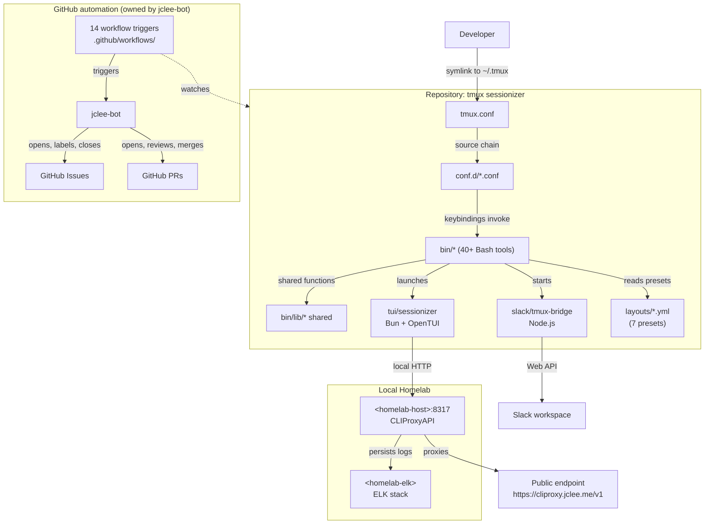

# TMUX SESSIONIZER / tmux 세션나이저


> A Bash-first tmux configuration and session-management toolkit, symlinked as `~/.tmux`, with a Bun/OpenTUI sessionizer, a Node.js Slack bridge, and a fully automated GitHub lifecycle owned by **jclee-bot**.
>
> Bash 우선 tmux 설정 및 세션 관리 툴킷. `~/.tmux`로 심볼릭 링크되며, Bun/OpenTUI 세션나이저, Node.js Slack 브리지, 그리고 **jclee-bot**이 완전히 소유하는 GitHub 자동화 라이프사이클을 함께 제공한다.

---

## Overview / 개요

**English.** TMUX SESSIONIZER is a homelab-grade tmux distribution built around a single rule: keep the loader thin and put behavior in small, composable, individually testable Bash tools. The `tmux.conf` at the root is just a `source` chain that pulls in modular `conf.d/*.conf` fragments; the real surface area lives in `bin/` — more than forty command-line tools that handle session discovery, sidebar rendering, dashboards, layout templates, Git awareness, Slack bridging, URL and file picking, status-bar widgets, SSH host picking, clipboard history, web terminal launching, and more.

Two companion applications live next to the Bash layer:

1. `tui/sessionizer/` — a Bun + OpenTUI front-end that replaces the legacy `fzf` picker with a reactive terminal UI, used for both session discovery and session creation.
2. `slack/tmux-bridge/` — a Node.js daemon that mirrors tmux session state into a Slack workspace so that chat-driven and terminal-driven workflows stay in sync.

The repository also ships a fully automated GitHub lifecycle. **jclee-bot** owns every mutating action — branch creation, PR opening, PR review, auto-merge, Dependabot reconciliation, post-merge cleanup, release notes, release publishing, downstream health checks, CI failure triaging, and auto-fixes. The 14 workflow files in `.github/workflows/` are the implementation triggers; the source of truth for the automation contract is the bot itself.

**한국어.** TMUX SESSIONIZER는 "로더는 얇게, 동작은 작고 조합 가능한 Bash 도구들로"라는 한 가지 원칙 위에 지어진 homelab 급 tmux 배포판이다. 최상위 `tmux.conf`는 단순히 `source` 체인으로 모듈화된 `conf.d/*.conf` 조각들을 끌어오는 얇은 로더이며, 실제 동작 면적은 `bin/`에 산재한다. 40개가 넘는 커맨드라인 도구가 세션 검색, 사이드바 렌더링, 대시보드, 레이아웃 템플릿, Git 인지, Slack 브리징, URL/파일 선택, 상태바 위젯, SSH 호스트 선택, 클립보드 히스토리, 웹 터미널 실행 등을 담당한다.

Bash 레이어 옆에는 두 개의 동반 애플리케이션이 함께 제공된다.

1. `tui/sessionizer/` — 기존 `fzf` 픽커를 대체하는 Bun + OpenTUI 프런트엔드로, 세션 검색과 세션 생성 양쪽에 사용된다.
2. `slack/tmux-bridge/` — tmux 세션 상태를 Slack 워크스페이스로 미러링하는 Node.js 데몬으로, 채팅 중심 워크플로와 터미널 중심 워크플로를 동기화한다.

이 저장소는 완전히 자동화된 GitHub 라이프사이클도 함께 선적한다. **jclee-bot**이 모든 변경 작업을 소유한다 — 브랜치 생성, PR 오프닝, PR 리뷰, 자동 머지, Dependabot 조율, 머지 후 정리, 릴리스 노트, 릴리스 게시, 다운스트림 헬스 체크, CI 실패 트리아지, 자동 수정까지. `.github/workflows/`의 14개 워크플로 파일은 구현 트리거이며, 자동화 계약의 진실의 원천은 봇 자신이다.

---

## Features / 주요 기능

- **Bash-first architecture** — every keybinding resolves to a small script in `bin/`, so each tool is independently testable and replaceable. / **Bash 우선 아키텍처** — 모든 키바인딩은 `bin/`의 작은 스크립트로 해소되어 각 도구를 독립적으로 테스트하고 교체할 수 있다.
- **Modular conf.d chain** — `00-core.conf`, `10-theme.conf`, `20-keys.conf`, `25-sidebar.conf` (and friends) split terminal baseline, theme, keybindings, and sidebar config into separate, readable files. / **모듈화된 conf.d 체인** — 터미널 베이스라인, 테마, 키바인딩, 사이드바 설정을 별도 파일로 분리한다.
- **Bun + OpenTUI sessionizer** — reactive TUI that replaces the legacy fzf flow for both session discovery and the create-wizard flow. / **Bun + OpenTUI 세션나이저** — 레거시 fzf 흐름을 대체하는 반응형 TUI로, 세션 검색과 생성 마법사 양쪽을 담당한다.
- **Node.js Slack bridge** — mirrors tmux session state into a Slack workspace via the Web API, with a dual-mode transport (socket-direct or HTTP-via-cloudflared). / **Node.js Slack 브리지** — Web API를 통해 tmux 세션 상태를 Slack 워크스페이스로 미러링하며, 듀얼 모드 전송(소켓 다이렉트 또는 cloudflared 경유 HTTP)을 지원한다.
- **Layout templates** — seven YAML presets in `layouts/` (default, resume, proxmox, splunk, safework, safework2, blacklist) applied by `tmux-layout-apply`. / **레이아웃 템플릿** — `layouts/`에 7개의 YAML 프리셋이 있으며, `tmux-layout-apply`로 적용된다.
- **Git-aware statusbar** — `tmux-git-status`, `tmux-git-uncommitted`, and `tmux-session-branch-log` push branch, dirty/ahead/behind/stash, and per-session branch history into the bar. / **Git 인지 상태바** — `tmux-git-status`, `tmux-git-uncommitted`, `tmux-session-branch-log`이 브랜치, dirty/ahead/behind/stash, 세션별 브랜치 히스토리를 상태바에 반영한다.
- **Responsive statusbar** — `tmux-responsive` swaps widget tiers by terminal width so the bar stays legible from 80 columns up. / **반응형 상태바** — `tmux-responsive`가 터미널 폭에 따라 위젯 단계를 교체한다.
- **Bridge, picker, and clipboard utilities** — `tmux-ssh-picker`, `tmux-url-open`, `tmux-file-open`, `tmux-clipboard-history`, `tmux-copy-word` are first-class fzf-based pickers. / **브리지·픽커·클립보드 유틸** — SSH 호스트, URL, 파일 경로, 클립보드 링 버퍼, 단어 단위 복사를 fzf 기반 픽커로 제공한다.
- **Auto-managed GitHub lifecycle** — every issue, PR, Dependabot bump, CI failure, and release flows through **jclee-bot**; nothing is hand-driven. / **자동 관리되는 GitHub 라이프사이클** — 모든 이슈, PR, Dependabot 업데이트, CI 실패, 릴리스가 **jclee-bot**을 통과한다.

---

## Architecture / 아키텍처



**Reading the diagram / 다이어그램 읽기.** The Bash loader (`tmux.conf`) is a thin entry point. Configuration is partitioned by concern into `conf.d/`. Runtime behavior is the `bin/` tool surface; the TUI and the Slack bridge are siblings of the Bash layer, not wrappers around it. The LLM router is `CLIProxyAPI` reachable on the homelab at `<homelab-host>:8317` and exposed publicly at `https://cliproxy.jclee.me/v1`; the Bun TUI is its primary caller. The 14 workflow files are triggers — the bot itself owns the automation contract and the mutating actions. / 로더(`tmux.conf`)는 얇은 진입점이며, 설정은 `conf.d/`로 관심사별로 분할된다. 런타임 동작은 `bin/` 도구 면적이고, TUI와 Slack 브리지는 Bash 레이어의 래퍼가 아닌 형제 컴포넌트다. LLM 라우터는 homelab의 `<homelab-host>:8317`에서 동작하는 `CLIProxyAPI`이며, `https://cliproxy.jclee.me/v1`로 외부에 공개된다. Bun TUI가 1차 호출자다. 14개 워크플로 파일은 트리거이며, 자동화 계약과 모든 변경 작업의 소유자는 봇 자신이다.

---

## Repository Layout / 저장소 구조

```
.
├── AGENTS.md
├── CONTRIBUTING.md
├── LICENSE
├── OWNERS
├── README.md
├── sessionizer.conf
├── tmux.conf
├── bin/
│   ├── tmux-auto-attach
│   ├── tmux-bash-preexec
│   ├── tmux-cheatsheet
│   ├── tmux-clipboard-history
│   ├── tmux-command-palette
│   ├── tmux-config-reload
│   ├── tmux-copy-word
│   ├── tmux-file-open
│   ├── tmux-git-status
│   ├── tmux-git-uncommitted
│   ├── tmux-layout-apply
│   ├── tmux-notify-long-command
│   ├── tmux-opencode
│   ├── tmux-pane-sync
│   ├── tmux-responsive
│   ├── tmux-session-branch-log
│   ├── tmux-session-cycle
│   ├── tmux-session-dashboard
│   ├── tmux-session-export
│   ├── tmux-session-icon
│   ├── tmux-session-jump
│   ├── tmux-session-kill
│   ├── tmux-session-order
│   ├── tmux-session-rename
│   ├── tmux-session-sync
│   ├── tmux-sessionizer
│   ├── tmux-sessionizer-tui
│   ├── tmux-sidebar
│   ├── tmux-sidebar-init
│   ├── tmux-sidebar-toggle
│   ├── tmux-slack-bridge-setup
│   ├── tmux-slack-bridge-start
│   ├── tmux-ssh-picker
│   ├── tmux-sys-stats
│   ├── tmux-template-create
│   ├── tmux-url-open
│   ├── tmux-web-terminal
│   └── lib/
│       ├── sidebar-colors
│       ├── sidebar-render
│       ├── tmux-sessionizer-common
│       └── tmux-sessionizer-wizard
├── conf.d/
│   ├── 00-core.conf
│   ├── 10-theme.conf
│   ├── 20-keys.conf
│   ├── 25-sidebar.conf
│   └── (additional fragments)
├── layouts/
│   ├── blacklist.yml
│   ├── default.yml
│   ├── proxmox.yml
│   ├── resume.yml
│   ├── safework.yml
│   ├── safework2.yml
│   └── splunk.yml
├── tui/
│   └── sessionizer/
│       ├── AGENTS.md
│       ├── bun.lock
│       ├── bunfig.toml
│       ├── package.json
│       ├── tsconfig.json
│       ├── __tests__/
│       │   ├── config.test.ts
│       │   └── tmux.test.ts
│       └── src/
│           ├── App.tsx
│           ├── bun-env.d.ts
│           ├── index.tsx
│           ├── actions/
│           │   └── session-actions.ts
│           ├── components/
│           │   ├── create-wizard.tsx
│           │   ├── filter-input.tsx
│           │   ├── kill-confirm-dialog.tsx
│           │   ├── preview-panel.tsx
│           │   ├── rename-dialog.tsx
│           │   ├── session-list.tsx
│           │   ├── wizard-step-dir.tsx
│           │   ├── wizard-step-layout.tsx
│           │   └── wizard-step-name.tsx
│           ├── hooks/
│           │   └── use-keyboard-handler.ts
│           └── lib/
│               ├── config.ts
│               ├── create-session.ts
│               ├── dirs.ts
│               ├── state.ts
│               ├── theme.ts
│               └── tmux.ts
├── docs/
│   ├── session-persistence-brainstorming.md
│   └── supermemory-governance.md
└── slack/
    └── tmux-bridge/
        └── AGENTS.md
```

> **Note / 참고.** The 14 workflow files in `.github/workflows/` are intentionally not surfaced as directory rows — they are implementation triggers for the automation contract owned by **jclee-bot**, not the source of truth. See the section below. / `.github/workflows/`의 워크플로 파일 14개는 의도적으로 디렉터리 행으로 노출하지 않는다. 이 파일들은 **jclee-bot**이 소유하는 자동화 계약의 구현 트리거일 뿐, 진실의 원천이 아니다. 아래 절을 참고하라.

---

## jclee-bot Automation Surfaces / jclee-bot 자동화 영역

Every mutating action on this repository is performed by **jclee-bot**. The 14 workflow files are the trigger layer — they observe events and dispatch the bot; the bot itself owns the contract. Human maintainers do not open branches, push PRs, label issues, or cut releases by hand.

이 저장소의 모든 변경 작업은 **jclee-bot**이 수행한다. 워크플로 파일 14개는 트리거 계층으로, 이벤트를 관찰하고 봇에 작업을 위임할 뿐이며 계약의 소유자는 봇 자신이다. 사람 메인테이너가 브랜치를 열거나, PR을 푸시하거나, 이슈에 라벨을 붙이거나, 릴리스를 자르지 않는다.

### Trigger surface (14 events) / 트리거 면적 (이벤트 14개)

The bot is awakened by 14 distinct event triggers. The set is intentionally closed; new triggers must be added by amending the bot's contract, not by adding a workflow in isolation. / 봇은 14개의 서로 다른 이벤트 트리거에 의해 깨어난다. 이 집합은 의도적으로 닫혀 있으며, 새로운 트리거는 워크플로를 단독 추가하는 것이 아니라 봇 계약을 수정하여 더해져야 한다.

- Branch-to-PR promotion / 브랜치→PR 승격
- Issue-to-branch implementation / 이슈→브랜치 구현
- PR review (general) / PR 리뷰 (일반)
- Security PR review (Qodo AI) / 보안 PR 리뷰 (Qodo AI)
- Dependabot auto-merge / Dependabot 자동 머지
- PR auto-merge (qualifying checks) / PR 자동 머지 (자격 검사)
- Bot auto-fix (post-review patch) / 봇 자동 수정 (리뷰 후 패치)
- Merged-PR cleanup (branch + scratch artifacts) / 머지된 PR 정리 (브랜치·스크래치 정리)
- Issue backfill (label & template normalization) / 이슈 백필 (라벨·템플릿 정규화)
- Release notes generation / 릴리스 노트 생성
- Release publishing / 릴리스 게시
- Downstream health check / 다운스트림 헬스 체크
- CI failure issue creation / CI 실패 이슈 생성
- Core CI (read-only signal) / 코어 CI (읽기 전용 신호)

### Owned mutation surfaces / 소유된 변경 면적

| Surface / 면적 | Owner / 소유자 | Notes / 참고 |
| --- | --- | --- |
| Branch creation / 브랜치 생성 | jclee-bot | Triggered by issue-to-branch; never human-driven. / 이슈→브랜치 트리거에 의해서만 생성된다. |
| PR opening & editing / PR 오프닝·편집 | jclee-bot | Title, body, and reviewers are bot-composed. / 제목·본문·리뷰어는 봇이 조합한다. |
| PR review & approval / PR 리뷰·승인 | jclee-bot | General reviews plus the security lane driven by [Qodo AI](https://github.com/qodo-ai/pr-agent). / 일반 리뷰와 [Qodo AI](https://github.com/qodo-ai/pr-agent)가 구동하는 보안 레인을 포함한다. |
| Auto-merge decisions / 자동 머지 결정 | jclee-bot | Dependabot lane and qualifying-checks lane are bot-only. / Dependabot 레인과 자격 검사 레인은 봇 전용이다. |
| Auto-fix patches / 자동 수정 패치 | jclee-bot | Triggered by review findings or CI failures. / 리뷰 결과 또는 CI 실패에 의해 트리거된다. |
| Issue lifecycle / 이슈 라이프사이클 | jclee-bot | Labeling, backfill, and CI-failure issues are all **jclee-bot에의해자동화됨**. / 라벨링·백필·CI 실패 이슈 생성은 모두 **jclee-bot에의해자동화됨**. |
| Release notes & publishing / 릴리스 노트·게시 | jclee-bot | Both authoring and the publish step. / 작성과 게시 단계 모두. |
| Branch & scratch cleanup / 브랜치·스크래치 정리 | jclee-bot | Post-merge housekeeping. / 머지 후 정리. |
| Downstream health checks / 다운스트림 헬스 체크 | jclee-bot | Periodic consumer-side verification. / 주기적 컨슈머 측 검증. |

The contract is intentionally narrow: the bot is the only writer, the workflows are the only triggers, and the [Qodo AI](https://github.com/qodo-ai/pr-agent) integration is the only delegated review lane. / 계약은 의도적으로 좁다. 봇이 유일한 작성자이고, 워크플로가 유일한 트리거이며, [Qodo AI](https://github.com/qodo-ai/pr-agent) 연동은 위임된 유일한 리뷰 레인이다.

### Public endpoints referenced by the bot / 봇이 참조하는 공개 엔드포인트

- LLM router (primary): `https://cliproxy.jclee.me/v1` / LLM 라우터 (기본)
- Bot service / 봇 서비스: `https://bot.jclee.me`
- Security review delegation / 보안 리뷰 위임: [Qodo AI / pr-agent](https://github.com/qodo-ai/pr-agent)

---

## Go Tools / Go 도구

This repository currently ships **zero Go-based automation tools**. All automation lives in the 14 GitHub workflow triggers orchestrated by **jclee-bot**. If a Go tool is added later, it must be registered in the bot's contract before it can be invoked from any workflow; bare `go run` invocations are not allowed in the trigger layer.

이 저장소는 현재 Go 기반 자동화 도구를 **0개** 출하한다. 모든 자동화는 **jclee-bot**이 오케스트레이션하는 14개의 GitHub 워크플로 트리거에 있다. 향후 Go 도구가 추가될 경우, 워크플로에서 호출되기 전에 반드시 봇 계약에 등록되어야 한다. 트리거 계층에서의 `go run` 직접 호출은 허용되지 않는다.

| Category / 카테고리 | Count / 개수 | Notes / 참고 |
| --- | --- | --- |
| Go CLI tools / Go CLI 도구 | 0 | None registered. / 등록된 도구 없음. |
| Go libraries / Go 라이브러리 | 0 | None registered. / 등록된 라이브러리 없음. |
| Go-triggering workflows / Go를 호출하는 워크플로 | 0 | All 14 triggers are bot-orchestrated. / 14개 트리거 모두 봇이 오케스트레이션. |

---

## Quick Start / 빠른 시작

**English.**

1. Clone the repository. / 저장소를 클론한다.

   ```bash
   git clone <repo-url> ~/projects/tmux-sessionizer
   ```

2. Symlink it as `~/.tmux` and `~/.tmux.conf`. / `~/.tmux` 및 `~/.tmux.conf`로 심볼릭 링크한다.

   ```bash
   ln -s ~/projects/tmux-sessionizer ~/.tmux
   ln -s ~/projects/tmux-sessionizer/tmux.conf ~/.tmux.conf
   ```

3. Install runtime dependencies: tmux 1.9+, fzf, gh, jq, Bun (for the TUI), and Node.js (for the Slack bridge). / 런타임 의존성을 설치한다: tmux 1.9+, fzf, gh, jq, Bun (TUI용), Node.js (Slack 브리지용).

4. Source it from your shell rc and start a session. / 셸 rc에서 소싱하고 세션을 시작한다.

   ```bash
   echo 'source ~/.tmux/tmux.conf' >> ~/.bashrc
   tmux new-session -A -s main
   ```

5. Inside tmux, press `C-a C-s` to open the sessionizer, or `C-a T` to launch the OpenTUI front-end. / tmux 안에서 `C-a C-s`로 세션나이저를, `C-a T`로 OpenTUI 프런트엔드를 실행한다.

**한국어.**

1. 저장소를 클론한다.
2. `~/.tmux` 및 `~/.tmux.conf`로 심볼릭 링크한다.
3. 런타임 의존성(tmux 1.9+, fzf, gh, jq, Bun, Node.js)을 설치한다.
4. 셸 rc에서 소싱한 뒤 세션을 시작한다.
5. tmux 안에서 `C-a C-s`로 세션나이저를, `C-a T`로 OpenTUI 프런트엔드를 실행한다.

---

## Local Development / 로컬 개발

### Prerequisites / 사전 조건

| Tool / 도구 | Purpose / 용도 | Notes / 참고 |
| --- | --- | --- |
| tmux 1.9+ | Core runtime / 코어 런타임 | Required. / 필수. |
| fzf | Picker backing for most `bin/*` tools / 다수 `bin/*` 도구의 픽커 백엔드 | Required. / 필수. |
| gh | GitHub CLI used by bridge and bot / 브리지·봇이 사용하는 GitHub CLI | Required. / 필수. |
| jq | JSON parsing in bridge and tools / 브리지·도구의 JSON 파싱 | Required. / 필수. |
| Bun | OpenTUI sessionizer / OpenTUI 세션나이저 | Required for TUI. / TUI에 필수. |
| Node.js | Slack bridge daemon / Slack 브리지 데몬 | Required for bridge. / 브리지에 필수. |
| Nerd Font | Sidebar icons & glyphs / 사이드바 아이콘·글리프 | Recommended. / 권장. |

### Working on the Bash layer / Bash 레이어 작업

- All Bash tools must remain POSIX-compatible with `bash` 4+ features (no `bash` 5-only syntax in `bin/`). / 모든 Bash 도구는 `bash` 4+ 기능에 대해 POSIX 호환을 유지해야 한다.
- Shared helpers go in `bin/lib/`; never duplicate a function across `bin/*` scripts. / 공유 헬퍼는 `bin/lib/`에 둔다. `bin/*` 스크립트 간에 함수를 중복 정의하지 않는다.
- Keybindings are declared in `conf.d/20-keys.conf` and must resolve to a single `bin/*` entry point. / 키바인딩은 `conf.d/20-keys.conf`에 선언하며 단일 `bin/*` 진입점으로 해소되어야 한다.
- New layouts land in `layouts/*.yml` and are surfaced through `tmux-template-create` and `tmux-layout-apply`. / 새 레이아웃은 `layouts/*.yml`에 추가하고 `tmux-template-create` 및 `tmux-layout-apply`로 노출한다.

### Working on the TUI / TUI 작업

```bash
cd tui/sessionizer
bun install
bun run dev        # OpenTUI dev loop
bun test           # __tests__/*
```

The TUI talks to `CLIProxyAPI` over local HTTP (`http://127.0.0.1:8317/v1` by default), proxied publicly at `https://cliproxy.jclee.me/v1`. Configure the endpoint via `sessionizer.conf` or the TUI's environment. / TUI는 로컬 HTTP(기본 `http://127.0.0.1:8317/v1`)로 `CLIProxyAPI`에 접속하며, `https://cliproxy.jclee.me/v1`로 공개 프록시된다. 엔드포인트는 `sessionizer.conf` 또는 TUI 환경변수로 설정한다.

### Working on the Slack bridge / Slack 브리지 작업

```bash
cd slack/tmux-bridge
npm install
./bin/tmux-slack-bridge-setup   # one-time app configuration
./bin/tmux-slack-bridge-start   # dual-mode: socket-direct or HTTP-via-cloudflared
```

The bridge requires a Slack app with the channels/groups scopes appropriate to the workspace. The setup wizard records tokens locally; never commit them. / 브리지는 워크스페이스에 적합한 channels/groups 스코프를 가진 Slack 앱이 필요하다. 셋업 마법사는 토큰을 로컬에 기록하며 절대 커밋하지 않는다.

### Working with the bot / 봇 작업

- Never push a commit directly to a protected branch — the bot is the only writer. / 보호 브랜치에 직접 커밋을 푸시하지 않는다. 봇이 유일한 작성자다.
- If a workflow trigger is needed, open an issue requesting the new trigger; the bot's contract is updated, not the workflow in isolation. / 새 트리거가 필요하면 새 트리거 요청 이슈를 연다. 워크플로 단독이 아니라 봇 계약이 갱신된다.
- All issue lifecycle behavior — labels, backfill, CI-failure creation — runs as **jclee-bot에의해자동화됨**. / 모든 이슈 라이프사이클 동작(라벨, 백필, CI 실패 이슈 생성)은 **jclee-bot에의해자동화됨**으로 실행된다.

---

## Commands Reference / 명령어 레퍼런스

### Session management / 세션 관리

| Command / 명령 | Purpose / 용도 |
| --- | --- |
| `tmux-sessionizer` | fzf-backed session picker and creation wizard. / fzf 기반 세션 픽커 및 생성 마법사. |
| `tmux-sessionizer-tui` | Launch the Bun/OpenTUI sessionizer. / Bun/OpenTUI 세션나이저를 실행한다. |
| `tmux-session-cycle` | PgUp/PgDn session rotation, excluding `opencode` lanes. / `opencode` 레인을 제외한 PgUp/PgDn 세션 회전. |
| `tmux-session-jump` | MRU fzf session picker. / MRU fzf 세션 픽커. |
| `tmux-session-kill` | Safe session termination with confirmation. / 확인 단계를 거치는 안전한 세션 종료. |
| `tmux-session-rename` | Session rename with validation. / 검증 절차를 거치는 세션 이름 변경. |
| `tmux-session-order` | Sessions sorted by most-recently-active. / 가장 최근 활성 순으로 정렬된 세션. |
| `tmux-session-icon` | Nerd Font icon mapper for sessions. / 세션용 Nerd Font 아이콘 매퍼. |
| `tmux-session-dashboard` | Formatted session table popup. / 포맷된 세션 테이블 팝업. |
| `tmux-session-export` | Export session layout to YAML. / 세션 레이아웃을 YAML로 익스포트. |
| `tmux-session-branch-log` | Log session→branch on switch. / 스위치 시 세션→브랜치 로그. |
| `tmux-session-sync` | Sync tmux sessions with Slack channels. / tmux 세션을 Slack 채널과 동기화. |
| `tmux-template-create` | Quick-create session from preset templates. / 프리셋 템플릿으로 세션 즉시 생성. |
| `tmux-auto-attach` | Login shell auto-attach flow. / 로그인 셸 자동 attach 흐름. |
| `tmux-opencode` | OpenCode session launcher. / OpenCode 세션 런처. |

### Sidebar / 사이드바

| Command / 명령 | Purpose / 용도 |
| --- | --- |
| `tmux-sidebar` | Tree sidebar display engine. / 트리 사이드바 표시 엔진. |
| `tmux-sidebar-init` | Sidebar initialization on session create. / 세션 생성 시 사이드바 초기화. |
| `tmux-sidebar-toggle` | Toggle sidebar visibility. / 사이드바 가시성 토글. |

### Layout & statusbar / 레이아웃·상태바

| Command / 명령 | Purpose / 용도 |
| --- | --- |
| `tmux-layout-apply` | Apply YAML layout templates to sessions. / YAML 레이아웃 템플릿을 세션에 적용. |
| `tmux-responsive` | Width-tiered statusbar rendering. / 폭 단계별 상태바 렌더링. |
| `tmux-sys-stats` | CPU load + MEM usage for status bar. / 상태바용 CPU 부하·메모리 사용량. |

### Git awareness / Git 인지

| Command / 명령 | Purpose / 용도 |
| --- | --- |
| `tmux-git-status` | Git branch + dirty/ahead/behind/stash. / 브랜치·dirty/ahead/behind/stash. |
| `tmux-git-uncommitted` | Track uncommitted changes per session. / 세션별 미커밋 변경 추적. |

### Pickers & clipboard / 픽커·클립보드

| Command / 명령 | Purpose / 용도 |
| --- | --- |
| `tmux-command-palette` | fzf action picker for common operations. / 일반 작업을 위한 fzf 액션 픽커. |
| `tmux-ssh-picker` | SSH config host picker. / SSH 설정 호스트 픽커. |
| `tmux-url-open` | URL extraction from pane via fzf. / fzf로 페인에서 URL 추출. |
| `tmux-file-open` | File path extraction from pane via fzf. / fzf로 페인에서 파일 경로 추출. |
| `tmux-clipboard-history` | tmux buffer ring browser via fzf. / fzf 기반 tmux 버퍼 링 브라우저. |
| `tmux-copy-word` | Smart word copy under cursor. / 커서 아래 단어 스마트 복사. |

### Pane, config, notifications / 페인·설정·알림

| Command / 명령 | Purpose / 용도 |
| --- | --- |
| `tmux-pane-sync` | Synchronize-panes toggle. / synchronize-panes 토글. |
| `tmux-config-reload` | Reload config with settings diff. / 설정 diff 표시와 함께 설정 리로드. |
| `tmux-notify-long-command` | Desktop notification for long commands. / 장기 실행 명령에 대한 데스크톱 알림. |
| `tmux-bash-preexec` | Sourceable shell preexec hook for command timing. / 명령 타이밍용 셸 preexec 훅. |
| `tmux-cheatsheet` | Categorized keybinding reference popup. / 카테고리별 키바인딩 레퍼런스 팝업. |
| `tmux-web-terminal` | ttyd web terminal launcher. / ttyd 웹 터미널 런처. |

### Slack bridge / Slack 브리지

| Command / 명령 | Purpose / 용도 |
| --- | --- |
| `tmux-slack-bridge-setup` | Interactive Slack app setup wizard. / 대화형 Slack 앱 셋업 마법사. |
| `tmux-slack-bridge-start` | Startup wrapper: dual mode (socket-direct / HTTP-via-cloudflared) + tsx exec. / 듀얼 모드 시작 래퍼(소켓 다이렉트 / cloudflared 경유 HTTP) + tsx 실행. |

---

## Contribution Guide / 기여 가이드

**English.**

1. Read `CONTRIBUTING.md` and `AGENTS.md` before opening a pull request. / PR을 열기 전에 `CONTRIBUTING.md`와 `AGENTS.md`를 읽는다.
2. Check the `OWNERS` file for the current code-owner mapping. / 현재 코드 오너 매핑은 `OWNERS` 파일을 확인한다.
3. File an issue describing the change. **jclee-bot** will pick it up via the issue-to-branch trigger, open a branch, implement the patch, run the PR review and security review lanes, and merge once the qualifying-checks lane is green. / 변경 사항을 설명하는 이슈를 등록한다. **jclee-bot**이 issue-to-branch 트리거로 브랜치를 열고, 패치를 구현하고, PR 리뷰·보안 리뷰 레인을 돌린 뒤, 자격 검사 레인이 통과되면 머지한다.
4. For documentation-only changes, request the "docs" lane in the issue body so the bot skips the security review step. / 문서 변경만이라면 이슈 본문에서 "docs" 레인을 요청해 보안 리뷰 단계를 건너뛰게 한다.
5. For new layout presets, attach the proposed YAML to the issue; the bot will land it in `layouts/` and wire it into `tmux-template-create`. / 새 레이아웃 프리셋의 경우 제안 YAML을 이슈에 첨부하면 봇이 `layouts/`에 추가하고 `tmux-template-create`에 연결한다.
6. Never commit secrets, tokens, or internal hostnames directly — the security review lane will fail the PR. / 시크릿·토큰·내부 호스트명을 직접 커밋하지 않는다. 보안 리뷰 레인이 PR을 실패 처리한다.
7. After merge, **jclee-bot** runs the merged-PR cleanup trigger to remove scratch branches and ephemeral artifacts. / 머지 후 **jclee-bot**이 머지된 PR 정리 트리거를 실행해 스크래치 브랜치와 임시 산출물을 제거한다.

**한국어.**

1. PR을 열기 전에 `CONTRIBUTING.md`와 `AGENTS.md`를 읽는다.
2. 현재 코드 오너 매핑은 `OWNERS` 파일을 확인한다.
3. 변경 사항을 설명하는 이슈를 등록한다. **jclee-bot**이 issue-to-branch 트리거로 브랜치를 열고, 패치를 구현하고, PR 리뷰와 보안 리뷰 레인을 돌린 뒤, 자격 검사 레인이 통과되면 머지한다.
4. 문서만 변경하는 경우 이슈 본문에서 "docs" 레인을 요청해 보안 리뷰 단계를 건너뛰게 한다.
5. 새 레이아웃 프리셋은 제안 YAML을 이슈에 첨부하면 봇이 `layouts/`에 추가하고 `tmux-template-create`에 연결한다.
6. 시크릿·토큰·내부 호스트명을 직접 커밋하지 않는다. 보안 리뷰 레인이 PR을 실패 처리한다.
7. 머지 후 **jclee-bot**이 머지된 PR 정리 트리거를 실행해 스크래치 브랜치와 임시 산출물을 제거한다.

---

## License / 라이선스

MIT — see [`LICENSE`](./LICENSE).

MIT — [`LICENSE`](./LICENSE) 파일을 참고하라.