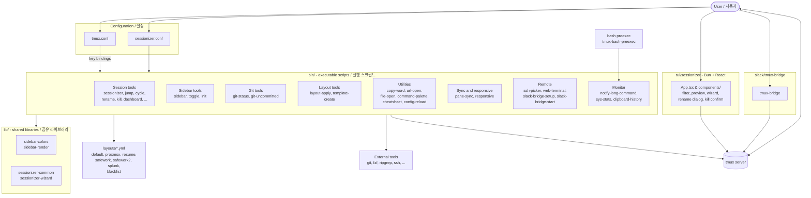

# tmux Productivity Suite / tmux 생산성 도구 모음

> A curated, opinionated tmux configuration plus a complete ecosystem of companion tools, libraries, layouts, and a TUI for power users.
>
> 파워 유저를 위한 큐레이션된 tmux 설정과 함께 제공되는 종합 도구·라이브러리·레이아웃·TUI 생태계입니다.

---

## Overview / 개요

This repository provides a battle-tested tmux configuration (`tmux.conf`) and an extensive set of companion shell scripts, shared libraries, declarative layouts, a TypeScript-based Terminal UI (TUI), and a Slack bridge. Together they form a complete environment for project-oriented development, system administration, and remote collaboration — all from a single tmux session.

이 저장소는 실전에서 검증된 tmux 설정(`tmux.conf`)과 풍부한 생태계를 이루는 셸 스크립트, 공유 라이브러리, 선언적 레이아웃, TypeScript 기반 터미널 UI(TUI), 그리고 Slack 브리지를 함께 제공합니다. 프로젝트 중심의 개발, 시스템 운영, 원격 협업에 필요한 모든 것을 단일 tmux 세션 안에서 제공합니다.

### Who is this for? / 사용 대상

| Audience / 대상                                | Use case / 활용 사례                                                                              |
| ---------------------------------------------- | ------------------------------------------------------------------------------------------------- |
| Multi-project developers / 다수 프로젝트 개발자 | Jump between repos, save layouts per project, fast session creation / 저장소 간 빠른 이동, 프로젝트별 레이아웃 |
| DevOps / SRE engineers / DevOps·SRE 엔지니어   | SSH picker, per-host layouts, system stats, long-command notifications                            |
| Remote-first teams / 원격 우선 팀              | Slack bridge for sharing terminal access / 터미널 공유                                            |
| tmux power users / tmux 파워 유저              | TUI sessionizer, sidebar, command palette                                                         |

---

## Features / 기능

### Session management / 세션 관리
- **Project-aware session creation** with `tmux-sessionizer` (fuzzy-find a directory and create or attach a session)
- **TUI mode**: `tmux-sessionizer-tui` — Bun + React + TypeScript interface
- **Quick navigation**: `tmux-session-jump`, `tmux-session-cycle`, `tmux-session-order`
- **Lifecycle helpers**: `tmux-session-rename`, `tmux-session-kill`, `tmux-session-export`, `tmux-session-dashboard`
- **Per-session icons** via `tmux-session-icon`
- **Auto-attach** on shell login with `tmux-auto-attach`
- **Sync & telemetry**: `tmux-session-sync`, `tmux-session-branch-log`

### Sidebar / 사이드바
- Toggleable sidebar: `tmux-sidebar-toggle`, `tmux-sidebar`
- Init helper: `tmux-sidebar-init`
- Color and render backends in `lib/sidebar-colors`, `lib/sidebar-render`

### Layouts / 레이아웃
- Declarative YAML layouts in `layouts/`
- Built-in profiles: `default`, `proxmox`, `resume`, `safework`, `safework2`, `splunk`
- `layouts/blacklist.yml` for path filters
- Apply and author layouts with `tmux-layout-apply`, `tmux-template-create`

### Git integration / Git 통합
- `tmux-git-status` — branch, dirty state, ahead/behind
- `tmux-git-uncommitted` — count of uncommitted files

### Pane sync & responsive / 페인 동기화·반응형
- `tmux-pane-sync` — synchronized input across panes
- `tmux-responsive` — adaptive layout

### Notifications & monitoring / 알림·모니터링
- `tmux-notify-long-command` — OS notification on long-running commands
- `tmux-sys-stats` — CPU, memory, load in the status bar
- `tmux-clipboard-history` — in-tmux clipboard ring

### Productivity utilities / 생산성 유틸리티
- `tmux-command-palette`, `tmux-cheatsheet`
- `tmux-copy-word` — WORD selection
- `tmux-url-open` — open URLs from the terminal
- `tmux-file-open` — open files in `$EDITOR`
- `tmux-config-reload` — reload `tmux.conf` without restarting
- `tmux-bash-preexec` — pre-exec hook for prompts and timing

### Remote workflows / 원격 워크플로우
- `tmux-ssh-picker` — interactive SSH host selection
- `tmux-web-terminal` — browser-based terminal
- `slack/tmux-bridge` with `tmux-slack-bridge-setup`, `tmux-slack-bridge-start`

### Editor / tool integration / 에디터·도구 통합
- `tmux-opencode` — OpenCode integration

---

## Architecture / 아키텍처



The `tmux.conf` is the entry point: it defines key bindings that dispatch to executables in `bin/`. Those scripts reuse helpers in `lib/`, apply templates from `layouts/`, and shell out to external tools. The TUI under `tui/sessionizer/` and the Slack bridge under `slack/tmux-bridge/` are independent entry points that talk directly to the tmux server.

`tmux.conf`가 진입점이며, 키 바인딩을 정의하여 `bin/`의 실행 스크립트를 호출합니다. 스크립트들은 `lib/`의 헬퍼를 재사용하고, `layouts/`의 템플릿을 적용하며, 외부 도구를 호출합니다. `tui/sessionizer/`의 TUI와 `slack/tmux-bridge/`의 브리지는 tmux 서버와 직접 통신하는 독립적인 진입점입니다.

---

## Quick start / 빠른 시작

### Prerequisites / 사전 요구사항

| Tool / 도구  | Required / 필수 | Notes / 비고                                          |
| ------------ | --------------- | ----------------------------------------------------- |
| `tmux` 3.0+  | yes             | Server and client                                     |
| `bash` 4+    | yes             | Scripts are bash                                      |
| `git`, `ssh` | yes             | Used by several scripts                               |
| `fzf`        | recommended     | Powers `tmux-sessionizer`                             |
| `bun`        | optional        | Required only for `tui/sessionizer` development       |
| `ripgrep`    | optional        | Faster filtering in TUI                               |
| `bat`, `delta` | optional      | Nicer rendering                                       |

### Install / 설치

```bash
# 1. Clone the repository
git clone <repository-url> ~/.tmux-suite
cd ~/.tmux-suite

# 2. Back up any existing tmux config
[ -f ~/.tmux.conf ] && mv ~/.tmux.conf ~/.tmux.conf.bak

# 3. Symlink the configuration
ln -s "$PWD/tmux.conf" ~/.tmux.conf

# 4. Make scripts executable
chmod +x bin/* lib/*

# 5. (Optional) Install TUI dependencies for the sessionizer UI
cd tui/sessionizer
bun install
cd ../..

# 6. (Optional) Make bin/ and lib/ discoverable from tmux.conf
#    (most key bindings call scripts by absolute path, but $PATH is recommended)
export PATH="$PWD/bin:$PWD/lib:$PATH"

# 7. Start tmux
tmux
```

Reload the configuration at any time with the binding or command exposed by `tmux-config-reload`.

설정 파일은 `tmux-config-reload`가 제공하는 바인딩이나 명령으로 언제든 다시 로드할 수 있습니다.

---

## Configuration / 설정

### `tmux.conf` (root / 루트)
The main configuration. It is heavily commented and binds prefix-key combinations to the executables in `bin/`. Adjust paths inside this file if you install the suite somewhere other than `~/.tmux-suite`.

전체 설정 파일입니다. 주석이 풍부하며 prefix 키 조합을 `bin/`의 실행 스크립트에 바인딩합니다. `~/.tmux-suite`가 아닌 다른 위치에 설치한 경우 이 파일 안의 경로를 조정하세요.

### `sessionizer.conf` (root / 루트)
Settings consumed by `tmux-sessionizer` and friends, such as:
- The set of directories to scan (`search_paths`)
- Per-path layout overrides
- Naming rules for new sessions

### `layouts/*.yml`
Each YAML file describes a window/pane layout that can be applied by name. Built-in profiles:

| File / 파일         | Purpose / 용도                                             |
| ------------------- | ---------------------------------------------------------- |
| `default.yml`       | A reasonable default for general development / 일반 개발용 |
| `proxmox.yml`       | Proxmox / virtualization host / 가상화 호스트용            |
| `resume.yml`        | Resume / recruiting workflows                              |
| `safework.yml`, `safework2.yml` | Safe / sandboxed work environments / 샌드박스 환경 |
| `splunk.yml`        | Splunk investigation                                       |
| `blacklist.yml`     | Path filters excluded from sessionizer                     |

Apply a layout with `tmux-layout-apply <name>`. Create your own by copying a YAML file and registering it in `tmux.conf` or `sessionizer.conf`.

레이아웃은 `tmux-layout-apply <name>` 명령으로 적용할 수 있습니다. YAML 파일을 복사하고 `tmux.conf` 또는 `sessionizer.conf`에 등록하면 자신만의 레이아웃을 만들 수 있습니다.

### `lib/`
Shared functions sourced by multiple scripts in `bin/`. The split keeps individual scripts small and consistent:

- `sidebar-colors`, `sidebar-render` — sidebar visual stack
- `tmux-sessionizer-common` — discovery, naming, attach logic
- `tmux-sessionizer-wizard` — multi-step prompts for new sessions

---

## Commands reference / 명령어 레퍼런스

All commands are shell scripts in `bin/` and are intended to be invoked from inside `tmux` (usually via a key binding defined in `tmux.conf`). Most accept `--help` for usage details.

모든 명령은 `bin/`의 셸 스크립트이며 tmux 내부에서 호출되는 것을 전제로 합니다(보통 `tmux.conf`에 정의된 키 바인딩을 통해). 대부분 `--help`로 사용법을 확인할 수 있습니다.

### Sessions / 세션

| Command                         | Description / 설명                                                                  |
| ------------------------------- | ----------------------------------------------------------------------------------- |
| `tmux-auto-attach`              | Auto-attach to a session on shell login / 셸 로그인 시 세션 자동 진입              |
| `tmux-sessionizer`              | Fuzzy-find a directory and create/attach a session / 디렉터리 퍼지 검색 → 세션 생성 |
| `tmux-sessionizer-tui`          | TUI front-end for the sessionizer / 세션라이저의 TUI 진입점                       |
| `tmux-session-jump`             | Quick jump to a session / 세션으로 빠른 이동                                       |
| `tmux-session-cycle`            | Cycle through sessions / 세션 순환                                                  |
| `tmux-session-order`            | Reorder sessions / 세션 순서 변경                                                    |
| `tmux-session-rename`           | Rename the current session / 현재 세션 이름 변경                                   |
| `tmux-session-kill`             | Kill one or more sessions / 세션 종료                                               |
| `tmux-session-dashboard`        | Open a session dashboard / 세션 대시보드 열기                                      |
| `tmux-session-export`           | Export session metadata / 세션 메타데이터 내보내기                                  |
| `tmux-session-icon`             | Set or display session icon / 세션 아이콘 설정·표시                                |
| `tmux-session-sync`             | Synchronize session state across clients / 클라이언트 간 세션 상태 동기화          |
| `tmux-session-branch-log`       | Log session activity against a git branch / Git 브랜치 단위로 세션 활동 기록        |

### Sidebar / 사이드바

| Command                | Description / 설명                                  |
| ---------------------- | --------------------------------------------------- |
| `tmux-sidebar`         | Show the sidebar / 사이드바 표시                   |
| `tmux-sidebar-toggle`  | Toggle the sidebar / 사이드바 토글                 |
| `tmux-sidebar-init`    | Initialize the sidebar / 사이드바 초기화           |

### Layouts / 레이아웃

| Command                  | Description / 설명                                  |
| ------------------------ | --------------------------------------------------- |
| `tmux-layout-apply`      | Apply a named layout from `layouts/` / 명명된 레이아웃 적용 |
| `tmux-template-create`   | Scaffold a new layout YAML / 새 레이아웃 YAML 생성  |

### Git / Git

| Command                       | Description / 설명                                                |
| ----------------------------- | ----------------------------------------------------------------- |
| `tmux-git-status`             | Show branch and dirty status in the status line / 상태 표시       |
| `tmux-git-uncommitted`        | Count of uncommitted files / 커밋되지 않은 파일 수               |

### Pane sync / responsive / 페인 동기화·반응형

| Command             | Description / 설명                                              |
| ------------------- | --------------------------------------------------------------- |
| `tmux-pane-sync`    | Synchronize input across panes / 페인 간 입력 동기화           |
| `tmux-responsive`   | Adapt layout to terminal size / 터미널 크기에 맞춘 레이아웃   |

### Monitoring / monitoring

| Command                       | Description / 설명                                                  |
| ----------------------------- | ------------------------------------------------------------------- |
| `tmux-notify-long-command`    | Notify when a command runs longer than threshold / 긴 명령 알림    |
| `tmux-sys-stats`              | CPU, memory, load in the status bar / CPU·메모리·로드 표시         |
| `tmux-clipboard-history`      | In-tmux clipboard history / tmux 내부 클립보드 히스토리            |

### Productivity / 생산성

| Command                  | Description / 설명                                                       |
| ------------------------ | ------------------------------------------------------------------------ |
| `tmux-command-palette`   | Interactive command palette / 대화형 명령 팔레트                       |
| `tmux-cheatsheet`        | Show a keybinding cheatsheet / 키 바인딩 치트시트                      |
| `tmux-copy-word`         | Copy a WORD / WORD 단위 복사                                            |
| `tmux-url-open`          | Open a URL from the terminal / 터미널에서 URL 열기                     |
| `tmux-file-open`         | Open a file in `$EDITOR` / `$EDITOR`로 파일 열기                       |
| `tmux-config-reload`     | Reload `tmux.conf` / 설정 다시 로드                                     |
| `tmux-bash-preexec`      | Pre-exec hook for prompts and timing / 프롬프트·타이밍용 pre-exec 후크 |

### Remote / 원격

| Command                          | Description / 설명                                              |
| -------------------------------- | --------------------------------------------------------------- |
| `tmux-ssh-picker`                | Interactive SSH host picker / 대화형 SSH 호스트 선택           |
| `tmux-web-terminal`              | Browser-based terminal / 브라우저 기반 터미널                   |
| `tmux-slack-bridge-setup`        | One-time Slack bridge setup / Slack 브리지 초기 설정            |
| `tmux-slack-bridge-start`        | Start the Slack bridge / Slack 브리지 시작                      |

### Editor integration / 에디터 통합

| Command            | Description / 설명                                  |
| ------------------ | --------------------------------------------------- |
| `tmux-opencode`    | OpenCode integration / OpenCode 연동               |

---

## Local development / 로컬 개발

### Editing shell scripts / 셸 스크립트 편집

The `bin/` and `lib/` scripts are self-contained. Use `shellcheck` to lint them and your editor of choice for editing. After any change, reload the configuration from inside tmux:

```bash
# inside an existing tmux session
tmux source-file ~/.tmux.conf
# or use the helper
tmux-config-reload
```

### Working on the TUI (`tui/sessionizer`) / TUI 개발

```bash
cd tui/sessionizer
bun install
bun run dev          # development build / 개발 빌드
bun run build        # production build / 프로덕션 빌드
```

Key files:

| Path / 경로                                                 | Purpose / 용도                                              |
| ----------------------------------------------------------- | ----------------------------------------------------------- |
| `tui/sessionizer/src/App.tsx`                               | Root React component / 최상위 React 컴포넌트                |
| `tui/sessionizer/src/components/`                           | UI components (filter, preview, wizard, dialogs)            |
| `tui/sessionizer/src/hooks/use-keyboard-handler.ts`         | Keyboard handling / 키보드 처리                            |
| `tui/sessionizer/src/actions/session-actions.ts`            | Session operations dispatched from the UI                  |
| `tui/sessionizer/src/lib/{config,create-session,dirs,state,tmux,theme}.ts` | Core logic / 핵심 로직            |

### Working on the Slack bridge (`slack/tmux-bridge`) / Slack 브리지 개발

See `slack/tmux-bridge/AGENTS.md` for contributor notes on the bridge.

`slack/tmux-bridge/AGENTS.md`에 브리지 기여자 가이드가 있습니다.

---

## Testing / 테스트

The TUI ships with a `bun test`-compatible suite under `tui/sessionizer/__tests__/`:

```bash
cd tui/sessionizer
bun test
```

For shell scripts, manual smoke tests inside `tmux` are usually sufficient:

```bash
# from inside a tmux session
tmux-sessionizer
tmux-sidebar-toggle
tmux-layout-apply default
tmux-config-reload
```

Lay out manual test plans for new bindings: trigger the binding in a real session, verify pane/window state with `tmux list-windows -F '#{window_name}'` and `tmux list-panes -F '#{pane_current_command}'`.

새 바인딩에 대해서는 수동 테스트 계획을 세워 실제 세션에서 바인딩을 실행한 뒤 `tmux list-windows -F '#{window_name}'`, `tmux list-panes -F '#{pane_current_command}'`로 상태를 확인합니다.

---

## Project structure / 프로젝트 구조

```
.
├── AGENTS.md                  # Contributor notes for AI agents / AI 에이전트 기여 가이드
├── CONTRIBUTING.md            # Contribution guidelines / 기여 가이드
├── LICENSE                    # License / 라이선스
├── OWNERS                     # Code owners / 코드 오너 목록
├── README.md                  # This file / 본 문서
├── sessionizer.conf           # Sessionizer settings / 세션라이저 설정
├── tmux.conf                  # Main tmux configuration / 메인 tmux 설정
├── bin/                       # Executable scripts (~40 commands) / 실행 스크립트
├── lib/                       # Shared shell libraries / 공유 셸 라이브러리
├── layouts/                   # YAML layout profiles / YAML 레이아웃 프로파일
├── tui/
│   └── sessionizer/           # Bun + React TUI for session management
│       ├── src/
│       │   ├── App.tsx
│       │   ├── components/    # filter, preview, wizard, dialogs
│       │   ├── hooks/         # keyboard handler
│       │   ├── actions/       # session-actions
│       │   └── lib/           # config, dirs, state, tmux, theme
│       └── __tests__/         # bun test suite / bun 테스트
├── docs/                      # Design notes / 설계 노트
└── slack/
    └── tmux-bridge/           # Slack bridge for remote terminal sharing
```

Additional design notes live under `docs/`:

- `docs/session-persistence-brainstorming.md` — ideas for persisting session state
- `docs/supermemory-governance.md` — governance notes for long-term memory

`docs/` 디렉터리에는 `docs/session-persistence-brainstorming.md`(세션 상태 영속화 아이디어)와 `docs/supermemory-governance.md`(장기 메모리 거버넌스) 같은 설계 노트가 있습니다.

---

## Contributing / 기여

1. Read `CONTRIBUTING.md` and the relevant `AGENTS.md` (`tui/sessionizer/AGENTS.md`, `slack/tmux-bridge/AGENTS.md`).
2. Open an issue describing the change. For new layout profiles, attach a sample YAML.
3. For shell scripts, keep them POSIX-adjacent bash and lint with `shellcheck`.
4. For the TUI, follow the existing component structure and add tests under `__tests__/`.
5. Code review is tracked via `OWNERS`.

1. `CONTRIBUTING.md`와 관련 `AGENTS.md`를 먼저 읽어 주세요.
2. 변경 사항을 설명하는 이슈를 열어 주세요. 새로운 레이아웃 프로파일의 경우 샘플 YAML을 첨부해 주세요.
3. 셸 스크립트는 POSIX에 가까운 bash로 작성하고 `shellcheck`로 린트합니다.
4. TUI는 기존 컴포넌트 구조를 따르고 `__tests__/`에 테스트를 추가해 주세요.
5. 코드 리뷰는 `OWNERS`를 기준으로 진행됩니다.

---

## License / 라이선스

See `LICENSE` in the repository root.

저장소 루트의 `LICENSE` 파일을 참조하세요.

---

## Acknowledgments / 감사의 말

Built on top of [tmux](https://github.com/tmux/tmux) and the many excellent CLI tools it composes — `fzf`, `ripgrep`, `git`, `ssh`, and Bun/React for the TUI.

이 프로젝트는 [tmux](https://github.com/tmux/tmux)와 `fzf`, `ripgrep`, `git`, `ssh` 같은 훌륭한 CLI 도구들, 그리고 TUI를 위한 Bun/React 위에서 만들어졌습니다.