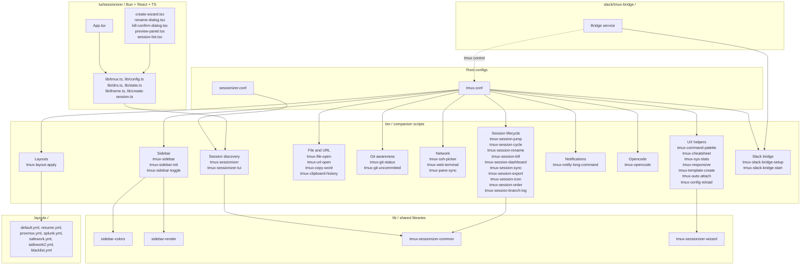

# tmux Productivity Suite / tmux 생산성 도구 모음

> A curated, opinionated tmux configuration plus a complete ecosystem of companion tools, shared libraries, declarative YAML layouts, a Bun/React/TypeScript TUI, and a Slack bridge — all designed for power users working across many projects and remote hosts.
>
> 큐레이션된 tmux 설정과 함께 동작하는 풍부한 생태계(보조 도구, 공유 라이브러리, 선언적 YAML 레이아웃, Bun/React/TypeScript 기반 TUI, Slack 브리지)를 한 저장소에 담은, 다수 프로젝트와 원격 호스트를 다루는 파워 유저용 환경입니다.

---

## Table of Contents / 목차

- [Overview / 개요](#overview--개요)
- [Features / 기능](#features--기능)
- [Architecture / 아키텍처](#architecture--아키텍처)
- [Repository Layout / 저장소 구조](#repository-layout--저장소-구조)
- [Quick Start / 빠른 시작](#quick-start--빠른-시작)
- [Configuration / 설정](#configuration--설정)
- [Commands Reference / 명령어 레퍼런스](#commands-reference--명령어-레퍼런스)
- [Layouts / 레이아웃](#layouts--레이아웃)
- [TUI Sessionizer / 터미널 UI 세션나이저](#tui-sessionizer--터미널-ui-세션나이저)
- [Slack Bridge / 슬랙 브리지](#slack-bridge--슬랙-브리지)
- [Local Development / 로컬 개발](#local-development--로컬-개발)
- [Testing / 테스트](#testing--테스트)
- [Contributing / 기여](#contributing--기여)
- [License / 라이선스](#license--라이선스)

---

## Overview / 개요

This repository bundles a battle-tested `tmux.conf`, a `sessionizer.conf` for project discovery, and a curated set of companion binaries under `bin/`. It ships shared shell libraries under `lib/`, project-style window layouts under `layouts/`, a modern Terminal UI (`tui/sessionizer/`), and a Slack ↔ tmux bridge (`slack/tmux-bridge/`).

이 저장소는 실전에서 검증된 `tmux.conf`, 프로젝트 검색을 위한 `sessionizer.conf`, 그리고 `bin/` 디렉터리의 큐레이션된 보조 바이너리들을 함께 제공합니다. `lib/`의 공유 셸 라이브러리, `layouts/`의 프로젝트형 윈도우 레이아웃, 모던 터미널 UI(`tui/sessionizer/`), 그리고 Slack ↔ tmux 브리지(`slack/tmux-bridge/`)가 한 곳에서 동작합니다.

### Who is this for? / 사용 대상

| Audience / 대상 | Use case / 활용 사례 |
| --- | --- |
| Multi-project developers / 다수 프로젝트 개발자 | Jump between repos, save layouts per project, fast session creation / 저장소 간 빠른 이동, 프로젝트별 레이아웃, 빠른 세션 생성 |
| DevOps / SRE engineers / DevOps · SRE 엔지니어 | SSH picker, remote host dashboards, sys-stats overlays / SSH 선택기, 원격 호스트 대시보드, 시스템 통계 오버레이 |
| Operators of shared workspaces / 공유 워크스페이스 운영자 | Splunk / Proxmox / Safework presets, repeatable window layouts / Splunk · Proxmox · Safework 프리셋, 재현 가능한 윈도우 레이아웃 |
| Terminal-first users / 터미널 우선 사용자 | Command palette, sidebar, cheatsheet, clipboard history / 명령어 팔레트, 사이드바, 치트시트, 클립보드 히스토리 |
| Remote pair-programmers / 원격 페어 프로그래머 | Slack ↔ tmux bridge for shell sharing and notifications / 셸 공유 및 알림을 위한 Slack ↔ tmux 브리지 |

---

## Features / 기능

- **Declarative project layouts** — YAML-driven window/pane definitions in `layouts/`, applied with `tmux-layout-apply`. / `layouts/`의 YAML로 윈도우/페인 레이아웃을 선언하고 `tmux-layout-apply`로 적용합니다.
- **Fuzzy session discovery** — `tmux-sessionizer` walks configured roots and creates or jumps to sessions. / `tmux-sessionizer`가 설정된 루트를 탐색해 세션을 생성하거나 이동합니다.
- **Terminal UI sessionizer** — a Bun + React + TypeScript TUI with preview, wizard, rename, kill, and filtering (`tui/sessionizer/`). / Bun + React + TypeScript 기반 TUI는 미리보기, 마법사, 이름 변경, 종료, 필터링을 제공합니다.
- **Session lifecycle tools** — jump, cycle, rename, kill, sync, order, export, branch-log, icon. / 점프, 순환, 이름 변경, 종료, 동기화, 정렬, 내보내기, 브랜치 로그, 아이콘 등 세션 수명주기 도구.
- **Sidebar overlay** — color-coded, toggleable sidebar (`tmux-sidebar*` + `lib/sidebar-*`). / 색상으로 구분되고 토글 가능한 사이드바(`tmux-sidebar*` + `lib/sidebar-*`).
- **Git awareness** — `tmux-git-status`, `tmux-git-uncommitted` surface repository state in the status line. / `tmux-git-status`, `tmux-git-uncommitted`로 저장소 상태를 상태 표시줄에 노출합니다.
- **Clipboard & URL helpers** — clipboard history, copy-word, file-open, url-open. / 클립보드 히스토리, 단어 복사, 파일 열기, URL 열기.
- **SSH picker** — `tmux-ssh-picker` opens an interactive host selector that connects via SSH and creates a dedicated session. / `tmux-ssh-picker`는 대화형 호스트 선택기를 열어 SSH로 접속하고 전용 세션을 만듭니다.
- **Notifications** — `tmux-notify-long-command` alerts when commands exceed a threshold. / 임계치를 초과한 명령을 알립니다.
- **Web terminal & sync** — `tmux-web-terminal` exposes the session over HTTP, `tmux-pane-sync` synchronizes panes. / `tmux-web-terminal`은 세션을 HTTP로 노출하고, `tmux-pane-sync`는 페인을 동기화합니다.
- **Command palette & cheatsheet** — `tmux-command-palette` and `tmux-cheatsheet` give in-tmux discovery. / `tmux-command-palette`와 `tmux-cheatsheet`로 tmux 안에서 명령을 검색할 수 있습니다.
- **Responsive status line** — `tmux-responsive` adapts the status line to terminal width. / `tmux-responsive`가 터미널 너비에 맞춰 상태 표시줄을 조정합니다.
- **Slack bridge** — bridge Slack channels/threads into tmux sessions for shared shell access (`slack/tmux-bridge/`). / Slack 채널/스레드를 tmux 세션과 연결해 셸을 공유합니다(`slack/tmux-bridge/`).
- **Opencode integration** — `tmux-opencode` for in-pane AI tooling. / `tmux-opencode`로 페인 안에서 AI 도구를 사용합니다.

---

## Architecture / 아키텍처

The suite is layered. Root configuration files are loaded by tmux and source the helpers under `bin/` and `lib/`. The sessionizer TUI runs as a separate process and talks back into tmux through the same helper scripts. The Slack bridge runs as a long-lived service that drives tmux over its CLI/socket.

이 도구 모음은 계층화되어 있습니다. 루트 설정 파일은 tmux가 로드하며, `bin/`과 `lib/`의 헬퍼를 소싱합니다. 세션나이저 TUI는 별도 프로세스로 실행되며 동일한 헬퍼 스크립트를 통해 tmux와 상호작용합니다. Slack 브리지는 장기 실행 서비스로 tmux의 CLI/소켓을 통해 제어합니다.



---

## Repository Layout / 저장소 구조

```
.
├── AGENTS.md                       # Agent / contributor guidelines
├── CONTRIBUTING.md                 # Contribution guide
├── LICENSE                         # Project license
├── OWNERS                          # Code ownership records
├── README.md                       # This document
├── tmux.conf                       # Main tmux configuration (sourced)
├── sessionizer.conf                # Project roots for sessionizer
├── bin/                            # Companion shell scripts (see Commands Reference)
│   ├── tmux-sessionizer            # Fuzzy project → tmux session picker
│   ├── tmux-sessionizer-tui        # Wrapper that launches the TUI sessionizer
│   ├── tmux-session-jump           # Jump to a session by partial name
│   ├── tmux-session-cycle          # Cycle through sessions
│   ├── tmux-session-rename         # Rename current session
│   ├── tmux-session-kill           # Kill sessions safely
│   ├── tmux-session-dashboard      # Overview of all sessions
│   ├── tmux-session-sync           # Sync session state across hosts
│   ├── tmux-session-export         # Export session layout
│   ├── tmux-session-icon           # Attach an icon/label to a session
│   ├── tmux-session-order          # Reorder sessions
│   ├── tmux-session-branch-log     # Track git branches used per session
│   ├── tmux-sidebar                # Render sidebar
│   ├── tmux-sidebar-init           # Initialize sidebar state
│   ├── tmux-sidebar-toggle         # Toggle sidebar visibility
│   ├── tmux-file-open              # Fuzzy file open in pane
│   ├── tmux-url-open               # Open URL under cursor
│   ├── tmux-copy-word              # Copy word under cursor
│   ├── tmux-clipboard-history      # Browse clipboard history
│   ├── tmux-git-status             # Git status in status line
│   ├── tmux-git-uncommitted        # Highlight uncommitted changes
│   ├── tmux-ssh-picker             # SSH host picker
│   ├── tmux-web-terminal           # Web-based terminal frontend
│   ├── tmux-pane-sync              # Synchronize panes
│   ├── tmux-command-palette        # In-tmux command palette
│   ├── tmux-cheatsheet             # Display keybinding cheatsheet
│   ├── tmux-sys-stats              # CPU / memory stats overlay
│   ├── tmux-responsive             # Adaptive status line
│   ├── tmux-template-create        # Create a session from template
│   ├── tmux-auto-attach            # Auto-attach on shell login
│   ├── tmux-config-reload          # Reload tmux.conf
│   ├── tmux-notify-long-command    # Notify on long-running commands
│   ├── tmux-opencode               # Opencode (AI) integration
│   ├── tmux-layout-apply           # Apply a YAML layout
│   ├── tmux-slack-bridge-setup     # One-time Slack bridge setup
│   └── tmux-slack-bridge-start     # Start the Slack bridge
├── lib/                            # Shared shell libraries sourced by bin/
│   ├── sidebar-colors
│   ├── sidebar-render
│   ├── tmux-sessionizer-common
│   └── tmux-sessionizer-wizard
├── layouts/                        # Declarative project layouts
│   ├── blacklist.yml
│   ├── default.yml
│   ├── proxmox.yml
│   ├── resume.yml
│   ├── safework.yml
│   ├── safework2.yml
│   └── splunk.yml
├── tui/
│   └── sessionizer/                # Bun + React + TypeScript TUI
│       ├── package.json
│       ├── tsconfig.json
│       ├── bunfig.toml
│       ├── bun.lock
│       ├── src/
│       │   ├── App.tsx
│       │   ├── index.tsx
│       │   ├── bun-env.d.ts
│       │   ├── lib/                # config, dirs, state, theme, tmux, create-session
│       │   ├── hooks/              # use-keyboard-handler
│       │   ├── actions/            # session-actions
│       │   └── components/         # create-wizard, filter-input, kill-confirm,
│       │                           # preview-panel, rename-dialog, session-list,
│       │                           # wizard-step-dir, wizard-step-layout,
│       │                           # wizard-step-name
│       └── __tests__/              # bun test specs (config, tmux)
├── docs/
│   ├── session-persistence-brainstorming.md
│   └── supermemory-governance.md
└── slack/
    └── tmux-bridge/                # Slack ↔ tmux bridge service
        └── AGENTS.md
```

---

## Quick Start / 빠른 시작

### Prerequisites / 사전 요구사항

| Tool | Purpose |
| --- | --- |
| tmux (≥ 3.x) | Terminal multiplexer / 터미널 멀티플렉서 |
| bash (≥ 4) | Script runtime / 스크립트 런타임 |
| fzf (optional / 선택) | Fuzzy finder integration / 퍼지 파인더 통합 |
| Bun (≥ 1.x, optional / 선택) | Build/run the TUI / TUI 빌드/실행 |
| Node.js (alternative / 대안) | For non-Bun hosts / Bun 미사용 환경 |
| ssh | For `tmux-ssh-picker` / SSH 선택기 사용 시 |

### Install / 설치

1. Clone the repository. / 저장소를 클론합니다.

   ```bash
   git clone <your-mirror-url> tmux-productivity-suite
   cd tmux-productivity-suite
   ```

2. Source the tmux configuration in your shell rc file, or symlink `tmux.conf` to `~/.tmux.conf`. / 셸 rc 파일에서 tmux 설정을 소싱하거나, `tmux.conf`를 `~/.tmux.conf`로 심볼릭 링크합니다.

   ```bash
   # Option A: source from rc
   echo "source $(pwd)/tmux.conf" >> ~/.tmux.conf

   # Option B: symlink
   ln -sf "$(pwd)/tmux.conf" ~/.tmux.conf
   ```

3. Ensure `bin/` is on `PATH` (or symlink each helper into `~/bin`). / `bin/`을 `PATH`에 추가합니다(또는 각 헬퍼를 `~/bin`으로 심볼릭 링크).

   ```bash
   export PATH="$PWD/bin:$PATH"
   ```

4. Reload tmux. / tmux를 리로드합니다.

   ```bash
   tmux source-file ~/.tmux.conf
   ```

5. (Optional) Install the TUI dependencies. / (선택) TUI 의존성을 설치합니다.

   ```bash
   cd tui/sessionizer
   bun install
   bun run build   # produces a runnable bundle
   ```

---

## Configuration / 설정

### `sessionizer.conf`

The sessionizer reads project roots from this file. Each non-comment line is treated as a directory to walk. / 세션나이저는 이 파일에서 프로젝트 루트를 읽습니다. 주석이 아닌 각 줄은 탐색할 디렉터리로 취급됩니다.

```text
# Example sessionizer.conf
~/code
~/work
~/projects
~/forks
```

### `tmux.conf`

The main configuration file:

- Sets sensible defaults (prefix, mouse, focus events, terminal colors). / 합리적인 기본값(접두키, 마우스, 포커스 이벤트, 터미널 색상)을 설정합니다.
- Binds keys to scripts under `bin/`. / `bin/`의 스크립트에 키를 바인딩합니다.
- Sources `lib/*` for shared behavior. / 공통 동작을 위해 `lib/*`를 소싱합니다.
- Hooks the status line to `tmux-git-status`, `tmux-sys-stats`, and `tmux-responsive`. / 상태 표시줄을 `tmux-git-status`, `tmux-sys-stats`, `tmux-responsive`에 연결합니다.
- Wires `tmux-auto-attach` into the shell login flow. / 셸 로그인 흐름에 `tmux-auto-attach`를 연결합니다.

### `layouts/*.yml`

Each YAML file declares a named layout: a list of windows and panes with commands and titles. See [Layouts](#layouts--레이아웃) for the schema and examples.

각 YAML 파일은 윈도우와 페인(명령과 제목 포함) 목록으로 구성된 명명된 레이아웃을 선언합니다. 스키마와 예시는 [레이아웃](#layouts--레이아웃) 섹션을 참조하세요.

---

## Commands Reference / 명령어 레퍼런스

All commands are plain shell scripts in `bin/`. They are intended to be invoked from tmux key bindings, from the TUI, or directly from a shell. / 모든 명령은 `bin/`의 일반 셸 스크립트입니다. tmux 키 바인딩, TUI, 또는 셸에서 직접 호출하도록 설계되었습니다.

### Session discovery / 세션 검색

| Command | Purpose |
| --- | --- |
| `tmux-sessionizer` | Fuzzy-find a project directory and jump to / create the matching tmux session. / 프로젝트 디렉터리를 퍼지 검색해 해당 tmux 세션으로 이동하거나 생성합니다. |
| `tmux-sessionizer-tui` | Launch the Bun/React TUI sessionizer for richer interaction. / Bun/React TUI 세션나이저를 실행합니다. |

### Session lifecycle / 세션 수명주기

| Command | Purpose |
| --- | --- |
| `tmux-session-jump` | Jump to a session by partial name. / 부분 이름으로 세션으로 이동합니다. |
| `tmux-session-cycle` | Cycle forward/backward through sessions. / 세션을 순방향/역방향으로 순환합니다. |
| `tmux-session-rename` | Rename the current session. / 현재 세션의 이름을 변경합니다. |
| `tmux-session-kill` | Safely kill one or more sessions. / 하나 이상의 세션을 안전하게 종료합니다. |
| `tmux-session-dashboard` | Show an overview of all sessions. / 모든 세션의 개요를 표시합니다. |
| `tmux-session-sync` | Synchronize session state. / 세션 상태를 동기화합니다. |
| `tmux-session-export` | Export a session's layout to YAML. / 세션 레이아웃을 YAML로 내보냅니다. |
| `tmux-session-icon` | Attach a label/icon to a session. / 세션에 라벨/아이콘을 부착합니다. |
| `tmux-session-order` | Reorder sessions. / 세션 순서를 재정렬합니다. |
| `tmux-session-branch-log` | Log git branches used per session. / 세션별 사용된 git 브랜치를 기록합니다. |

### Sidebar / 사이드바

| Command | Purpose |
| --- | --- |
| `tmux-sidebar` | Render the sidebar overlay. / 사이드바 오버레이를 렌더링합니다. |
| `tmux-sidebar-init` | Initialize sidebar state on first run. / 최초 실행 시 사이드바 상태를 초기화합니다. |
| `tmux-sidebar-toggle` | Toggle sidebar visibility. / 사이드바 가시성을 토글합니다. |

### File and URL / 파일과 URL

| Command | Purpose |
| --- | --- |
| `tmux-file-open` | Fuzzy-find and open a file. / 파일을 퍼지 검색하여 엽니다. |
| `tmux-url-open` | Open the URL under the cursor. / 커서 아래 URL을 엽니다. |
| `tmux-copy-word` | Copy the word under the cursor. / 커서 아래 단어를 복사합니다. |
| `tmux-clipboard-history` | Browse clipboard history. / 클립보드 히스토리를 탐색합니다. |

### Git / 깃

| Command | Purpose |
| --- | --- |
| `tmux-git-status` | Reflect git status in the tmux status line. / tmux 상태 표시줄에 git 상태를 반영합니다. |
| `tmux-git-uncommitted` | Highlight uncommitted changes. / 커밋되지 않은 변경 사항을 강조 표시합니다. |

### Network / 네트워크

| Command | Purpose |
| --- | --- |
| `tmux-ssh-picker` | Interactive SSH host picker; opens a new session per host. / 대화형 SSH 호스트 선택기, 호스트당 새 세션을 엽니다. |
| `tmux-web-terminal` | Expose the current session over HTTP. / 현재 세션을 HTTP로 노출합니다. |
| `tmux-pane-sync` | Synchronize input across panes. / 페인 간 입력을 동기화합니다. |

### UX helpers / 사용성 헬퍼

| Command | Purpose |
| --- | --- |
| `tmux-command-palette` | In-tmux command palette. / tmux 내 명령어 팔레트입니다. |
| `tmux-cheatsheet` | Display keybinding cheatsheet. / 키 바인딩 치트시트를 표시합니다. |
| `tmux-sys-stats` | CPU / memory stats in status line. / 상태 표시줄의 CPU/메모리 통계입니다. |
| `tmux-responsive` | Adapt the status line to terminal width. / 터미널 너비에 맞춰 상태 표시줄을 조정합니다. |
| `tmux-template-create` | Create a session from a template. / 템플릿에서 세션을 생성합니다. |
| `tmux-auto-attach` | Auto-attach to a session on shell login. / 셸 로그인 시 세션에 자동 연결합니다. |
| `tmux-config-reload` | Reload tmux.conf without restarting tmux. / tmux를 재시작하지 않고 tmux.conf를 리로드합니다. |
| `tmux-bash-preexec` | Bridge bash preexec into tmux. / bash preexec을 tmux로 연결합니다. |

### Notifications and AI / 알림과 AI

| Command | Purpose |
| --- | --- |
| `tmux-notify-long-command` | Notify when a command runs longer than a threshold. / 임계치보다 오래 실행되는 명령을 알립니다. |
| `tmux-opencode` | Opencode AI tooling in a pane. / 페인에서 Opencode AI 도구를 사용합니다. |

### Layouts / 레이아웃

| Command | Purpose |
| --- | --- |
| `tmux-layout-apply` | Apply a YAML layout to the current session. / 현재 세션에 YAML 레이아웃을 적용합니다. |

### Slack bridge / 슬랙 브리지

| Command | Purpose |
| --- | --- |
| `tmux-slack-bridge-setup` | One-time configuration of the Slack bridge (tokens, channel mappings). / Slack 브리지 1회성 설정(토큰, 채널 매핑). |
| `tmux-slack-bridge-start` | Start the long-running bridge service. / 장기 실행 브리지 서비스를 시작합니다. |

---

## Layouts / 레이아웃

Layouts live in `layouts/` as YAML files. They describe named window/pane arrangements applied via `tmux-layout-apply`.

레이아웃은 `layouts/`의 YAML 파일로 저장되며, `tmux-layout-apply`로 적용되는 명명된 윈도우/페인 배치를 설명합니다.

### Available presets / 사용 가능한 프리셋

| File | Intended use |
| --- | --- |
| `default.yml` | Sensible default for general projects / 일반 프로젝트를 위한 기본값 |
| `resume.yml` | Resume / CV work / 이력서 작업 |
| `proxmox.yml` | Proxmox operator dashboard / Proxmox 운영 대시보드 |
| `splunk.yml` | Splunk search and dashboards / Splunk 검색 및 대시보드 |
| `safework.yml` | Safework standard workspace / Safework 표준 워크스페이스 |
| `safework2.yml` | Safework alternative workspace / Safework 대체 워크스페이스 |
| `blacklist.yml` | Layout blacklist / 비활성 레이아웃 목록 |

### Schema (illustrative) / 스키마 (예시)

```yaml
name: proxmox
windows:
  - title: shell
    panes:
      - cmd: "htop"
  - title: ops
    panes:
      - cmd: "tail -F /var/log/syslog"
      - cmd: "ssh bastion"
        split: vertical
  - title: notes
    panes:
      - cmd: "vim ~/notes/proxmox.md"
```

Apply with / 적용:

```bash
tmux-layout-apply layouts/proxmox.yml
```

---

## TUI Sessionizer / 터미널 UI 세션나이저

A modern terminal UI for managing tmux sessions, written in TypeScript with React and run by Bun. It provides fuzzy filtering, a preview panel, a multi-step create wizard (directory → layout → name), rename dialog, and a kill confirmation dialog.

tmux 세션 관리를 위한 모던 터미널 UI로, TypeScript + React로 작성되어 Bun에서 실행됩니다. 퍼지 필터링, 미리보기 패널, 다단계 생성 마법사(디렉터리 → 레이아웃 → 이름), 이름 변경 다이얼로그, 종료 확인 다이얼로그를 제공합니다.

### Source layout / 소스 구조

```
tui/sessionizer/
├── src/
│   ├── App.tsx                   # Top-level app, routing
│   ├── index.tsx                 # Entry point
│   ├── bun-env.d.ts              # Bun environment types
│   ├── lib/
│   │   ├── config.ts             # sessionizer.conf parsing
│   │   ├── create-session.ts     # Session creation flow
│   │   ├── dirs.ts               # Directory walking
│   │   ├── state.ts              # App state
│   │   ├── theme.ts              # Color theme
│   │   └── tmux.ts               # tmux CLI wrapper
│   ├── hooks/
│   │   └── use-keyboard-handler.ts
│   ├── actions/
│   │   └── session-actions.ts
│   └── components/
│       ├── create-wizard.tsx
│       ├── filter-input.tsx
│       ├── kill-confirm-dialog.tsx
│       ├── preview-panel.tsx
│       ├── rename-dialog.tsx
│       ├── session-list.tsx
│       ├── wizard-step-dir.tsx
│       ├── wizard-step-layout.tsx
│       └── wizard-step-name.tsx
└── __tests__/                    # bun test specs
    ├── config.test.ts
    └── tmux.test.ts
```

### Develop / 개발

```bash
cd tui/sessionizer
bun install
bun run dev       # live development
bun run build     # production bundle
bun run start     # run the built TUI
```

### Wire it up / 연결

```bash
# Launch from a tmux key binding:
bind-key S run-shell "tmux-sessionizer-tui"
```

---

## Slack Bridge / 슬랙 브리지

The Slack bridge lives in `slack/tmux-bridge/`. It is a long-running service that watches configured Slack channels/threads and exposes them as tmux sessions, allowing teammates to share shells, run commands, and receive notifications.

Slack 브리지는 `slack/tmux-bridge/`에 있습니다. 설정된 Slack 채널/스레드를 감시하여 tmux 세션으로 노출하는 장기 실행 서비스로, 팀원 간에 셸을 공유하고 명령을 실행하며 알림을 받을 수 있게 합니다.

```bash
# 1. Configure tokens and channel mappings
tmux-slack-bridge-setup

# 2. Start the service
tmux-slack-bridge-start
```

See `slack/tmux-bridge/AGENTS.md` for service-level operational notes.

운영 노트는 `slack/tmux-bridge/AGENTS.md`를 참조하세요.

---

## Local Development / 로컬 개발

### Shell scripts / 셸 스크립트

- Scripts are POSIX-leaning bash. Source `lib/*.sh` files directly when iterating. / 스크립트는 POSIX 지향 bash입니다. 이터레이션 중에는 `lib/*.sh` 파일을 직접 소싱하세요.
- After editing a script, run `tmux-config-reload` (or `tmux source-file ~/.tmux.conf`) to rebind keys. / 스크립트 수정 후 `tmux-config-reload` (또는 `tmux source-file ~/.tmux.conf`)로 키를 재바인딩합니다.
- Lint with `shellcheck` if available. / 가능하다면 `shellcheck`로 린트합니다.

### TUI / 터미널 UI

```bash
cd tui/sessionizer
bun install
bun run dev       # watch mode
bun run typecheck # if defined in package.json scripts
```

### Bridge / 브리지

Follow the steps in [Slack Bridge](#slack-bridge--슬랙-브리지). For daemonizing on boot, register `tmux-slack-bridge-start` with your init system (systemd, launchd, etc.) as appropriate.

[Slack 브리지](#slack-bridge--슬랙-브리지)의 단계를 따르세요. 부팅 시 데몬화하려면 사용 중인 init 시스템(systemd, launchd 등)에 `tmux-slack-bridge-start`를 등록하세요.

---

## Testing / 테스트

### Shell scripts / 셸 스크립트

Manual smoke tests are typical for shell scripts in this repository. Recommended checks:

- `shellcheck bin/* lib/*`
- Run each script with `--help` (when implemented) to confirm it parses its environment. / 각 스크립트를 `--help`로 실행해 환경 파싱을 확인합니다.
- Validate that `tmux-sessionizer` finds sessions for the directories in `sessionizer.conf`. / `sessionizer.conf`의 디렉터리에 대해 `tmux-sessionizer`가 세션을 찾는지 검증합니다.
- Validate `tmux-layout-apply` against each YAML in `layouts/`. / `layouts/`의 각 YAML에 대해 `tmux-layout-apply`를 검증합니다.

### TUI / 터미널 UI

The TUI uses `bun test`. / TUI는 `bun test`를 사용합니다.

```bash
cd tui/sessionizer
bun test
```

Test files live in `tui/sessionizer/__tests__/` (e.g. `config.test.ts`, `tmux.test.ts`). Add new specs alongside these files.

테스트 파일은 `tui/sessionizer/__tests__/`에 있습니다(예: `config.test.ts`, `tmux.test.ts`). 이 위치에 새 스펙을 추가하세요.

---

## Contributing / 기여

- Read [`CONTRIBUTING.md`](./CONTRIBUTING.md) for the contribution policy. / 기여 정책은 [`CONTRIBUTING.md`](./CONTRIBUTING.md)를 참조하세요.
- Follow [`AGENTS.md`](./AGENTS.md) for code style, scope, and review expectations. / 코드 스타일, 범위, 리뷰 기준은 [`AGENTS.md`](./AGENTS.md)를 따르세요.
- See [`OWNERS`](./OWNERS) for module ownership. / 모듈 소유자는 [`OWNERS`](./OWNERS)를 참조하세요.
- Add tests for new TUI behavior. / 새 TUI 동작에 대한 테스트를 추가하세요.
- When adding a new layout, ship a matching entry in `layouts/blacklist.yml` if disabled by default. / 새 레이아웃을 추가할 때 기본적으로 비활성화되어 있다면 `layouts/blacklist.yml`에도 항목을 추가하세요.
- Brainstorming and governance notes live in [`docs/`](./docs). / 브레인스토밍 및 거버넌스 노트는 [`docs/`](./docs)에 있습니다.

---

## License / 라이선스

This project is released under the terms described in [`LICENSE`](./LICENSE). / 이 프로젝트는 [`LICENSE`](./LICENSE)에 명시된 조건에 따라 배포됩니다.