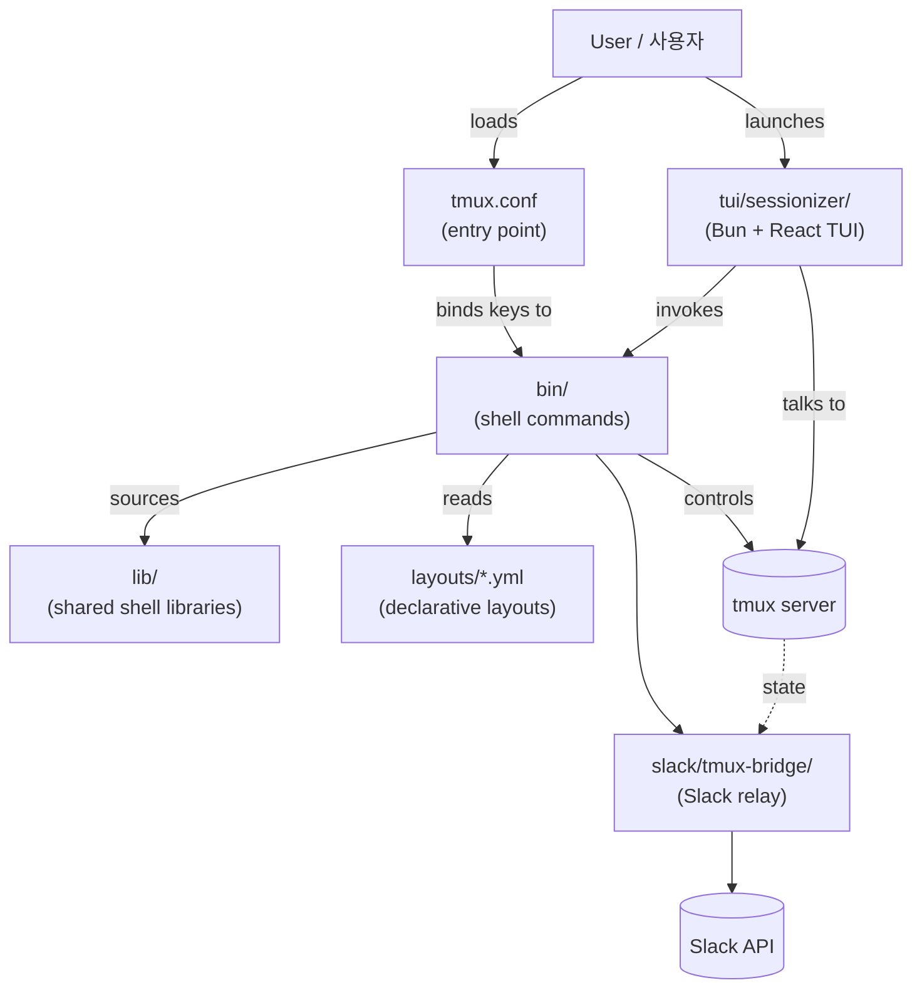

# tmux Productivity Suite / tmux 생산성 도구 모음

> A curated, opinionated tmux configuration plus a complete ecosystem of companion tools, libraries, layouts, a TUI, and a Slack bridge for power users.
>
> 파워 유저를 위한 큐레이션된 tmux 설정과 함께 제공되는 종합 도구·라이브러리·레이아웃·TUI·Slack 브리지 생태계입니다.

---

## Overview / 개요

This repository provides a battle-tested tmux configuration (`tmux.conf`) and an extensive set of companion shell scripts, shared libraries, declarative YAML layouts, a TypeScript-based Terminal UI (TUI), and a Slack bridge. Together they form a complete environment for project-oriented development, system administration, and remote collaboration — all from a single tmux session.

이 저장소는 실전에서 검증된 tmux 설정(`tmux.conf`)과 풍부한 생태계를 이루는 셸 스크립트, 공유 라이브러리, 선언적 YAML 레이아웃, TypeScript 기반 터미널 UI(TUI), 그리고 Slack 브리지를 함께 제공합니다. 프로젝트 중심의 개발, 시스템 운영, 원격 협업에 필요한 모든 것을 단일 tmux 세션 안에서 제공합니다.

### Who is this for? / 사용 대상

| Audience / 대상 | Use case / 활용 사례 |
| --- | --- |
| Multi-project developers / 다수 프로젝트 개발자 | Jump between repos, save layouts per project, fast session creation / 저장소 간 빠른 이동, 프로젝트별 레이아웃 |
| DevOps / SRE engineers / DevOps·SRE 엔지니어 | SSH picker, per-host layouts, system stats, long-command notifications |
| Remote-first teams / 원격 우선 팀 | Slack bridge for sharing terminal access / 터미널 공유 |
| tmux power users / tmux 파워 유저 | TUI sessionizer, sidebar, command palette, pane synchronization |

---

## Features / 기능

### Session management / 세션 관리
- **Project-aware session creation** with `tmux-sessionizer` — fuzzy-find a directory and create or attach a session
- **TUI mode** via `tmux-sessionizer-tui` — Bun + React + TypeScript interface with preview, create-wizard, kill-confirm and rename dialogs
- **Cycle, jump, kill, rename, reorder, sync** helpers (`tmux-session-cycle`, `tmux-session-jump`, `tmux-session-kill`, `tmux-session-rename`, `tmux-session-order`, `tmux-session-sync`)
- **Session dashboard** (`tmux-session-dashboard`) for an at-a-glance overview of active sessions
- **Session export / branch log** (`tmux-session-export`, `tmux-session-branch-log`) for reproducible state and history
- **Session icons** (`tmux-session-icon`) for visual identification in the status line

### Sidebar and command palette / 사이드바 & 명령 팔레트
- **`tmux-sidebar` / `tmux-sidebar-toggle` / `tmux-sidebar-init`** — a persistent project tree on the left
- **`tmux-command-palette`** — quick fuzzy launcher bound to a single key
- **`tmux-cheatsheet`** — in-session keybinding help

### Layouts and templates / 레이아웃 & 템플릿
- Declarative YAML layouts in `layouts/` (`default.yml`, `proxmox.yml`, `splunk.yml`, `resume.yml`, `safework.yml`, `safework2.yml`, `blacklist.yml`)
- `tmux-layout-apply <name>` to spin up a pre-defined window/pane topology
- `tmux-template-create` to author and save new templates
- `tmux-responsive` to adapt layouts to terminal dimensions

### Developer productivity / 개발자 생산성
- `tmux-copy-word`, `tmux-url-open`, `tmux-file-open` — fast text/file/URL actions
- `tmux-clipboard-history` — searchable clipboard buffer
- `tmux-pane-sync` — synchronize input across panes
- `tmux-git-status` / `tmux-git-uncommitted` — surface git state in the status line
- `tmux-opencode` — integration hook for the `opencode` workflow

### Operations and remote work / 운영 & 원격 작업
- `tmux-ssh-picker` — interactive SSH host selection
- `tmux-sys-stats` — CPU / memory / load in the status line
- `tmux-notify-long-command` — desktop notification for long-running commands
- `tmux-web-terminal` — expose the session over HTTP/WebSocket
- `tmux-slack-bridge-setup` / `tmux-slack-bridge-start` — share a tmux session with a Slack channel (see `slack/tmux-bridge/`)

### Quality-of-life / 사용성
- `tmux-auto-attach` — automatically attach to a previous session on login
- `tmux-bash-preexec` — preexec hook integration
- `tmux-config-reload` — live reload of `tmux.conf` and key bindings

---

## Architecture / 아키텍처

The suite is organized into clear, composable layers. `tmux.conf` is the entry point that sources the bundled shell tools. The shell tools (in `bin/`) call into shared libraries (in `lib/`) and load layouts (in `layouts/`) as YAML. The TUI is a standalone Bun + React + TypeScript application in `tui/sessionizer/` that talks to the same data sources as the CLI. The Slack bridge is a separate process that relays terminal state into Slack.



### Repository layout / 저장소 구조

```
.
├── AGENTS.md                 # agent / contributor guidance
├── CONTRIBUTING.md           # contribution guide
├── LICENSE                   # license file
├── OWNERS                    # CODEOWNERS-equivalent
├── README.md                 # this file
├── sessionizer.conf          # sessionizer configuration
├── tmux.conf                 # main tmux configuration
├── bin/                      # executable shell tools (see Commands)
├── lib/                      # shared shell libraries
│   ├── sidebar-colors
│   ├── sidebar-render
│   ├── tmux-sessionizer-common
│   └── tmux-sessionizer-wizard
├── layouts/                  # declarative YAML layouts
│   ├── blacklist.yml
│   ├── default.yml
│   ├── proxmox.yml
│   ├── resume.yml
│   ├── safework.yml
│   ├── safework2.yml
│   └── splunk.yml
├── tui/
│   └── sessionizer/          # Bun + React + TypeScript TUI
│       ├── package.json
│       ├── tsconfig.json
│       ├── bunfig.toml
│       ├── bun.lock
│       ├── src/
│       │   ├── App.tsx
│       │   ├── index.tsx
│       │   ├── actions/
│       │   ├── components/
│       │   ├── hooks/
│       │   └── lib/
│       └── __tests__/
├── docs/                     # design notes and brainstorming
└── slack/
    └── tmux-bridge/          # Slack bridge service
```

---

## Quick start / 빠른 시작

### 1. Prerequisites / 사전 요구사항

- `tmux` 3.0 or newer
- `bash` 4+ and common coreutils (`fd` / `fzf` recommended for the sessionizer)
- `yq` (mikefarah/go-yq) for YAML layout parsing
- `Bun` 1.x (only required for the TUI)
- A Nerd Font (recommended for sidebar icons)

### 2. Install / 설치

Clone the repository and symlink the entry point into your shell startup:

```sh
git clone <repo-url> ~/.config/tmux-productivity-suite
ln -sf ~/.config/tmux-productivity-suite/tmux.conf ~/.tmux.conf
```

Reload your current tmux server:

```sh
tmux source-file ~/.tmux.conf
```

Or start fresh:

```sh
tmux
```

The sessionizer's first run will create a default config in `~/.config/tmux-sessionizer/`.

### 3. First session / 첫 세션 만들기

```sh
# Open the TUI sessionizer
~/.config/tmux-productivity-suite/bin/tmux-sessionizer-tui

# Or use the classic fuzzy sessionizer (bound to a key in tmux.conf)
# Prefix + s   (or whatever binding is configured in your tmux.conf)
```

Pick a directory, name the session, optionally apply a layout, and the suite creates a tmux session and attaches to it.

---

## Configuration / 설정

### `tmux.conf`

The main configuration file. Edit it to remap the leader key, change key bindings, or source additional files. Most of the bundled `bin/` scripts are wired to bindings inside this file.

### `sessionizer.conf`

Controls sessionizer behavior — search roots, ignored paths, default layout, and per-directory overrides. A minimal example:

```yaml
search_roots:
  - ~/code
  - ~/work
ignore:
  - node_modules
  - .git
default_layout: default
per_project:
  - path: ~/code/proxmox-cluster
    layout: proxmox
  - path: ~/work/splunk-deployment
    layout: splunk
```

### `layouts/*.yml`

Each YAML file under `layouts/` describes a window/pane topology. They are loaded by `tmux-layout-apply` and the create-wizard inside the TUI. See `layouts/default.yml` for the canonical schema.

### TUI configuration / TUI 설정

The TUI reads the same `sessionizer.conf` and exposes its UI options in `tui/sessionizer/src/lib/config.ts`. Theme and state are defined in `src/lib/theme.ts` and `src/lib/state.ts`.

---

## Commands reference / 명령어 레퍼런스

All commands are designed to be run from inside a tmux session, but most also work standalone.

### Session management / 세션 관리

| Command | Purpose / 용도 |
| --- | --- |
| `tmux-sessionizer` | Fuzzy-find a directory and create/attach a session / 디렉터리 퍼지 검색 → 세션 생성·접속 |
| `tmux-sessionizer-tui` | TUI version (Bun + React) / TUI 버전 |
| `tmux-session-cycle` | Cycle through sessions / 세션 순환 |
| `tmux-session-jump` | Jump to a session by name / 이름으로 점프 |
| `tmux-session-kill` | Kill a session (with confirm) / 세션 종료 |
| `tmux-session-rename` | Rename current session / 세션 이름 변경 |
| `tmux-session-order` | Reorder session list / 세션 순서 정렬 |
| `tmux-session-sync` | Sync state between sessions / 세션 간 상태 동기화 |
| `tmux-session-dashboard` | Overview of all sessions / 세션 대시보드 |
| `tmux-session-export` | Export session definition to YAML / 세션 정의 내보내기 |
| `tmux-session-branch-log` | Log per-session git branches / 세션별 브랜치 기록 |
| `tmux-session-icon` | Pick / set a session icon / 세션 아이콘 설정 |

### Sidebar, palette, clipboard / 사이드바, 팔레트, 클립보드

| Command | Purpose / 용도 |
| --- | --- |
| `tmux-sidebar` | Render the sidebar / 사이드바 표시 |
| `tmux-sidebar-init` | Initialize sidebar state / 사이드바 초기화 |
| `tmux-sidebar-toggle` | Show / hide sidebar / 사이드바 토글 |
| `tmux-command-palette` | Open the command palette / 명령 팔레트 열기 |
| `tmux-cheatsheet` | Display keybinding help / 단축키 도움말 |
| `tmux-clipboard-history` | Searchable clipboard history / 클립보드 히스토리 |
| `tmux-copy-word` | Copy word under cursor / 커서 단어 복사 |
| `tmux-url-open` | Open URL under cursor / 커서 URL 열기 |
| `tmux-file-open` | Open file under cursor / 커서 파일 열기 |

### Layouts and panes / 레이아웃 & 패널

| Command | Purpose / 용도 |
| --- | --- |
| `tmux-layout-apply <name>` | Apply a layout from `layouts/<name>.yml` |
| `tmux-template-create` | Create a new layout template / 새 템플릿 생성 |
| `tmux-responsive` | Adapt layout to terminal size / 터미널 크기 대응 |
| `tmux-pane-sync` | Synchronize input across panes / 패널 입력 동기화 |

### Operations and notifications / 운영 & 알림

| Command | Purpose / 용도 |
| --- | --- |
| `tmux-ssh-picker` | Interactive SSH host picker / SSH 호스트 선택 |
| `tmux-sys-stats` | System stats in the status line / 시스템 상태 |
| `tmux-notify-long-command` | Notify when a long command finishes / 장기 명령 알림 |
| `tmux-web-terminal` | Expose session over HTTP/WS / 웹 터미널 노출 |
| `tmux-slack-bridge-setup` | Configure the Slack bridge / Slack 브리지 설정 |
| `tmux-slack-bridge-start` | Start the Slack bridge / Slack 브리지 시작 |
| `tmux-git-status` | Show git status in status line / Git 상태 표시 |
| `tmux-git-uncommitted` | Highlight uncommitted changes / 미커밋 변경 표시 |
| `tmux-opencode` | Opencode workflow integration / Opencode 연동 |

### Lifecycle / 수명주기

| Command | Purpose / 용도 |
| --- | --- |
| `tmux-auto-attach` | Auto-attach to a previous session / 자동 접속 |
| `tmux-bash-preexec` | Preexec hook for bash / bash 사전 실행 훅 |
| `tmux-config-reload` | Reload `tmux.conf` and bindings / 설정 리로드 |

Run any command with `--help` (where implemented) for option details. All scripts in `bin/` are self-documenting through their usage strings.

---

## Local development / 로컬 개발

### Shell scripts / 셸 스크립트

Most `bin/` scripts are POSIX-/bash-compatible. To iterate on a single script:

```sh
# Run a script directly
./bin/tmux-sessionizer --help

# Lint / format
shellcheck bin/*
shfmt -w bin/ lib/
```

A suggested layout:

- `bin/tmux-*` — entry points, thin wrappers
- `lib/tmux-*` — reusable functions, sourced via `source "$(dirname "$0")/../lib/<name>"`

### TUI (Bun + React + TypeScript) / TUI 개발

```sh
cd tui/sessionizer
bun install
bun run dev        # development
bun run build      # production bundle
```

The TUI:

- reads `sessionizer.conf` via `src/lib/config.ts`
- enumerates candidate directories via `src/lib/dirs.ts`
- shells out to `bin/tmux-*` for tmux control via `src/lib/tmux.ts`
- renders state defined in `src/lib/state.ts` and `src/lib/theme.ts`
- dispatches actions from `src/actions/session-actions.ts`
- handles keys through `src/hooks/use-keyboard-handler.ts`

The create-wizard (`src/components/create-wizard.tsx` and its step components) uses `lib/tmux-sessionizer-wizard` for shared logic with the CLI.

### Slack bridge / Slack 브리지

See `slack/tmux-bridge/AGENTS.md` for service-level development notes. The bridge subscribes to tmux session state and relays it to Slack.

### Documentation / 문서

Design notes live under `docs/`. They are intentionally rough — treat them as brainstorming material rather than authoritative specs.

---

## Testing / 테스트

### TUI

The TUI ships with unit tests under `tui/sessionizer/__tests__/`:

```sh
cd tui/sessionizer
bun test
```

Current test coverage focuses on configuration parsing (`config.test.ts`) and the tmux control layer (`tmux.test.ts`).

### Shell scripts

There is no formal test harness for the shell layer. Recommended manual checks:

```sh
# Layout round-trip
./bin/tmux-layout-apply default
tmux list-windows
./bin/tmux-layout-apply proxmox

# Sessionizer dry run
SESSIONIZER_DRY_RUN=1 ./bin/tmux-sessionizer ~/code
```

When adding new shell logic, prefer extracting it into `lib/` and testing it with `bats` or `shunit2` if available.

---

## Contributing / 기여

Contributions are welcome. Before opening a pull request:

1. Read `AGENTS.md` and `CONTRIBUTING.md` for project conventions.
2. Keep `bin/` scripts thin; push reusable logic into `lib/`.
3. Add a new entry to this README's Commands reference when introducing a new script.
4. Add or update tests for the TUI when changing TypeScript code.
5. Follow the existing style:
   - Shell: `shellcheck`-clean, `shfmt`-formatted, `set -euo pipefail` where appropriate
   - TypeScript: Prettier defaults, strict mode, named exports preferred

New layout templates should be added under `layouts/` with a self-explanatory filename and a short comment header.

---

## License / 라이선스

See the `LICENSE` file in the repository root.
저장소 루트의 `LICENSE` 파일을 참조하세요.