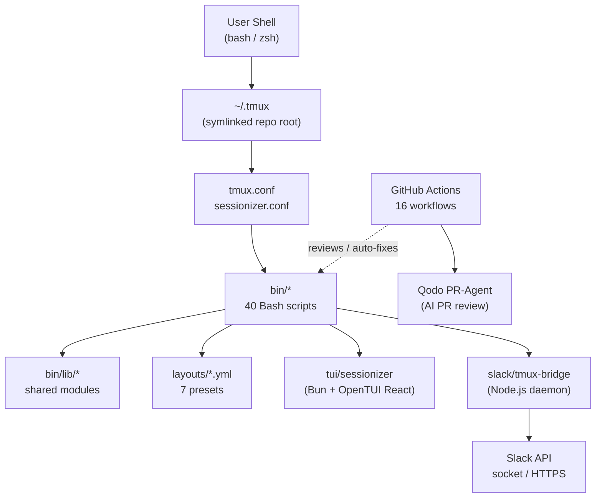
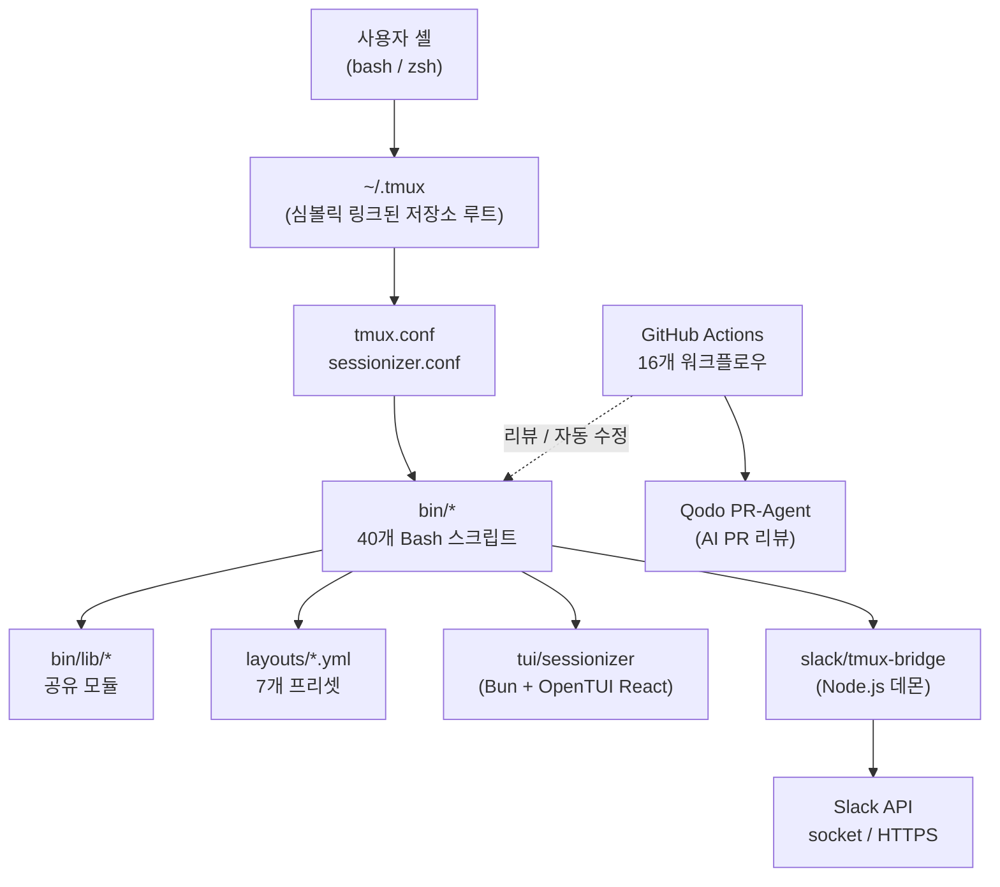

# TMUX SESSIONIZER


[](../../actions/workflows/ci.yml)
[](../../actions/workflows/10_pr-review.yml)
[](../../actions/workflows/11_security-pr-review.yml)
[](../../actions/workflows/12_dependabot-auto-merge.yml)
[](../../actions/workflows/13_pr-auto-merge.yml)
[](../../actions/workflows/14_bot-auto-fix.yml)
[](../../actions/workflows/60_ci-auto-heal.yml)
[](../../actions/workflows/25_release-publish.yml)

> **A Bash-first tmux configuration and session-management toolkit.**
> **Bash 중심의 tmux 설정 및 세션 관리 도구 모음입니다.**

---

## Table of Contents

- [Overview](#overview)
- [Features](#features)
- [Repository Structure](#repository-structure)
- [Architecture](#architecture)
- [Automation Inventory](#automation-inventory)
- [Quick Start](#quick-start)
- [Local Development](#local-development)
- [Commands Reference](#commands-reference)
- [Configuration Reference](#configuration-reference)
- [Contribution Guide](#contribution-guide)
- [License](#license)
- [개요](#개요)
- [주요 기능](#주요-기능)
- [저장소 구조](#저장소-구조)
- [아키텍처](#아키텍처)
- [자동화 인벤토리](#자동화-인벤토리)
- [빠른 시작](#빠른-시작)
- [로컬 개발](#로컬-개발)
- [명령어 레퍼런스](#명령어-레퍼런스)
- [설정 레퍼런스](#설정-레퍼런스)
- [기여 가이드](#기여-가이드)

---

## Overview

TMUX SESSIONIZER is a layered tmux environment that replaces a bare `~/.tmux.conf` with a structured, script-driven toolkit. The repository is intended to be symlinked into your home directory as `~/.tmux`, after which `tmux.conf` and `sessionizer.conf` at the root are sourced by `tmux` on startup.

Behavior is decomposed into a **Bash core** (`bin/*` + `bin/lib/*`), a **Bun/OpenTUI React front-end** (`tui/sessionizer`), and a **Node.js Slack bridge** (`slack/tmux-bridge`). All three layers share the same session model and layout YAMLs in `layouts/`.

This repository is **not** a generic config dump: it ships an opinionated workflow for branch-aware sessions, layout templates, MRU navigation, Slack mirroring, and self-maintaining GitHub Actions automation.

### Key Principles

- **Bash-first**: every interactive surface is a small Bash script (most under 100 LOC) so the toolchain is debuggable with `bash -x`.
- **Composable**: each script is independently invokable and can be bound to a key in `tmux.conf`.
- **Discoverable**: `tmux-sessionizer`, `tmux-sessionizer-tui`, and `tmux-command-palette` provide three progressive entry points (fzf, OpenTUI, fzf palette).
- **Layout-as-data**: panes, windows, and session shapes live in `layouts/*.yml`, not in shell conditionals.
- **Self-healing CI**: 16 GitHub Actions workflows cover PR review, auto-merge, dependency updates, release publishing, and CI failure remediation.

---

## Features

### Session Management

- `tmux-sessionizer` — `fzf`-based directory picker that jumps to or creates a session rooted at the picked path. Supports EXTRA_DIRS and per-directory layouts.
- `tmux-sessionizer-tui` — Bun + OpenTUI React front-end with multi-step create wizard, MRU list, kill confirmation, rename dialog, and live preview panel.
- `tmux-session-cycle` — `PgUp`/`PgDn` rotation across sessions, with opt-in exclusion of `opencode` sessions.
- `tmux-session-jump` — minimal MRU picker (19 LOC) for rapid switching without `fzf` overhead.
- `tmux-session-kill`, `tmux-session-rename`, `tmux-session-icon`, `tmux-session-order` — session lifecycle utilities.
- `tmux-session-dashboard` — formatted tabular popup of all sessions (active, attached, windows, age).
- `tmux-session-branch-log` — append-only log mapping `session → git branch` on every switch.
- `tmux-session-export` — dump the current session layout to a `layouts/*.yml`-shaped file.

### Sidebar

- `tmux-sidebar`, `tmux-sidebar-init`, `tmux-sidebar-toggle` — a tree-style sidebar (rendered by `bin/lib/sidebar-render`) bound to a dedicated pane.
- `bin/lib/sidebar-colors` and `bin/lib/sidebar-render` are the shared modules for color and rendering logic.

### Layouts & Templates

- 7 layout presets: `default.yml`, `resume.yml`, `proxmox.yml`, `splunk.yml`, `safework.yml`, `safework2.yml`, `blacklist.yml` (negative filter).
- `tmux-template-create` — quick-create a session from a named preset.
- `tmux-layout-apply` — apply a `layouts/*.yml` definition to an existing or new session.

### Shell & Pane Utilities

- `tmux-clipboard-history` — browse the tmux paste buffer ring.
- `tmux-copy-word` — smart word-copy under the cursor (respects `$TMUX_COPY_WORD_DELIMS`).
- `tmux-pane-sync` — toggle `synchronize-panes`.
- `tmux-url-open` / `tmux-file-open` — extract URLs or file paths from a pane and open them.
- `tmux-ssh-picker` — pick an SSH host from `~/.ssh/config`.
- `tmux-command-palette` — categorized `fzf` action picker.
- `tmux-config-reload` — reload `tmux.conf` with a settings diff.
- `tmux-cheatsheet` — categorized keybinding reference popup.
- `tmux-bash-preexec` — sourceable pre-exec hook for command timing and notifications.
- `tmux-notify-long-command` — desktop notification when a command exceeds a threshold.

### Git Awareness

- `tmux-git-status` — render branch + dirty/ahead/behind/stash as a status segment.
- `tmux-git-uncommitted` — track uncommitted-change counts per session.

### Slack Bridge

- `tmux-slack-bridge-setup` — interactive wizard to provision a Slack app.
- `tmux-slack-bridge-start` — dual-mode runner: direct socket (self-hosted) or HTTPS via a public endpoint.
- `slack/tmux-bridge` (Node.js) — long-running daemon that mirrors tmux sessions into Slack channels.

### Web & Auto-attach

- `tmux-web-terminal` — launches `ttyd` to expose the current session over HTTP.
- `tmux-auto-attach` — login-shell-friendly auto-attach flow.
- `tmux-responsive` — width-tiered status bar rendering.
- `tmux-opencode` — launcher for OpenCode AI sessions.

### CI / Release / Governance (GitHub-side)

- 16 GitHub Actions workflows covering PR review (Qodo PR-Agent), security review, dependabot auto-merge, bot auto-fix, merged-PR cleanup, issue backfill, release notes, release publishing, downstream health checks, CI failure issues, CI auto-heal, and issue classification.
- See [Automation Inventory](#automation-inventory) for the full per-workflow breakdown.

---

## Repository Structure

```text
.
├── AGENTS.md                       # Project knowledge base (LLM-readable)
├── CONTRIBUTING.md                 # Contribution policy
├── LICENSE                         # MIT License
├── OWNERS                          # CODEOWNERS-equivalent reviewer list
├── README.md                       # This document
├── sessionizer.conf                # SCAN_DIR + EXTRA_DIRS for session discovery
├── tmux.conf                       # Root tmux loader
├── bin/                            # Bash execution surface (40 scripts)
│   ├── tmux-auto-attach
│   ├── tmux-bash-preexec
│   ├── tmux-cheatsheet
│   ├── tmux-clipboard-history
│   ├── tmux-command-palette
│   ├── tmux-config-reload
│   ├── tmux-copy-word
│   ├── tmux-file-open
│   ├── tmux-git-status
│   ├── tmux-git-uncommitted
│   ├── tmux-layout-apply
│   ├── tmux-notify-long-command
│   ├── tmux-opencode
│   ├── tmux-pane-sync
│   ├── tmux-responsive
│   ├── tmux-session-branch-log
│   ├── tmux-session-cycle
│   ├── tmux-session-dashboard
│   ├── tmux-session-export
│   ├── tmux-session-icon
│   ├── tmux-session-jump
│   ├── tmux-session-kill
│   ├── tmux-session-order
│   ├── tmux-session-rename
│   ├── tmux-session-sync
│   ├── tmux-sessionizer
│   ├── tmux-sessionizer-tui
│   ├── tmux-sidebar
│   ├── tmux-sidebar-init
│   ├── tmux-sidebar-toggle
│   ├── tmux-slack-bridge-setup
│   ├── tmux-slack-bridge-start
│   ├── tmux-ssh-picker
│   ├── tmux-sys-stats
│   ├── tmux-template-create
│   ├── tmux-url-open
│   ├── tmux-web-terminal
│   └── lib/                        # Shared library modules
│       ├── sidebar-colors
│       ├── sidebar-render
│       ├── tmux-sessionizer-common
│       └── tmux-sessionizer-wizard
├── layouts/                        # YAML session layout presets
│   ├── blacklist.yml
│   ├── default.yml
│   ├── proxmox.yml
│   ├── resume.yml
│   ├── safework.yml
│   ├── safework2.yml
│   └── splunk.yml
├── tui/
│   └── sessionizer/                # Bun + OpenTUI React front-end
│       ├── AGENTS.md
│       ├── bun.lock
│       ├── bunfig.toml
│       ├── package.json
│       ├── tsconfig.json
│       ├── src/
│       │   ├── App.tsx
│       │   ├── bun-env.d.ts
│       │   ├── index.tsx
│       │   ├── actions/
│       │   │   └── session-actions.ts
│       │   ├── components/
│       │   │   ├── create-wizard.tsx
│       │   │   ├── filter-input.tsx
│       │   │   ├── kill-confirm-dialog.tsx
│       │   │   ├── preview-panel.tsx
│       │   │   ├── rename-dialog.tsx
│       │   │   ├── session-list.tsx
│       │   │   ├── wizard-step-dir.tsx
│       │   │   ├── wizard-step-layout.tsx
│       │   │   └── wizard-step-name.tsx
│       │   ├── hooks/
│       │   │   └── use-keyboard-handler.ts
│       │   └── lib/
│       │       ├── config.ts
│       │       ├── create-session.ts
│       │       ├── dirs.ts
│       │       ├── state.ts
│       │       ├── theme.ts
│       │       └── tmux.ts
│       └── __tests__/
│           ├── config.test.ts
│           └── tmux.test.ts
├── docs/
│   ├── session-persistence-brainstorming.md
│   └── supermemory-governance.md
└── slack/
    └── tmux-bridge/                # Node.js Slack bridge daemon
        └── AGENTS.md
```

> The `tui/sessionizer/__tests__/` directory uses Bun's built-in test runner. Run it with `bun test` from inside `tui/sessionizer`.

---

## Architecture

The repository is a **layered toolkit**. The Bash layer is the source of truth; the TUI is a thin React front-end over the same primitives; the Slack bridge is an external daemon that consumes `tmux ls` / `tmux display-message` output.



**Layered responsibilities**

| Layer | Path | Responsibility |
| --- | --- | --- |
| Loader | `tmux.conf`, `sessionizer.conf` | Source env, set prefix, define keybindings |
| Bash Core | `bin/*` | All interactive behavior |
| Shared Lib | `bin/lib/*` | Cross-script helpers (rendering, wizard, colors) |
| Layout Data | `layouts/*.yml` | Declarative session shapes |
| TUI | `tui/sessionizer` | Interactive picker / wizard with React |
| Bridge | `slack/tmux-bridge` | Slack ↔ tmux session mirroring |
| Automation | `.github/workflows/*` | PR review, auto-merge, releases, healing |

---

## Automation Inventory

This repository ships **16 GitHub Actions workflows** (no Go automation tools in this repo). All file names below are the real on-disk names with their numeric prefix preserved.

| # | Workflow File | Purpose |
| - | ------------- | ------- |
| 01 | `01_branch-to-pr.yml` | Promote a long-lived branch into a draft PR with auto-filled context. |
| 02 | `02_issue-to-branch.yml` | On `issue opened` / `labeled`, open a feature branch and a tracking PR. |
| 03 | `10_pr-review.yml` | Invoke [Qodo PR-Agent](https://github.com/qodo-ai/pr-agent) for AI code review on every PR. |
| 04 | `11_security-pr-review.yml` | Security-focused variant of `10_pr-review.yml` (SAST + secret heuristics). |
| 05 | `12_dependabot-auto-merge.yml` | Auto-merge Dependabot PRs once CI + review pass. |
| 06 | `13_pr-auto-merge.yml` | Auto-merge PRs labeled `auto-merge` once all checks are green. |
| 07 | `14_bot-auto-fix.yml` | Allow bots (e.g. PR-Agent, dependabot) to push follow-up commits and auto-merge. |
| 08 | `15_merged-pr-cleanup.yml` | Delete head branches after merge and close stale linked issues. |
| 09 | `19_issue-backfill.yml` | Backfill missing labels/milestones on legacy issues. |
| 10 | `24_release-notes.yml` | Aggregate conventional-commits into `RELEASE_NOTES.md`. |
| 11 | `25_release-publish.yml` | Tag, build, and publish a release artifact on `v*` tags. |
| 12 | `29_downstream-health-check.yml` | Verify downstream consumers (homepage, docs site) still resolve. |
| 13 | `37_ci-failure-issues.yml` | On persistent CI failure, open a remediation issue with logs. |
| 14 | `60_ci-auto-heal.yml` | Retry transient CI failures and apply known-good workarounds. |
| 15 | `91_issue-classification.yml` | Auto-classify new issues by topic and assign labels. |
| 16 | `ci.yml` | Primary CI: lint, `bash -n` syntax check, `shellcheck`, `bun test`, `bun build`. |

### Workflow Naming Convention

Workflow file names use a two-digit numeric prefix that maps to a lifecycle band:

- `01–09` — issue/branch ingestion
- `10–19` — PR review
- `20–29` — release lifecycle
- `30–39` — CI failure handling
- `60–69` — CI self-healing
- `90–99` — housekeeping and classification

---

## Quick Start

```bash
# 1. Clone
git clone https://github.com/<you>/tmux-sessionizer.git ~/.tmux

# 2. Symlink (the repo expects to be reachable as ~/.tmux)
ln -sfn "$(pwd)/.tmux/tmux.conf" ~/.tmux.conf 2>/dev/null || true

# 3. Install Bun (for the TUI)
curl -fsSL https://bun.sh/install | bash

# 4. Install Node deps for the Slack bridge
cd ~/.tmux/slack/tmux-bridge && npm ci && cd -

# 5. Launch
tmux new-session -A -s main \; source-file ~/.tmux/tmux.conf
```

Inside tmux, the default prefix is `C-a`. Useful entry points:

- `prefix + s` — `tmux-sessionizer` (fzf picker)
- `prefix + S` — `tmux-sessionizer-tui` (Bun OpenTUI wizard)
- `prefix + Tab` — `tmux-session-cycle` (rotate sessions)
- `prefix + d` — `tmux-session-dashboard` (table popup)
- `prefix + /` — `tmux-command-palette`

---

## Local Development

### Bash core

```bash
# Lint every script
find bin -type f -exec shellcheck {} +

# Syntax check
find bin -type f -name 'tmux-*' -exec bash -n {} +

# Run a single script in trace mode
bash -x bin/tmux-sessionizer
```

### TUI (Bun + OpenTUI)

```bash
cd tui/sessionizer
bun install
bun test                    # unit tests
bun run src/index.tsx       # launch the TUI
bun build src/index.tsx --outdir dist
```

### Slack bridge

```bash
cd slack/tmux-bridge
npm ci
npm run build
npm start                   # socket mode
npm run start:http          # HTTPS via public tunnel
```

### CI parity

`ci.yml` runs:

1. `shellcheck` over `bin/*`
2. `bash -n` over `bin/*`
3. `bun install && bun test` inside `tui/sessionizer`
4. `npm ci && npm run build` inside `slack/tmux-bridge`

Reproduce locally before pushing:

```bash
make ci   # if a Makefile is added; otherwise invoke the four commands above
```

---

## Commands Reference

### Session management

| Command | Description |
| ------- | ----------- |
| `tmux-sessionizer` | fzf directory/session picker with create wizard. |
| `tmux-sessionizer-tui` | Bun OpenTUI React picker (multi-step wizard). |
| `tmux-session-cycle [dir]` | PgUp/PgDn across sessions (excludes `opencode`). |
| `tmux-session-jump` | MRU session picker (no directory scan). |
| `tmux-session-kill` | Kill with confirmation prompt. |
| `tmux-session-rename` | Rename current session (validates name). |
| `tmux-session-icon` | Resolve Nerd Font icon for a session name. |
| `tmux-session-order` | Sort sessions by `activity` timestamp. |
| `tmux-session-dashboard` | Formatted session table popup. |
| `tmux-session-branch-log` | Append `session → branch` to log on switch. |
| `tmux-session-export [file]` | Dump current session layout to a YAML file. |
| `tmux-session-sync` | Replicate tmux sessions into Slack channels. |

### Sidebar

| Command | Description |
| ------- | ----------- |
| `tmux-sidebar` | Render the tree sidebar in the dedicated pane. |
| `tmux-sidebar-init` | Initialize the sidebar pane on session create. |
| `tmux-sidebar-toggle` | Show/hide the sidebar. |

### Layouts & templates

| Command | Description |
| ------- | ----------- |
| `tmux-template-create <name>` | Create a session from a preset in `layouts/`. |
| `tmux-layout-apply <file>` | Apply a `layouts/*.yml` to current or new session. |

### Pane & shell utilities

| Command | Description |
| ------- | ----------- |
| `tmux-clipboard-history` | Browse paste buffer ring via fzf. |
| `tmux-copy-word` | Smart word copy under cursor. |
| `tmux-pane-sync` | Toggle `synchronize-panes`. |
| `tmux-url-open` | Extract a URL from current pane and open it. |
| `tmux-file-open` | Extract a file path from current pane and open it. |
| `tmux-ssh-picker` | Pick an SSH host from `~/.ssh/config`. |
| `tmux-command-palette` | Categorized fzf action picker. |
| `tmux-config-reload` | Reload `tmux.conf` with a settings diff. |
| `tmux-cheatsheet` | Categorized keybinding reference popup. |
| `tmux-bash-preexec` | Sourceable preexec hook (command timing). |
| `tmux-notify-long-command` | Desktop notification for long-running commands. |

### Git

| Command | Description |
| ------- | ----------- |
| `tmux-git-status` | Statusline segment: branch + dirty/ahead/behind/stash. |
| `tmux-git-uncommitted` | Track uncommitted-change counts per session. |

### Bridge, web, auto-attach

| Command | Description |
| ------- | ----------- |
| `tmux-slack-bridge-setup` | Interactive Slack app provisioning wizard. |
| `tmux-slack-bridge-start` | Start bridge (socket or HTTPS mode). |
| `tmux-web-terminal` | Launch `ttyd` for the current session. |
| `tmux-auto-attach` | Login-shell auto-attach flow. |
| `tmux-opencode` | Launch an OpenCode AI session. |
| `tmux-responsive` | Width-tiered status bar renderer. |

---

## Configuration Reference

### `sessionizer.conf`

```bash
SCAN_DIR="$HOME/src"          # primary project root to scan
EXTRA_DIRS=("$HOME/work" "$HOME/sandbox")  # additional roots
LAYOUTS_DIR="$HOME/.tmux/layouts"
```

### Layout YAML shape (`layouts/*.yml`)

```yaml
session: safework
root: ~/work/safework
windows:
  - name: code
    panes:
      - vim
      - "git status -sb | less"
  - name: logs
    panes:
      - "tail -F logs/*.log"
on_start:
  - "tmux-sidebar-init"
```

### Environment variables

| Var | Default | Used by |
| --- | ------- | ------- |
| `TMUX_SESSIONIZER_SCAN_DIR` | `~/src` | `tmux-sessionizer*` |
| `TMUX_SESSIONIZER_EXTRA_DIRS` | (empty) | `tmux-sessionizer*` |
| `TMUX_COPY_WORD_DELIMS` | `_-\./\\` | `tmux-copy-word` |
| `TMUX_SLACK_BRIDGE_MODE` | `socket` | `tmux-slack-bridge-start` |
| `TMUX_SLACK_BRIDGE_TOKEN` | (required) | `slack/tmux-bridge` |
| `TMUX_WEB_PORT` | `7681` | `tmux-web-terminal` |

---

## Contribution Guide

1. Read [`CONTRIBUTING.md`](./CONTRIBUTING.md) for the full policy.
2. Check [`OWNERS`](./OWNERS) for the current reviewers per area.
3. Open an issue using one of the templates; `91_issue-classification.yml` will auto-label it.
4. Branch from `master` using the `02_issue-to-branch.yml` convention (`<issue-number>-<slug>`).
5. Before pushing, run:
   - `shellcheck bin/*`
   - `bash -n bin/*`
   - `bun test` inside `tui/sessionizer`
6. Open a PR. `10_pr-review.yml` will post an AI review; address comments or apply suggestions via `14_bot-auto-fix.yml`.
7. Once green and approved, label the PR `auto-merge` to engage `13_pr-auto-merge.yml`.
8. On merge, `15_merged-pr-cleanup.yml` deletes the head branch and closes linked issues.

### Code style

- Bash: 4-space indent, `set -euo pipefail` at the top of every script, prefer `printf` over `echo`.
- TypeScript (TUI): strict mode, ESM, React 18+, OpenTUI components only.
- Node (bridge): CommonJS by default for `tsx` compatibility, `engines.node >= 18`.

---

## License

This project is released under the **MIT License**. See [`LICENSE`](./LICENSE).

---

# 한국어 안내

## 개요

TMUX SESSIONIZER는 단순한 `~/.tmux.conf` 한 파일을 넘어, **구조화된 스크립트 기반 tmux 환경**으로 발전시킨 도구 모음입니다. 저장소 자체를 `~/.tmux`로 심볼릭 링크한 뒤, 루트의 `tmux.conf`와 `sessionizer.conf`를 tmux가 시작 시 source하도록 설계되어 있습니다.

동작은 세 개의 레이어로 분리됩니다.

- **Bash 코어** (`bin/*` + `bin/lib/*`)
- **Bun/OpenTUI React 프런트엔드** (`tui/sessionizer`)
- **Node.js Slack 브리지** (`slack/tmux-bridge`)

세 레이어는 동일한 세션 모델과 `layouts/`의 YAML 레이아웃 정의를 공유합니다.

### 설계 원칙

- **Bash 우선**: 모든 인터랙티브 표면은 작은 Bash 스크립트(대부분 100 LOC 이내)로 구성하여 `bash -x`로 디버깅할 수 있습니다.
- **조합 가능**: 각 스크립트는 독립적으로 실행 가능하며 `tmux.conf`에서 키로 직접 바인딩할 수 있습니다.
- **진입점이 다양**: `tmux-sessionizer`(fzf), `tmux-sessionizer-tui`(OpenTUI), `tmux-command-palette`(fzf 팔레트) 세 단계로 진입합니다.
- **레이아웃은 데이터**: 패널·윈도우·세션 형태는 셸 조건문이 아닌 `layouts/*.yml`에 선언적으로 보관합니다.
- **자가 치유 CI**: 16개의 GitHub Actions 워크플로우가 PR 리뷰, 자동 머지, 의존성 갱신, 릴리스, CI 실패 복구를 담당합니다.

---

## 주요 기능

### 세션 관리

- `tmux-sessionizer` — `fzf` 기반 디렉터리 피커. 선택한 경로를 루트로 하는 세션으로 점프하거나 신규 생성합니다. EXTRA_DIRS와 디렉터리별 레이아웃을 지원합니다.
- `tmux-sessionizer-tui` — Bun + OpenTUI React 프런트엔드. 다단계 생성 위저드, MRU 리스트, 종료 확인, 이름 변경 다이얼로그, 실시간 프리뷰 패널을 제공합니다.
- `tmux-session-cycle` — `PgUp`/`PgDn`으로 세션을 순환하며 `opencode` 세션은 선택적으로 제외합니다.
- `tmux-session-jump` — `fzf` 오버헤드 없이 동작하는 미니멀 MRU 피커 (19 LOC).
- `tmux-session-kill`, `tmux-session-rename`, `tmux-session-icon`, `tmux-session-order` — 세션 생명주기 유틸리티.
- `tmux-session-dashboard` — 모든 세션을 표 형식(활성/연결/윈도우/생성 시각)으로 팝업 표시.
- `tmux-session-branch-log` — 세션 전환 시 `session → git branch`를 로그에 누적 기록.
- `tmux-session-export` — 현재 세션 레이아웃을 `layouts/*.yml` 형태로 덤프.

### 사이드바

- `tmux-sidebar`, `tmux-sidebar-init`, `tmux-sidebar-toggle` — 전용 패널에 트리 형태 사이드바를 표시(`bin/lib/sidebar-render`가 렌더링).
- `bin/lib/sidebar-colors`, `bin/lib/sidebar-render` — 색상 및 렌더링 로직 공유 모듈.

### 레이아웃과 템플릿

- 7개의 레이아웃 프리셋: `default.yml`, `resume.yml`, `proxmox.yml`, `splunk.yml`, `safework.yml`, `safework2.yml`, `blacklist.yml`(차단 필터).
- `tmux-template-create` — 프리셋 이름으로 세션을 빠르게 생성.
- `tmux-layout-apply` — `layouts/*.yml` 정의를 기존 또는 신규 세션에 적용.

### 셸과 패널 유틸리티

- `tmux-clipboard-history` — tmux 붙여넣기 버퍼 링을 탐색.
- `tmux-copy-word` — 커서 위치의 단어를 똑똑히 복사(`$TMUX_COPY_WORD_DELIMS` 사용).
- `tmux-pane-sync` — `synchronize-panes` 토글.
- `tmux-url-open` / `tmux-file-open` — 패널에서 URL 또는 파일 경로를 추출하여 실행.
- `tmux-ssh-picker` — `~/.ssh/config`에서 호스트 선택.
- `tmux-command-palette` — 카테고리별 `fzf` 액션 피커.
- `tmux-config-reload` — `tmux.conf`를 재로드하고 설정 차이를 표시.
- `tmux-cheatsheet` — 카테고리별 키바인딩 참고 팝업.
- `tmux-bash-preexec` — 명령어 시간 측정용 preexec 훅.
- `tmux-notify-long-command` — 임계치 초과 시 데스크톱 알림.

### Git 인식

- `tmux-git-status` — 브랜치 + dirty/ahead/behind/stash 상태를 상태바 세그먼트로 출력.
- `tmux-git-uncommitted` — 세션별 미커밋 변경 수 추적.

### Slack 브리지

- `tmux-slack-bridge-setup` — Slack 앱 프로비저닝용 대화형 위저드.
- `tmux-slack-bridge-start` — 직접 소켓(self-hosted) 또는 HTTPS(공개 엔드포인트) 듀얼 모드 러너.
- `slack/tmux-bridge` (Node.js) — tmux 세션을 Slack 채널에 미러링하는 장기 실행 데몬.

### 웹과 자동 연결

- `tmux-web-terminal` — 현재 세션을 HTTP로 노출하는 `ttyd` 실행기.
- `tmux-auto-attach` — 로그인 셸 친화적 자동 연결 흐름.
- `tmux-responsive` — 폭 등급별 상태바 렌더링.
- `tmux-opencode` — OpenCode AI 세션 실행기.

### CI / 릴리스 / 거버넌스 (GitHub 측)

- 16개의 GitHub Actions 워크플로우: PR 리뷰(Qodo PR-Agent), 보안 리뷰, Dependabot 자동 머지, 봇 자동 수정, 머지 후 PR 정리, 이슈 백필, 릴리스 노트, 릴리스 게시, 다운스트림 헬스 체크, CI 실패 이슈, CI 자가 치유, 이슈 분류.
- 자세한 내용은 [자동화 인벤토리](#자동화-인벤토리) 절을 참고하세요.

---

## 저장소 구조

```text
.
├── AGENTS.md                       # 프로젝트 지식 베이스 (LLM 친화)
├── CONTRIBUTING.md                 # 기여 정책
├── LICENSE                         # MIT 라이선스
├── OWNERS                          # CODEOWNERS에 준하는 리뷰어 명단
├── README.md                       # 본 문서
├── sessionizer.conf                # 세션 탐색용 SCAN_DIR + EXTRA_DIRS
├── tmux.conf                       # 루트 tmux 로더
├── bin/                            # Bash 실행 표면 (40개 스크립트)
│   ├── tmux-auto-attach
│   ├── tmux-bash-preexec
│   ├── tmux-cheatsheet
│   ├── tmux-clipboard-history
│   ├── tmux-command-palette
│   ├── tmux-config-reload
│   ├── tmux-copy-word
│   ├── tmux-file-open
│   ├── tmux-git-status
│   ├── tmux-git-uncommitted
│   ├── tmux-layout-apply
│   ├── tmux-notify-long-command
│   ├── tmux-opencode
│   ├── tmux-pane-sync
│   ├── tmux-responsive
│   ├── tmux-session-branch-log
│   ├── tmux-session-cycle
│   ├── tmux-session-dashboard
│   ├── tmux-session-export
│   ├── tmux-session-icon
│   ├── tmux-session-jump
│   ├── tmux-session-kill
│   ├── tmux-session-order
│   ├── tmux-session-rename
│   ├── tmux-session-sync
│   ├── tmux-sessionizer
│   ├── tmux-sessionizer-tui
│   ├── tmux-sidebar
│   ├── tmux-sidebar-init
│   ├── tmux-sidebar-toggle
│   ├── tmux-slack-bridge-setup
│   ├── tmux-slack-bridge-start
│   ├── tmux-ssh-picker
│   ├── tmux-sys-stats
│   ├── tmux-template-create
│   ├── tmux-url-open
│   ├── tmux-web-terminal
│   └── lib/                        # 공유 라이브러리 모듈
│       ├── sidebar-colors
│       ├── sidebar-render
│       ├── tmux-sessionizer-common
│       └── tmux-sessionizer-wizard
├── layouts/                        # YAML 세션 레이아웃 프리셋
│   ├── blacklist.yml
│   ├── default.yml
│   ├── proxmox.yml
│   ├── resume.yml
│   ├── safework.yml
│   ├── safework2.yml
│   └── splunk.yml
├── tui/
│   └── sessionizer/                # Bun + OpenTUI React 프런트엔드
│       ├── AGENTS.md
│       ├── bun.lock
│       ├── bunfig.toml
│       ├── package.json
│       ├── tsconfig.json
│       ├── src/
│       │   ├── App.tsx
│       │   ├── bun-env.d.ts
│       │   ├── index.tsx
│       │   ├── actions/
│       │   │   └── session-actions.ts
│       │   ├── components/
│       │   │   ├── create-wizard.tsx
│       │   │   ├── filter-input.tsx
│       │   │   ├── kill-confirm-dialog.tsx
│       │   │   ├── preview-panel.tsx
│       │   │   ├── rename-dialog.tsx
│       │   │   ├── session-list.tsx
│       │   │   ├── wizard-step-dir.tsx
│       │   │   ├── wizard-step-layout.tsx
│       │   │   └── wizard-step-name.tsx
│       │   ├── hooks/
│       │   │   └── use-keyboard-handler.ts
│       │   └── lib/
│       │       ├── config.ts
│       │       ├── create-session.ts
│       │       ├── dirs.ts
│       │       ├── state.ts
│       │       ├── theme.ts
│       │       └── tmux.ts
│       └── __tests__/
│           ├── config.test.ts
│           └── tmux.test.ts
├── docs/
│   ├── session-persistence-brainstorming.md
│   └── supermemory-governance.md
└── slack/
    └── tmux-bridge/                # Node.js Slack 브리지 데몬
        └── AGENTS.md
```

> `tui/sessionizer/__tests__/`는 Bun 내장 테스트 러너를 사용합니다. `tui/sessionizer` 디렉터리에서 `bun test`로 실행하세요.

---

## 아키텍처

이 저장소는 **레이어드 도구 모음**입니다. Bash 레이어가 진실의 근원(source of truth)이고, TUI는 동일 프리미티브 위에 얹힌 얇은 React 프런트엔드이며, Slack 브리지는 `tmux ls` / `tmux display-message` 출력을 소비하는 외부 데몬입니다.



**레이어별 책임**

| 레이어 | 경로 | 책임 |
| --- | --- | --- |
| 로더 | `tmux.conf`, `sessionizer.conf` | 환경 변수 source, prefix 정의, 키바인딩 |
| Bash 코어 | `bin/*` | 모든 인터랙티브 동작 |
| 공유 라이브러리 | `bin/lib/*` | 스크립트 간 헬퍼(렌더링, 위저드, 색상) |
| 레이아웃 데이터 | `layouts/*.yml` | 선언적 세션 형태 |
| TUI | `tui/sessionizer` | React 기반 인터랙티브 피커 / 위저드 |
| 브리지 | `slack/tmux-bridge` | Slack ↔ tmux 세션 미러링 |
| 자동화 | `.github/workflows/*` | PR 리뷰, 자동 머지, 릴리스, 자가 치유 |

---

## 자동화 인벤토리

이 저장소는 **16개의 GitHub Actions 워크플로우**를 제공합니다(Go 자동화 도구는 본 저장소에 포함되어 있지 않음). 아래 파일명은 디스크에 저장된 실제 이름이며 숫자 prefix를 그대로 유지합니다.

| # | 워크플로우 파일 | 목적 |
| - | ------------- | ---- |
| 01 | `01_branch-to-pr.yml` | 장수 브랜치를 컨텍스트가 채워진 드래프트 PR로 승격. |
| 02 | `02_issue-to-branch.yml` | `issue opened` / `labeled` 시 피처 브랜치와 추적용 PR을 자동 개설. |
| 03 | `10_pr-review.yml` | 모든 PR에 대해 [Qodo PR-Agent](https://github.com/qodo-ai/pr-agent)로 AI 코드 리뷰를 수행. |
| 04 | `11_security-pr-review.yml` | `10_pr-review.yml`의 보안 특화 변형(SAST + 시크릿 휴리스틱). |
| 05 | `12_dependabot-auto-merge.yml` | Dependabot PR을 CI + 리뷰 통과 시 자동 머지. |
| 06 | `13_pr-auto-merge.yml` | `auto-merge` 라벨이 붙은 PR을 모든 체크 그린 시 자동 머지. |
| 07 | `14_bot-auto-fix.yml` | 봇(예: PR-Agent, dependabot)이 후속 커밋을 푸시하고 자동 머지하도록 허용. |
| 08 | `15_merged-pr-cleanup.yml` | 머지 후 헤드 브랜치를 삭제하고 연결된 이슈를 종료. |
| 09 | `19_issue-backfill.yml` | 레거시 이슈의 누락된 라벨/마일스톤을 백필. |
| 10 | `24_release-notes.yml` | conventional commits를 `RELEASE_NOTES.md`로 집계. |
| 11 | `25_release-publish.yml` | `v*` 태그에서 릴리스 아티팩트를 태깅·빌드·게시. |
| 12 | `29_downstream-health-check.yml` | 다운스트림 컨슈머(홈페이지, 문서 사이트)의 정상 동작 여부 검증. |
| 13 | `37_ci-failure-issues.yml` | 지속되는 CI 실패에 대해 로그를 첨부한 복구 이슈를 개설. |
| 14 | `60_ci-auto-heal.yml` | 일시적 CI 실패를 재시도하고 알려진 정상 우회책을 적용. |
| 15 | `91_issue-classification.yml` | 신규 이슈를 주제별로 자동 분류하여 라벨 부착. |
| 16 | `ci.yml` | 메인 CI: lint, `bash -n` 신택스 체크, `shellcheck`, `bun test`, `bun build`. |

### 워크플로우 명명 규칙

워크플로우 파일명은 라이프사이클 대역을 나타내는 두 자리 숫자 prefix를 사용합니다.

- `01–09` — 이슈 / 브랜치 수집
- `10–19` — PR 리뷰
- `20–29` — 릴리스 라이프사이클
- `30–39` — CI 실패 처리
- `60–69` — CI 자가 치유
- `90–99` — housekeeping 및 분류

---

## 빠른 시작

```bash
# 1. 클론
git clone https://github.com/<you>/tmux-sessionizer.git ~/.tmux

# 2. 심볼릭 링크 (저장소는 ~/.tmux 로 접근 가능해야 함)
ln -sfn "$(pwd)/.tmux/tmux.conf" ~/.tmux.conf 2>/dev/null || true

# 3. Bun 설치 (TUI용)
curl -fsSL https://bun.sh/install | bash

# 4. Slack 브리지용 Node 의존성 설치
cd ~/.tmux/slack/tmux-bridge && npm ci && cd -

# 5. 실행
tmux new-session -A -s main \; source-file ~/.tmux/tmux.conf
```

tmux 안에서 기본 prefix는 `C-a`입니다. 유용한 진입점은 다음과 같습니다.

- `prefix + s` — `tmux-sessionizer` (fzf 피커)
- `prefix + S` — `tmux-sessionizer-tui` (Bun OpenTUI 위저드)
- `prefix + Tab` — `tmux-session-cycle` (세션 순환)
- `prefix + d` — `tmux-session-dashboard` (테이블 팝업)
- `prefix + /` — `tmux-command-palette`

---

## 로컬 개발

### Bash 코어

```bash
# 모든 스크립트 lint
find bin -type f -exec shellcheck {} +

# 신택스 체크
find bin -type f -name 'tmux-*' -exec bash -n {} +

# 단일 스크립트 trace 모드 실행
bash -x bin/tmux-sessionizer
```

### TUI (Bun + OpenTUI)

```bash
cd tui/sessionizer
bun install
bun test                    # 단위 테스트
bun run src/index.tsx       # TUI 실행
bun build src/index.tsx --outdir dist
```

### Slack 브리지

```bash
cd slack/tmux-bridge
npm ci
npm run build
npm start                   # socket 모드
npm run start:http          # HTTPS(공개 터널) 모드
```

### CI 패리티

`ci.yml`은 다음을 수행합니다.

1. `bin/*`에 대한 `shellcheck`
2. `bin/*`에 대한 `bash -n`
3. `tui/sessionizer` 내부의 `bun install && bun test`
4. `slack/tmux-bridge` 내부의 `npm ci && npm run build`

푸시 전에 로컬에서 재현하세요.

```bash
make ci   # Makefile이 있다면; 없으면 위 네 명령을 직접 실행
```

---

## 명령어 레퍼런스

### 세션 관리

| 명령어 | 설명 |
| --- | --- |
| `tmux-sessionizer` | fzf 디렉터리/세션 피커(생성 위저드 포함). |
| `tmux-sessionizer-tui` | Bun OpenTUI React 피커(다단계 위저드). |
| `tmux-session-cycle [dir]` | `PgUp`/`PgDn`으로 세션 순환(`opencode` 제외). |
| `tmux-session-jump` | MRU 세션 피커(디렉터리 스캔 없음). |
| `tmux-session-kill` | 확인 프롬프트 후 세션 종료. |
| `tmux-session-rename` | 현재 세션 이름 변경(이름 검증 포함). |
| `tmux-session-icon` | 세션 이름에 대응하는 Nerd Font 아이콘 결정. |
| `tmux-session-order` | 세션을 `activity` 시각 기준 정렬. |
| `tmux-session-dashboard` | 세션 테이블 팝업. |
| `tmux-session-branch-log` | 세션 전환 시 `session → branch`를 로그에 추가. |
| `tmux-session-export [file]` | 현재 세션 레이아웃을 YAML로 덤프. |
| `tmux-session-sync` | tmux 세션을 Slack 채널로 복제. |

### 사이드바

| 명령어 | 설명 |
| --- | --- |
| `tmux-sidebar` | 전용 패널에 트리 사이드바 렌더링. |
| `tmux-sidebar-init` | 세션 생성 시 사이드바 패널 초기화. |
| `tmux-sidebar-toggle` | 사이드바 표시/숨김 토글. |

### 레이아웃과 템플릿

| 명령어 | 설명 |
| --- | --- |
| `tmux-template-create <name>` | `layouts/`의 프리셋으로 세션 생성. |
| `tmux-layout-apply <file>` | `layouts/*.yml`을 현재 또는 신규 세션에 적용. |

### 패널 / 셸 유틸리티

| 명령어 | 설명 |
| --- | --- |
| `tmux-clipboard-history` | fzf로 붙여넣기 버퍼 링 탐색. |
| `tmux-copy-word` | 커서 아래 단어 스마트 복사. |
| `tmux-pane-sync` | `synchronize-panes` 토글. |
| `tmux-url-open` | 현재 패널에서 URL을 추출하여 실행. |
| `tmux-file-open` | 현재 패널에서 파일 경로를 추출하여 실행. |
| `tmux-ssh-picker` | `~/.ssh/config`에서 호스트 선택. |
| `tmux-command-palette` | 카테고리별 fzf 액션 피커. |
| `tmux-config-reload` | `tmux.conf`를 재로드하고 설정 차이 표시. |
| `tmux-cheatsheet` | 카테고리별 키바인딩 참고 팝업. |
| `tmux-bash-preexec` | 명령어 시간 측정용 preexec 훅(소스 가능). |
| `tmux-notify-long-command` | 장기 실행 명령에 대해 데스크톱 알림. |

### Git

| 명령어 | 설명 |
| --- | --- |
| `tmux-git-status` | 상태바 세그먼트: 브랜치 + dirty/ahead/behind/stash. |
| `tmux-git-uncommitted` | 세션별 미커밋 변경 수 추적. |

### 브리지, 웹, 자동 연결

| 명령어 | 설명 |
| --- | --- |
| `tmux-slack-bridge-setup` | Slack 앱 프로비저닝 대화형 위저드. |
| `tmux-slack-bridge-start` | 브리지 시작(socket 또는 HTTPS 모드). |
| `tmux-web-terminal` | 현재 세션용 `ttyd` 실행. |
| `tmux-auto-attach` | 로그인 셸 친화적 자동 연결. |
| `tmux-opencode` | OpenCode AI 세션 실행. |
| `tmux-responsive` | 폭 등급별 상태바 렌더러. |

---

## 설정 레퍼런스

### `sessionizer.conf`

```bash
SCAN_DIR="$HOME/src"          # 1차 프로젝트 루트
EXTRA_DIRS=("$HOME/work" "$HOME/sandbox")  # 추가 루트
LAYOUTS_DIR="$HOME/.tmux/layouts"
```

### 레이아웃 YAML 형식 (`layouts/*.yml`)

```yaml
session: safework
root: ~/work/safework
windows:
  - name: code
    panes:
      - vim
      - "git status -sb | less"
  - name: logs
    panes:
      - "tail -F logs/*.log"
on_start:
  - "tmux-sidebar-init"
```

### 환경 변수

| 변수 | 기본값 | 사용처 |
| --- | --- | --- |
| `TMUX_SESSIONIZER_SCAN_DIR` | `~/src` | `tmux-sessionizer*` |
| `TMUX_SESSIONIZER_EXTRA_DIRS` | (없음) | `tmux-sessionizer*` |
| `TMUX_COPY_WORD_DELIMS` | `_-\./\\` | `tmux-copy-word` |
| `TMUX_SLACK_BRIDGE_MODE` | `socket` | `tmux-slack-bridge-start` |
| `TMUX_SLACK_BRIDGE_TOKEN` | (필수) | `slack/tmux-bridge` |
| `TMUX_WEB_PORT` | `7681` | `tmux-web-terminal` |

---

## 기여 가이드

1. 전체 정책은 [`CONTRIBUTING.md`](./CONTRIBUTING.md)를 참고하세요.
2. 영역별 현재 리뷰어는 [`OWNERS`](./OWNERS)에서 확인하세요.
3. 템플릿을 사용해 이슈를 개설하세요. `91_issue-classification.yml`이 자동으로 라벨을 부여합니다.
4. `02_issue-to-branch.yml` 규약(`<이슈번호>-<slug>`)에 따라 `master`에서 브랜치를 분기하세요.
5. 푸시 전에 다음을 실행하세요.
   - `shellcheck bin/*`
   - `bash -n bin/*`
   - `tui/sessionizer` 내부에서 `bun test`
6. PR을 개설하세요. `10_pr-review.yml`이 AI 리뷰를 게시하며, `14_bot-auto-fix.yml`을 통해 코멘트나 제안을 반영할 수 있습니다.
7. 그린 상태가 되고 승인되면 PR에 `auto-merge` 라벨을 붙여 `13_pr-auto-merge.yml`을 동작시키세요.
8. 머지 후에는 `15_merged-pr-cleanup.yml`이 헤드 브랜치를 삭제하고 연결된 이슈를 종료합니다.

### 코드 스타일

- **Bash**: 4-space 들여쓰기, 모든 스크립트 선두에 `set -euo pipefail`, `echo`보다 `printf` 선호.
- **TypeScript (TUI)**: strict 모드, ESM, React 18+, OpenTUI 컴포넌트만 사용.
- **Node (브리지)**: `tsx` 호환을 위해 기본 CommonJS, `engines.node >= 18`.

---

## 라이선스

본 프로젝트는 **MIT License**로 배포됩니다. [`LICENSE`](./LICENSE)를 참고하세요.