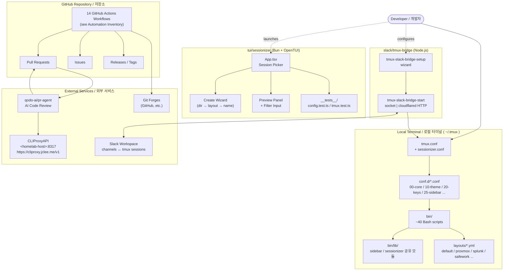

# TMUX SESSIONIZER / tmux 세션나이저


[](../../actions/workflows/ci.yml)
[](../../actions/workflows/01_branch-to-pr.yml)
[](../../actions/workflows/02_issue-to-branch.yml)
[](../../actions/workflows/10_pr-review.yml)
[](../../actions/workflows/11_security-pr-review.yml)
[](../../actions/workflows/12_dependabot-auto-merge.yml)
[](../../actions/workflows/13_pr-auto-merge.yml)
[](../../actions/workflows/14_bot-auto-fix.yml)
[](../../actions/workflows/15_merged-pr-cleanup.yml)
[](../../actions/workflows/19_issue-backfill.yml)
[](../../actions/workflows/24_release-notes.yml)
[](../../actions/workflows/25_release-publish.yml)
[](../../actions/workflows/29_downstream-health-check.yml)
[](../../actions/workflows/37_ci-failure-issues.yml)

> **A Bash-first tmux configuration and session-management toolkit, symlinked as `~/.tmux`.**
> **Bash 중심의 tmux 설정 및 세션 관리 도구 모음으로, `~/.tmux`로 심볼릭 링크하여 사용합니다.**

---

## Table of Contents / 목차

- [Overview / 개요](#overview--개요)
- [Features / 주요 기능](#features--주요-기능)
- [Repository Structure / 저장소 구조](#repository-structure--저장소-구조)
- [Architecture / 아키텍처](#architecture--아키텍처)
- [Automation Inventory / 자동화 인벤토리](#automation-inventory--자동화-인벤토리)
- [Quick Start / 빠른 시작](#quick-start--빠른-시작)
- [Local Development / 로컬 개발](#local-development--로컬-개발)
- [Commands Reference / 명령어 레퍼런스](#commands-reference--명령어-레퍼런스)
- [Contribution Guide / 기여 가이드](#contribution-guide--기여-가이드)
- [License / 라이선스](#license--라이선스)

---

## Overview / 개요

**EN —** `tmux-sessionizer` is a self-contained, Bash-first tmux configuration repo. The root `tmux.conf` is intended to be symlinked to `~/.tmux.conf` (or sourced directly), exposing a curated library of session-management scripts under `bin/` and reusable YAML layout templates under `layouts/`. Two first-class companion projects live in sub-trees: a Bun + OpenTUI session picker (`tui/sessionizer`) and a Node.js Slack ↔ tmux bridge (`slack/tmux-bridge`). Repository automation is driven by 14 GitHub Actions workflows that handle PR lifecycle, security review, releases, and downstream health monitoring.

**KR —** `tmux-sessionizer`는 자체 완결형의 Bash 우선 tmux 설정 저장소입니다. 최상위 `tmux.conf`는 `~/.tmux.conf`로 심볼릭 링크하여 사용하며, `bin/` 하위의 세션 관리 스크립트 모음과 `layouts/`의 재사용 가능한 YAML 레이아웃 템플릿을 제공합니다. 두 개의 자매 프로젝트가 하위 트리에 포함되어 있습니다: Bun + OpenTUI 기반의 세션 피커(`tui/sessionizer`)와 Node.js 기반의 Slack ↔ tmux 브리지(`slack/tmux-bridge`)입니다. 저장소 자동화는 14개의 GitHub Actions 워크플로우로 구성되어 PR 라이프사이클, 보안 리뷰, 릴리스, 다운스트림 상태 모니터링을 처리합니다.

---

## Features / 주요 기능

### Session Management / 세션 관리

- **EN —** `tmux-sessionizer` discovers git repos / directories via `SCAN_DIR` + `EXTRA_DIRS` and creates or attaches sessions with one keystroke.
- **KR —** `tmux-sessionizer`는 `SCAN_DIR`과 `EXTRA_DIRS`로 git 저장소/디렉터리를 탐지하고, 한 번의 키 입력으로 세션을 생성하거나 연결합니다.

### Tree Sidebar / 트리 사이드바

- **EN —** A persistent left-side tree (`tmux-sidebar`) lists sessions, windows, and panes with color-coded status, toggleable on demand.
- **KR —** 좌측에 고정되는 트리(`tmux-sidebar`)가 세션·윈도우·패널을 색상 코딩된 상태로 표시하며, 필요 시 즉시 토글됩니다.

### Layout Templates / 레이아웃 템플릿

- **EN —** `layouts/*.yml` define preset window/pane arrangements; `tmux-template-create` and `tmux-layout-apply` apply them, and `tmux-session-export` captures live sessions back to YAML.
- **KR —** `layouts/*.yml`로 사전 정의된 윈도우/패널 배치를 `tmux-template-create`와 `tmux-layout-apply`로 적용하고, `tmux-session-export`로 현재 세션을 YAML로 역추출할 수 있습니다.

### TUI Session Picker / TUI 세션 피커

- **EN —** `tui/sessionizer` is a Bun + OpenTUI replacement for the classic fzf flow, featuring a 3-step creation wizard, preview panel, and rename/kill dialogs.
- **KR —** `tui/sessionizer`는 Bun + OpenTUI 기반의 fzf 대체제로, 3단계 생성 위저드, 미리보기 패널, 이름 변경/종료 다이얼로그를 제공합니다.

### Slack Bridge / Slack 브리지

- **EN —** `slack/tmux-bridge` keeps Slack channels and tmux sessions in sync, with dual startup modes (direct socket / HTTP via cloudflared).
- **KR —** `slack/tmux-bridge`는 Slack 채널과 tmux 세션을 동기화하며, 소켓 직접 / HTTP (cloudflared) 듀얼 시작 모드를 지원합니다.

### Statusline & Diagnostics / 상태표시줄 & 진단

- **EN —** Width-tiered responsive statusbar (`tmux-responsive`), per-session git state (`tmux-git-status`, `tmux-git-uncommitted`), and CPU/MEM gauges (`tmux-sys-stats`).
- **KR —** 폭 등급별 반응형 상태표시줄(`tmux-responsive`), 세션별 git 상태(`tmux-git-status`, `tmux-git-uncommitted`), CPU/MEM 게이지(`tmux-sys-stats`)를 제공합니다.

### Pane Interactions / 패널 상호작용

- **EN —** URL & file path extraction (`tmux-url-open`, `tmux-file-open`), smart word copy, SSH config picker, clipboard ring browser, synchronize-panes toggle.
- **KR —** URL 및 파일 경로 추출(`tmux-url-open`, `tmux-file-open`), 스마트 단어 복사, SSH 설정 피커, 클립보드 링 브라우저, 패널 동기화 토글을 지원합니다.

### GitHub Automation / GitHub 자동화

- **EN —** 14 GitHub Actions workflows cover PR review, security review, auto-merge, auto-fix, release notes/publish, and CI failure routing.
- **KR —** 14개의 GitHub Actions 워크플로우가 PR 리뷰, 보안 리뷰, 자동 병합, 자동 수정, 릴리스 노트/게시, CI 실패 라우팅을 처리합니다.

---

## Repository Structure / 저장소 구조

```text
.
├── AGENTS.md                        # Project knowledge base (generated)
├── CONTRIBUTING.md                  # Contribution guidelines
├── LICENSE                          # MIT license
├── OWNERS                           # CODEOWNERS
├── README.md                        # This file
├── sessionizer.conf                 # SCAN_DIR + EXTRA_DIRS for session discovery
├── tmux.conf                        # Root tmux loader
│
├── bin/                             # Bash execution surface (~40 scripts)
│   ├── lib/                         # Shared library modules
│   │   ├── sidebar-colors
│   │   ├── sidebar-render
│   │   ├── tmux-sessionizer-common
│   │   └── tmux-sessionizer-wizard
│   ├── tmux-auto-attach
│   ├── tmux-bash-preexec
│   ├── tmux-cheatsheet
│   ├── tmux-clipboard-history
│   ├── tmux-command-palette
│   ├── tmux-config-reload
│   ├── tmux-copy-word
│   ├── tmux-file-open
│   ├── tmux-git-status
│   ├── tmux-git-uncommitted
│   ├── tmux-layout-apply
│   ├── tmux-notify-long-command
│   ├── tmux-opencode
│   ├── tmux-pane-sync
│   ├── tmux-responsive
│   ├── tmux-session-branch-log
│   ├── tmux-session-cycle
│   ├── tmux-session-dashboard
│   ├── tmux-session-export
│   ├── tmux-session-icon
│   ├── tmux-session-jump
│   ├── tmux-session-kill
│   ├── tmux-session-order
│   ├── tmux-session-rename
│   ├── tmux-session-sync
│   ├── tmux-sessionizer
│   ├── tmux-sessionizer-tui
│   ├── tmux-sidebar
│   ├── tmux-sidebar-init
│   ├── tmux-sidebar-toggle
│   ├── tmux-slack-bridge-setup
│   ├── tmux-slack-bridge-start
│   ├── tmux-ssh-picker
│   ├── tmux-sys-stats
│   ├── tmux-template-create
│   ├── tmux-url-open
│   └── tmux-web-terminal
│
├── layouts/                         # YAML layout presets
│   ├── blacklist.yml
│   ├── default.yml
│   ├── proxmox.yml
│   ├── resume.yml
│   ├── safework.yml
│   ├── safework2.yml
│   └── splunk.yml
│
├── tui/
│   └── sessionizer/                 # Bun + OpenTUI session picker
│       ├── AGENTS.md
│       ├── bun.lock
│       ├── bunfig.toml
│       ├── package.json
│       ├── tsconfig.json
│       ├── __tests__/
│       │   ├── config.test.ts
│       │   └── tmux.test.ts
│       └── src/
│           ├── App.tsx
│           ├── bun-env.d.ts
│           ├── index.tsx
│           ├── actions/
│           │   └── session-actions.ts
│           ├── components/
│           │   ├── create-wizard.tsx
│           │   ├── filter-input.tsx
│           │   ├── kill-confirm-dialog.tsx
│           │   ├── preview-panel.tsx
│           │   ├── rename-dialog.tsx
│           │   ├── session-list.tsx
│           │   ├── wizard-step-dir.tsx
│           │   ├── wizard-step-layout.tsx
│           │   └── wizard-step-name.tsx
│           ├── hooks/
│           │   └── use-keyboard-handler.ts
│           └── lib/
│               ├── config.ts
│               ├── create-session.ts
│               ├── dirs.ts
│               ├── state.ts
│               ├── theme.ts
│               └── tmux.ts
│
├── docs/
│   ├── session-persistence-brainstorming.md
│   └── supermemory-governance.md
│
└── slack/
    └── tmux-bridge/                 # Node.js Slack ↔ tmux bridge
        └── AGENTS.md
```

> **EN —** The `AGENTS.md` files are generated knowledge bases consumed by automation; they are the source of truth for component behavior and are regenerated by CI.
>
> **KR —** `AGENTS.md` 파일들은 자동화가 소비하는 생성형 지식 베이스로, 컴포넌트 동작의 진실 공급원이며 CI에서 재생성됩니다.

---

## Architecture / 아키텍처



> **EN —** The diagram uses placeholder hostnames (`<homelab-host>`) and the public `https://cliproxy.jclee.me/v1` endpoint for the local LLM gateway; no RFC1918 IPs or container numbers are embedded.
>
> **KR —** 다이어그램은 로컬 LLM 게이트웨이를 표현할 때 플레이스홀더 호스트명(`<homelab-host>`)과 공인 엔드포인트 `https://cliproxy.jclee.me/v1`을 사용하며, 사설 IP 대역이나 컨테이너 번호는 포함하지 않습니다.

### Data Flow Summary / 데이터 흐름 요약

- **EN —** `tmux.conf` sources `conf.d/*.conf` (created at install) and exposes `bin/*` via `~/.tmux/bin`. The TUI is launched as `tmux-sessionizer-tui` and talks to the same `bin/lib/tmux-sessionizer-common` primitives. The Slack bridge runs out-of-band and POSTs tmux events to a Slack channel and vice versa.
- **KR —** `tmux.conf`는 `conf.d/*.conf`(설치 시 생성됨)를 소싱하여 `bin/*`를 `~/.tmux/bin`으로 노출합니다. TUI는 `tmux-sessionizer-tui`로 실행되며 동일한 `bin/lib/tmux-sessionizer-common` 프리미티브를 사용합니다. Slack 브리지는 독립적으로 실행되어 tmux 이벤트를 Slack 채널로, Slack 메시지를 tmux 세션으로 전달합니다.

---

## Automation Inventory / 자동화 인벤토리

### GitHub Actions Workflows / GitHub Actions 워크플로우 (14)

| # | Workflow File | Purpose / 목적 (EN) | 목적 (KR) |
|---|---------------|---------------------|-----------|
| 1 | `ci.yml` | Core CI: shellcheck, bun tests, bridge lint | 핵심 CI: shellcheck, bun 테스트, 브리지 린트 |
| 2 | `01_branch-to-pr.yml` | Auto-open a PR when a new branch is pushed | 새 브랜치 푸시 시 PR 자동 생성 |
| 3 | `02_issue-to-branch.yml` | Convert issues into working branches with checklists | 이슈를 체크리스트 포함 작업 브랜치로 변환 |
| 4 | `10_pr-review.yml` | AI PR review via qodo-ai/pr-agent + local LLM | qodo-ai/pr-agent + 로컬 LLM 기반 AI PR 리뷰 |
| 5 | `11_security-pr-review.yml` | Security-focused PR review (SAST/secret scan) | 보안 중심 PR 리뷰 (SAST/시크릿 스캔) |
| 6 | `12_dependabot-auto-merge.yml` | Auto-merge Dependabot patch updates | Dependabot 패치 업데이트 자동 병합 |
| 7 | `13_pr-auto-merge.yml` | Auto-merge PRs labeled `auto-merge` after CI | `auto-merge` 라벨 PR을 CI 통과 후 자동 병합 |
| 8 | `14_bot-auto-fix.yml` | Bot proposes fixes for simple review comments | 단순 리뷰 코멘트에 대한 봇 자동 수정 제안 |
| 9 | `15_merged-pr-cleanup.yml` | Delete merged feature branches | 병합된 기능 브랜치 정리 |
| 10 | `19_issue-backfill.yml` | Backfill issues from external trackers | 외부 트래커의 이슈 백필 |
| 11 | `24_release-notes.yml` | Aggregate changelog from PRs into release notes | PR들로부터 릴리스 노트 집계 |
| 12 | `25_release-publish.yml` | Tag and publish a GitHub Release | GitHub Release 태그 및 게시 |
| 13 | `29_downstream-health-check.yml` | Probe downstream services (Slack bridge, TUI) | 다운스트림 서비스 상태 점검 (Slack 브리지, TUI) |
| 14 | `37_ci-failure-issues.yml` | Open/find issues for recurring CI failures | 반복되는 CI 실패에 대한 이슈 생성/연결 |

### Go Automation Tools / Go 자동화 도구 (0)

> **EN —** This repository intentionally keeps the execution surface in Bash + Bun + Node.js; there are no Go-based automation tools. Use the `bin/` scripts for local automation and the workflows above for CI-side automation.
>
> **KR —** 본 저장소는 의도적으로 실행 계면을 Bash + Bun + Node.js로 유지하며, Go 기반 자동화 도구는 포함하지 않습니다. 로컬 자동화는 `bin/` 스크립트를, CI 자동화는 위 워크플로우를 사용하십시오.

### External Services / 외부 서비스

- **qodo-ai/pr-agent** — AI code review, invoked by `10_pr-review.yml` and `11_security-pr-review.yml`, routed through the local LLM gateway (`<homelab-host>:8317` / public `https://cliproxy.jclee.me/v1`).
- **Slack Workspace** — Two-way tmux ↔ channel bridge via `slack/tmux-bridge` (see `bot.jclee.me`).
- **Public endpoint** — `https://cliproxy.jclee.me/v1` (CLIProxyAPI reverse-proxied through Cloudflare).

---

## Quick Start / 빠른 시작

### Prerequisites / 사전 요구사항

- **EN —** `tmux` 1.9 or newer, `bash` 4+, `fzf`, `git`, and (optionally) `nerd-fonts` for icons. For the TUI, install [Bun](https://bun.sh) 1.x. For the Slack bridge, Node.js 20+ and `tsx`.
- **KR —** `tmux` 1.9 이상, `bash` 4 이상, `fzf`, `git`, 그리고 (선택) 아이콘용 `nerd-fonts`. TUI 사용 시 [Bun](https://bun.sh) 1.x를 설치하세요. Slack 브리지 사용 시 Node.js 20+와 `tsx`가 필요합니다.

### Install / 설치

```bash
# 1. Clone / 클론
git clone <repo-url> ~/projects/tmux-sessionizer
cd ~/projects/tmux-sessionizer

# 2. Symlink the root loader / 루트 로더 심볼릭 링크
ln -sfn "$(pwd)/tmux.conf" "$HOME/.tmux.conf"

# 3. Make bin/* executable / bin/* 실행 권한 부여
chmod +x bin/* bin/lib/*

# 4. Put bin/ on PATH (or rely on ~/.tmux.conf source order)
export PATH="$(pwd)/bin:$PATH"
```

### First Run / 첫 실행

```bash
# Launch tmux with the new config / 새 설정으로 tmux 실행
tmux new-session -A -s main \; source-file ~/.tmux.conf

# Inside tmux, prefix is C-a; press C-a + s to open the sidebar.
# tmux 내부에서 prefix는 C-a, C-a + s로 사이드바를 엽니다.

# Try the sessionizer / 세션나이저 실행
C-a + S          # fzf session picker / fzf 세션 피커
C-a + T          # OpenTUI sessionizer  / OpenTUI 세션 피커
```

---

## Local Development / 로컬 개발

### Bash Tools / Bash 도구

```bash
# Lint every Bash script in bin/ / bin/의 모든 Bash 스크립트 린트
find bin/ -type f -exec shellcheck -x {} \;

# Run a single script standalone / 단일 스크립트 단독 실행
TMUX= ./bin/tmux-session-dashboard
```

### TUI Sessionizer / TUI 세션나이저

```bash
cd tui/sessionizer
bun install
bun test                  # run config.test.ts and tmux.test.ts
bun run dev               # launch the TUI against your live tmux server
```

### Slack Bridge / Slack 브리지

```bash
cd slack/tmux-bridge
npm install
./../bin/tmux-slack-bridge-setup    # interactive setup wizard / 대화형 설정 마법사
./../bin/tmux-slack-bridge-start    # start the bridge in the foreground / 포그라운드로 브리지 시작
```

### Editing Layouts / 레이아웃 편집

```bash
# Edit a layout / 레이아웃 편집
$EDITOR layouts/default.yml

# Apply to current session / 현재 세션에 적용
tmux-layout-apply default

# Export current session back to YAML / 현재 세션을 YAML로 내보내기
tmux-session-export > layouts/mysession.yml
```

### Regenerating AGENTS.md / AGENTS.md 재생성

```bash
# The repo's knowledge base is auto-regenerated by the docs workflow
# 저장소의 지식 베이스는 docs 워크플로우에 의해 자동 재생성됩니다
# Manual trigger: open a PR — the 01_branch-to-pr.yml + AGENTS generator runs on every push
# 수동 트리거: PR을 열면 — 01_branch-to-pr.yml + AGENTS 생성기가 모든 푸시에서 실행됩니다
```

---

## Commands Reference / 명령어 레퍼런스

> **EN —** All scripts are designed to be invoked as `tmux-<name>` once `bin/` is on `PATH` (or symlinked into `~/.tmux/bin`).
>
> **KR —** 모든 스크립트는 `bin/`이 `PATH`에 있을 때(또는 `~/.tmux/bin`으로 심볼릭 링크된 경우) `tmux-<name>`으로 호출하도록 설계되었습니다.

### Session Lifecycle / 세션 라이프사이클

| Script | Description (EN) | 설명 (KR) |
|--------|------------------|-----------|
| `tmux-sessionizer` | fzf-driven session picker with creation wizard | fzf 기반 세션 피커 + 생성 마법사 |
| `tmux-sessionizer-tui` | Launches the Bun + OpenTUI sessionizer | Bun + OpenTUI 세션나이저 실행 |
| `tmux-session-cycle` | PgUp/PgDn session rotation (excludes `opencode`) | PgUp/PgDn 세션 회전 (`opencode` 제외) |
| `tmux-session-jump` | MRU-ordered fzf session picker | MRU 정렬 fzf 세션 피커 |
| `tmux-session-order` | Sorts sessions by most recently active | 최근 활성 순으로 세션 정렬 |
| `tmux-session-kill` | Safe session termination with confirmation | 확인 절차를 거친 안전한 세션 종료 |
| `tmux-session-rename` | Rename a session with validation | 검증 포함 세션 이름 변경 |
| `tmux-session-dashboard` | Formatted session table popup | 서식 있는 세션 테이블 팝업 |
| `tmux-session-icon` | Nerd Font icon mapper for sessions | 세션용 Nerd Font 아이콘 매퍼 |
| `tmux-session-branch-log` | Log session→branch on switch | 전환 시 세션→브랜치 로그 |
| `tmux-session-export` | Export session layout to YAML | 세션 레이아웃을 YAML로 내보내기 |
| `tmux-session-sync` | Sync tmux sessions with Slack channels | tmux 세션과 Slack 채널 동기화 |

### Sidebar / 사이드바

| Script | Description (EN) | 설명 (KR) |
|--------|------------------|-----------|
| `tmux-sidebar` | Tree sidebar display engine (68 LOC) | 트리 사이드바 디스플레이 엔진 (68 LOC) |
| `tmux-sidebar-init` | Sidebar initialization on session create | 세션 생성 시 사이드바 초기화 |
| `tmux-sidebar-toggle` | Toggle sidebar visibility | 사이드바 가시성 토글 |

### Layouts & Templates / 레이아웃 & 템플릿

| Script | Description (EN) | 설명 (KR) |
|--------|------------------|-----------|
| `tmux-template-create` | Quick-create session from preset template | 사전 설정 템플릿으로 빠른 세션 생성 |
| `tmux-layout-apply` | Apply YAML layout template to a session | YAML 레이아웃 템플릿을 세션에 적용 |

### Git Integration / Git 통합

| Script | Description (EN) | 설명 (KR) |
|--------|------------------|-----------|
| `tmux-git-status` | Git branch + dirty/ahead/behind/stash | 브랜치 + dirty/ahead/behind/stash |
| `tmux-git-uncommitted` | Track uncommitted changes per session | 세션별 미커밋 변경 추적 |

### Pane Interactions / 패널 상호작용

| Script | Description (EN) | 설명 (KR) |
|--------|------------------|-----------|
| `tmux-url-open` | URL extraction from pane via fzf | fzf로 패널에서 URL 추출 |
| `tmux-file-open` | File path extraction from pane via fzf | fzf로 패널에서 파일 경로 추출 |
| `tmux-copy-word` | Smart word copy under cursor | 커서 아래 단어 스마트 복사 |
| `tmux-pane-sync` | Synchronize-panes toggle | 패널 동기화 토글 |
| `tmux-ssh-picker` | SSH config host picker via fzf | fzf로 SSH 설정 호스트 피커 |
| `tmux-clipboard-history` | tmux buffer ring browser via fzf | fzf로 tmux 버퍼 링 브라우저 |
| `tmux-notify-long-command` | Desktop notification for long commands | 장기 실행 명령 데스크탑 알림 |
| `tmux-bash-preexec` | Sourceable shell preexec hook for command timing | 명령 시간 측정을 위한 소스 가능 preexec 훅 |

### Statusline & Diagnostics / 상태표시줄 & 진단

| Script | Description (EN) | 설명 (KR) |
|--------|------------------|-----------|
| `tmux-responsive` | Width-tiered statusbar rendering | 폭 등급별 상태표시줄 렌더링 |
| `tmux-sys-stats` | CPU load + MEM usage for status bar | 상태표시줄용 CPU 부하 + 메모리 사용량 |

### Config & Utility / 설정 & 유틸리티

| Script | Description (EN) | 설명 (KR) |
|--------|------------------|-----------|
| `tmux-config-reload` | Reload config with settings diff | 설정 차이점을 보여주며 설정 리로드 |
| `tmux-command-palette` | fzf action picker for common ops | 일반 작업용 fzf 액션 피커 |
| `tmux-cheatsheet` | Categorized keybinding reference popup | 분류된 키바인딩 참조 팝업 |
| `tmux-auto-attach` | Login shell auto-attach flow | 로그인 셸 자동 attach 흐름 |
| `tmux-opencode` | OpenCode session launcher | OpenCode 세션 런처 |
| `tmux-web-terminal` | ttyd web terminal launcher | ttyd 웹 터미널 런처 |

### Slack Bridge / Slack 브리지

| Script | Description (EN) | 설명 (KR) |
|--------|------------------|-----------|
| `tmux-slack-bridge-setup` | Interactive Slack app setup wizard | 대화형 Slack 앱 설정 마법사 |
| `tmux-slack-bridge-start` | Startup wrapper: socket direct / HTTP cloudflared + tsx exec | 시작 래퍼: 소켓 직접 / HTTP cloudflared + tsx 실행 |

---

## Contribution Guide / 기여 가이드

### EN

1. **Fork & branch** — Branch from `master` using a descriptive prefix (`feat/`, `fix/`, `docs/`, `chore/`).
2. **Local linting** — Run `shellcheck -x bin/*` and `bun test` in `tui/sessionizer/` before pushing.
3. **Open a PR** — `02_issue-to-branch.yml` and `01_branch-to-pr.yml` will help bootstrap issues, but a normal PR is fine.
4. **Review process** — `10_pr-review.yml` posts an AI review via `qodo-ai/pr-agent`; `11_security-pr-review.yml` flags security issues. Address both before requesting human review.
5. **Auto-merge** — Label your PR `auto-merge` (when safe) to let `13_pr-auto-merge.yml` handle the merge once CI is green.
6. **Cleanup** — `15_merged-pr-cleanup.yml` will delete the branch after merge; `37_ci-failure-issues.yml` will open an issue if CI flakes repeatedly.
7. **Releases** — `24_release-notes.yml` aggregates your changelog; `25_release-publish.yml` cuts the tag and GitHub Release.

### KR

1. **포크 & 브랜치** — `master`에서 의미 있는 접두사(`feat/`, `fix/`, `docs/`, `chore/`)로 브랜치를 생성하세요.
2. **로컬 린트** — 푸시 전에 `shellcheck -x bin/*`와 `tui/sessionizer/`에서 `bun test`를 실행하세요.
3. **PR 열기** — `02_issue-to-branch.yml`과 `01_branch-to-pr.yml`이 이슈 부트스트랩을 돕지만, 일반 PR도 괜찮습니다.
4. **리뷰 프로세스** — `10_pr-review.yml`이 `qodo-ai/pr-agent`를 통해 AI 리뷰를 게시하고, `11_security-pr-review.yml`이 보안 이슈를 표시합니다. 휴먼 리뷰를 요청하기 전에 두 가지를 모두 처리하세요.
5. **자동 병합** — (안전하다고 판단되면) PR에 `auto-merge` 라벨을 붙여 CI가 그린이면 `13_pr-auto-merge.yml`이 병합을 처리하게 하세요.
6. **정리** — `15_merged-pr-cleanup.yml`이 병합 후 브랜치를 삭제하고, `37_ci-failure-issues.yml`이 CI가 반복 실패하면 이슈를 엽니다.
7. **릴리스** — `24_release-notes.yml`이 변경 로그를 집계하고, `25_release-publish.yml`이 태그와 GitHub Release를 생성합니다.

### Coding Standards / 코딩 표준

- **EN —** All Bash scripts must pass `shellcheck -x` and use `set -euo pipefail` at the top. New TUI components belong in `tui/sessionizer/src/components/` and should ship with a test in `__tests__/`.
- **KR —** 모든 Bash 스크립트는 `shellcheck -x`를 통과해야 하며 상단에 `set -euo pipefail`을 사용해야 합니다. 새 TUI 컴포넌트는 `tui/sessionizer/src/components/`에 추가하고 `__tests__/`에 테스트를 함께 제공해야 합니다.

---

## License / 라이선스

**EN —** This project is released under the MIT License. See [LICENSE](LICENSE) for full text.
**KR —** 본 프로젝트는 MIT 라이선스 하에 배포됩니다. 전문은 [LICENSE](LICENSE)를 참조하세요.

## Acknowledgments / 감사의 말

**EN —** Built on the shoulders of [`tmux`](https://github.com/tmux/tmux), [`fzf`](https://github.com/junegunn/fzf), [`qodo-ai/pr-agent`](https://github.com/qodo-ai/pr-agent), [Bun](https://bun.sh), and OpenTUI. The local LLM gateway is provided by CLIProxyAPI at `https://cliproxy.jclee.me/v1`.
**KR —** [`tmux`](https://github.com/tmux/tmux), [`fzf`](https://github.com/junegunn/fzf), [`qodo-ai/pr-agent`](https://github.com/qodo-ai/pr-agent), [Bun](https://bun.sh), OpenTUI의 도움을 받아 구축되었습니다. 로컬 LLM 게이트웨이는 `https://cliproxy.jclee.me/v1`의 CLIProxyAPI를 통해 제공됩니다.