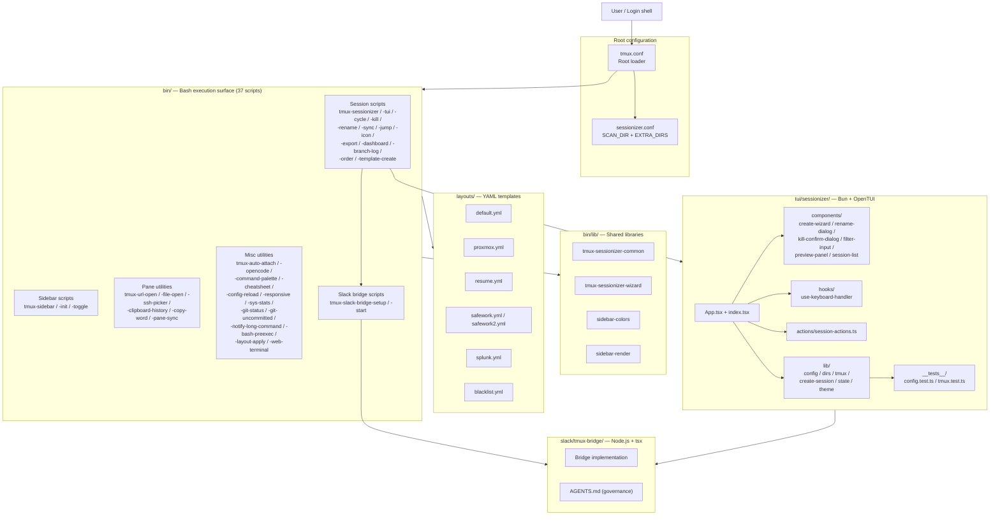

# TMUX SESSIONIZER


[](../../actions/workflows/ci.yml)
[](../../actions/workflows/10_pr-review.yml)
[](../../actions/workflows/11_security-pr-review.yml)
[](../../actions/workflows/13_pr-auto-merge.yml)
[](../../actions/workflows/60_ci-auto-heal.yml)
[](../../actions/workflows/25_release-publish.yml)

> **Bash-first tmux configuration and session-management toolkit.**
> Bash 중심의 tmux 설정 및 세션 관리 도구 모음입니다.

---

## Table of Contents

- [Overview](#overview)
- [Features](#features)
- [Architecture](#architecture)
- [Automation Inventory](#automation-inventory)
- [Quick Start](#quick-start)
- [Local Development](#local-development)
- [Commands Reference](#commands-reference)
- [Contribution Guide](#contribution-guide)
- [License](#license)
- [개요](#개요)
- [주요 기능](#주요-기능)
- [아키텍처](#아키텍처-1)
- [자동화 인벤토리](#자동화-인벤토리-1)
- [빠른 시작](#빠른-시작)
- [로컬 개발](#로컬-개발-1)
- [명령어 참고](#명령어-참고-1)
- [기여 가이드](#기여-가이드-1)
- [라이선스](#라이선스)

---

## Overview

`TMUX SESSIONIZER` is a developer-focused tmux environment for quickly discovering projects, creating named tmux sessions, applying repeatable window/pane layouts, and managing daily terminal workflows from small Bash utilities. It is designed to be installed (or symlinked) as the user's `~/.tmux` directory and is intentionally **shell-first**: every runtime behaviour is implemented as a tmux-aware Bash command, with a nested Bun/OpenTUI session picker for richer interaction and an optional Node.js Slack bridge for remote control.

The repository ships:

- A root tmux configuration loader at `tmux.conf` and a session-discovery config at `sessionizer.conf`.
- **37 executable helper scripts** in `bin/` covering sessions, sidebar, layout templates, status, SSH, clipboard, and Slack bridge startup.
- **4 shared Bash libraries** in `bin/lib/` for sessionizer, wizard, and sidebar rendering.
- **8 reusable YAML layout templates** in `layouts/` (default, proxmox, resume, safework, safework2, splunk, blacklist).
- A **Bun/TypeScript TUI** in `tui/sessionizer/` built on OpenTUI.
- **Slack bridge scaffolding** under `slack/tmux-bridge/` (Node.js + tsx).
- Documentation, brainstorming notes, and project governance files in `docs/` and at the repo root.

---

## Features

### Session management

- **fzf-backed session picker** (`tmux-sessionizer`) with project discovery via `SCAN_DIR` and `EXTRA_DIRS`.
- **TUI sessionizer** (`tmux-sessionizer-tui`) — OpenTUI based picker with wizard, rename, kill confirmation, and live preview.
- **MRU session jump** (`tmux-session-jump`) for fastest recent-session access.
- **Session cycle** (`tmux-session-cycle`) — PgUp/PgDn rotation with optional `opencode` exclusion.
- **Session rename, kill, order, dashboard, export** — full session lifecycle from the keyboard.
- **Template-driven creation** (`tmux-template-create`) — apply preset layouts in one step.
- **Per-session icon mapping** (`tmux-session-icon`) with Nerd Font glyphs.
- **Session → branch log** (`tmux-session-branch-log`) for analytics and audit.

### Layout engine

- **YAML layout templates** in `layouts/` (default, proxmox, resume, safework, safework2, splunk, blacklist).
- **Apply layouts on demand** (`tmux-layout-apply`) with pane/window definitions in pure YAML.
- **Export current session** (`tmux-session-export`) back to YAML.
- **Sync tmux sessions with Slack channels** (`tmux-session-sync`) for remote mirroring.

### Sidebar & status

- **Tree-style sidebar** (`tmux-sidebar`, `tmux-sidebar-init`, `tmux-sidebar-toggle`) with a shared rendering engine in `bin/lib/sidebar-render` and color palette in `bin/lib/sidebar-colors`.
- **Width-tiered responsive statusbar** (`tmux-responsive`) for narrow/wide terminals.
- **System stats** (`tmux-sys-stats`) — CPU load + memory usage.
- **Git status indicators** (`tmux-git-status`, `tmux-git-uncommitted`).

### Pane utilities

- **URL and file extraction** from pane content via fzf (`tmux-url-open`, `tmux-file-open`).
- **SSH config host picker** (`tmux-ssh-picker`).
- **Clipboard history** ring browser (`tmux-clipboard-history`).
- **Smart word copy** under cursor (`tmux-copy-word`).
- **Synchronize-panes toggle** (`tmux-pane-sync`).

### Workflow utilities

- **Command palette** (`tmux-command-palette`) — fzf-driven action menu.
- **Long-running command notifications** (`tmux-notify-long-command`).
- **Bash preexec hook** (`tmux-bash-preexec`) for command timing.
- **Config reload with diff** (`tmux-config-reload`).
- **Cheatsheet popup** (`tmux-cheatsheet`) — categorized keybinding reference.
- **Auto-attach on login** (`tmux-auto-attach`).
- **OpenCode launcher** (`tmux-opencode`).
- **Web terminal launcher** (`tmux-web-terminal`) — ttyd integration.

### Slack bridge (optional)

- **Setup wizard** (`tmux-slack-bridge-setup`) — interactive Slack app OAuth/credential onboarding.
- **Bridge starter** (`tmux-slack-bridge-start`) — supports both direct-socket and HTTP (cloudflared) modes.
- **Full bridge implementation** under `slack/tmux-bridge/` (Node.js + tsx).

---

## Architecture

The system is organised as a layered toolkit: a root tmux config loads Bash scripts and shared libraries, which in turn call into layout templates or launch the OpenTUI/Node.js subprojects.



**Layer summary**

| Layer | Path | Role |
| --- | --- | --- |
| Root config | `tmux.conf`, `sessionizer.conf` | tmux entry point and discovery config |
| Execution surface | `bin/` | 37 tmux-aware Bash entry points |
| Shared libraries | `bin/lib/` | Reusable functions and rendering engines |
| Layout templates | `layouts/*.yml` | Declarative window/pane definitions |
| TUI | `tui/sessionizer/` | Bun/TypeScript + OpenTUI session picker |
| Bridge | `slack/tmux-bridge/` | Node.js Slack socket bridge |
| Governance | `AGENTS.md`, `OWNERS`, `CONTRIBUTING.md` | Knowledge base and contribution policy |
| Docs | `docs/` | Brainstorming and governance notes |

---

## Automation Inventory

This repository ships **16 GitHub Actions workflows** (no Go-based automation tools). All are listed below with their real on-disk names and responsibilities.

### Workflows (16)

| # | File | Purpose |
| --- | --- | --- |
| 1 | `ci.yml` | Primary CI — shellcheck, actionlint, lint, TUI build/test. |
| 2 | `01_branch-to-pr.yml` | Convert a pushed branch into a draft pull request automatically. |
| 3 | `02_issue-to-branch.yml` | Create a working branch (and optionally PR) from an issue label/command. |
| 4 | `10_pr-review.yml` | Automated PR review powered by [qodo-ai/pr-agent](https://github.com/qodo-ai/pr-agent). |
| 5 | `11_security-pr-review.yml` | Security-focused PR review pass on pull requests. |
| 6 | `12_dependabot-auto-merge.yml` | Auto-merge Dependabot PRs once checks pass. |
| 7 | `13_pr-auto-merge.yml` | Auto-merge approved PRs (squash / rebase policy). |
| 8 | `14_bot-auto-fix.yml` | Bot-driven auto-fix commits in response to review comments. |
| 9 | `15_merged-pr-cleanup.yml` | Post-merge branch / remote cleanup. |
| 10 | `19_issue-backfill.yml` | Backfill missing metadata on issues (labels, projects, assignees). |
| 11 | `24_release-notes.yml` | Generate release notes from merged PRs and issues. |
| 12 | `25_release-publish.yml` | Publish the release (tag, GitHub Release, artefacts). |
| 13 | `29_downstream-health-check.yml` | Probe downstream consumers / homelab endpoints (uses the public [cliproxy.jclee.me](https://cliproxy.jclee.me/v1) gateway). |
| 14 | `37_ci-failure-issues.yml` | File an issue automatically when CI fails on `master`. |
| 15 | `60_ci-auto-heal.yml` | Self-heal flaky CI by retrying / patching known transient failures. |
| 16 | `91_issue-classification.yml` | Triage new issues into labels and assignees. |

### Go automation tools

None. The automation surface is **GitHub Actions only**; no `cmd/` Go binaries are checked into this repository.

### External services used by workflows

- **PR review**: [qodo-ai/pr-agent](https://github.com/qodo-ai/pr-agent) (no other AI tooling vendors are linked from this repo).
- **Public gateway**: [`https://cliproxy.jclee.me/v1`](https://cliproxy.jclee.me/v1) — used by `29_downstream-health-check.yml` to verify downstream reachability. Internal homelab endpoints are referenced by placeholders such as `<homelab-host>` and `<homelab-elk>` only; no RFC1918 addresses are hardcoded.
- **Bot surface**: [`https://bot.jclee.me`](https://bot.jclee.me) (declared in `OWNERS` / `AGENTS.md` as the bot entrypoint).

---

## Quick Start

### 1. Prerequisites

- **tmux 1.9+** (3.0+ recommended for styling)
- **Bash 4+** (5+ recommended)
- **fzf** for all picker-based helpers
- **git**, **ssh**, **yq** (or `python3 -c "import yaml"`) for YAML layouts
- Optional: **bun** (for the TUI), **node 20+** (for the Slack bridge), **ttyd** (for the web terminal)

### 2. Install

```bash
# Clone to a stable location
git clone <your-fork-or-mirror-url> ~/.tmux
cd ~/.tmux

# Symlink the root config so tmux picks it up automatically
ln -sf ~/.tmux/tmux.conf ~/.tmux.conf

# Make all helpers executable (idempotent)
chmod +x bin/* bin/lib/*

# Verify
tmux -V
which fzf
```

### 3. First session

```bash
# Open tmux
tmux

# Inside tmux, press Prefix (default: C-a) then:
#   s — open the sessionizer (fzf picker)
#   T — open the TUI sessionizer
#   S — toggle the sidebar
#   ? — open the cheatsheet popup
```

### 4. Configure session discovery

Edit `sessionizer.conf` to point `SCAN_DIR` and `EXTRA_DIRS` at your project roots:

```yaml
SCAN_DIR: "$HOME/code"
EXTRA_DIRS:
  - "$HOME/work"
  - "$HOME/sandbox"
```

Reload without restarting tmux: `prefix + R` (handled by `tmux-config-reload`).

---

## Local Development

### Layout

```
.
├── tmux.conf                 # Root loader
├── sessionizer.conf          # SCAN_DIR + EXTRA_DIRS
├── bin/                      # 37 Bash helper scripts
│   └── lib/                  # 4 shared Bash libraries
├── layouts/                  # 8 YAML layout templates
├── tui/
│   └── sessionizer/          # Bun/TypeScript OpenTUI app
│       ├── src/
│       │   ├── App.tsx
│       │   ├── index.tsx
│       │   ├── components/   # wizard, dialogs, list, preview
│       │   ├── hooks/        # use-keyboard-handler
│       │   ├── actions/      # session-actions
│       │   └── lib/          # config, dirs, tmux, state, theme
│       ├── __tests__/        # bun test suites
│       ├── AGENTS.md         # TUI-specific knowledge base
│       ├── package.json
│       ├── tsconfig.json
│       └── bunfig.toml
├── slack/
│   └── tmux-bridge/          # Node.js + tsx Slack bridge
│       └── AGENTS.md
├── docs/                     # brainstorming + governance
├── AGENTS.md                 # Project knowledge base
├── CONTRIBUTING.md
├── LICENSE
├── OWNERS
├── sessionizer.conf
└── tmux.conf
```

### TUI development

```bash
cd tui/sessionizer
bun install
bun run dev          # watch mode
bun test             # runs __tests__/*.test.ts
bun run build        # production bundle
```

The TUI shells out to `bin/tmux-sessionizer` and friends via `lib/tmux.ts`, so any change to a Bash helper is reflected the next time the TUI process is launched.

### Slack bridge development

```bash
cd slack/tmux-bridge
npm install
npm run dev          # tsx watch
# Setup wizard: ../../bin/tmux-slack-bridge-setup
# Start wrapper: ../../bin/tmux-slack-bridge-start
```

### Linting and CI parity

```bash
# ShellCheck all bash files
find bin -type f -exec shellcheck {} \;

# YAML validation for layouts
for f in layouts/*.yml; do yq eval . "$f" >/dev/null; done

# Actionlint for workflows
actionlint

# TUI
cd tui/sessionizer && bun test
```

---

## Commands Reference

All commands live under `bin/` and are designed to be invoked from a tmux keybinding (or directly from the shell). They are grouped by surface below.

### Sessions

| Command | Description |
| --- | --- |
| `tmux-sessionizer` | fzf-backed session picker + creation wizard. |
| `tmux-sessionizer-tui` | Launch the OpenTUI sessionizer. |
| `tmux-session-cycle` | PgUp/PgDn session rotation (optionally excluding `opencode`). |
| `tmux-session-kill` | Safe session termination with confirmation. |
| `tmux-session-rename` | Rename the current session with validation. |
| `tmux-session-sync` | Mirror tmux sessions to Slack channels. |
| `tmux-session-jump` | MRU fzf session picker. |
| `tmux-session-icon` | Map Nerd Font icons to sessions. |
| `tmux-session-export` | Export current session layout to YAML. |
| `tmux-session-dashboard` | Formatted session table popup. |
| `tmux-session-branch-log` | Log session → branch on switch. |
| `tmux-session-order` | Sort sessions by most recently active. |
| `tmux-template-create` | Quick-create a session from a preset template. |

### Sidebar

| Command | Description |
| --- | --- |
| `tmux-sidebar` | Tree sidebar display engine. |
| `tmux-sidebar-init` | Initialise the sidebar on session create. |
| `tmux-sidebar-toggle` | Toggle sidebar visibility. |

### Pane utilities

| Command | Description |
| --- | --- |
| `tmux-url-open` | Extract URLs from the current pane via fzf. |
| `tmux-file-open` | Extract file paths from the current pane via fzf. |
| `tmux-ssh-picker` | Pick an SSH host from `~/.ssh/config` via fzf. |
| `tmux-clipboard-history` | Browse the tmux buffer ring via fzf. |
| `tmux-copy-word` | Smart word copy under the cursor. |
| `tmux-pane-sync` | Toggle `synchronize-panes`. |

### Layouts

| Command | Description |
| --- | --- |
| `tmux-layout-apply` | Apply a YAML layout template to the current session. |

### Status & shell

| Command | Description |
| --- | --- |
| `tmux-responsive` | Width-tiered statusbar rendering. |
| `tmux-sys-stats` | CPU load + memory usage for the status bar. |
| `tmux-git-status` | Git branch + dirty/ahead/behind/stash status. |
| `tmux-git-uncommitted` | Track uncommitted changes per session. |
| `tmux-bash-preexec` | Sourceable shell preexec hook for command timing. |
| `tmux-notify-long-command` | Desktop notification for long-running commands. |
| `tmux-config-reload` | Reload config and show a settings diff. |
| `tmux-cheatsheet` | Categorised keybinding reference popup. |
| `tmux-command-palette` | fzf action picker for common operations. |
| `tmux-auto-attach` | Login-shell auto-attach flow. |
| `tmux-opencode` | OpenCode session launcher. |
| `tmux-web-terminal` | ttyd web terminal launcher. |

### Slack bridge

| Command | Description |
| --- | --- |
| `tmux-slack-bridge-setup` | Interactive Slack app setup wizard. |
| `tmux-slack-bridge-start` | Start the bridge (direct-socket or HTTP / cloudflared mode). |

---

## Contribution Guide

Contributions of all sizes are welcome — bug fixes, new layout templates, additional bin/ helpers, TUI components, and workflow improvements. Please read `CONTRIBUTING.md` and `AGENTS.md` (the project knowledge base) before opening a pull request.

### Coding conventions

- **Bash**: shellcheck-clean, `set -euo pipefail`, prefer POSIX-ish Bash 4+. Use `bin/lib/` for shared functions rather than copy/paste.
- **TypeScript (TUI)**: bun, strict TS, OpenTUI components, tests via `bun test` under `tui/sessionizer/__tests__/`.
- **Node.js (bridge)**: tsx for dev, plain Node for production, JSDoc on public exports.
- **YAML layouts**: include a header comment describing windows, panes, and any required environment variables.
- **Workflows**: numeric-prefix naming (`NN_name.yml`), actionlint-clean, and add a row to the workflow table in this README.

### Pull request flow

1. **Branch** from `master` using a descriptive name (the bot can create one from an issue via `02_issue-to-branch.yml`).
2. **Push** your branch — `01_branch-to-pr.yml` will open a draft PR for you.
3. **Wait for review** — `10_pr-review.yml` and `11_security-pr-review.yml` post automated feedback via [qodo-ai/pr-agent](https://github.com/qodo-ai/pr-agent).
4. **Apply fixes** — `14_bot-auto-fix.yml` may push automated patches.
5. **Approve & merge** — once checks pass and reviews are in, `13_pr-auto-merge.yml` handles the squash.
6. **Cleanup** — `15_merged-pr-cleanup.yml` removes the merged branch.

### Issue triage

- `91_issue-classification.yml` will label and assign new issues automatically.
- `37_ci-failure-issues.yml` opens an issue if CI fails on `master`; please link it in any related PR.
- For long-term ideas, please use the brainstorming notes in `docs/session-persistence-brainstorming.md` as inspiration.

### Governance

- Code ownership is recorded in `OWNERS`.
- Cross-project knowledge (homelab endpoints, bot conventions, AI tooling) is documented in `AGENTS.md`.
- Use placeholders like `<homelab-host>` and `<homelab-elk>` for any internal hostnames — never commit RFC1918 IPs.
- The public AI gateway is [`https://cliproxy.jclee.me/v1`](https://cliproxy.jclee.me/v1); the bot entrypoint is [`https://bot.jclee.me`](https://bot.jclee.me).

---

## License

Released under the [MIT License](LICENSE). © The TMUX SESSIONIZER contributors.

---

# 한국어 (Korean)

## 개요

`TMUX SESSIONIZER`는 프로젝트를 빠르게 탐색하고, 이름 있는 tmux 세션을 생성하며, 재현 가능한 윈도우/페인 레이아웃을 적용하고, 작은 Bash 유틸리티만으로 일상적인 터미널 워크플로를 관리할 수 있도록 설계된 **개발자 중심의 tmux 환경**입니다. 사용자의 `~/.tmux` 디렉터리로 설치(또는 심볼릭 링크)하는 것을 전제로 하며, 의도적으로 **셸 우선(shell-first)** 구조를 채택합니다. 모든 런타임 동작은 tmux 인지 Bash 명령으로 구현되어 있고, 보다 풍부한 상호작용이 필요한 부분은 Bun/OpenTUI 기반의 TUI 세션 선택기와, 선택형 Node.js Slack 브리지로 보완됩니다.

이 저장소는 다음을 제공합니다.

- 루트 tmux 설정 로더인 `tmux.conf`와 세션 탐색 설정인 `sessionizer.conf`.
- 세션, 사이드바, 레이아웃 템플릿, 상태 표시줄, SSH, 클립보드, Slack 브리지 시작을 다루는 **`bin/`의 실행형 헬퍼 스크립트 37개**.
- 세션나이저, 마법사, 사이드바 렌더링을 위한 **공유 Bash 라이브러리 4개**(`bin/lib/`).
- **재사용 가능한 YAML 레이아웃 템플릿 8개**(`layouts/`: default, proxmox, resume, safework, safework2, splunk, blacklist).
- OpenTUI 기반의 **Bun/TypeScript TUI**(`tui/sessionizer/`).
- **Slack 브리지 스캐폴딩**(`slack/tmux-bridge/`, Node.js + tsx).
- `docs/` 및 저장소 루트의 문서/거버넌스 파일.

## 주요 기능

### 세션 관리

- `SCAN_DIR`, `EXTRA_DIRS`로 프로젝트를 발견하는 **fzf 기반 세션 선택기**(`tmux-sessionizer`).
- 마법사, 이름 변경, 종료 확인, 실시간 미리보기가 가능한 **OpenTUI 기반 TUI 세션나이저**(`tmux-sessionizer-tui`).
- 가장 최근 세션에 빠르게 접근하는 **MRU 세션 점프**(`tmux-session-jump`).
- `opencode` 세션을 제외할 수 있는 **PgUp/PgDn 세션 순환**(`tmux-session-cycle`).
- 키보드만으로 세션의 전체 라이프사이클을 관리 — 이름 변경, 종료, 정렬, 대시보드, 내보내기, 템플릿 생성, 아이콘 매핑, 세션-브랜치 로그.
- 한 번에 사전 정의된 레이아웃을 적용하는 **템플릿 기반 생성**(`tmux-template-create`).
- Nerd Font 글리프를 사용하는 **세션별 아이콘 매핑**(`tmux-session-icon`).
- 분석과 감사를 위한 **세션 → 브랜치 로그**(`tmux-session-branch-log`).
- tmux 세션을 Slack 채널에 미러링하는 **세션 동기화**(`tmux-session-sync`).

### 레이아웃 엔진

- `layouts/`의 **YAML 레이아웃 템플릿**(default, proxmox, resume, safework, safework2, splunk, blacklist).
- 요청 시 레이아웃을 적용하는 **`tmux-layout-apply`**.
- 현재 세션을 YAML로 내보내는 **`tmux-session-export`**.

### 사이드바 및 상태

- `bin/lib/sidebar-render` 엔진과 `bin/lib/sidebar-colors` 팔레트를 사용하는 **트리형 사이드바**(`tmux-sidebar`, `tmux-sidebar-init`, `tmux-sidebar-toggle`).
- 좁은/넓은 터미널에 대응하는 **반응형 상태 표시줄**(`tmux-responsive`).
- CPU 부하 + 메모리 사용량을 보여주는 **시스템 통계**(`tmux-sys-stats`).
- **Git 상태 표시**(`tmux-git-status`, `tmux-git-uncommitted`).

### 페인 유틸리티

- fzf를 통한 페인 콘텐츠 내 **URL/파일 경로 추출**(`tmux-url-open`, `tmux-file-open`).
- **`~/.ssh/config`에서 호스트 선택**(`tmux-ssh-picker`).
- **클립보드 히스토리** 링 브라우저(`tmux-clipboard-history`).
- 커서 아래의 **스마트 단어 복사**(`tmux-copy-word`).
- **동기화 페인 토글**(`tmux-pane-sync`).

### 워크플로 유틸리티

- fzf 기반 **명령 팔레트**(`tmux-command-palette`).
- **장시간 실행 명령 알림**(`tmux-notify-long-command`).
- 명령 시간 측정을 위한 **Bash preexec 훅**(`tmux-bash-preexec`).
- 차이점을 보여주는 **설정 리로드**(`tmux-config-reload`).
- 카테고리별 **키바인딩 참고 팝업**(`tmux-cheatsheet`).
- **로그인 셸 자동 attach**(`tmux-auto-attach`).
- **OpenCode 런처**(`tmux-opencode`).
- **웹 터미널 런처**(`tmux-web-terminal`, ttyd 통합).

### Slack 브리지 (선택)

- **설정 마법사**(`tmux-slack-bridge-setup`) — 대화형 Slack 앱 OAuth/자격증명 온보딩.
- **브리지 스타터**(`tmux-slack-bridge-start`) — 다이렉트 소켓 모드와 HTTP (cloudflared) 모드를 모두 지원.
- `slack/tmux-bridge/`의 전체 브리지 구현(Node.js + tsx).

## 아키텍처

시스템은 계층화된 툴킷으로 구성됩니다. 루트 tmux 설정이 Bash 스크립트와 공유 라이브러리를 로드하고, 이들이 다시 레이아웃 템플릿을 호출하거나 OpenTUI/Node.js 서브프로젝트를 실행합니다.


### 계층 요약

| 계층 | 경로 | 역할 |
| --- | --- | --- |
| 루트 설정 | `tmux.conf`, `sessionizer.conf` | tmux 진입점 및 탐색 설정 |
| 실행 표면 | `bin/` | 37개의 tmux 인지 Bash 진입점 |
| 공유 라이브러리 | `bin/lib/` | 재사용 함수 및 렌더링 엔진 |
| 레이아웃 템플릿 | `layouts/*.yml` | 선언적 윈도우/페인 정의 |
| TUI | `tui/sessionizer/` | Bun/TypeScript + OpenTUI 세션 선택기 |
| 브리지 | `slack/tmux-bridge/` | Node.js Slack 소켓 브리지 |
| 거버넌스 | `AGENTS.md`, `OWNERS`, `CONTRIBUTING.md` | 지식 베이스 및 기여 정책 |
| 문서 | `docs/` | 브레인스토밍 및 거버넌스 노트 |

## 자동화 인벤토리

이 저장소는 **GitHub Actions 워크플로 16개**를 제공합니다(Go 기반 자동화 도구는 없음). 모두 디스크 상의 실제 파일 이름과 책임 범위와 함께 아래에 나열되어 있습니다.

### 워크플로 (16개)

| # | 파일 | 목적 |
| --- | --- | --- |
| 1 | `ci.yml` | 메인 CI — shellcheck, actionlint, 린트, TUI 빌드/테스트. |
| 2 | `01_branch-to-pr.yml` | 푸시된 브랜치를 자동으로 draft PR로 변환. |
| 3 | `02_issue-to-branch.yml` | 이슈 라벨/명령으로 작업 브랜치(선택적으로 PR) 생성. |
| 4 | `10_pr-review.yml` | [qodo-ai/pr-agent](https://github.com/qodo-ai/pr-agent) 기반 자동 PR 리뷰. |
| 5 | `11_security-pr-review.yml` | PR에 대한 보안 중심 리뷰 패스. |
| 6 | `12_dependabot-auto-merge.yml` | Dependabot PR을 검사 통과 시 자동 병합. |
| 7 | `13_pr-auto-merge.yml` | 승인된 PR 자동 병합(squash / rebase 정책). |
| 8 | `14_bot-auto-fix.yml` | 리뷰 코멘트에 대한 봇 기반 자동 수정 커밋. |
| 9 | `15_merged-pr-cleanup.yml` | 병합 후 브랜치 / 리모트 정리. |
| 10 | `19_issue-backfill.yml` | 이슈의 누락된 메타데이터(라벨, 프로젝트, 담당자) 백필. |
| 11 | `24_release-notes.yml` | 병합된 PR과 이슈로 릴리스 노트 생성. |
| 12 | `25_release-publish.yml` | 릴리스 게시(태그, GitHub Release, 아티팩트). |
| 13 | `29_downstream-health-check.yml` | 다운스트림 컨슈머 / 홈랩 엔드포인트 점검(공개 게이트웨이 [cliproxy.jclee.me](https://cliproxy.jclee.me/v1) 사용). |
| 14 | `37_ci-failure-issues.yml` | `master` 브랜치에서 CI가 실패하면 자동으로 이슈 발행. |
| 15 | `60_ci-auto-heal.yml` | 알려진 일시적 실패를 재시도/패치하여 CI 자동 복구. |
| 16 | `91_issue-classification.yml` | 새 이슈를 라벨과 담당자로 자동 분류. |

### Go 자동화 도구

없음. 자동화 표면은 **GitHub Actions 전용**이며, 이 저장소에는 `cmd/` 형태의 Go 바이너리가 포함되어 있지 않습니다.

### 워크플로가 사용하는 외부 서비스

- **PR 리뷰**: [qodo-ai/pr-agent](https://github.com/qodo-ai/pr-agent) (이 저장소에는 다른 AI 툴 벤더가 연결되어 있지 않습니다).
- **공개 게이트웨이**: [`https://cliproxy.jclee.me/v1`](https://cliproxy.jclee.me/v1) — `29_downstream-health-check.yml`이 다운스트림 도달 가능성을 검증할 때 사용. 내부 홈랩 엔드포인트는 `<homelab-host>`, `<homelab-elk>` 같은 플레이스홀더로만 참조하며 RFC1918 주소는 하드코딩하지 않습니다.
- **봇 표면**: [`https://bot.jclee.me`](https://bot.jclee.me) (`OWNERS` / `AGENTS.md`에 봇 진입점으로 명시).

## 빠른 시작

### 1. 사전 준비물

- **tmux 1.9+** (스타일링은 3.0+ 권장)
- **Bash 4+** (5+ 권장)
- 모든 선택형 헬퍼를 위한 **fzf**
- **git**, **ssh**, **yq**(또는 `python3 -c "import yaml"`) — YAML 레이아웃용
- 선택: **bun**(TUI용), **node 20+**(Slack 브리지용), **ttyd**(웹 터미널용)

### 2. 설치

```bash
# 안정적인 위치에 클론
git clone <your-fork-or-mirror-url> ~/.tmux
cd ~/.tmux

# 루트 설정을 심볼릭 링크하여 tmux가 자동으로 인식하도록 함
ln -sf ~/.tmux/tmux.conf ~/.tmux.conf

# 모든 헬퍼에 실행 권한 부여(멱등)
chmod +x bin/* bin/lib/*

# 검증
tmux -V
which fzf
```

### 3. 첫 세션

```bash
# tmux 실행
tmux

# tmux 안에서 Prefix(기본: C-a) 누른 후:
#   s — 세션나이저(fzf 선택기) 열기
#   T — TUI 세션나이저 열기
#   S — 사이드바 토글
#   ? — 키바인딩 참고 팝업 열기
```

### 4. 세션 탐색 설정

`sessionizer.conf`를 편집하여 `SCAN_DIR`과 `EXTRA_DIRS`가 프로젝트 루트를 가리키도록 합니다.

```yaml
SCAN_DIR: "$HOME/code"
EXTRA_DIRS:
  - "$HOME/work"
  - "$HOME/sandbox"
```

tmux를 재시작하지 않고 리로드: `prefix + R` (`tmux-config-reload`가 처리).

## 로컬 개발

### 디렉터리 구조

```
.
├── tmux.conf                 # 루트 로더
├── sessionizer.conf          # SCAN_DIR + EXTRA_DIRS
├── bin/                      # 37개의 Bash 헬퍼 스크립트
│   └── lib/                  # 4개의 공유 Bash 라이브러리
├── layouts/                  # 8개의 YAML 레이아웃 템플릿
├── tui/
│   └── sessionizer/          # Bun/TypeScript OpenTUI 앱
│       ├── src/
│       │   ├── App.tsx
│       │   ├── index.tsx
│       │   ├── components/   # wizard, dialogs, list, preview
│       │   ├── hooks/        # use-keyboard-handler
│       │   ├── actions/      # session-actions
│       │   └── lib/          # config, dirs, tmux, state, theme
│       ├── __tests__/        # bun 테스트 스위트
│       ├── AGENTS.md         # TUI 전용 지식 베이스
│       ├── package.json
│       ├── tsconfig.json
│       └── bunfig.toml
├── slack/
│   └── tmux-bridge/          # Node.js + tsx Slack 브리지
│       └── AGENTS.md
├── docs/                     # 브레인스토밍 + 거버넌스
├── AGENTS.md                 # 프로젝트 지식 베이스
├── CONTRIBUTING.md
├── LICENSE
├── OWNERS
├── sessionizer.conf
└── tmux.conf
```

### TUI 개발

```bash
cd tui/sessionizer
bun install
bun run dev          # 워치 모드
bun test             # __tests__/*.test.ts 실행
bun run build        # 프로덕션 번들
```

TUI는 `lib/tmux.ts`를 통해 `bin/tmux-sessionizer` 등을 호출하므로, Bash 헬퍼를 변경하면 다음 TUI 프로세스 시작 시 반영됩니다.

### Slack 브리지 개발

```bash
cd slack/tmux-bridge
npm install
npm run dev          # tsx 워치
# 설정 마법사: ../../bin/tmux-slack-bridge-setup
# 시작 래퍼:   ../../bin/tmux-slack-bridge-start
```

### 린트 및 CI 패리티

```bash
# 모든 bash 파일에 대해 shellcheck 실행
find bin -type f -exec shellcheck {} \;

# layouts의 YAML 검증
for f in layouts/*.yml; do yq eval . "$f" >/dev/null; done

# 워크플로 actionlint
actionlint

# TUI
cd tui/sessionizer && bun test
```

## 명령어 참고

모든 명령은 `bin/` 아래에 있으며 tmux 키바인딩(또는 셸에서 직접)에서 호출되도록 설계되었습니다. 아래는 표면별로 그룹화되어 있습니다.

### 세션

| 명령 | 설명 |
| --- | --- |
| `tmux-sessionizer` | fzf 기반 세션 선택기 + 생성 마법사. |
| `tmux-sessionizer-tui` | OpenTUI 세션나이저 실행. |
| `tmux-session-cycle` | PgUp/PgDn 세션 순환(`opencode` 제외 옵션). |
| `tmux-session-kill` | 확인 단계를 거치는 안전한 세션 종료. |
| `tmux-session-rename` | 유효성 검사를 포함한 세션 이름 변경. |
| `tmux-session-sync` | tmux 세션을 Slack 채널에 미러링. |
| `tmux-session-jump` | MRU fzf 세션 선택기. |
| `tmux-session-icon` | 세션에 Nerd Font 아이콘 매핑. |
| `tmux-session-export` | 현재 세션 레이아웃을 YAML로 내보내기. |
| `tmux-session-dashboard` | 포맷된 세션 테이블 팝업. |
| `tmux-session-branch-log` | 세션 전환 시 세션 → 브랜치 로그. |
| `tmux-session-order` | 가장 최근 활성 순으로 세션 정렬. |
| `tmux-template-create` | 사전 정의된 템플릿에서 세션을 빠르게 생성. |

### 사이드바

| 명령 | 설명 |
| --- | --- |
| `tmux-sidebar` | 트리 사이드바 표시 엔진. |
| `tmux-sidebar-init` | 세션 생성 시 사이드바 초기화. |
| `tmux-sidebar-toggle` | 사이드바 가시성 토글. |

### 페인 유틸리티

| 명령 | 설명 |
| --- | --- |
| `tmux-url-open` | fzf로 현재 페인에서 URL 추출. |
| `tmux-file-open` | fzf로 현재 페인에서 파일 경로 추출. |
| `tmux-ssh-picker` | `~/.ssh/config`에서 SSH 호스트 선택. |
| `tmux-clipboard-history` | fzf로 tmux 버퍼 링 탐색. |
| `tmux-copy-word` | 커서 아래 단어의 스마트 복사. |
| `tmux-pane-sync` | `synchronize-panes` 토글. |

### 레이아웃

| 명령 | 설명 |
| --- | --- |
| `tmux-layout-apply` | YAML 레이아웃 템플릿을 현재 세션에 적용. |

### 상태 및 셸

| 명령 | 설명 |
| --- | --- |
| `tmux-responsive` | 폭 등급에 따른 상태 표시줄 렌더링. |
| `tmux-sys-stats` | 상태 표시줄용 CPU 부하 + 메모리 사용량. |
| `tmux-git-status` | Git 브랜치 + dirty/ahead/behind/stash 상태. |
| `tmux-git-uncommitted` | 세션당 커밋되지 않은 변경 추적. |
| `tmux-bash-preexec` | 명령 시간 측정을 위한 소스 가능한 셸 preexec 훅. |
| `tmux-notify-long-command` | 장시간 실행 명령에 대한 데스크톱 알림. |
| `tmux-config-reload` | 설정을 리로드하고 변경 사항 차이 표시. |
| `tmux-cheatsheet` | 카테고리별 키바인딩 참고 팝업. |
| `tmux-command-palette` | 일반 작업을 위한 fzf 액션 선택기. |
| `tmux-auto-attach` | 로그인 셸 자동 attach 플로우. |
| `tmux-opencode` | OpenCode 세션 런처. |
| `tmux-web-terminal` | ttyd 웹 터미널 런처. |

### Slack 브리지

| 명령 | 설명 |
| --- | --- |
| `tmux-slack-bridge-setup` | 대화형 Slack 앱 설정 마법사. |
| `tmux-slack-bridge-start` | 브리지 시작(다이렉트 소켓 또는 HTTP / cloudflared 모드). |

## 기여 가이드

모든 규모의 기여를 환영합니다 — 버그 수정, 새 레이아웃 템플릿, bin/ 헬퍼 추가, TUI 컴포넌트, 워크플로 개선 등. PR을 열기 전에 `CONTRIBUTING.md`와 프로젝트 지식 베이스인 `AGENTS.md`를 반드시 읽어 주세요.

### 코딩 규약

- **Bash**: shellclean 통과, `set -euo pipefail`, 가능한 한 POSIX에 가까운 Bash 4+ 권장. 복사/붙여넣기보다 `bin/lib/`의 공유 함수를 사용하세요.
- **TypeScript (TUI)**: bun, strict TS, OpenTUI 컴포넌트, `tui/sessionizer/__tests__/`에서 `bun test`로 테스트.
- **Node.js (브리지)**: 개발은 tsx, 프로덕션은 plain Node, 공개 export에는 JSDoc.
- **YAML 레이아웃**: 윈도우, 페인, 필요한 환경 변수를 설명하는 헤더 코멘트를 포함하세요.
- **워크플로**: 숫자 접두사 명명(`NN_name.yml`), actionlint 통과, 본 README의 워크플로 표에 행을 추가하세요.

### 풀 리퀘스트 플로우

1. `master`에서 **브랜치** 생성(이슈 기반 작업 브랜치는 `02_issue-to-branch.yml` 봇이 생성).
2. 브랜치를 **푸시** — `01_branch-to-pr.yml`이 draft PR을 엽니다.
3. **리뷰 대기** — `10_pr-review.yml`과 `11_security-pr-review.yml`이 [qodo-ai/pr-agent](https://github.com/qodo-ai/pr-agent)로 자동 피드백을 게시합니다.
4. **수정 적용** — `14_bot-auto-fix.yml`이 자동 패치를 푸시할 수 있습니다.
5. **승인 및 병합** — 검사를 통과하고 리뷰가 끝나면 `13_pr-auto-merge.yml`이 squash 병합을 처리합니다.
6. **정리** — `15_merged-pr-cleanup.yml`이 병합된 브랜치를 제거합니다.

### 이슈 분류

- `91_issue-classification.yml`이 새 이슈에 자동으로 라벨과 담당자를 부여합니다.
- `37_ci-failure-issues.yml`이 `master`에서 CI가 실패하면 이슈를 발행합니다. 관련 PR에서 해당 이슈를 링크해 주세요.
- 장기 아이디어는 `docs/session-persistence-brainstorming.md`의 브레인스토밍 노트를 참고해 주세요.

### 거버넌스

- 코드 소유권은 `OWNERS`에 기록되어 있습니다.
- 프로젝트 간 지식(홈랩 엔드포인트, 봇 관행, AI 툴링)은 `AGENTS.md`에 문서화되어 있습니다.
- 내부 호스트명에는 `<homelab-host>`, `<homelab-elk>` 같은 플레이스홀더를 사용하고, RFC1918 IP는 절대 커밋하지 마세요.
- 공개 AI 게이트웨이는 [`https://cliproxy.jclee.me/v1`](https://cliproxy.jclee.me/v1)이며, 봇 진입점은 [`https://bot.jclee.me`](https://bot.jclee.me)입니다.

## 라이선스

[MIT 라이선스](LICENSE) 하에 배포됩니다. © TMUX SESSIONIZER 기여자.