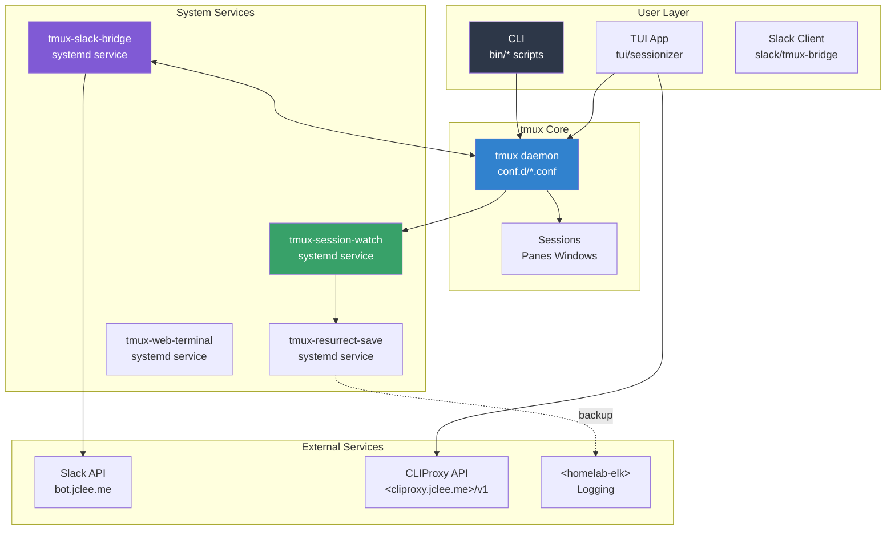
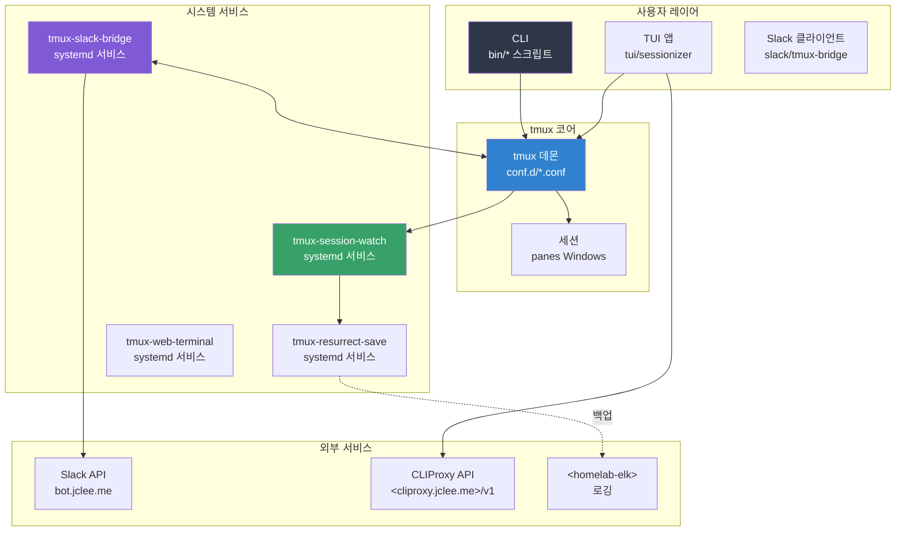

# TMUX SESSIONIZER

[](https://github.com/jclee941/.github/actions/workflows/ci.yml)
[](https://github.com/jclee941/.github/releases)
[](LICENSE)
[](https://bun.sh)
[](https://www.typescriptlang.org/)

> Bash-first tmux configuration and session-management toolkit

---

## Table of Contents

- [Overview](#overview)
- [Features](#features)
- [Architecture](#architecture)
- [Automation Inventory](#automation-inventory)
- [Quick Start](#quick-start)
- [Local Development](#local-development)
- [Commands Reference](#commands-reference)
- [Contribution Guide](#contribution-guide)
- [개요](#개요)
- [기능](#기능)
- [아키텍처](#아키텍처)
- [자동화 인벤토리](#자동화-인벤토리)
- [빠른 시작](#빠른-시작)
- [로컬 개발](#로컬-개발)
- [명령어 참고자료](#명령어-참고자료)
- [기여 가이드](#기여-가이드)

---

## Overview

**TMUX SESSIONIZER** is a comprehensive tmux configuration system designed for developers who work with multiple projects and sessions. It provides a unified interface for session discovery, creation, and management, with deep integrations for Slack, system services, and terminal UI applications.

The project is structured as a symlinked `~/.tmux` directory with a plugin-style architecture. Core behavior lives in `conf.d/*.conf` and `bin/*` scripts. A nested Bun/OpenTUI sessionizer TUI runs at `tui/sessionizer`, and a Node.js Slack bridge operates at `slack/tmux-bridge`.

### Key Components

| Component | Technology | Purpose |
|-----------|------------|---------|
| Core Config | tmux.conf | Root loader, sources conf.d/*.conf |
| Session Discovery | Bash + fzf | bin/tmux-sessionizer for picker + wizard |
| TUI Application | Bun + React + OpenTUI | Interactive session management UI |
| Slack Bridge | Node.js + TypeScript | Bi-directional tmux/Slack sync |
| Systemd Services | systemd | Background automation (resurrect, watch, bridge) |
| Wezterm Config | Lua | Terminal integration |

---

## Features

### Core Session Management

- **fzf-powered picker**: Fast session discovery and switching via `tmux-sessionizer`
- **Creation wizard**: Guided multi-step session creation (name → directory → layout)
- **MRU jump**: Most recently used session access with `tmux-session-jump`
- **Session lifecycle**: Safe kill, rename, and export capabilities

### TUI Application (`tui/sessionizer`)

- React-based interactive UI running on Bun + OpenTUI
- Real-time session list with filtering
- Preview panel for session state
- Keyboard-driven navigation

### Slack Integration (`slack/tmux-bridge`)

- **Bi-directional sync**: tmux session changes → Slack messages
- **Command handling**: Slack commands control tmux sessions
- **Channel mapping**: Sessions linked to Slack channels
- **Idle monitoring**: Track inactive sessions
- **Formatter system**: Rich block kit messages, notifications, modal dialogs

### Systemd Services (`systemd/`)

- `tmux-session-watch.service`: Monitor session changes
- `tmux-resurrect-save.service`: Periodic session state backup
- `tmux-slack-bridge.service`: Slack bridge daemon
- `tmux-web-terminal.service`: Web-based terminal via ttyd

### Automation Workflows (33 total)

- PR review automation via `10_pr-review.yml` (qodo-ai/pr-agent)
- Issue-to-branch automation via `02_issue-to-branch.yml`
- Dependency management via `12_dependabot-auto-merge.yml`
- CI health monitoring via `60_ci-auto-heal.yml`
- And 29 more workflows for comprehensive GitHub automation

### Terminal Integration

- Wezterm Lua configuration (`wezterm/wezterm.lua`)
- Tokyo Night color theme
- Responsive status bar with tiered rendering
- Nerd Font icon support

---

## Architecture



---

## Automation Inventory

### Workflow Files (33 total)

#### Branch & PR Automation

| Workflow File | Purpose |
|--------------|---------|
| `01_branch-to-pr.yml` | Create PR from branch |
| `02_issue-to-branch.yml` | Create branch from issue |
| `10_pr-review.yml` | AI-powered PR review (qodo-ai/pr-agent) |
| `security/11_pr-review.yml` | Security-focused PR review |
| `13_pr-auto-merge.yml` | Auto-merge on approval |
| `15_merged-pr-cleanup.yml` | Cleanup after merge |

#### CI/CD & Quality

| Workflow File | Purpose |
|--------------|---------|
| `03_pr-checks.yml` | PR validation checks |
| `44_reusable-pr-checks.yml` | Reusable PR check logic |
| `04_actionlint.yml` | Workflow linting |
| `05_gitleaks.yml` | Secret scanning |
| `45_reusable-gitleaks.yml` | Reusable gitleaks logic |
| `06_codeql.yml` | CodeQL analysis |
| `07_dependency-review.yml` | Dependency vulnerability check |
| `08_scorecard.yml` | Security scorecard |
| `09_semantic-pr.yml` | Semantic PR validation |
| `ci.yml` | Main CI pipeline |
| `auto-merge.yml` | Auto-merge automation |
| `labeler.yml` | PR labeling rules |

#### Issue Management

| Workflow File | Purpose |
|--------------|---------|
| `18_issue-management.yml` | Issue lifecycle management |
| `43_reusable-issue-management.yml` | Reusable issue logic |
| `37_ci-failure-issues.yml` | Auto-create issues from CI failures |
| `91_issue-classification.yml` | AI issue classification |
| `19_issue-backfill.yml` | Backfill issue metadata |
| `42_reusable-docs-sync.yml` | Documentation sync |

#### Documentation & Release

| Workflow File | Purpose |
|--------------|---------|
| `20_readme-gen.yml` | README generation |
| `21_docs-sync.yml` | Documentation sync |
| `24_release-notes.yml` | Release note generation |
| `25_release-publish.yml` | Release publishing |

#### Dependency Management

| Workflow File | Purpose |
|--------------|---------|
| `12_dependabot-auto-merge.yml` | Dependabot auto-merge |

#### Automation Tools

| Workflow File | Purpose |
|--------------|---------|
| `14_bot-auto-fix.yml` | Bot-triggered auto-fix |
| `29_downstream-health-check.yml` | Downstream repo health |
| `60_ci-auto-heal.yml` | CI self-healing |
| `welcome.yml` | New contributor welcome |

### CLI Automation Tools (Bin Scripts)

#### Session Management (30 total)

| Script | Description |
|--------|-------------|
| `tmux-sessionizer` | fzf session picker + creation wizard |
| `tmux-sessionizer-tui` | Launch TUI sessionizer |
| `tmux-sidebar` | Tree sidebar display |
| `tmux-sidebar-init` | Sidebar initialization |
| `tmux-sidebar-toggle` | Toggle sidebar |
| `tmux-session-cycle` | PgUp/PgDn session rotation |
| `tmux-session-kill` | Safe session termination |
| `tmux-session-rename` | Session rename |
| `tmux-session-sync` | Sync with Slack channels |
| `tmux-session-jump` | MRU fzf picker |
| `tmux-session-icon` | Nerd Font icon mapping |
| `tmux-session-export` | Export layout to YAML |
| `tmux-session-branch-log` | Log session→branch mapping |
| `tmux-session-dashboard` | Session table popup |
| `tmux-template-create` | Quick-create from templates |
| `tmux-layout-apply` | Apply YAML layouts |

#### Git & Development

| Script | Description |
|--------|-------------|
| `tmux-git-status` | Git branch + status |
| `tmux-git-uncommitted` | Track uncommitted changes |
| `tmux-command-palette` | fzf action picker |

#### System Utilities

| Script | Description |
|--------|-------------|
| `tmux-responsive` | Responsive statusbar |
| `tmux-opencode` | OpenCode launcher |
| `tmux-ssh-picker` | SSH host picker |
| `tmux-url-open` | URL extraction |
| `tmux-file-open` | File path extraction |
| `tmux-clipboard-history` | Buffer ring browser |
| `tmux-notify-long-command` | Desktop notifications |
| `tmux-cheatsheet` | Keybinding reference |
| `tmux-slack-bridge-start` | Start Slack bridge |
| `tmux-slack-bridge-setup` | Slack app setup |
| `tmux-web-terminal` | ttyd launcher |

---

## Quick Start

### Prerequisites

- **tmux** ≥ 2.9
- **Bash** ≥ 4.0
- **fzf** ≥ 0.25
- **Bun** ≥ 1.0 (for TUI and Slack bridge)
- **Node.js** ≥ 18 (fallback for Slack bridge)

### Installation

```bash
# Clone repository
git clone https://github.com/jclee941/.github ~/.tmux

# Symlink configuration
ln -s ~/.tmux/tmux.conf ~/.tmux.conf
ln -s ~/.tmux/sessionizer.conf ~/.sessionizer.conf

# Install TUI dependencies
cd ~/.tmux/tui/sessionizer
bun install

# Install Slack bridge dependencies
cd ~/.tmux/slack/tmux-bridge
bun install

# Reload tmux configuration
tmux source-file ~/.tmux.conf
```

### Basic Usage

```bash
# Launch session picker (fzf interface)
tmux-sessionizer

# Launch TUI sessionizer
tmux-sessionizer-tui

# Jump to most recent session
tmux-session-jump

# Kill session with confirmation
tmux-session-kill

# Start Slack bridge
tmux-slack-bridge-start
```

---

## Local Development

### Repository Structure

```
tmux-sessionizer/
├── tmux.conf              # Root tmux configuration
├── sessionizer.conf       # Session discovery settings
├── bin/                   # Bash CLI scripts (30 tools)
│   └── lib/               # Shared library modules
├── conf.d/                # tmux config fragments
├── tui/
│   └── sessionizer/       # Bun + React TUI app
│       ├── src/           # React components
│       ├── __tests__/     # Unit tests
│       └── package.json
├── slack/
│   └── tmux-bridge/       # Node.js Slack integration
│       ├── src/           # TypeScript source
│       ├── __tests__/     # Unit tests
│       └── package.json
├── systemd/               # systemd service files
├── wezterm/               # Wezterm Lua config
└── .github/
    └── workflows/         # 33 automation workflows
```

### Development Commands

```bash
# tmux configuration
tmux source-file ~/.tmux.conf        # Reload config
tmux show-options -g                 # Show global options

# TUI development
cd tui/sessionizer
bun run dev                          # Start dev server
bun test                             # Run tests
bun run build                        # Production build

# Slack bridge development
cd slack/tmux-bridge
bun run dev                          # Start with tsx
bun test                             # Run tests
bun run build                        # Production build

# Run all tests
bun test --filter '*'
```

### Testing

```bash
# TUI unit tests
cd tui/sessionizer && bun test

# Slack bridge unit tests
cd slack/tmux-bridge && bun test

# CI validation (local)
actionlint
gitleaks detect --verbose
```

### Configuration

| File | Purpose | Key Settings |
|------|---------|--------------|
| `sessionizer.conf` | Session discovery | `SCAN_DIR`, `EXTRA_DIRS` |
| `conf.d/00-core.conf` | Core tmux settings | `$EDITOR`, terminal caps |
| `conf.d/10-theme.conf` | Visual theme | Tokyo Night colors |
| `conf.d/20-keys.conf` | Keybindings | Prefix `C-a`, navigation |
| `conf.d/25-sidebar.conf` | Sidebar behavior | Toggle, width |

---

## Commands Reference

### Session Management

| Command | Description | Key Binding |
|---------|-------------|-------------|
| `tmux-sessionizer` | fzf session picker + wizard | `Prefix + s` |
| `tmux-sessionizer-tui` | Launch TUI sessionizer | `Prefix + C-s` |
| `tmux-session-jump` | MRU session jump | `Prefix + C-j` |
| `tmux-session-kill` | Kill with confirmation | `Prefix + K` |
| `tmux-session-rename` | Rename session | `Prefix + ,` |
| `tmux-session-cycle` | Cycle sessions | `PgUp/PgDn` |
| `tmux-session-export` | Export layout YAML | `Prefix + E` |
| `tmux-session-dashboard` | Session table view | `Prefix + D` |

### Sidebar

| Command | Description | Key Binding |
|---------|-------------|-------------|
| `tmux-sidebar-toggle` | Show/hide sidebar | `Prefix + C-b` |
| `tmux-sidebar` | Render sidebar | - |
| `tmux-sidebar-init` | Init on session create | - |

### Slack Bridge

| Command | Description |
|---------|-------------|
| `tmux-slack-bridge-start` | Start bridge daemon |
| `tmux-slack-bridge-setup` | Interactive setup wizard |
| `tmux-session-sync` | Sync sessions → Slack |

### Git Integration

| Command | Description |
|---------|-------------|
| `tmux-git-status` | Show branch + status |
| `tmux-git-uncommitted` | Track changes per session |
| `tmux-session-branch-log` | Log branch on switch |

### Utilities

| Command | Description |
|---------|-------------|
| `tmux-opencode` | Launch OpenCode session |
| `tmux-ssh-picker` | Pick SSH host |
| `tmux-url-open` | Extract and open URLs |
| `tmux-file-open` | Extract and open files |
| `tmux-command-palette` | fzf action picker |
| `tmux-cheatsheet` | Keybinding reference |
| `tmux-clipboard-history` | Browse buffer ring |
| `tmux-responsive` | Responsive statusbar |

### Systemd Services

```bash
# Enable services
systemctl --user enable tmux-session-watch.service
systemctl --user enable tmux-resurrect-save.service
systemctl --user enable tmux-slack-bridge.service
systemctl --user enable tmux-web-terminal.service

# Start services
systemctl --user start tmux-session-watch.service
systemctl --user start tmux-slack-bridge.service

# View logs
journalctl --user -u tmux-slack-bridge.service -f
```

---

## Contribution Guide

### Getting Started

1. **Fork** the repository
2. **Clone** your fork: `git clone https://github.com/YOUR_USER/tmux-sessionizer.git`
3. **Create a branch**: `git checkout -b feature/my-feature`
4. **Install dependencies**: `bun install`
5. **Make changes** and **test** locally
6. **Commit** using conventional commits (see below)
7. **Push** and **open a PR**

### Commit Convention

We follow [Conventional Commits](https://www.conventionalcommits.org/):

```
<type>(<scope>): <description>

[optional body]

[optional footer]
```

**Types:**

- `feat`: New feature
- `fix`: Bug fix
- `docs`: Documentation
- `refactor`: Code refactoring
- `test`: Tests
- `chore`: Maintenance

**Examples:**

```
feat(sessionizer): add fuzzy directory filtering
fix(slack-bridge): correct channel name parsing
docs(readme): update architecture diagram
```

### Code Standards

- **Shell scripts**: ShellCheck compliant, `set -euo pipefail`
- **TypeScript**: Strict mode, full type coverage
- **Testing**: All new features require unit tests
- **Workflow files**: Validated via `04_actionlint.yml` in CI

### PR Review Process

1. Automated checks run via `03_pr-checks.yml`
2. AI review via `10_pr-review.yml` (qodo-ai/pr-agent)
3. Security review for sensitive changes
4. Maintainer approval required for core changes

### Reporting Issues

1. Use issue templates for bug reports and feature requests
2. Include reproduction steps and environment details
3. For security issues, see [SECURITY.md](.github/SECURITY.md)

---

## 개요

**TMUX SESSIONIZER**는 여러 프로젝트와 세션에서 작업하는 개발자를 위해 설계된 종합적인 tmux 설정 시스템입니다. 세션 검색, 생성, 관리에 대한 통합 인터페이스를 제공하며 Slack, 시스템 서비스, 터미널 UI 애플리케이션과 깊은 통합을 제공합니다.

프로젝트는 심볼릭 링크된 `~/.tmux` 디렉토리로 plugin 스타일 아키텍처를採用합니다. 핵심 동작은 `conf.d/*.conf`와 `bin/*` 스크립트에 있으며, Bun/OpenTUI 세션 관리 TUI는 `tui/sessionizer`에서, Node.js Slack 브리지는 `slack/tmux-bridge`에서 작동합니다.

---

## 기능

### 핵심 세션 관리

- **fzf 기반 피커**: `tmux-sessionizer`로 빠른 세션 검색 및 전환
- **생성 마법사**: 안내식 다단계 세션 생성 (이름 → 디렉토리 → 레이아웃)
- **MRU 점프**: `tmux-session-jump`로 가장 최근 세션 접근
- **세션 수명주기**: 안전한 종료, 이름 변경, 내보내기 기능

### TUI 애플리케이션 (`tui/sessionizer`)

- Bun + OpenTUI에서 실행되는 React 기반 대화형 UI
- 필터링이 가능한 실시간 세션 목록
- 세션 상태 미리보기 패널
- 키보드 중심 네비게이션

### Slack 통합 (`slack/tmux-bridge`)

- **양방향 동기화**: tmux 세션 변경 → Slack 메시지
- **명령 처리**: Slack 명령으로 tmux 세션 제어
- **채널 매핑**: 세션을 Slack 채널에 연결
- **유휴 모니터링**: 비활성 세션 추적
- **포맷터 시스템**: 블록 킷 메시지, 알림, 모달 대화상자

### 시스템 서비스 (`systemd/`)

- `tmux-session-watch.service`: 세션 변경 모니터링
- `tmux-resurrect-save.service`: 주기적 세션 상태 백업
- `tmux-slack-bridge.service`: Slack 브릿지 데몬
- `tmux-web-terminal.service`: ttyd를 통한 웹 터미널

### 자동화 워크플로우 (33개)

- `10_pr-review.yml`를 통한 AI PR 리뷰 (qodo-ai/pr-agent)
- `02_issue-to-branch.yml`를 통한 이슈-브랜치 자동화
- `12_dependabot-auto-merge.yml`를 통한 의존성 관리
- `60_ci-auto-heal.yml`를 통한 CI 상태 모니터링
- 그 외 29개 워크플로우로 종합 GitHub 자동화 제공

### 터미널 통합

- Wezterm Lua 구성 (`wezterm/wezterm.lua`)
- Tokyo Night 컬러 테마
- 티어별 렌더링의 반응형 상태바
- Nerd Font 아이콘 지원

---

## 아키텍처



---

## 자동화 인벤토리

### 워크플로우 파일 (33개)

#### 브랜치 및 PR 자동화

| 워크플로우 파일 | 용도 |
|--------------|---------|
| `01_branch-to-pr.yml` | 브랜치에서 PR 생성 |
| `02_issue-to-branch.yml` | 이슈에서 브랜치 생성 |
| `10_pr-review.yml` | AI 기반 PR 리뷰 (qodo-ai/pr-agent) |
| `security/11_pr-review.yml` | 보안 중심 PR 리뷰 |
| `13_pr-auto-merge.yml` | 승인 시 자동 병합 |
| `15_merged-pr-cleanup.yml` | 병합 후 정리 |

#### CI/CD 및 품질

| 워크플로우 파일 | 용도 |
|--------------|---------|
| `03_pr-checks.yml` | PR 검증 체크 |
| `44_reusable-pr-checks.yml` | 재사용 PR 체크 로직 |
| `04_actionlint.yml` | 워크플로우 린팅 |
| `05_gitleaks.yml` | 시크릿 스캐닝 |
| `45_reusable-gitleaks.yml` | 재사용 gitleaks 로직 |
| `06_codeql.yml` | CodeQL 분석 |
| `07_dependency-review.yml` | 의존성 취약점 체크 |
| `08_scorecard.yml` | 보안 점수카드 |
| `09_semantic-pr.yml` | 시맨틱 PR 검증 |
| `ci.yml` | 메인 CI 파이프라인 |
| `auto-merge.yml` | 자동 병합 자동화 |
| `labeler.yml` | PR 라벨링 규칙 |

#### 이슈 관리

| 워크플로우 파일 | 용도 |
|--------------|---------|
| `18_issue-management.yml` | 이슈 수명주기 관리 |
| `43_reusable-issue-management.yml` | 재사용 이슈 로직 |
| `37_ci-failure-issues.yml` | CI 실패로부터 자동 이슈 생성 |
| `91_issue-classification.yml` | AI 이슈 분류 |
| `19_issue-backfill.yml` | 이슈 메타데이터 백필 |
| `42_reusable-docs-sync.yml` | 문서 동기화 |

#### 문서 및 릴리스

| 워크플로우 파일 | 용도 |
|--------------|---------|
| `20_readme-gen.yml` | README 생성 |
| `21_docs-sync.yml` | 문서 동기화 |
| `24_release-notes.yml` | 릴리스 노트 생성 |
| `25_release-publish.yml` | 릴리스 게시 |

#### 의존성 관리

| 워크플로우 파일 | 용도 |
|--------------|---------|
| `12_dependabot-auto-merge.yml` | Dependabot 자동 병합 |

#### 자동화 도구

| 워크플로우 파일 | 용도 |
|--------------|---------|
| `14_bot-auto-fix.yml` | 봇 트리거 자동 수정 |
| `29_downstream-health-check.yml` | 다운스트림 저장소 상태 확인 |
| `60_ci-auto-heal.yml` | CI 자체 복구 |
| `welcome.yml` | 신규 기여자 환영 |

### CLI 자동화 도구 (Bin 스크립트)

#### 세션 관리 (30개)

| 스크립트 | 설명 |
|--------|-------------|
| `tmux-sessionizer` | fzf 세션 피커 + 생성 마법사 |
| `tmux-sessionizer-tui` | TUI 세션 관리자起動 |
| `tmux-sidebar` | 트리 사이드바 표시 |
| `tmux-sidebar-init` | 사이드바 초기화 |
| `tmux-sidebar-toggle` | 사이드바 토글 |
| `tmux-session-cycle` | PgUp/PgDn 세션 순환 |
| `tmux-session-kill` | 확인 후 세션 종료 |
| `tmux-session-rename` | 세션 이름 변경 |
| `tmux-session-sync` | Slack 채널 동기화 |
| `tmux-session-jump` | MRU fzf 피커 |
| `tmux-session-icon` | Nerd Font 아이콘 매핑 |
| `tmux-session-export` | 레이아웃 YAML 내보내기 |
| `tmux-session-branch-log` | 세션→브랜치 매핑 로그 |
| `tmux-session-dashboard` | 세션 테이블 팝업 |
| `tmux-template-create` | 템플릿에서 빠른 생성 |
| `tmux-layout-apply` | YAML 레이아웃 적용 |

#### Git 및 개발

| 스크립트 | 설명 |
|--------|-------------|
| `tmux-git-status` | Git 브랜치 + 상태 |
| `tmux-git-uncommitted` | 세션별 미커밋 추적 |
| `tmux-command-palette` | fzf 작업 피커 |

#### 시스템 유틸리티

| 스크립트 | 설명 |
|--------|-------------|
| `tmux-responsive` | 반응형 상태바 |
| `tmux-opencode` | OpenCode起動 |
| `tmux-ssh-picker` | SSH 호스트 피커 |
| `tmux-url-open` | URL 추출 및 열기 |
| `tmux-file-open` | 파일 경로 추출 및 열기 |
| `tmux-clipboard-history` | 버퍼 링 브라우저 |
| `tmux-notify-long-command` | 데스크톱 알림 |
| `tmux-cheatsheet` | 키바인딩 참조 |
| `tmux-slack-bridge-start` | Slack 브릿지 시작 |
| `tmux-slack-bridge-setup` | Slack 앱 설정 |
| `tmux-web-terminal` | ttyd起動 |

---

## 빠른 시작

### 전제 조건

- **tmux** ≥ 2.9
- **Bash** ≥ 4.0
- **fzf** ≥ 0.25
- **Bun** ≥ 1.0 (TUI 및 Slack 브릿지용)
- **Node.js** ≥ 18 (Slack 브릿지 폴백)

### 설치

```bash
# 저장소 클론
git clone https://github.com/jclee941/.github ~/.tmux

# 구성 심볼릭 링크
ln -s ~/.tmux/tmux.conf ~/.tmux.conf
ln -s ~/.tmux/sessionizer.conf ~/.sessionizer.conf

# TUI 의존성 설치
cd ~/.tmux/tui/sessionizer
bun install

# Slack 브릿지 의존성 설치
cd ~/.tmux/slack/tmux-bridge
bun install

# tmux 구성 다시 로드
tmux source-file ~/.tmux.conf
```

### 기본 사용법

```bash
# 세션 피커起動 (fzf 인터페이스)
tmux-sessionizer

# TUI 세션 관리자起動
tmux-sessionizer-tui

# 가장 최근 세션으로 점프
tmux-session-jump

# 확인 후 세션 종료
tmux-session-kill

# Slack 브릿지 시작
tmux-slack-bridge-start
```

---

## 로컬 개발

### 저장소 구조

```
tmux-sessionizer/
├── tmux.conf              # 루트 tmux 구성
├── sessionizer.conf       # 세션 검색 설정
├── bin/                   # Bash CLI 스크립트 (30개 도구)
│   └── lib/               # 공유 라이브러리 모듈
├── conf.d/                # tmux 구성 프래그먼트
├── tui/
│   └── sessionizer/       # Bun + React TUI 앱
│       ├── src/           # React 컴포넌트
│       ├── __tests__/     # 단위 테스트
│       └── package.json
├── slack/
│   └── tmux-bridge/       # Node.js Slack 통합
│       ├── src/           # TypeScript 소스
│       ├── __tests__/     # 단위 테스트
│       └── package.json
├── systemd/               # systemd 서비스 파일
├── wezterm/               # Wezterm Lua 구성
└── .github/
    └── workflows/         # 33개 자동화 워크플로우
```

### 개발 명령어

```bash
# tmux 구성
tmux source-file ~/.tmux.conf        # 구성 다시 로드
tmux show-options -g                 # 전역 옵션 표시

# TUI 개발
cd tui/sessionizer
bun run dev                          # 개발 서버 시작
bun test                             # 테스트 실행
bun run build                        # 프로덕션 빌드

# Slack 브릿지 개발
cd slack/tmux-bridge
bun run dev                          # tsx로 시작
bun test                             # 테스트 실행
bun run build                        # 프로덕션 빌드

# 전체 테스트 실행
bun test --filter '*'
```

### 테스트

```bash
# TUI 단위 테스트
cd tui/sessionizer && bun test

# Slack 브릿지 단위 테스트
cd slack/tmux-bridge && bun test

# CI 검증 (로컬)
actionlint
gitleaks detect --verbose
```

### 구성

| 파일 | 용도 | 주요 설정 |
|------|---------|--------------|
| `sessionizer.conf` | 세션 검색 | `SCAN_DIR`, `EXTRA_DIRS` |
| `conf.d/00-core.conf` | 코어 tmux 설정 | `$EDITOR`, 터미널 기능 |
| `conf.d/10-theme.conf` | 시각 테마 | Tokyo Night 색상 |
| `conf.d/20-keys.conf` | 키바인딩 | Prefix `C-a`, 네비게이션 |
| `conf.d/25-sidebar.conf` | 사이드바 동작 | 토글, 너비 |

---

## 명령어 참고자료

### 세션 관리

| 명령어 | 설명 | 키 바인딩 |
|---------|-------------|-------------|
| `tmux-sessionizer` | fzf 세션 피커 + 마법사 | `Prefix + s` |
| `tmux-sessionizer-tui` | TUI 세션 관리자起動 | `Prefix + C-s` |
| `tmux-session-jump` | MRU 세션 점프 | `Prefix + C-j` |
| `tmux-session-kill` | 확인 후 종료 | `Prefix + K` |
| `tmux-session-rename` | 세션 이름 변경 | `Prefix + ,` |
| `tmux-session-cycle` | 세션 순환 | `PgUp/PgDn` |
| `tmux-session-export` | 레이아웃 YAML 내보내기 | `Prefix + E` |
| `tmux-session-dashboard` | 세션 테이블 뷰 | `Prefix + D` |

### 사이드바

| 명령어 | 설명 | 키 바인딩 |
|---------|-------------|-------------|
| `tmux-sidebar-toggle` | 사이드바 표시/숨기기 | `Prefix + C-b` |
| `tmux-sidebar` | 사이드바 렌더링 | - |
| `tmux-sidebar-init` | 세션 생성 시 초기화 | - |

### Slack 브릿지

| 명령어 | 설명 |
|--------|-------------|
| `tmux-slack-bridge-start` | 브릿지 데몬 시작 |
| `tmux-slack-bridge-setup` | 대화형 설정 마법사 |
| `tmux-session-sync` | 세션 → Slack 동기화 |

### Git 통합

| 명령어 | 설명 |
|--------|-------------|
| `tmux-git-status` | 브랜치 + 상태 표시 |
| `tmux-git-uncommitted` | 세션별 변경 사항 추적 |
| `tmux-session-branch-log` | 전환 시 브랜치 로그 |

### 유틸리티

| 명령어 | 설명 |
|--------|-------------|
| `tmux-opencode` | OpenCode 세션起動 |
| `tmux-ssh-picker` | SSH 호스트 피커 |
| `tmux-url-open` | URL 추출 및 열기 |
| `tmux-file-open` | 파일 경로 추출 및 열기 |
| `tmux-command-palette` | fzf 작업 피커 |
| `tmux-cheatsheet` | 키바인딩 참조 |
| `tmux-clipboard-history` | 버퍼 링 브라우저 |
| `tmux-responsive` | 반응형 상태바 |

### systemd 서비스

```bash
# 서비스 활성화
systemctl --user enable tmux-session-watch.service
systemctl --user enable tmux-resurrect-save.service
systemctl --user enable tmux-slack-bridge.service
systemctl --user enable tmux-web-terminal.service

# 서비스 시작
systemctl --user start tmux-session-watch.service
systemctl --user start tmux-slack-bridge.service

# 로그 확인
journalctl --user -u tmux-slack-bridge.service -f
```

---

## 기여 가이드

### 시작하기

1. 저장소 **Fork**
2. 포크 클론: `git clone https://github.com/YOUR_USER/tmux-sessionizer.git`
3. 브랜치 생성: `git checkout -b feature/my-feature`
4. 의존성 설치: `bun install`
5. 변경 및 로컬 테스트
6. conventional 커밋으로 **Commit** (아래 참조)
7. **Push** 및 **PR 열기**

### 커밋 규칙

[Conventional Commits](https://www.conventionalcommits.org/)를 따릅니다:

```
<type>(<scope>): <description>

[선택적 본문]

[선택적 푸터]
```

**타입:**

- `feat`: 새 기능
- `fix`: 버그 수정
- `docs`: 문서
- `refactor`: 코드 리팩토링
- `test`: 테스트
- `chore`: 유지보수

**예시:**

```
feat(sessionizer): add fuzzy directory filtering
fix(slack-bridge): correct channel name parsing
docs(readme): update architecture diagram
```

### 코드 표준

- **셸 스크립트**: ShellCheck 준수, `set -euo pipefail`
- **TypeScript**: 엄격 모드, 완전한 타입 커버리지
- **테스트**: 모든 새 기능에는 단위 테스트 필요
- **워크플로우 파일**: CI에서 `04_actionlint.yml`로 검증

### PR 리뷰 프로세스

1. `03_pr-checks.yml`로 자동화 체크 실행
2. `10_pr-review.yml`로 AI 리뷰 (qodo-ai/pr-agent)
3. 민감한 변경에 대한 보안 리뷰
4. 핵심 변경에는 유지관리자 승인 필요

### 이슈 보고

1. 버그 보고 및 기능 요청에 이슈 템플릿 사용
2. 재현 단계 및 환경 세부정보 포함
3. 보안 이슈는 [SECURITY.md](.github/SECURITY.md) 참조

---

## License

This project is licensed under the MIT License - see [LICENSE](LICENSE) for details.
