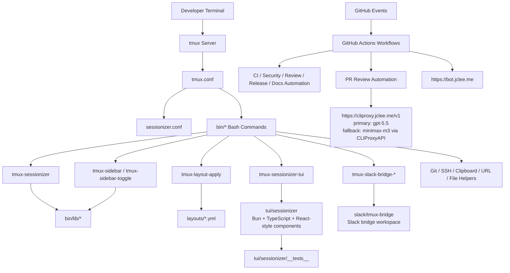
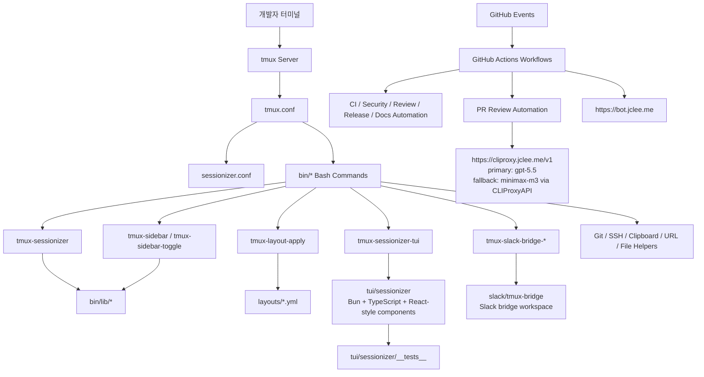

# TMUX SESSIONIZER

[](../../actions/workflows/ci.yml)
[](../../actions/workflows/03_pr-checks.yml)
[](../../actions/workflows/04_actionlint.yml)
[](../../actions/workflows/05_gitleaks.yml)
[](../../actions/workflows/06_codeql.yml)
[](LICENSE)

Bash-first tmux configuration and session-management toolkit.

Bash 중심의 tmux 설정 및 세션 관리 도구 모음입니다.

---

## Table of Contents

- [Overview](#overview)
- [Features](#features)
- [Architecture](#architecture)
- [Automation Inventory](#automation-inventory)
- [Quick Start](#quick-start)
- [Local Development](#local-development)
- [Commands Reference](#commands-reference)
- [Contribution Guide](#contribution-guide)
- [개요](#개요)
- [기능](#기능)
- [아키텍처](#아키텍처)
- [자동화 인벤토리](#자동화-인벤토리)
- [빠른 시작](#빠른-시작)
- [로컬 개발](#로컬-개발)
- [명령어 참고](#명령어-참고)
- [기여 가이드](#기여-가이드)

---

## Overview

TMUX SESSIONIZER is a developer-focused tmux environment for quickly discovering projects, creating named tmux sessions, applying repeatable layouts, and managing daily terminal workflows from small Bash utilities.

The repository is designed to be installed as a tmux configuration/tooling directory. It includes:

- Root tmux configuration in `tmux.conf`
- Session discovery configuration in `sessionizer.conf`
- Executable helper scripts in `bin/`
- Shared Bash libraries in `bin/lib/`
- Reusable YAML layout templates in `layouts/`
- A Bun/TypeScript terminal UI in `tui/sessionizer/`
- Slack bridge scaffolding under `slack/tmux-bridge/`
- Documentation and project governance files

This project is intentionally shell-first: most runtime behavior is implemented as tmux-aware Bash commands, while the TUI provides a richer interactive sessionizer experience.

---

## Features

### Session Management

- Create, rename, jump to, cycle through, and safely kill tmux sessions
- Discover workspaces from `sessionizer.conf`
- Use an `fzf`-style picker through `tmux-sessionizer`
- Launch a richer Bun/TypeScript TUI through `tmux-sessionizer-tui`
- Track recently active sessions
- Export and apply session layouts

### Layout Automation

- Apply YAML layout templates from `layouts/`
- Included layouts:
  - `layouts/blacklist.yml`
  - `layouts/default.yml`
  - `layouts/proxmox.yml`
  - `layouts/resume.yml`
  - `layouts/safework.yml`
  - `layouts/safework2.yml`
  - `layouts/splunk.yml`

### Sidebar and Dashboard

- Toggle a tmux sidebar
- Render session/project state in side panes
- Display a session dashboard popup
- Show command palettes and cheatsheets

### Developer Workflow Utilities

- Git status helpers for tmux status lines
- URL and file extraction from pane content
- SSH host picker
- Clipboard buffer browser
- Pane synchronization toggle
- Config reload helper
- Long-command notification hook
- Web terminal launcher

### Integrations

- Slack bridge setup and startup scripts
- OpenCode launcher
- Optional CLIProxy-compatible automation endpoint:
  - `https://cliproxy.jclee.me/v1`
- Bot/automation dashboard endpoint:
  - `https://bot.jclee.me`

---

## Architecture



---

## Automation Inventory

This repository contains GitHub Actions workflows for CI, security, PR review, auto-merge, release, documentation, issue triage, and self-healing automation.

### Workflow Files

| File | Purpose |
|---|---|
| `01_branch-to-pr.yml` | Creates or supports pull request flow from branches |
| `02_issue-to-branch.yml` | Creates branches from issues or issue-driven work |
| `03_pr-checks.yml` | Pull request validation checks |
| `04_actionlint.yml` | GitHub Actions workflow linting |
| `05_gitleaks.yml` | Secret scanning with Gitleaks |
| `06_codeql.yml` | CodeQL security analysis |
| `07_dependency-review.yml` | Dependency review for pull requests |
| `08_scorecard.yml` | OpenSSF Scorecard-style supply chain checks |
| `09_semantic-pr.yml` | Semantic pull request title validation |
| `10_pr-review.yml` | Automated PR review using repository automation |
| `11_security-pr-review.yml` | Security-focused PR review automation |
| `12_dependabot-auto-merge.yml` | Dependabot auto-merge workflow |
| `13_pr-auto-merge.yml` | Pull request auto-merge workflow |
| `14_bot-auto-fix.yml` | Bot-driven automatic fix workflow |
| `15_merged-pr-cleanup.yml` | Cleanup after merged pull requests |
| `19_issue-backfill.yml` | Issue metadata/backfill automation |
| `20_readme-gen.yml` | README generation workflow; primary model `gpt-5.5`, fallback `minimax-m3` via CLIProxyAPI |
| `21_docs-sync.yml` | Documentation synchronization |
| `24_release-notes.yml` | Release notes generation |
| `25_release-publish.yml` | Release publishing workflow |
| `29_downstream-health-check.yml` | Downstream health check automation |
| `37_ci-failure-issues.yml` | Creates or updates issues for CI failures |
| `42_reusable-docs-sync.yml` | Reusable documentation sync workflow |
| `44_reusable-pr-checks.yml` | Reusable pull request checks workflow |
| `45_reusable-gitleaks.yml` | Reusable Gitleaks workflow |
| `60_ci-auto-heal.yml` | CI auto-healing workflow |
| `91_issue-classification.yml` | Issue classification automation |
| `auto-merge.yml` | General auto-merge workflow |
| `ci.yml` | Main CI workflow |
| `labeler.yml` | Pull request and issue labeling |
| `welcome.yml` | New contributor welcome automation |

### Automation Tools

| Tool | Used For |
|---|---|
| GitHub Actions | CI/CD and repository automation runtime |
| actionlint | Workflow syntax and best-practice validation |
| Gitleaks | Secret scanning |
| CodeQL | Static security analysis |
| Dependency Review | Dependency risk review in pull requests |
| OpenSSF Scorecard | Supply chain health checks |
| Dependabot | Dependency update automation |
| Qodo PR-Agent | PR review assistance; see `qodo-ai/pr-agent` |
| CLIProxyAPI | LLM-compatible automation endpoint through `https://cliproxy.jclee.me/v1` |
| README generator | `20_readme-gen.yml` with primary model `gpt-5.5` and fallback `minimax-m3` |
| Bot dashboard | Automation visibility through `https://bot.jclee.me` |

### Go Automation Tools

There are no Go automation tools in this repository.

---

## Repository Structure

```text
/
├── AGENTS.md
├── CONTRIBUTING.md
├── LICENSE
├── OWNERS
├── README.md
├── sessionizer.conf
├── tmux.conf
├── bin/
│   ├── tmux-auto-attach
│   ├── tmux-bash-preexec
│   ├── tmux-cheatsheet
│   ├── tmux-clipboard-history
│   ├── tmux-command-palette
│   ├── tmux-config-reload
│   ├── tmux-copy-word
│   ├── tmux-file-open
│   ├── tmux-git-status
│   ├── tmux-git-uncommitted
│   ├── tmux-layout-apply
│   ├── tmux-notify-long-command
│   ├── tmux-opencode
│   ├── tmux-pane-sync
│   ├── tmux-responsive
│   ├── tmux-session-branch-log
│   ├── tmux-session-cycle
│   ├── tmux-session-dashboard
│   ├── tmux-session-export
│   ├── tmux-session-icon
│   ├── tmux-session-jump
│   ├── tmux-session-kill
│   ├── tmux-session-order
│   ├── tmux-session-rename
│   ├── tmux-session-sync
│   ├── tmux-sessionizer
│   ├── tmux-sessionizer-tui
│   ├── tmux-sidebar
│   ├── tmux-sidebar-init
│   ├── tmux-sidebar-toggle
│   ├── tmux-slack-bridge-setup
│   ├── tmux-slack-bridge-start
│   ├── tmux-ssh-picker
│   ├── tmux-sys-stats
│   ├── tmux-template-create
│   ├── tmux-url-open
│   ├── tmux-web-terminal
│   └── lib/
│       ├── sidebar-colors
│       ├── sidebar-render
│       ├── tmux-sessionizer-common
│       └── tmux-sessionizer-wizard
├── layouts/
│   ├── blacklist.yml
│   ├── default.yml
│   ├── proxmox.yml
│   ├── resume.yml
│   ├── safework.yml
│   ├── safework2.yml
│   └── splunk.yml
├── tui/
│   └── sessionizer/
├── docs/
│   ├── session-persistence-brainstorming.md
│   └── supermemory-governance.md
└── slack/
    └── tmux-bridge/
```

---

## Quick Start

### Prerequisites

Install the following tools on your workstation:

- `tmux`
- `bash`
- `git`
- `fzf`
- `bun` for the optional TUI under `tui/sessionizer`
- A terminal with Nerd Font support is recommended for icons

### Clone and Install

```bash
git clone <repository-url> ~/.tmux
cd ~/.tmux
```

Back up any existing tmux configuration:

```bash
test -f ~/.tmux.conf && cp ~/.tmux.conf ~/.tmux.conf.backup
```

Symlink the root tmux config:

```bash
ln -sf ~/.tmux/tmux.conf ~/.tmux.conf
```

Ensure scripts are executable:

```bash
chmod +x ~/.tmux/bin/tmux-*
chmod +x ~/.tmux/bin/lib/*
```

Add the script directory to your shell path:

```bash
export PATH="$HOME/.tmux/bin:$PATH"
```

For persistent shell configuration, add the same line to your shell startup file.

### Configure Session Discovery

Edit `sessionizer.conf`:

```bash
$EDITOR ~/.tmux/sessionizer.conf
```

Use it to define directories scanned by the sessionizer. Keep machine-specific paths local to your environment.

### Start tmux

```bash
tmux
```

Inside tmux, reload configuration when needed:

```bash
tmux-config-reload
```

Launch the sessionizer:

```bash
tmux-sessionizer
```

Launch the TUI sessionizer:

```bash
tmux-sessionizer-tui
```

---

## Local Development

### Bash Tooling

Most runtime commands live in `bin/`. During development, run scripts directly from the repository:

```bash
cd ~/.tmux
PATH="$PWD/bin:$PATH" tmux-sessionizer
```

Validate shell syntax:

```bash
bash -n bin/tmux-sessionizer
bash -n bin/tmux-layout-apply
bash -n bin/tmux-sidebar
```

Check all executable Bash scripts:

```bash
find bin -type f -maxdepth 2 -print0 | xargs -0 -I{} bash -n {}
```

### TUI Development

The terminal UI is located in `tui/sessionizer`.

```bash
cd tui/sessionizer
bun install
bun test
```

Run the TUI through the wrapper:

```bash
../../bin/tmux-sessionizer-tui
```

Or run from inside the package during development:

```bash
bun run src/index.tsx
```

### Layout Development

Create or edit YAML layouts in `layouts/`.

```bash
cp layouts/default.yml layouts/my-layout.yml
$EDITOR layouts/my-layout.yml
```

Apply a layout:

```bash
tmux-layout-apply layouts/my-layout.yml
```

### Documentation Development

Documentation files live in `docs/`.

```bash
ls docs/
```

README automation is managed by `20_readme-gen.yml`.

---

## Commands Reference

### Session Commands

| Command | Description |
|---|---|
| `tmux-sessionizer` | Project/session picker and session creation entry point |
| `tmux-sessionizer-tui` | Launches the Bun/TypeScript TUI sessionizer |
| `tmux-session-jump` | Jump to a session using a most-recently-used picker |
| `tmux-session-cycle` | Cycle through sessions |
| `tmux-session-kill` | Safely terminate a tmux session with confirmation |
| `tmux-session-rename` | Rename the current or selected session |
| `tmux-session-sync` | Synchronize tmux sessions with Slack-related metadata/workflows |
| `tmux-session-order` | Output sessions ordered by recent activity |
| `tmux-session-dashboard` | Show a formatted session dashboard |
| `tmux-session-export` | Export the current session layout |
| `tmux-session-icon` | Map session names to display icons |
| `tmux-session-branch-log` | Log session-to-branch transitions |

### Layout and Template Commands

| Command | Description |
|---|---|
| `tmux-layout-apply` | Apply a YAML layout to a tmux session |
| `tmux-template-create` | Create a session from a preset template |

### Sidebar Commands

| Command | Description |
|---|---|
| `tmux-sidebar` | Render the sidebar |
| `tmux-sidebar-init` | Initialize sidebar state for a session |
| `tmux-sidebar-toggle` | Toggle sidebar visibility |

### Productivity Commands

| Command | Description |
|---|---|
| `tmux-command-palette` | Open an action picker for common tmux operations |
| `tmux-cheatsheet` | Show categorized keybinding reference |
| `tmux-url-open` | Extract and open URLs from pane content |
| `tmux-file-open` | Extract and open file paths from pane content |
| `tmux-ssh-picker` | Pick SSH hosts from local SSH configuration |
| `tmux-clipboard-history` | Browse tmux buffer history |
| `tmux-copy-word` | Copy the word under the cursor |
| `tmux-pane-sync` | Toggle synchronized panes |
| `tmux-config-reload` | Reload tmux configuration |
| `tmux-notify-long-command` | Notify after long-running commands |
| `tmux-bash-preexec` | Sourceable preexec hook for timing commands |
| `tmux-auto-attach` | Auto-attach flow for login shells |
| `tmux-responsive` | Responsive status bar rendering |
| `tmux-opencode` | Launch an OpenCode tmux session |
| `tmux-web-terminal` | Launch a web terminal wrapper |

### Git and System Commands

| Command | Description |
|---|---|
| `tmux-git-status` | Show branch, dirty state, ahead/behind, and stash status |
| `tmux-git-uncommitted` | Track uncommitted changes per session |
| `tmux-sys-stats` | Show CPU and memory information for status lines |

### Slack Bridge Commands

| Command | Description |
|---|---|
| `tmux-slack-bridge-setup` | Interactive Slack bridge setup helper |
| `tmux-slack-bridge-start` | Start the Slack bridge wrapper |

---

## Contribution Guide

### Before You Start

Read:

- `CONTRIBUTING.md`
- `AGENTS.md`
- `OWNERS`
- Package-specific guidance in nested `AGENTS.md` files:
  - `tui/sessionizer/AGENTS.md`
  - `slack/tmux-bridge/AGENTS.md`

### Development Rules

- Keep Bash scripts portable and tmux-aware.
- Do not hardcode machine-specific private addresses or container identifiers.
- Prefer placeholders such as `<homelab-host>` or `<homelab-elk>` in documentation.
- Keep local paths configurable through `sessionizer.conf`.
- Preserve executable permissions for files under `bin/`.
- Add or update tests for TUI behavior under `tui/sessionizer/__tests__/`.
- Update this README when commands, layouts, workflows, or top-level structure change.

### Pull Request Expectations

- Use a semantic PR title where possible.
- Keep changes focused and reviewable.
- Include screenshots or terminal recordings for visible TUI changes when useful.
- Run local validation before opening a PR:
  - Bash syntax checks
  - TUI tests
  - tmux smoke testing
- Expect automated review, security checks, dependency checks, and CI validation.

---

# 개요

TMUX SESSIONIZER는 여러 프로젝트와 터미널 세션을 빠르게 전환해야 하는 개발자를 위한 tmux 환경입니다. 프로젝트 검색, 세션 생성, 세션 이름 변경, 레이아웃 적용, 사이드바 표시, Git 상태 확인, Slack 연동 보조 기능 등을 Bash 기반 명령어로 제공합니다.

저장소는 tmux 설정 및 도구 디렉터리로 설치하는 것을 전제로 합니다. 주요 구성은 다음과 같습니다.

- 루트 tmux 설정: `tmux.conf`
- 세션 검색 설정: `sessionizer.conf`
- 실행 스크립트: `bin/`
- 공용 Bash 라이브러리: `bin/lib/`
- YAML 레이아웃 템플릿: `layouts/`
- Bun/TypeScript 기반 터미널 UI: `tui/sessionizer/`
- Slack 브리지 스캐폴딩: `slack/tmux-bridge/`
- 문서 및 거버넌스 파일

이 프로젝트는 shell-first 설계를 따릅니다. 핵심 동작은 tmux와 연동되는 Bash 명령어로 구현되어 있고, TUI는 더 풍부한 인터랙티브 세션 관리 경험을 제공합니다.

---

# 기능

## 세션 관리

- tmux 세션 생성, 이름 변경, 이동, 순환, 안전 종료
- `sessionizer.conf` 기반 워크스페이스 검색
- `tmux-sessionizer`를 통한 picker 기반 세션 선택
- `tmux-sessionizer-tui`를 통한 Bun/TypeScript TUI 실행
- 최근 사용 세션 추적
- 세션 레이아웃 내보내기 및 적용

## 레이아웃 자동화

`layouts/` 아래 YAML 레이아웃을 적용할 수 있습니다.

포함된 레이아웃:

- `layouts/blacklist.yml`
- `layouts/default.yml`
- `layouts/proxmox.yml`
- `layouts/resume.yml`
- `layouts/safework.yml`
- `layouts/safework2.yml`
- `layouts/splunk.yml`

## 사이드바와 대시보드

- tmux 사이드바 토글
- 세션 및 프로젝트 상태 렌더링
- 세션 대시보드 팝업 표시
- 명령 팔레트 및 치트시트 제공

## 개발자 생산성 도구

- tmux 상태 표시줄용 Git 상태 도구
- pane 내용에서 URL 및 파일 경로 추출
- SSH 호스트 picker
- tmux buffer 기반 클립보드 이력 브라우저
- pane 동기화 토글
- 설정 reload 도구
- 장시간 명령 알림 hook
- 웹 터미널 실행 wrapper

## 연동

- Slack bridge setup/start 스크립트
- OpenCode 실행 도구
- CLIProxy 호환 자동화 endpoint:
  - `https://cliproxy.jclee.me/v1`
- Bot/automation dashboard:
  - `https://bot.jclee.me`

---

# 아키텍처



---

# 자동화 인벤토리

이 저장소는 CI, 보안 검사, PR 리뷰, 자동 병합, 릴리스, 문서 동기화, 이슈 분류, CI 자동 복구를 위한 GitHub Actions workflow를 포함합니다.

## Workflow 파일

| 파일 | 목적 |
|---|---|
| `01_branch-to-pr.yml` | 브랜치에서 PR 생성 또는 PR 흐름 지원 |
| `02_issue-to-branch.yml` | 이슈 기반 브랜치 생성 |
| `03_pr-checks.yml` | Pull request 검증 |
| `04_actionlint.yml` | GitHub Actions workflow lint |
| `05_gitleaks.yml` | Gitleaks 기반 secret scanning |
| `06_codeql.yml` | CodeQL 보안 분석 |
| `07_dependency-review.yml` | PR dependency review |
| `08_scorecard.yml` | OpenSSF Scorecard 계열 공급망 검사 |
| `09_semantic-pr.yml` | Semantic PR 제목 검증 |
| `10_pr-review.yml` | 자동 PR 리뷰 |
| `11_security-pr-review.yml` | 보안 중심 PR 리뷰 |
| `12_dependabot-auto-merge.yml` | Dependabot PR 자동 병합 |
| `13_pr-auto-merge.yml` | 일반 PR 자동 병합 |
| `14_bot-auto-fix.yml` | Bot 기반 자동 수정 |
| `15_merged-pr-cleanup.yml` | 병합된 PR 정리 |
| `19_issue-backfill.yml` | 이슈 메타데이터 backfill |
| `20_readme-gen.yml` | README 생성; primary model `gpt-5.5`, fallback `minimax-m3` via CLIProxyAPI |
| `21_docs-sync.yml` | 문서 동기화 |
| `24_release-notes.yml` | 릴리스 노트 생성 |
| `25_release-publish.yml` | 릴리스 publish |
| `29_downstream-health-check.yml` | downstream health check |
| `37_ci-failure-issues.yml` | CI 실패 이슈 생성/갱신 |
| `42_reusable-docs-sync.yml` | 재사용 가능한 문서 동기화 workflow |
| `44_reusable-pr-checks.yml` | 재사용 가능한 PR check workflow |
| `45_reusable-gitleaks.yml` | 재사용 가능한 Gitleaks workflow |
| `60_ci-auto-heal.yml` | CI 자동 복구 |
| `91_issue-classification.yml` | 이슈 분류 자동화 |
| `auto-merge.yml` | 일반 자동 병합 workflow |
| `ci.yml` | 메인 CI workflow |
| `labeler.yml` | PR/이슈 label 자동화 |
| `welcome.yml` | 신규 기여자 welcome 자동화 |

## 자동화 도구

| 도구 | 용도 |
|---|---|
| GitHub Actions | CI/CD 및 저장소 자동화 실행 환경 |
| actionlint | workflow 문법 및 best practice 검증 |
| Gitleaks | secret scanning |
| CodeQL | 정적 보안 분석 |
| Dependency Review | PR dependency risk 검토 |
| OpenSSF Scorecard | 공급망 상태 점검 |
| Dependabot | dependency update 자동화 |
| Qodo PR-Agent | PR 리뷰 보조; `qodo-ai/pr-agent` |
| CLIProxyAPI | `https://cliproxy.jclee.me/v1` 기반 LLM 호환 자동화 endpoint |
| README generator | `20_readme-gen.yml`, primary `gpt-5.5`, fallback `minimax-m3` |
| Bot dashboard | `https://bot.jclee.me` 기반 자동화 가시화 |

## Go 자동화 도구

이 저장소에는 Go 기반 자동화 도구가 없습니다.

---

# 빠른 시작

## 필요 도구

다음 도구가 필요합니다.

- `tmux`
- `bash`
- `git`
- `fzf`
- 선택 사항: `tui/sessionizer` 실행을 위한 `bun`
- 권장: Nerd Font 지원 터미널

## 설치

```bash
git clone <repository-url> ~/.tmux
cd ~/.tmux
```

기존 tmux 설정을 백업합니다.

```bash
test -f ~/.tmux.conf && cp ~/.tmux.conf ~/.tmux.conf.backup
```

루트 설정을 symlink합니다.

```bash
ln -sf ~/.tmux/tmux.conf ~/.tmux.conf
```

실행 권한을 확인합니다.

```bash
chmod +x ~/.tmux/bin/tmux-*
chmod +x ~/.tmux/bin/lib/*
```

`PATH`에 `bin/`을 추가합니다.

```bash
export PATH="$HOME/.tmux/bin:$PATH"
```

영구 적용하려면 shell startup 파일에도 동일한 라인을 추가합니다.

## 세션 검색 설정

```bash
$EDITOR ~/.tmux/sessionizer.conf
```

로컬 환경에 맞는 scan directory를 설정합니다. 개인 환경 전용 경로는 문서나 workflow에 하드코딩하지 않는 것을 권장합니다.

## 실행

```bash
tmux
```

설정 reload:

```bash
tmux-config-reload
```

기본 sessionizer 실행:

```bash
tmux-sessionizer
```

TUI sessionizer 실행:

```bash
tmux-sessionizer-tui
```

---

# 로컬 개발

## Bash 스크립트 개발

```bash
cd ~/.tmux
PATH="$PWD/bin:$PATH" tmux-sessionizer
```

문법 검사:

```bash
bash -n bin/tmux-sessionizer
bash -n bin/tmux-layout-apply
bash -n bin/tmux-sidebar
```

전체 `bin/` 스크립트 검사:

```bash
find bin -type f -maxdepth 2 -print0 | xargs -0 -I{} bash -n {}
```

## TUI 개발

```bash
cd tui/sessionizer
bun install
bun test
```

wrapper를 통해 실행:

```bash
../../bin/tmux-sessionizer-tui
```

패키지 내부에서 직접 실행:

```bash
bun run src/index.tsx
```

## 레이아웃 개발

```bash
cp layouts/default.yml layouts/my-layout.yml
$EDITOR layouts/my-layout.yml
tmux-layout-apply layouts/my-layout.yml
```

---

# 명령어 참고

## 세션 명령어

| 명령어 | 설명 |
|---|---|
| `tmux-sessionizer` | 프로젝트/세션 picker 및 세션 생성 진입점 |
| `tmux-sessionizer-tui` | Bun/TypeScript TUI sessionizer 실행 |
| `tmux-session-jump` | 최근 사용 세션 picker |
| `tmux-session-cycle` | 세션 순환 |
| `tmux-session-kill` | 확인 후 세션 종료 |
| `tmux-session-rename` | 세션 이름 변경 |
| `tmux-session-sync` | Slack 관련 세션 동기화 |
| `tmux-session-order` | 최근 활동 기준 세션 출력 |
| `tmux-session-dashboard` | 세션 대시보드 표시 |
| `tmux-session-export` | 현재 세션 레이아웃 export |
| `tmux-session-icon` | 세션 이름에 아이콘 매핑 |
| `tmux-session-branch-log` | 세션과 branch 전환 기록 |

## 레이아웃 및 템플릿 명령어

| 명령어 | 설명 |
|---|---|
| `tmux-layout-apply` | YAML 레이아웃 적용 |
| `tmux-template-create` | preset template에서 세션 생성 |

## 사이드바 명령어

| 명령어 | 설명 |
|---|---|
| `tmux-sidebar` | 사이드바 렌더링 |
| `tmux-sidebar-init` | 세션용 사이드바 초기화 |
| `tmux-sidebar-toggle` | 사이드바 표시 토글 |

## 생산성 명령어

| 명령어 | 설명 |
|---|---|
| `tmux-command-palette` | 자주 쓰는 작업 picker |
| `tmux-cheatsheet` | keybinding reference 표시 |
| `tmux-url-open` | pane에서 URL 추출 및 열기 |
| `tmux-file-open` | pane에서 파일 경로 추출 및 열기 |
| `tmux-ssh-picker` | SSH config host picker |
| `tmux-clipboard-history` | tmux buffer 이력 탐색 |
| `tmux-copy-word` | 커서 아래 단어 복사 |
| `tmux-pane-sync` | pane 동기화 토글 |
| `tmux-config-reload` | tmux 설정 reload |
| `tmux-notify-long-command` | 장시간 명령 알림 |
| `tmux-bash-preexec` | command timing용 sourceable hook |
| `tmux-auto-attach` | login shell auto-attach |
| `tmux-responsive` | responsive status bar 렌더링 |
| `tmux-opencode` | OpenCode session 실행 |
| `tmux-web-terminal` | web terminal wrapper 실행 |

## Git 및 시스템 명령어

| 명령어 | 설명 |
|---|---|
| `tmux-git-status` | branch, dirty, ahead/behind, stash 상태 표시 |
| `tmux-git-uncommitted` | 세션별 uncommitted change 추적 |
| `tmux-sys-stats` | CPU 및 memory 상태 표시 |

## Slack Bridge 명령어

| 명령어 | 설명 |
|---|---|
| `tmux-slack-bridge-setup` | Slack bridge interactive setup |
| `tmux-slack-bridge-start` | Slack bridge wrapper 시작 |

---

# 기여 가이드

## 먼저 읽을 문서

- `CONTRIBUTING.md`
- `AGENTS.md`
- `OWNERS`
- `tui/sessionizer/AGENTS.md`
- `slack/tmux-bridge/AGENTS.md`

## 개발 규칙

- Bash 스크립트는 portable하고 tmux 환경을 고려해야 합니다.
- 개인 네트워크 주소, 내부 호스트 정보, 컨테이너 번호를 하드코딩하지 마세요.
- 문서에는 `<homelab-host>`, `<homelab-elk>` 같은 placeholder를 사용하세요.
- 로컬 경로는 `sessionizer.conf`로 설정 가능하게 유지하세요.
- `bin/` 아래 실행 파일의 executable permission을 유지하세요.
- TUI 동작 변경 시 `tui/sessionizer/__tests__/`에 테스트를 추가하거나 갱신하세요.
- 명령어, 레이아웃, workflow, top-level 구조가 바뀌면 README를 함께 갱신하세요.

## Pull Request 기준

- 가능하면 semantic PR title을 사용하세요.
- 변경 범위를 작고 명확하게 유지하세요.
- TUI처럼 화면 변화가 있는 경우 screenshot 또는 terminal recording을 첨부하면 좋습니다.
- PR 전 로컬에서 다음을 확인하세요.
  - Bash syntax check
  - TUI test
  - tmux smoke test
- PR에는 자동 리뷰, 보안 검사, dependency review, CI 검증이 실행됩니다.