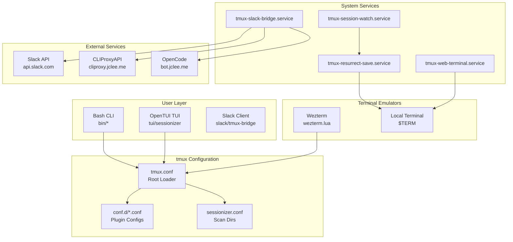

# TMUX SESSIONIZER

[](https://github.com/jclee941/.github/actions/workflows/ci.yml)
[](https://github.com/jclee941/.github/releases)
[](LICENSE)
[](https://github.com/nicerobot/opentui)

> bash-first tmux configuration and session-management toolkit

---

## Table of Contents

- [Overview](#overview)
- [개요 (Korean)](#개요-korean)
- [Features](#features)
- [Architecture](#architecture)
- [Automation Inventory](#automation-inventory)
- [Quick Start](#quick-start)
- [Local Development](#local-development)
- [Commands Reference](#commands-reference)
- [Contribution Guide](#contribution-guide)

---

## Overview

**TMUX SESSIONIZER** is a comprehensive tmux configuration system designed for developers who work with multiple projects and sessions. It provides a unified interface for session discovery, creation, and management, with deep integrations for Slack, system services, and terminal UI applications.

The project is structured as a symlinked `~/.tmux` directory with a plugin-style architecture where core behavior lives in `conf.d/*.conf` and `bin/*` scripts. A nested Bun/OpenTUI sessionizer TUI runs at `tui/sessionizer`, and a Node.js Slack bridge operates at `slack/tmux-bridge`.

### Key Components

| Component | Technology | Purpose |
|-----------|------------|---------|
| Core Config | tmux.conf | Root loader, sources `conf.d/*.conf` |
| Session Scripts | Bash + fzf | Session discovery, creation, management |
| TUI Application | Bun + OpenTUI | Interactive terminal UI for session management |
| Slack Bridge | Node.js + TypeScript | Real-time Slack channel ↔ tmux session sync |
| Systemd Services | unit files | Background services for session persistence |
| Wezterm Integration | Lua | Wezterm terminal emulator configuration |

---

## 개요 (Korean)

**TMUX SESSIONIZER**는 여러 프로젝트와 세션으로 작업하는 개발자를 위해 설계된 종합 tmux 구성 시스템입니다. Slack, 시스템 서비스 및 터미널 UI 애플리케이션과의 심층 통합을 통해 세션 검색, 생성 및 관리를 위한 통합 인터페이스를 제공합니다.

프로젝트는 심볼릭 링크된 `~/.tmux` 디렉토리로 구조화되어 있으며, 플러그인 스타일 아키텍처에서 핵심 동작은 `conf.d/*.conf` 및 `bin/*` 스크립트에 있습니다. 중첩된 Bun/OpenTUI 세션라이저 TUI는 `tui/sessionizer`에서 실행되고, Node.js Slack 브리지는 `slack/tmux-bridge`에서 운영됩니다.

---

## Features

### Session Management

- **Intelligent Session Discovery**: Auto-scan configured directories for git repositories and project folders
- **Fuzzy Session Picker**: fzf-based session selection with preview and instant filtering
- **Session Creation Wizard**: Interactive multi-step wizard for new session setup
- **MRU Session Jump**: Quickly access most recently used sessions
- **Session Templates**: Create sessions from predefined layout templates
- **Session Export/Import**: Save and restore session window/pane layouts as YAML

### Terminal UI (TUI) Application

- **OpenTUI-based Interface**: Modern terminal user interface built with Bun and OpenTUI
- **Preview Panel**: Real-time preview of session contents and windows
- **Kill Confirmation**: Safe session termination with confirmation dialogs
- **Rename Support**: Rename existing sessions with validation
- **Layout Selection**: Visual layout picker for window arrangements
- **Keyboard-driven Navigation**: Full keyboard navigation with vim-style shortcuts

### Slack Integration

- **Real-time Sync**: Bidirectional sync between tmux sessions and Slack channels
- **Session Status**: Post session activity and status to Slack
- **Idle Monitoring**: Track idle time and notify on activity
- **Modal Interactions**: Interactive Slack modals for session management
- **OpenCode Integration**: Launch OpenCode sessions from Slack commands

### System Services

- **Session Persistence**: Automatic session save/restore via `tmux-resurrect`
- **Session Watch**: Monitor and react to session changes
- **Web Terminal**: ttyd-based web terminal access to tmux sessions
- **Slack Bridge Service**: Background service for Slack integration

### Terminal Emulator Integration

- **Wezterm Support**: Native Wezterm configuration with tmux integration
- **Responsive Status Bar**: Width-tiered statusbar rendering
- **Nerd Font Icons**: Visual session icons via font glyphs

---

## Architecture



### Directory Structure

```
tmux-sessionizer/
├── README.md                    # This file
├── AGENTS.md                    # Project knowledge base
├── CONTRIBUTING.md              # Contribution guidelines
├── LICENSE                      # MIT License
├── OWNERS                       # Code ownership
├── tmux.conf                    # Root tmux configuration
├── sessionizer.conf             # Session discovery settings
├── tui/
│   └── sessionizer/             # Bun/OpenTUI TUI application
│       ├── package.json
│       ├── bunfig.toml
│       ├── tsconfig.json
│       ├── vitest.config.ts
│       ├── src/
│       │   ├── App.tsx
│       │   ├── index.tsx
│       │   ├── lib/             # Core libraries
│       │   ├── actions/          # Session actions
│       │   ├── hooks/            # Custom React hooks
│       │   └── components/       # UI components
│       └── __tests__/           # Unit tests
├── slack/
│   └── tmux-bridge/             # Node.js Slack bridge
│       ├── package.json
│       ├── tsconfig.json
│       ├── vitest.config.ts
│       ├── src/
│       │   ├── index.ts         # Entry point
│       │   ├── types.ts         # TypeScript types
│       │   ├── lib/             # Core libraries
│       │   ├── actions/         # Action handlers
│       │   ├── commands/        # Command handlers
│       │   └── __tests__/       # Unit tests
├── wezterm/
│   └── wezterm.lua              # Wezterm configuration
├── systemd/
│   ├── tmux-resurrect-save.service
│   ├── tmux-resurrect-save.sh
│   ├── tmux-server.service
│   ├── tmux-session-watch.path
│   ├── tmux-session-watch.service
│   ├── tmux-slack-bridge.service
│   └── tmux-web-terminal.service
└── .github/
    └── workflows/              # GitHub Actions workflows
```

---

## Automation Inventory

### GitHub Actions Workflows

This project uses **33 GitHub Actions workflows** for comprehensive automation:

#### Pull Request Workflows

| Workflow File | Purpose |
|---------------|---------|
| `01_branch-to-pr.yml` | Convert feature branches to pull requests |
| `03_pr-checks.yml` | Run tests, linting, and validation on PRs |
| `04_actionlint.yml` | Lint GitHub Actions workflow files |
| `05_gitleaks.yml` | Detect secrets and credentials in code |
| `06_codeql.yml` | CodeQL security analysis |
| `07_dependency-review.yml` | Review dependency changes for vulnerabilities |
| `08_scorecard.yml` | OpenSSF Scorecard security assessment |
| `09_semantic-pr.yml` | Enforce semantic PR title format |
| `10_pr-review.yml` | Automated PR review using AI |
| `12_dependabot-auto-merge.yml` | Auto-merge Dependabot updates |
| `13_pr-auto-merge.yml` | Auto-merge approved PRs |
| `14_bot-auto-fix.yml` | Auto-fix code issues using bot |
| `15_merged-pr-cleanup.yml` | Cleanup after PR merge |
| `security/11_pr-review.yml` | Security-focused PR review |

#### Issue Management Workflows

| Workflow File | Purpose |
|---------------|---------|
| `02_issue-to-branch.yml` | Create branch from issue |
| `18_issue-management.yml` | Manage issue lifecycle |
| `19_issue-backfill.yml` | Backfill issue metadata |
| `37_ci-failure-issues.yml` | Auto-create issues for CI failures |
| `43_reusable-issue-management.yml` | Reusable issue management |
| `91_issue-classification.yml` | Classify and label issues |

#### Release & Distribution Workflows

| Workflow File | Purpose |
|---------------|---------|
| `24_release-notes.yml` | Generate release notes |
| `25_release-publish.yml` | Publish releases |

#### Documentation Workflows

| Workflow File | Purpose |
|---------------|---------|
| `20_readme-gen.yml` | Generate README documentation |
| `21_docs-sync.yml` | Sync documentation across repos |
| `42_reusable-docs-sync.yml` | Reusable docs sync workflow |

#### Health & Monitoring Workflows

| Workflow File | Purpose |
|---------------|---------|
| `29_downstream-health-check.yml` | Monitor downstream dependencies |

#### Maintenance Workflows

| Workflow File | Purpose |
|---------------|---------|
| `60_ci-auto-heal.yml` | Auto-heal failing CI pipelines |
| `auto-merge.yml` | Generic auto-merge workflow |
| `ci.yml` | Main CI pipeline |
| `labeler.yml` | Auto-label issues and PRs |
| `welcome.yml` | Welcome new contributors |

#### Reusable Workflows

| Workflow File | Purpose |
|---------------|---------|
| `42_reusable-docs-sync.yml` | Template for docs sync |
| `43_reusable-issue-management.yml` | Template for issue management |
| `44_reusable-pr-checks.yml` | Template for PR checks |
| `45_reusable-gitleaks.yml` | Template for secret scanning |

### AI-Powered Automation Tools

| Tool | Integration | Purpose |
|------|-------------|---------|
| **PR-Agent** | `qodo-ai/pr-agent` | Automated PR review, description, and fixes |
| **CLIProxy API** | `cliproxy.jclee.me` | README generation and documentation |
| **OpenCode** | `bot.jclee.me` | AI-powered code execution and analysis |

---

## Quick Start

### Prerequisites

- **tmux** (≥ 3.0)
- **bash** (≥ 5.0)
- **fzf** (≥ 0.25)
- **Git**
- **Bun** (for TUI application)
- **Node.js** (≥ 18, for Slack bridge)

### Installation

1. **Clone the repository:**

```bash
git clone https://github.com/jclee941/.github ~/.tmux
```

2. **Symlink to home directory:**

```bash
ln -sfn ~/.tmux ~/.tmux
```

3. **Configure session discovery:**

Edit `sessionizer.conf` to add your project directories:

```bash
export SCAN_DIRS="$HOME/projects $HOME/work"
export EXTRA_DIRS="$HOME/dev"
```

4. **Install TPM plugins:**

```bash
tmux source ~/.tmux/tmux.conf
# Press C-a + I to install plugins
```

### TUI Application Setup

```bash
cd ~/.tmux/tui/sessionizer
bun install
```

### Slack Bridge Setup

```bash
cd ~/.tmux/slack/tmux-bridge
npm install
./bin/setup  # Interactive Slack app configuration
```

---

## Local Development

### Repository Structure

```
tmux-sessionizer/
├── bin/                    # Bash executable scripts (30+ commands)
├── bin/lib/                # Shared Bash libraries
├── conf.d/                 # tmux configuration files
├── tui/sessionizer/        # Bun/OpenTUI application
├── slack/tmux-bridge/      # Node.js Slack integration
├── wezterm/                # Wezterm configuration
└── systemd/               # Systemd service files
```

### Development Environment

#### TUI Application

```bash
cd tui/sessionizer

# Install dependencies
bun install

# Run tests
bun test

# Run type checking
bun run typecheck

# Start development server
bun run dev
```

#### Slack Bridge

```bash
cd slack/tmux-bridge

# Install dependencies
npm install

# Run tests
npm test

# Run type checking
npx tsc --noEmit

# Start in development mode
npm run dev
```

#### tmux Configuration

```bash
# Reload tmux configuration
~/.tmux/bin/tmux-config-reload

# View configuration diff
~/.tmux/bin/tmux-config-reload --diff
```

### Testing

```bash
# Run all TUI tests
cd tui/sessionizer && bun test

# Run all Slack bridge tests
cd slack/tmux-bridge && npm test

# Run tmux configuration tests
tmux source-file ~/.tmux/tmux.conf
```

---

## Commands Reference

### Core Session Commands

| Command | Description |
|---------|-------------|
| `tmux-sessionizer` | Main session picker with fzf |
| `tmux-sessionizer-tui` | Launch TUI-based session picker |
| `tmux-session-jump` | Quick MRU session jump |
| `tmux-session-kill` | Kill session with confirmation |
| `tmux-session-rename` | Rename session |
| `tmux-session-sync` | Sync sessions with Slack |
| `tmux-session-export` | Export session layout to YAML |
| `tmux-session-dashboard` | Show session dashboard |
| `tmux-session-icon` | Get Nerd Font icon for session |
| `tmux-session-order` | Sort sessions by MRU |

### Session Creation

| Command | Description |
|---------|-------------|
| `tmux-template-create` | Create session from template |
| `tmux-layout-apply` | Apply YAML layout to session |
| `tmux-session-branch-log` | Log branch on session switch |

### Sidebar Commands

| Command | Description |
|---------|-------------|
| `tmux-sidebar` | Show tree sidebar |
| `tmux-sidebar-init` | Initialize sidebar on session create |
| `tmux-sidebar-toggle` | Toggle sidebar visibility |

### Git Integration

| Command | Description |
|---------|-------------|
| `tmux-git-status` | Show git branch and status |
| `tmux-git-uncommitted` | Track uncommitted changes |

### System Commands

| Command | Description |
|---------|-------------|
| `tmux-config-reload` | Reload tmux configuration |
| `tmux-sys-stats` | Show CPU/MEM stats |
| `tmux-notify-long-command` | Notify on long command completion |
| `tmux-pane-sync` | Toggle synchronize-panes |

### Clipboard & URL

| Command | Description |
|---------|-------------|
| `tmux-url-open` | Extract and open URLs from pane |
| `tmux-file-open` | Extract and open file paths |
| `tmux-ssh-picker` | Pick SSH host from config |
| `tmux-clipboard-history` | Browse tmux buffer history |
| `tmux-copy-word` | Copy word under cursor |

### Web & Remote

| Command | Description |
|---------|-------------|
| `tmux-web-terminal` | Launch ttyd web terminal |
| `tmux-opencode` | Launch OpenCode session |

### Slack Commands

| Command | Description |
|---------|-------------|
| `tmux-slack-bridge-start` | Start Slack bridge service |
| `tmux-slack-bridge-setup` | Interactive Slack app setup |

### Other Commands

| Command | Description |
|---------|-------------|
| `tmux-session-cycle` | Cycle sessions with PgUp/PgDn |
| `tmux-command-palette` | fzf action picker |
| `tmux-cheatsheet` | Show keybinding cheatsheet |
| `tmux-responsive` | Responsive statusbar rendering |
| `tmux-auto-attach` | Auto-attach on login shell |
| `tmux-bash-preexec` | Command timing hook |

---

## Contribution Guide

Please read [CONTRIBUTING.md](CONTRIBUTING.md) for details on our development workflow, coding standards, and pull request process.

### Quick Contribution Steps

1. **Fork the repository**
2. **Create a feature branch:**

   ```bash
   git checkout -b feature/your-feature-name
   # or from issue
   gh issue develop 42 -b feature/
   ```

3. **Make your changes**
4. **Run tests:**

   ```bash
   cd tui/sessionizer && bun test
   cd slack/tmux-bridge && npm test
   ```

5. **Commit using conventional commits:**

   ```bash
   git commit -m "feat: add new feature"
   ```

6. **Push and create PR:**

   ```bash
   git push origin feature/your-feature-name
   ```

### Code Owners

See [OWNERS](OWNERS) file for the list of code owners.

### Automation Notes

- PRs are automatically reviewed by **PR-Agent** (`qodo-ai/pr-agent`)
- README is auto-generated by **CLIProxy** (`cliproxy.jclee.me`)
- Issues are classified by the `91_issue-classification.yml` workflow
- CI failures create issues automatically via `37_ci-failure-issues.yml`

---

## License

This project is licensed under the MIT License - see the [LICENSE](LICENSE) file for details.
