# TMUX SESSIONIZER


[](../../actions/workflows/ci.yml)
[](../../actions/workflows/10_pr-review.yml)
[](../../actions/workflows/11_security-pr-review.yml)
[](../../actions/workflows/13_pr-auto-merge.yml)
[](../../actions/workflows/14_bot-auto-fix.yml)
[](../../actions/workflows/60_ci-auto-heal.yml)
[](../../actions/workflows/25_release-publish.yml)

> **Bash-first tmux configuration and session-management toolkit.**
> Bash 중심의 tmux 설정 및 세션 관리 도구 모음입니다.

---

## Table of Contents

- [Overview](#overview)
- [Features](#features)
- [Repository Structure](#repository-structure)
- [Architecture](#architecture)
- [Automation Inventory](#automation-inventory)
- [Quick Start](#quick-start)
- [Local Development](#local-development)
- [Commands Reference](#commands-reference)
- [Configuration Reference](#configuration-reference)
- [Contribution Guide](#contribution-guide)
- [License](#license)
- [개요](#개요)
- [주요 기능](#주요-기능)
- [저장소 구조](#저장소-구조)
- [아키텍처](#아키텍처-1)
- [자동화 인벤토리](#자동화-인벤토리-1)
- [빠른 시작](#빠른-시작)
- [로컬 개발](#로컬-개발-1)
- [명령어 참고](#명령어-참고-1)
- [설정 참고](#설정-참고)
- [기여 가이드](#기여-가이드-1)
- [라이선스](#라이선스-1)

---

## Overview

`TMUX SESSIONIZER` is a developer-focused tmux environment designed to make session discovery, layout composition, and cross-tool integration fast and scriptable. The repo is symlinked as `~/.tmux` and structured so that every feature is either a small Bash tool under `bin/`, a YAML layout under `layouts/`, or a clearly bounded sub-system under `tui/` and `slack/`.

The core idea is **Bash-first**: no framework, no plugin manager, no hidden state. `tmux.conf` sources `conf.d/*.conf` in numeric order, and every binding resolves to a `bin/tmux-*` script you can read, run, and patch. Two optional sub-systems extend that core without polluting it: a Bun + OpenTUI sessionizer TUI for keyboard-driven session creation, and a Node.js Slack bridge that mirrors tmux sessions into Slack channels.

## Features

- **Prefix-`C-a` keymap** with a single source of truth in `conf.d/20-keys.conf`.
- **Tokyo Night theme** with pane-border status, responsive status bar, and Nerd Font icons per session.
- **Sidebar tree view** with colors, init-on-create, and visibility toggle.
- **Sessionizer** — fzf-based discovery from `SCAN_DIR` + `EXTRA_DIRS`, with a creation wizard and YAML layout attach.
- **Layout templates** in `layouts/*.yml` (proxmox, splunk, safework, resume, default, blacklist).
- **Width-tiered status bar** (`tmux-responsive`) that adapts to terminal width.
- **fzf pickers** for SSH hosts, files, URLs, clipboard history, command palette, git status, and uncommitted changes.
- **Slack bridge** with two transport modes: direct tmux socket and HTTP tunnel via `cloudflared`.
- **Web terminal** launcher backed by `ttyd`.
- **Auto-attach on login** via `tmux-auto-attach`.
- **Git-aware statusline** showing branch, dirty/ahead/behind/stash counts.
- **System stats** (CPU load + memory) for the status bar.
- **Cheatsheet popup** with categorized keybinding reference.
- **CI-friendly**: 16 GitHub Actions workflows covering review, auto-merge, auto-heal, release, and classification.

## Repository Structure

```text
.
├── AGENTS.md                       # Machine-readable project knowledge base
├── CONTRIBUTING.md                 # Contribution conventions
├── LICENSE                         # MIT license
├── OWNERS                          # CODEOWNERS-equivalent for this repo
├── README.md                       # This file
├── sessionizer.conf                # SCAN_DIR + EXTRA_DIRS for session discovery
├── tmux.conf                       # Root loader: sources conf.d/*.conf
├── bin/                            # Bash execution surface (40+ scripts)
│   ├── lib/                        # Shared library modules
│   │   ├── sidebar-colors
│   │   ├── sidebar-render
│   │   ├── tmux-sessionizer-common
│   │   └── tmux-sessionizer-wizard
│   ├── tmux-auto-attach
│   ├── tmux-bash-preexec
│   ├── tmux-cheatsheet
│   ├── tmux-clipboard-history
│   ├── tmux-command-palette
│   ├── tmux-config-reload
│   ├── tmux-copy-word
│   ├── tmux-file-open
│   ├── tmux-git-status
│   ├── tmux-git-uncommitted
│   ├── tmux-layout-apply
│   ├── tmux-notify-long-command
│   ├── tmux-opencode
│   ├── tmux-pane-sync
│   ├── tmux-responsive
│   ├── tmux-session-branch-log
│   ├── tmux-session-cycle
│   ├── tmux-session-dashboard
│   ├── tmux-session-export
│   ├── tmux-session-icon
│   ├── tmux-session-jump
│   ├── tmux-session-kill
│   ├── tmux-session-order
│   ├── tmux-session-rename
│   ├── tmux-session-sync
│   ├── tmux-sessionizer
│   ├── tmux-sessionizer-tui
│   ├── tmux-sidebar
│   ├── tmux-sidebar-init
│   ├── tmux-sidebar-toggle
│   ├── tmux-slack-bridge-setup
│   ├── tmux-slack-bridge-start
│   ├── tmux-ssh-picker
│   ├── tmux-sys-stats
│   ├── tmux-template-create
│   ├── tmux-url-open
│   └── tmux-web-terminal
├── docs/
│   ├── session-persistence-brainstorming.md
│   └── supermemory-governance.md
├── layouts/                        # YAML layout presets
│   ├── blacklist.yml
│   ├── default.yml
│   ├── proxmox.yml
│   ├── resume.yml
│   ├── safework.yml
│   ├── safework2.yml
│   └── splunk.yml
├── slack/
│   └── tmux-bridge/                # Node.js Slack bridge
│       └── AGENTS.md
└── tui/
    └── sessionizer/                # Bun + OpenTUI sessionizer
        ├── AGENTS.md
        ├── bun.lock
        ├── bunfig.toml
        ├── package.json
        ├── tsconfig.json
        ├── __tests__/
        │   ├── config.test.ts
        │   └── tmux.test.ts
        └── src/
            ├── App.tsx
            ├── bun-env.d.ts
            ├── index.tsx
            ├── actions/
            │   └── session-actions.ts
            ├── components/
            │   ├── create-wizard.tsx
            │   ├── filter-input.tsx
            │   ├── kill-confirm-dialog.tsx
            │   ├── preview-panel.tsx
            │   ├── rename-dialog.tsx
            │   ├── session-list.tsx
            │   ├── wizard-step-dir.tsx
            │   ├── wizard-step-layout.tsx
            │   └── wizard-step-name.tsx
            ├── hooks/
            │   └── use-keyboard-handler.ts
            └── lib/
                ├── config.ts
                ├── create-session.ts
                ├── dirs.ts
                ├── state.ts
                ├── theme.ts
                └── tmux.ts
```

> Note: GitHub Actions workflow files are referenced in [Automation Inventory](#automation-inventory) by their on-disk names with numeric prefixes (for example `10_pr-review.yml`).

## Architecture

The runtime is layered. The root `tmux.conf` is a thin loader that sources `conf.d/*.conf` in numeric order so each concern (core, theme, keys, sidebar) is a single, reviewable file. Every keybinding resolves to a `bin/tmux-*` script, which keeps behavior diffable and testable in isolation. Two optional sub-systems — the Bun/OpenTUI sessionizer and the Node.js Slack bridge — sit beside the core and only depend on the public `bin/` and `lib/` surfaces.

```mermaid
flowchart TB
    subgraph Config["Configuration Layer"]
        RootConf["tmux.conf<br/>root loader"]
        SessConf["sessionizer.conf<br/>SCAN_DIR + EXTRA_DIRS"]
        subgraph ConfD["conf.d/ (sourced in numeric order)"]
            C00["00-core.conf<br/>env + perf baseline"]
            C10["10-theme.conf<br/>Tokyo Night palette"]
            C20["20-keys.conf<br/>prefix = C-a"]
            C25["25-sidebar.conf<br/>sidebar bindings"]
        end
    end

    subgraph BinLayer["bin/ — Bash Execution Surface"]
        direction TB
        subgraph Session["Session Management"]
            S1["tmux-sessionizer"]
            S2["tmux-session-cycle"]
            S3["tmux-session-jump"]
            S4["tmux-session-kill"]
            S5["tmux-session-rename"]
            S6["tmux-session-dashboard"]
            S7["tmux-session-export"]
            S8["tmux-session-order"]
            S9["tmux-session-icon"]
            S10["tmux-session-branch-log"]
            S11["tmux-session-sync"]
        end
        subgraph Pickers["fzf Pickers"]
            P1["tmux-command-palette"]
            P2["tmux-ssh-picker"]
            P3["tmux-file-open"]
            P4["tmux-url-open"]
            P5["tmux-clipboard-history"]
            P6["tmux-copy-word"]
            P7["tmux-git-status"]
            P8["tmux-git-uncommitted"]
        end
        subgraph UI["Status + Sidebar"]
            U1["tmux-responsive"]
            U2["tmux-sys-stats"]
            U3["tmux-sidebar"]
            U4["tmux-sidebar-init"]
            U5["tmux-sidebar-toggle"]
            U6["tmux-notify-long-command"]
            U7["tmux-pane-sync"]
        end
        subgraph Layout["Layouts + Web"]
            L1["tmux-layout-apply"]
            L2["tmux-template-create"]
            L3["tmux-cheatsheet"]
            L4["tmux-config-reload"]
            L5["tmux-auto-attach"]
            L6["tmux-web-terminal"]
        end
        subgraph Bridge["Slack Bridge Wrappers"]
            B1["tmux-slack-bridge-start<br/>socket / cloudflared"]
            B2["tmux-slack-bridge-setup<br/>interactive wizard"]
        end
    end

    subgraph Ext["External Sub-systems"]
        TUI["tui/sessionizer<br/>Bun + OpenTUI"]
        BridgeNode["slack/tmux-bridge<br/>Node.js"]
        TTYD["ttyd<br/>web terminal"]
        CF["cloudflared<br/>optional tunnel"]
    end

    Layouts[("layouts/*.yml<br/>proxmox, splunk,<br/>safework, resume,<br/>default, blacklist")]

    RootConf --> ConfD
    SessConf --> S1
    TUI -. launches .-> S1
    B1 --> BridgeNode
    B1 -. tunnel .-> CF
    BridgeNode <--> S11
    Layouts --> L1
    Layouts --> L2
    L6 --> TTYD

    classDef cfg fill:#7aa2f7,stroke:#3d59a1,color:#1a1b26
    classDef bash fill:#9ece6a,stroke:#3d59a1,color:#1a1b26
    classDef ext fill:#bb9af7,stroke:#3d59a1,color:#1a1b26
    classDef store fill:#e0af68,stroke:#3d59a1,color:#1a1b26
    class RootConf,SessConf,C00,C10,C20,C25 cfg
    class S1,S2,S3,S4,S5,S6,S7,S8,S9,S10,S11,P1,P2,P3,P4,P5,P6,P7,P8,U1,U2,U3,U4,U5,U6,U7,L1,L2,L3,L4,L5,L6,B1,B2 bash
    class TUI,BridgeNode,TTYD,CF ext
    class Layouts store
```



## Automation Inventory

This repository is operated end-to-end by 16 GitHub Actions workflows. There are no Go automation tools in this repo — the automation surface is exclusively workflow-driven.

| # | Workflow file | Purpose |
|---|---|---|
| 01 | `01_branch-to-pr.yml` | Converts a long-lived branch into a pull request with a templated body. |
| 02 | `02_issue-to-branch.yml` | Creates a branch from an issue and links it back via PR body. |
| 10 | `10_pr-review.yml` | Runs automated PR review using [qodo-ai/pr-agent](https://github.com/qodo-ai/pr-agent) and posts the review as a comment. |
| 11 | `11_security-pr-review.yml` | Re-runs the PR review with a security-focused lens and surfaces findings. |
| 12 | `12_dependabot-auto-merge.yml` | Auto-merges Dependabot PRs that pass CI and review checks. |
| 13 | `13_pr-auto-merge.yml` | Auto-merges PRs that meet the merge policy (approvals, checks, labels). |
| 14 | `14_bot-auto-fix.yml` | Bot-driven self-heal flow: opens or amends a PR in response to an issue. |
| 15 | `15_merged-pr-cleanup.yml` | Deletes merged branches and closes linked issues as appropriate. |
| 19 | `19_issue-backfill.yml` | Backfills metadata (labels, milestones, project fields) for older issues. |
| 24 | `24_release-notes.yml` | Generates the changelog/release notes draft from merged PRs. |
| 25 | `25_release-publish.yml` | Publishes the release: tags, attaches artifacts, and announces. |
| 29 | `29_downstream-health-check.yml` | Verifies downstream consumers (sub-systems, Slack bridge, TUI build) are still healthy after a release. |
| 37 | `37_ci-failure-issues.yml` | Opens a tracking issue whenever a CI run fails repeatedly. |
| 60 | `60_ci-auto-heal.yml` | Attempts a bounded set of auto-fixes (lockfile regen, lint --fix, retry) before opening an issue. |
| 91 | `91_issue-classification.yml` | Auto-applies area / priority / kind labels to new issues. |
| — | `ci.yml` | Default CI: shellcheck on `bin/`, Bun tests for `tui/sessionizer`, and lint. |

### Workflow precedence and intent

- The numeric prefixes encode intent: `0x` is intake (branches, issues), `1x` is PR lifecycle, `2x` is release, `3x` is CI failure handling, `6x` is auto-heal, `9x` is classification, and `ci.yml` is the always-on baseline.
- Auto-merge workflows (`12`, `13`) are gated by required checks and branch protection; they never bypass review policy.
- The release pair (`24`, `25`) is intentionally split: `24` produces an artifact (notes), `25` consumes it for publication.
- `60_ci-auto-heal.yml` runs **before** `37_ci-failure-issues.yml` to avoid opening a tracking issue for transient or auto-fixable failures.

## Quick Start

```bash
# 1. Clone into ~/.tmux (the canonical symlink target)
git clone https://github.com/<your-org>/tmux-sessionizer.git ~/.tmux

# 2. Ensure the loader is sourced from your shell rc
#    (add this to ~/.bashrc or ~/.zshrc)
[ -f ~/.tmux/tmux.conf ] && tmux source-file ~/.tmux/tmux.conf

# 3. Install runtime deps used by bin/* scripts
#    - tmux >= 1.9
#    - fzf
#    - gh (for GitHub-aware helpers)
#    - A Nerd Font in your terminal for icons
brew install tmux fzf gh   # or: apt install tmux fzf gh

# 4. Open a new terminal — tmux will auto-attach (tmux-auto-attach)
#    and the prefix key is C-a.
```

Launch the optional TUI sessionizer:

```bash
~/.tmux/bin/tmux-sessionizer-tui   # or bind it from conf.d/20-keys.conf
```

Launch the optional Slack bridge (interactive wizard on first run):

```bash
~/.tmux/bin/tmux-slack-bridge-setup   # one-time
~/.tmux/bin/tmux-slack-bridge-start   # every shell / via systemd
```

## Local Development

### Bash surface (`bin/`, `conf.d/`, `layouts/`)

```bash
# Lint every Bash script in bin/
find bin -type f -name 'tmux-*' -exec shellcheck {} +

# Validate YAML layouts parse
for f in layouts/*.yml; do yq eval . "$f" >/dev/null; done

# Reload config in a running tmux server
~/.tmux/bin/tmux-config-reload
```

### TUI sessionizer (`tui/sessionizer/`)

```bash
cd tui/sessionizer
bun install
bun test                 # runs __tests__/*
bun run dev              # launches the TUI
bun run typecheck        # tsc --noEmit
```

See `tui/sessionizer/AGENTS.md` for component boundaries, state model, and test conventions.

### Slack bridge (`slack/tmux-bridge/`)

```bash
cd slack/tmux-bridge
npm install
npm test                 # unit + integration
npm run start            # direct socket mode
npm run start:http       # cloudflared-tunneled mode
```

See `slack/tmux-bridge/AGENTS.md` for socket-vs-HTTP mode selection and the `cloudflared` bring-up procedure.

### End-to-end checks

```bash
# Mimic the GitHub Actions baseline locally
gh act -W .github/workflows/ci.yml
```

## Commands Reference

All commands live under `bin/` and follow the `tmux-<verb>-<noun>` convention. They are designed to be bound in `conf.d/20-keys.conf` or invoked directly.

### Session lifecycle

| Command | Description |
|---|---|
| `tmux-sessionizer` | fzf session picker with creation wizard (directory → layout → name). |
| `tmux-sessionizer-tui` | Launches the Bun + OpenTUI sessionizer. |
| `tmux-session-cycle` | Cycles sessions with `PgUp`/`PgDn`, excluding `opencode` sessions. |
| `tmux-session-jump` | MRU fzf session picker for quick jump. |
| `tmux-session-kill` | Safe session termination with confirmation. |
| `tmux-session-rename` | Rename the current session with validation. |
| `tmux-session-dashboard` | Formatted session table popup. |
| `tmux-session-export` | Export a session's layout to YAML. |
| `tmux-session-order` | List sessions sorted by most recently active. |
| `tmux-session-icon` | Resolve a Nerd Font icon for a session name. |
| `tmux-session-branch-log` | Append session → branch mappings to a log on switch. |
| `tmux-session-sync` | Mirror tmux sessions to Slack channels. |

### Sidebar

| Command | Description |
|---|---|
| `tmux-sidebar` | Tree sidebar display engine. |
| `tmux-sidebar-init` | Initialize the sidebar on session create. |
| `tmux-sidebar-toggle` | Toggle sidebar visibility. |

### Status bar and system

| Command | Description |
|---|---|
| `tmux-responsive` | Render a width-tiered status bar. |
| `tmux-sys-stats` | CPU load + memory usage for the status bar. |
| `tmux-git-status` | Branch, dirty/ahead/behind/stash counts. |
| `tmux-git-uncommitted` | Track uncommitted changes per session. |
| `tmux-notify-long-command` | Desktop notification when a command exceeds a threshold. |
| `tmux-pane-sync` | Toggle `synchronize-panes` for the current window. |
| `tmux-bash-preexec` | Sourceable shell preexec hook for command timing. |

### fzf pickers

| Command | Description |
|---|---|
| `tmux-command-palette` | fzf action picker for common operations. |
| `tmux-ssh-picker` | `~/.ssh/config` host picker. |
| `tmux-file-open` | Extract and open a file path from the active pane. |
| `tmux-url-open` | Extract and open a URL from the active pane. |
| `tmux-clipboard-history` | Browse the tmux buffer ring. |
| `tmux-copy-word` | Smart word-copy under the cursor. |

### Layouts and templates

| Command | Description |
|---|---|
| `tmux-template-create` | Create a session from a preset template in `layouts/`. |
| `tmux-layout-apply` | Apply a YAML layout template to the current session. |

### Web and bridge

| Command | Description |
|---|---|
| `tmux-web-terminal` | Launch a `ttyd` web terminal bound to the current session. |
| `tmux-slack-bridge-start` | Start the Slack bridge (socket direct or `cloudflared` HTTP). |
| `tmux-slack-bridge-setup` | Interactive wizard to configure the Slack app. |

### Maintenance

| Command | Description |
|---|---|
| `tmux-auto-attach` | Auto-attach flow for login shells. |
| `tmux-config-reload` | Reload `tmux.conf` and show a settings diff. |
| `tmux-cheatsheet` | Categorized keybinding reference popup. |
| `tmux-opencode` | OpenCode session launcher. |

## Configuration Reference

### `sessionizer.conf`

Sets the discovery roots consumed by `tmux-sessionizer` and `tmux-sessionizer-tui`:

- `SCAN_DIR` — primary directory tree to scan for projects.
- `EXTRA_DIRS` — additional roots, colon-separated.

### `conf.d/` (sourced in numeric order)

| File | Role |
|---|---|
| `00-core.conf` | Terminal/perf baseline, env propagation. |
| `10-theme.conf` | Tokyo Night palette, pane-border status. |
| `20-keys.conf` | All keybindings (prefix = `C-a`). |
| `25-sidebar.conf` | Sidebar bindings and refresh triggers. |

### `layouts/`

YAML presets consumed by `tmux-template-create` and `tmux-layout-apply`. See file headers for the schema; the canonical examples are `proxmox.yml`, `splunk.yml`, `safework.yml`, `safework2.yml`, `resume.yml`, and `default.yml`. `blacklist.yml` is a denylist of session-name patterns.

### Shared libraries (`bin/lib/`)

- `tmux-sessionizer-common` — shared sessionizer functions.
- `tmux-sessionizer-wizard` — creation wizard logic.
- `sidebar-colors` — sidebar color definitions.
- `sidebar-render` — sidebar rendering engine.

## Contribution Guide

1. Read `AGENTS.md` at the repo root for the canonical project model.
2. Read the subsystem-specific `AGENTS.md` before touching:
   - `tui/sessionizer/AGENTS.md` for any change under `tui/sessionizer/`.
   - `slack/tmux-bridge/AGENTS.md` for any change under `slack/tmux-bridge/`.
3. Follow `CONTRIBUTING.md` for branch naming, commit messages, and PR template.
4. Respect the `OWNERS` file: route reviews to the listed code owners per path.
5. Keep `bin/*` scripts `shellcheck`-clean; the CI workflow `ci.yml` enforces this.
6. For new Bash scripts, place them under `bin/`, share helpers via `bin/lib/`, and add a binding in `conf.d/20-keys.conf`.
7. For new layouts, drop a YAML file under `layouts/` and reference it from `tmux-template-create`.
8. For new TUI features, add a test under `tui/sessionizer/__tests__/` and run `bun test` locally before opening the PR.
9. PRs flow through `10_pr-review.yml` and `11_security-pr-review.yml`. Auto-merge (`13_pr-auto-merge.yml`) is enabled for PRs that pass required checks and approvals.
10. Releases are produced by the `24_release-notes.yml` → `25_release-publish.yml` pair; do not tag manually.

## License

Released under the [MIT License](./LICENSE).

---

# 한국어 문서

## 개요

`TMUX SESSIONIZER`는 세션 탐색, 레이아웃 구성, 외부 도구 연동을 빠르고 스크립트 가능하게 만드는 데 초점을 맞춘 tmux 환경입니다. 저장소는 `~/.tmux`로 심볼릭 링크되며, 모든 기능은 `bin/` 아래의 작은 Bash 도구, `layouts/`의 YAML 레이아웃, 또는 `tui/` 및 `slack/`의 경계가 명확한 서브시스템 중 하나입니다.

핵심 철학은 **Bash 우선**입니다. 프레임워크도, 플러그인 매니저도, 숨겨진 상태도 없습니다. `tmux.conf`는 `conf.d/*.conf`를 숫자 순서대로 소싱하며, 모든 키 바인딩은 읽고 실행하고 패치할 수 있는 `bin/tmux-*` 스크립트로 해소됩니다. 이 코어 위에 두 개의 선택적 서브시스템이 올라갑니다. 키보드 중심의 세션 생성을 위한 Bun + OpenTUI 세셔나이저 TUI, 그리고 tmux 세션을 Slack 채널로 미러링하는 Node.js 슬랙 브리지입니다.

## 주요 기능

- **프리픽스 `C-a` 키맵**, 단일 진실 소스는 `conf.d/20-keys.conf`.
- **Tokyo Night 테마**, 패널 보더 상태 표시, 반응형 상태바, Nerd Font 아이콘 매핑.
- **사이드바 트리 뷰**, 색상·세션 생성 시 자동 초기화·표시 토글 지원.
- **세셔나이저**, `SCAN_DIR` + `EXTRA_DIRS` 기반 fzf 탐색, 생성 위저드와 YAML 레이아웃 부착.
- **레이아웃 템플릿** (`layouts/*.yml`: proxmox, splunk, safework, resume, default, blacklist).
- **터미널 폭에 적응하는 상태바** (`tmux-responsive`).
- **fzf 피커**: SSH 호스트, 파일, URL, 클립보드 히스토리, 커맨드 팔레트, Git 상태, 미커밋 변경.
- **두 가지 전송 모드를 가진 슬랙 브리지**: tmux 소켓 직접 모드와 `cloudflared` HTTP 터널 모드.
- **`ttyd` 기반 웹 터미널** 런처.
- **로그인 셸 자동 attach** (`tmux-auto-attach`).
- **Git 인지 상태선**: 브랜치, dirty/ahead/behind/stash 카운트.
- **시스템 통계** (CPU 로드 + 메모리) 표시.
- **키바인딩 치트시트** 팝업.
- **CI 친화적**: 리뷰·자동 병합·자동 복구·릴리스·분류를 다루는 16개의 GitHub Actions 워크플로우.

## 저장소 구조

저장소 구조는 영문 섹션의 [Repository Structure](#repository-structure)와 동일합니다. 핵심 디렉터리는 다음과 같습니다.

```text
.
├── tmux.conf          # 루트 로더: conf.d/*.conf 를 소싱
├── sessionizer.conf   # SCAN_DIR + EXTRA_DIRS
├── bin/               # 40여 개의 Bash 스크립트 (실행 표면)
│   └── lib/           # 공용 라이브러리 모듈
├── conf.d/            # 00-core / 10-theme / 20-keys / 25-sidebar
├── layouts/           # YAML 레이아웃 프리셋
├── tui/sessionizer/   # Bun + OpenTUI 세셔나이저
└── slack/tmux-bridge/ # Node.js 슬랙 브리지
```

## 아키텍처

런타임은 계층화되어 있습니다. 루트 `tmux.conf`는 얇은 로더이며, 각 관심사(코어, 테마, 키, 사이드바)를 별도 파일로 분리하기 위해 `conf.d/*.conf`를 숫자 순서대로 소싱합니다. 모든 키바인딩은 `bin/tmux-*` 스크립트로 해소되어 동작이 diff 가능하고 단위 테스트하기 쉽습니다. 두 개의 선택적 서브시스템(Bun/OpenTUI 세셔나이저와 Node.js 슬랙 브리지)은 코어 옆에 자리 잡고, 공개된 `bin/` 및 `lib/` 표면에만 의존합니다.

상단 영문 섹션의 [Architecture](#architecture) 다이어그램(Mermaid)을 참고하세요. 노드 색상은 다음 범례를 따릅니다.

- 파란색: 설정 계층 (`tmux.conf`, `conf.d/`, `sessionizer.conf`)
- 녹색: `bin/`의 Bash 실행 표면
- 보라색: 외부 서브시스템 (Bun/OpenTUI TUI, Node.js 브리지, `ttyd`, `cloudflared`)
- 주황색: 데이터 저장소 (`layouts/*.yml`)

## 자동화 인벤토리

이 저장소는 16개의 GitHub Actions 워크플로우로 종단 간 운영됩니다. Go 자동화 도구는 없으며, 자동화 표면은 전적으로 워크플로우 기반입니다.

| # | 워크플로우 파일 | 목적 |
|---|---|---|
| 01 | `01_branch-to-pr.yml` | 장수 브랜치를 템플릿 본문이 적용된 PR로 변환합니다. |
| 02 | `02_issue-to-branch.yml` | 이슈로부터 브랜치를 생성하고 PR 본문으로 다시 연결합니다. |
| 10 | `10_pr-review.yml` | [qodo-ai/pr-agent](https://github.com/qodo-ai/pr-agent)로 자동 PR 리뷰를 수행하고 코멘트로 게시합니다. |
| 11 | `11_security-pr-review.yml` | 보안 관점으로 PR 리뷰를 재실행하여 결과를 표면화합니다. |
| 12 | `12_dependabot-auto-merge.yml` | CI와 리뷰를 통과한 Dependabot PR을 자동 병합합니다. |
| 13 | `13_pr-auto-merge.yml` | 병합 정책(승인, 체크, 라벨)을 충족한 PR을 자동 병합합니다. |
| 14 | `14_bot-auto-fix.yml` | 이슈에 반응하여 PR을 열거나 갱신하는 봇 셀프힐 플로우입니다. |
| 15 | `15_merged-pr-cleanup.yml` | 병합된 브랜치를 삭제하고 연결된 이슈를 적절히 종료합니다. |
| 19 | `19_issue-backfill.yml` | 기존 이슈의 메타데이터(라벨, 마일스톤, 프로젝트 필드)를 백필합니다. |
| 24 | `24_release-notes.yml` | 병합된 PR로부터 릴리스 노트/변경 로그 초안을 생성합니다. |
| 25 | `25_release-publish.yml` | 태그 지정, 아티팩트 첨부, 공지를 포함해 릴리스를 게시합니다. |
| 29 | `29_downstream-health-check.yml` | 릴리스 이후 다운스트림 컨슈머(서브시스템, 슬랙 브리지, TUI 빌드)의 건강 상태를 검증합니다. |
| 37 | `37_ci-failure-issues.yml` | CI 실행이 반복적으로 실패하면 추적 이슈를 엽니다. |
| 60 | `60_ci-auto-heal.yml` | 추적 이슈를 열기 전에 제한된 자동 수정(lockfile 재생성, lint --fix, 재시도)을 시도합니다. |
| 91 | `91_issue-classification.yml` | 새 이슈에 area / priority / kind 라벨을 자동 부여합니다. |
| — | `ci.yml` | 기본 CI: `bin/`의 shellcheck, `tui/sessionizer/`의 Bun 테스트, lint. |

### 워크플로우 우선순위와 의도

- 숫자 접두사는 의도를编码합니다. `0x`는 인테이크(브랜치·이슈), `1x`는 PR 라이프사이클, `2x`는 릴리스, `3x`는 CI 실패 처리, `6x`는 자동 복구, `9x`는 분류, `ci.yml`은 항상 켜져 있는 베이스라인입니다.
- 자동 병합 워크플로우(`12`, `13`)는 필수 체크와 브랜치 보호 정책에 의해 게이팅되며, 리뷰 정책을 우회하지 않습니다.
- 릴리스 페어(`24`, `25`)는 의도적으로 분리되었습니다. `24`는 아티팩트(노트)를 만들고, `25`는 이를 소비해 게시합니다.
- `60_ci-auto-heal.yml`은 일시적이거나 자동 수정 가능한 실패에 대해 추적 이슈가 열리지 않도록 `37_ci-failure-issues.yml`보다 먼저 실행됩니다.

## 빠른 시작

```bash
# 1. ~/.tmux로 클론 (정식 심볼릭 링크 대상)
git clone https://github.com/<your-org>/tmux-sessionizer.git ~/.tmux

# 2. 셸 rc에서 로더를 소싱
#    (~/.bashrc 또는 ~/.zshrc에 추가)
[ -f ~/.tmux/tmux.conf ] && tmux source-file ~/.tmux/tmux.conf

# 3. bin/* 스크립트가 사용하는 런타임 의존성 설치
#    - tmux >= 1.9
#    - fzf
#    - gh (GitHub 인지 헬퍼용)
#    - 아이콘용 Nerd Font
brew install tmux fzf gh   # 또는: apt install tmux fzf gh

# 4. 새 터미널을 열면 tmux가 자동 attach 되고 (tmux-auto-attach)
#    프리픽스 키는 C-a 입니다.
```

선택적 TUI 세셔나이저 실행:

```bash
~/.tmux/bin/tmux-sessionizer-tui
```

선택적 슬랙 브리지 실행 (최초 1회 인터랙티브 위저드):

```bash
~/.tmux/bin/tmux-slack-bridge-setup   # 1회성
~/.tmux/bin/tmux-slack-bridge-start   # 매 셸 또는 systemd로
```

## 로컬 개발

### Bash 표면 (`bin/`, `conf.d/`, `layouts/`)

```bash
# bin/ 아래 모든 Bash 스크립트 lint
find bin -type f -name 'tmux-*' -exec shellcheck {} +

# YAML 레이아웃 파싱 검증
for f in layouts/*.yml; do yq eval . "$f" >/dev/null; done

# 실행 중인 tmux 서버에서 설정 리로드
~/.tmux/bin/tmux-config-reload
```

### TUI 세셔나이저 (`tui/sessionizer/`)

```bash
cd tui/sessionizer
bun install
bun test                 # __tests__/* 실행
bun run dev              # TUI 기동
bun run typecheck        # tsc --noEmit
```

컴포넌트 경계, 상태 모델, 테스트 규약은 `tui/sessionizer/AGENTS.md`를 참고하세요.

### 슬랙 브리지 (`slack/tmux-bridge/`)

```bash
cd slack/tmux-bridge
npm install
npm test                 # 단위 + 통합
npm run start            # 소켓 직접 모드
npm run start:http       # cloudflared 터널 모드
```

소켓 vs HTTP 모드 선택과 `cloudflared` 기동 절차는 `slack/tmux-bridge/AGENTS.md`를 참고하세요.

### 종단 간 검증

```bash
# 로컬에서 GitHub Actions 베이스라인 재현
gh act -W .github/workflows/ci.yml
```

## 명령어 참고

모든 명령은 `bin/` 아래에 있으며 `tmux-<동사>-<명사>` 규칙을 따릅니다. `conf.d/20-keys.conf`에 바인딩하거나 직접 실행할 수 있습니다.

### 세션 라이프사이클

| 명령어 | 설명 |
|---|---|
| `tmux-sessionizer` | 디렉터리 → 레이아웃 → 이름 순서의 생성 위저드를 갖춘 fzf 세션 피커. |
| `tmux-sessionizer-tui` | Bun + OpenTUI 세셔나이저를 기동합니다. |
| `tmux-session-cycle` | `PgUp`/`PgDn`으로 세션을 순환하며 `opencode` 세션은 제외합니다. |
| `tmux-session-jump` | MRU 기반 fzf 세션 점프 피커. |
| `tmux-session-kill` | 확인 절차를 거친 안전한 세션 종료. |
| `tmux-session-rename` | 검증을 포함해 현재 세션 이름을 변경합니다. |
| `tmux-session-dashboard` | 포맷된 세션 테이블 팝업. |
| `tmux-session-export` | 세션 레이아웃을 YAML로 내보냅니다. |
| `tmux-session-order` | 가장 최근 활성 순으로 세션을 정렬해 나열합니다. |
| `tmux-session-icon` | 세션 이름에 대응하는 Nerd Font 아이콘을 반환합니다. |
| `tmux-session-branch-log` | 세션 → 브랜치 매핑을 전환 시 로그에 추가합니다. |
| `tmux-session-sync` | tmux 세션을 Slack 채널에 미러링합니다. |

### 사이드바

| 명령어 | 설명 |
|---|---|
| `tmux-sidebar` | 트리 사이드바 디스플레이 엔진. |
| `tmux-sidebar-init` | 세션 생성 시 사이드바를 초기화합니다. |
| `tmux-sidebar-toggle` | 사이드바 가시성을 토글합니다. |

### 상태바 및 시스템

| 명령어 | 설명 |
|---|---|
| `tmux-responsive` | 폭에 따라 단계를 갖는 상태바를 렌더링합니다. |
| `tmux-sys-stats` | 상태바용 CPU 로드 + 메모리 사용량. |
| `tmux-git-status` | 브랜치, dirty/ahead/behind/stash 카운트. |
| `tmux-git-uncommitted` | 세션별 미커밋 변경을 추적합니다. |
| `tmux-notify-long-command` | 명령이 임계치를 넘으면 데스크톱 알림을 보냅니다. |
| `tmux-pane-sync` | 현재 윈도우의 `synchronize-panes`를 토글합니다. |
| `tmux-bash-preexec` | 명령 타이밍용 셸 preexec 훅 (소스 가능). |

### fzf 피커

| 명령어 | 설명 |
|---|---|
| `tmux-command-palette` | 일반 작업을 위한 fzf 액션 피커. |
| `tmux-ssh-picker` | `~/.ssh/config` 호스트 피커. |
| `tmux-file-open` | 활성 패널에서 파일 경로를 추출해 엽니다. |
| `tmux-url-open` | 활성 패널에서 URL을 추출해 엽니다. |
| `tmux-clipboard-history` | tmux 버퍼 링을 탐색합니다. |
| `tmux-copy-word` | 커서 아래 단어를 똑똑하게 복사합니다. |

### 레이아웃과 템플릿

| 명령어 | 설명 |
|---|---|
| `tmux-template-create` | `layouts/`의 프리셋 템플릿으로 세션을 생성합니다. |
| `tmux-layout-apply` | 현재 세션에 YAML 레이아웃 템플릿을 적용합니다. |

### 웹과 브리지

| 명령어 | 설명 |
|---|---|
| `tmux-web-terminal` | 현재 세션에 바인딩된 `ttyd` 웹 터미널을 기동합니다. |
| `tmux-slack-bridge-start` | 슬랙 브리지를 시작합니다 (소켓 직접 또는 `cloudflared` HTTP). |
| `tmux-slack-bridge-setup` | Slack 앱 설정을 위한 인터랙티브 위저드입니다. |

### 유지보수

| 명령어 | 설명 |
|---|---|
| `tmux-auto-attach` | 로그인 셸의 자동 attach 플로우. |
| `tmux-config-reload` | `tmux.conf`를 리로드하고 설정 차이를 표시합니다. |
| `tmux-cheatsheet` | 카테고리화된 키바인딩 참고 팝업. |
| `tmux-opencode` | OpenCode 세션 런처. |

## 설정 참고

### `sessionizer.conf`

`tmux-sessionizer` 및 `tmux-sessionizer-tui`가 사용하는 탐색 루트를 설정합니다.

- `SCAN_DIR`: 프로젝트를 스캔할 1차 디렉터리 트리.
- `EXTRA_DIRS`: 콜론으로 구분된 추가 루트.

### `conf.d/` (숫자 순서로 소싱)

| 파일 | 역할 |
|---|---|
| `00-core.conf` | 터미널/성능 베이스라인, 환경 변수 전파. |
| `10-theme.conf` | Tokyo Night 팔레트, 패널 보더 상태. |
| `20-keys.conf` | 모든 키바인딩 (프리픽스 = `C-a`). |
| `25-sidebar.conf` | 사이드바 바인딩과 새로 고침 트리거. |

### `layouts/`

`tmux-template-create`와 `tmux-layout-apply`가 소비하는 YAML 프리셋입니다. 스키마는 각 파일 헤더를 참고하세요. 표준 예시는 `proxmox.yml`, `splunk.yml`, `safework.yml`, `safework2.yml`, `resume.yml`, `default.yml`이며, `blacklist.yml`은 세션 이름 패턴의 차단 목록입니다.

### 공용 라이브러리 (`bin/lib/`)

- `tmux-sessionizer-common`: 세셔나이저 공용 함수.
- `tmux-sessionizer-wizard`: 생성 위저드 로직.
- `sidebar-colors`: 사이드바 색상 정의.
- `sidebar-render`: 사이드바 렌더링 엔진.

## 기여 가이드

1. 루트의 `AGENTS.md`에서 정식 프로젝트 모델을 먼저 읽으세요.
2. 다음 영역을 수정하기 전에는 반드시 해당 서브시스템의 `AGENTS.md`를 읽으세요.
   - `tui/sessionizer/AGENTS.md` — `tui/sessionizer/` 하위 변경 시.
   - `slack/tmux-bridge/AGENTS.md` — `slack/tmux-bridge/` 하위 변경 시.
3. 브랜치 명명 규칙, 커밋 메시지, PR 템플릿은 `CONTRIBUTING.md`를 따르세요.
4. `OWNERS` 파일을尊重해 경로별 코드 오너에게 리뷰를 라우팅하세요.
5. `bin/*` 스크립트는 `shellcheck` 클린을 유지하세요. CI의 `ci.yml`이 이를 강제합니다.
6. 새 Bash 스크립트는 `bin/` 아래에 추가하고, 헬퍼는 `bin/lib/`로 공유하며, `conf.d/20-keys.conf`에 바인딩을 추가하세요.
7. 새 레이아웃은 `layouts/`에 YAML 파일을 추가하고 `tmux-template-create`에서 참조하세요.
8. 새 TUI 기능은 `tui/sessionizer/__tests__/` 아래에 테스트를 추가하고 PR을 열기 전에 로컬에서 `bun test`를 실행하세요.
9. PR은 `10_pr-review.yml`과 `11_security-pr-review.yml`을 통과합니다. 필수 체크와 승인을 통과한 PR에 대해 `13_pr-auto-merge.yml`이 자동 병합을 수행합니다.
10. 릴리스는 `24_release-notes.yml` → `25_release-publish.yml` 페어로 생성됩니다. 수동으로 태그하지 마세요.

## 라이선스

[MIT License](./LICENSE) 하에 배포됩니다.