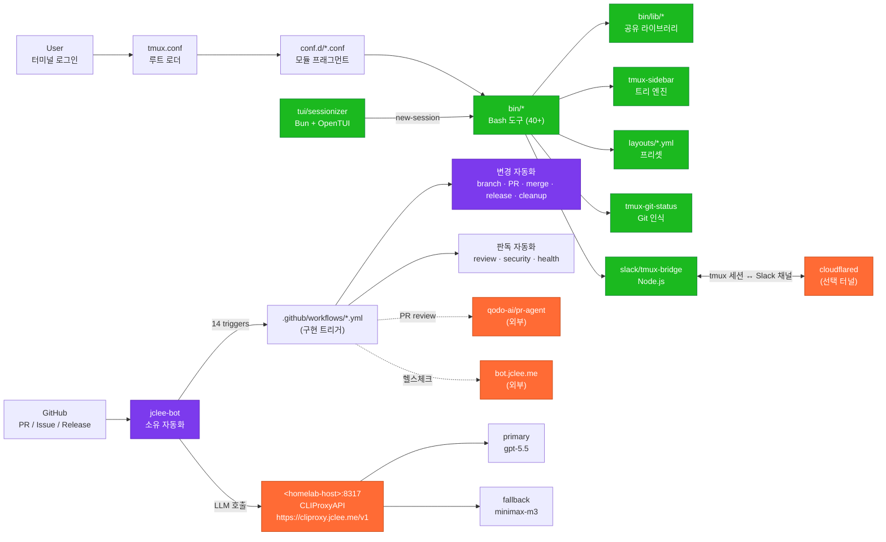

# TMUX SESSIONIZER / tmux 세션나이저


> A Bash-first tmux configuration and session-management toolkit, symlinked as `~/.tmux`, with a Bun/OpenTUI sessionizer, a Node.js Slack bridge, and a fully automated GitHub lifecycle owned by **jclee-bot**.
>
> Bash 우선 tmux 설정 및 세션 관리 툴킷. `~/.tmux`로 심볼릭 링크되며, Bun/OpenTUI 세션나이저, Node.js Slack 브리지, 그리고 **jclee-bot**이 완전히 소유하는 GitHub 자동화 라이프사이클을 함께 제공한다.

---

## Overview / 개요

**English.** TMUX SESSIONIZER is a homelab-grade tmux distribution built around a single rule: keep the loader thin and put behavior in small, composable, individually testable Bash tools. The `tmux.conf` at the root is just a `source` chain that pulls in modular `conf.d/*.conf` fragments; the real surface area lives in `bin/` — more than forty command-line tools that handle session discovery, sidebar rendering, dashboards, layout templates, Git awareness, Slack bridging, URL and file picking, status-bar widgets, SSH host picking, clipboard history, web terminal launching, and more.

Two companion applications extend the core:

- A Bun/OpenTUI sessionizer in `tui/sessionizer` for keyboard-driven session discovery.
- A Node.js Slack bridge in `slack/tmux-bridge` that mirrors tmux sessions into Slack channels.

**한국어.** TMUX SESSIONIZER는 홈랩 등급의 tmux 배포판이며, "로더는 얇게, 동작은 작고 조합 가능하며 개별 테스트 가능한 Bash 도구로" 라는 단 하나의 원칙 위에 설계되었다. 루트의 `tmux.conf`는 단지 모듈식 `conf.d/*.conf` 프래그먼트를 소싱하는 체인이며, 실제 표면적은 `bin/`에 있다 — 세션 검색, 사이드바 렌더링, 대시보드, 레이아웃 템플릿, Git 인식, Slack 브리징, URL/파일 픽킹, 상태바 위젯, SSH 호스트 픽킹, 클립보드 히스토리, 웹 터미널 실행 등을 다루는 40개 이상의 명령행 도구들이다.

두 개의 동반 애플리케이션이 코어를 확장한다:

- `tui/sessionizer`의 Bun/OpenTUI 세션나이저 — 키보드 중심 세션 검색.
- `slack/tmux-bridge`의 Node.js Slack 브리지 — tmux 세션을 Slack 채널로 미러링.

---

## Features / 주요 기능

### Session & Workspace / 세션 & 워크스페이스

- `tmux-sessionizer`, `tmux-sessionizer-tui` — fzf 또는 OpenTUI 기반 세션 픽커 + 생성 위저드.
- `tmux-session-cycle`, `tmux-session-jump`, `tmux-session-order`, `tmux-session-kill`, `tmux-session-rename`, `tmux-session-icon` — 세션 회전, MRU 점프, MRU 정렬, 안전한 종료, 이름 변경, Nerd Font 아이콘 매핑.
- `tmux-session-dashboard`, `tmux-session-export`, `tmux-session-branch-log`, `tmux-session-sync` — 포맷된 세션 테이블, YAML 내보내기, 브랜치 로깅, Slack 채널 동기화.

### Layouts & Templates / 레이아웃 & 템플릿

- `tmux-layout-apply` — `layouts/*.yml` 프리셋을 세션에 적용.
- `tmux-template-create` — 프리셋에서 빠른 세션 생성.
- 동봉된 템플릿: `default.yml`, `proxmox.yml`, `resume.yml`, `safework.yml`, `safework2.yml`, `splunk.yml`, `blacklist.yml`.

### Sidebar & Status / 사이드바 & 상태

- `tmux-sidebar`, `tmux-sidebar-init`, `tmux-sidebar-toggle`, `bin/lib/sidebar-render`, `bin/lib/sidebar-colors` — 트리형 사이드바 엔진.
- `tmux-responsive`, `tmux-sys-stats`, `tmux-git-status`, `tmux-git-uncommitted` — 폭 단계형 상태바, CPU/메모리 위젯, Git 상태, 세션별 미커밋 추적.

### Pickers & UX Helpers / 픽커 & UX 도우미

- `tmux-command-palette`, `tmux-url-open`, `tmux-file-open`, `tmux-ssh-picker`, `tmux-clipboard-history`, `tmux-copy-word` — fzf 기반 액션·URL·파일·SSH 호스트·버퍼 링 픽커와 스마트 단어 복사.
- `tmux-config-reload`, `tmux-pane-sync`, `tmux-notify-long-command`, `tmux-bash-preexec`, `tmux-cheatsheet`, `tmux-auto-attach` — 설정 리로드(설정 차이 표시), 동기화 팬 토글, 장시간 명령 데스크톱 알림, preexec 후킹, 키바인딩 치트시트, 로그인 셸 자동 attach.

### Companion Applications / 동반 애플리케이션

- **TUI Sessionizer** (`tui/sessionizer/`): Bun 런타임 + OpenTUI 렌더러 + React 컴포넌트 (`session-list`, `preview-panel`, `create-wizard`, `filter-input`, `rename-dialog`, `kill-confirm-dialog`, `wizard-step-{dir,layout,name}`). `bun test`로 단위 테스트 실행.
- **Slack Bridge** (`slack/tmux-bridge/`): Node.js 기반 tmux ↔ Slack 미러링 데몬. 듀얼 모드 — 직접 tmux 소켓 또는 cloudflared HTTP 터널.

---

## Architecture / 아키텍처



> **Reading the diagram / 다이어그램 해설.** 셸 안의 모든 동작은 `bin/*`와 `bin/lib/*`에서 나온다. `tmux.conf`와 `conf.d/*.conf`는 단순한 모듈 로더이며, 비즈니스 로직은 도구들 안에 격리되어 있다. GitHub 측의 변이(mutation)는 모두 **jclee-bot**이 소유하며, 14개의 `.github/workflows/*.yml` 파일은 그 자동화를 *구현*하는 트리거일 뿐, 자동화의 진실 공급원(source of truth)은 jclee-bot 그 자체다. LLM 호출은 사설 호스트의 CLIProxyAPI를 거치며, 외부 노출 엔드포인트는 `https://cliproxy.jclee.me/v1`이다.

---

## jclee-bot Automation Surfaces / jclee-bot 자동화 표면

`jclee-bot` is the **sole owner** of all mutating automation in this repository. The 14 workflow YAML files under `.github/workflows/` are implementation triggers that *invoke* jclee-bot's automation surfaces; they are **not** the source of truth for the automation contract. This section is the contract; the workflow files are plumbing.

`jclee-bot`은 본 저장소의 모든 변이(mutating) 자동화의 **단독 소유자**다. `.github/workflows/` 아래의 14개 YAML 파일은 jclee-bot의 자동화 표면을 *호출*하는 구현 트리거이며, 자동화 계약의 진실 공급원이 **아니다**. 본 절이 계약이고, 워크플로 파일은 배관이다.

### Owned by jclee-bot / jclee-bot 소유

- **Issues → branch creation.** Labeled issues are promoted into development branches by jclee-bot. 트리거: `02_issue-to-branch.yml`. — jclee-bot에의해자동화됨.
- **Issue backfill & CI-failure issues.** Triage automation opens or updates issues based on signals (triggers: `19_issue-backfill.yml`, `37_ci-failure-issues.yml`). — jclee-bot에의해자동화됨.
- **Branch → PR.** When a branch is ready, jclee-bot opens a PR for it (trigger: `01_branch-to-pr.yml`). — jclee-bot에의해자동화됨.
- **Auto-fix on bot signal.** jclee-bot can open a fix PR in response to its own quality signals (trigger: `14_bot-auto-fix.yml`). — jclee-bot에의해자동화됨.
- **Auto-merge.** Dependabot PRs and other eligible PRs are auto-merged by jclee-bot after checks pass (triggers: `12_dependabot-auto-merge.yml`, `13_pr-auto-merge.yml`). — jclee-bot에의해자동화됨.
- **Merged-PR cleanup.** Stale branches and metadata from merged PRs are removed (trigger: `15_merged-pr-cleanup.yml`). — jclee-bot에의해자동화됨.
- **Release notes & publish.** jclee-bot composes and publishes release notes (triggers: `24_release-notes.yml`, `25_release-publish.yml`). — jclee-bot에의해자동화됨.

### Read-only / Observability owned by jclee-bot / 판독 전용 — jclee-bot 소유

- **PR review** via [qodo-ai/pr-agent](https://github.com/qodo-ai/pr-agent) (trigger: `10_pr-review.yml`).
- **Security PR review** (trigger: `11_security-pr-review.yml`).
- **Downstream health checks** against `bot.jclee.me` and the public LLM endpoint `https://cliproxy.jclee.me/v1` (trigger: `29_downstream-health-check.yml`).
- **CI runner** (trigger: `ci.yml`) — test execution only; no mutations.

### LLM routing / LLM 라우팅

All LLM calls made by jclee-bot's automation are routed through CLIProxyAPI:

- **Public endpoint**: `https://cliproxy.jclee.me/v1`
- **Primary model**: `gpt-5.5`
- **Fallback model**: `minimax-m3` (via CLIProxyAPI failover)
- **LAN origin**: `<homelab-host>:8317` (placeholder — never commit a real private IP)

> **Why no workflow inventory table? / 왜 워크플로 인벤토리 표가 없는가.** Workflow YAML files are implementation triggers, not the automation contract. They can be renamed, split, or consolidated without changing the automation surfaces above. If you find yourself reaching for a workflow table, treat that as a sign you are mixing plumbing with policy.

---

## Go Tools / Go 도구

**Go automation tools: 0.**

This repository intentionally ships **zero** Go-based automation. All automation surfaces are owned by `jclee-bot` (see above) and implemented as GitHub Actions workflow YAML. There are no CLI daemons, no `cmd/` tree, no Go module (`go.mod`) at the root, and no Go binaries in `bin/`.

본 저장소는 의도적으로 **Go 기반 자동화를 0개만 출하한다**. 모든 자동화 표면은 `jclee-bot`이 소유하며 GitHub Actions 워크플로 YAML로 구현된다. CLI 데몬, `cmd/` 트리, 루트의 `go.mod`, `bin/` 안의 Go 바이너리는 존재하지 않는다.

If a future contributor proposes adding a Go tool, it must integrate with the jclee-bot surface model (e.g. be invoked from a workflow trigger, never bypass `jclee-bot` ownership) or be rejected. — jclee-bot에의해자동화됨.

---

## Quick Start / 빠른 시작

### Prerequisites / 사전 요구사항

- `tmux` ≥ 1.9
- `bash` ≥ 4
- `fzf`
- (Optional) `nerd-font` — for `tmux-session-icon`
- (Optional) `cloudflared` — for Slack bridge HTTP-tunnel mode
- (Optional) `bun` — for the TUI sessionizer
- (Optional) `node` + `tsx` — for the Slack bridge
- (Optional) `ttyd` — for `tmux-web-terminal`

### Install / 설치

```bash
# 1. Clone
git clone <this-repo> ~/projects/tmux-sessionizer

# 2. Symlink as ~/.tmux
ln -sfn ~/projects/tmux-sessionizer ~/.tmux

# 3. Symlink tmux.conf as ~/.tmux.conf
ln -sfn ~/.tmux/tmux.conf ~/.tmux.conf

# 4. (Optional) Install TUI sessionizer dependencies
cd ~/.tmux/tui/sessionizer && bun install

# 5. Start tmux
tmux new-session -A -s main
```

### First-run sanity checks / 첫 실행 점검

```bash
# 세션 픽커
~/.tmux/bin/tmux-sessionizer --help

# 사이드바 토글 키 (prefix + s)
# 상태바 확인: prefix + i

# TUI 세션나이저
~/.tmux/bin/tmux-sessionizer-tui

# Slack 브리지 (1회 설정)
~/.tmux/bin/tmux-slack-bridge-setup
~/.tmux/bin/tmux-slack-bridge-start
```

---

## Local Development / 로컬 개발

### Bash tools / Bash 도구

```bash
# 도구를 직접 호출하여 동작 확인
~/.tmux/bin/tmux-sessionizer --help
~/.tmux/bin/tmux-sidebar --help

# 설정 리로드 + 차이 표시
~/.tmux/bin/tmux-config-reload

# 스크립트 첫 줄에는 항상 다음이 있어야 한다
#   #!/usr/bin/env bash
#   set -euo pipefail
```

### TUI Sessionizer (`tui/sessionizer/`) / TUI 세션나이저

```bash
cd tui/sessionizer
bun install
bun test                 # config / tmux 단위 테스트
bun run dev              # 개발 모드로 실행
bun run build            # 번들 빌드
```

Project shape:

- `src/App.tsx`, `src/index.tsx` — entry + root component.
- `src/lib/` — `config`, `tmux`, `dirs`, `state`, `theme`, `create-session`.
- `src/hooks/use-keyboard-handler.ts` — keyboard plumbing.
- `src/actions/session-actions.ts` — mutation actions.
- `src/components/` — `session-list`, `preview-panel`, `create-wizard`, `filter-input`, `rename-dialog`, `kill-confirm-dialog`, `wizard-step-{dir,layout,name}`.

### Slack Bridge (`slack/tmux-bridge/`) / Slack 브리지

```bash
cd slack/tmux-bridge
npm install
~/.tmux/bin/tmux-slack-bridge-setup   # 1회: Slack 앱 설정
~/.tmux/bin/tmux-slack-bridge-start   # 듀얼 모드 데몬 시작 (소켓 직접 / cloudflared HTTP)
```

---

## Commands Reference / 명령어 레퍼런스

`bin/`에 직접 노출된 40개 이상의 도구를 카테고리별로 묶었다. 각 도구는 단일 책임(single responsibility)을 가지며 셸에서 직접 호출 가능하다.

### Session lifecycle / 세션 라이프사이클

- `tmux-sessionizer` — fzf 세션 픽커 + 생성 위저드.
- `tmux-sessionizer-tui` — OpenTUI 세션나이저 런처.
- `tmux-session-cycle` — PgUp/PgDn 세션 회전 (opencode 제외).
- `tmux-session-jump` — MRU fzf 세션 점프.
- `tmux-session-order` — MRU 정렬.
- `tmux-session-kill` — 확인 후 안전 종료.
- `tmux-session-rename` — 유효성 검사 포함 이름 변경.
- `tmux-session-icon` — Nerd Font 아이콘 매퍼.
- `tmux-session-dashboard` — 포맷된 세션 테이블 팝업.
- `tmux-session-export` — 세션 레이아웃을 YAML로 내보내기.
- `tmux-session-branch-log` — 스위치 시 세션→브랜치 로그.
- `tmux-session-sync` — tmux 세션을 Slack 채널과 동기화.
- `tmux-template-create` — 프리셋에서 빠른 생성.
- `tmux-sessionizer-wizard` (lib) — 생성 위저드 로직.
- `tmux-sessionizer-common` (lib) — 공유 세션나이저 함수.

### Sidebar & Layout / 사이드바 & 레이아웃

- `tmux-sidebar` — 트리 사이드바 디스플레이 엔진.
- `tmux-sidebar-init` — 세션 생성 시 사이드바 초기화.
- `tmux-sidebar-toggle` — 사이드바 가시성 토글.
- `tmux-layout-apply` — `layouts/*.yml` 프리셋 적용.
- `tmux-responsive` — 폭 단계형 상태바 렌더링.
- `sidebar-render` (lib) — 사이드바 렌더링 엔진.
- `sidebar-colors` (lib) — 사이드바 색상 정의.

### Status & Widgets / 상태 & 위젯

- `tmux-sys-stats` — CPU 부하 + 메모리 사용량.
- `tmux-git-status` — 브랜치 + dirty/ahead/behind/stash.
- `tmux-git-uncommitted` — 세션별 미커밋 변경 추적.

### Pickers / 픽커

- `tmux-command-palette` — fzf 액션 픽커.
- `tmux-url-open` — 팬에서 URL 추출.
- `tmux-file-open` — 팬에서 파일 경로 추출.
- `tmux-ssh-picker` — SSH config 호스트 픽커.
- `tmux-clipboard-history` — tmux 버퍼 링 브라우저.
- `tmux-copy-word` — 커서 아래 단어 스마트 복사.

### UX helpers / UX 도우미

- `tmux-config-reload` — 설정 리로드 (차이 표시).
- `tmux-pane-sync` — 동기화 팬 토글.
- `tmux-notify-long-command` — 장시간 명령 데스크톱 알림.
- `tmux-bash-preexec` — 명령 타이밍용 소스 가능 preexec 후크.
- `tmux-cheatsheet` — 카테고리별 키바인딩 참조 팝업.
- `tmux-auto-attach` — 로그인 셸 자동 attach.
- `tmux-opencode` — OpenCode 세션 런처.
- `tmux-web-terminal` — ttyd 웹 터미널 런처.

### Slack bridge / Slack 브리지

- `tmux-slack-bridge-setup` — 대화형 Slack 앱 설정 위저드.
- `tmux-slack-bridge-start` — 듀얼 모드 데몬 시작 (소켓 직접 / cloudflared HTTP).

---

## Repository Structure / 저장소 구조

```
.
├── AGENTS.md                      # 프로젝트 지식 베이스 (에이전트용)
├── CONTRIBUTING.md                # 기여 가이드
├── LICENSE                        # 라이선스
├── OWNERS                         # 코드 오너십 명세
├── README.md                      # 본 문서
├── sessionizer.conf               # SCAN_DIR + EXTRA_DIRS 세션 검색 설정
├── tmux.conf                      # 루트 로더 (conf.d/*.conf 소싱)
├── bin/                           # Bash 실행 표면 (40+ 도구)
│   ├── tmux-sessionizer
│   ├── tmux-sessionizer-tui
│   ├── tmux-sidebar
│   ├── tmux-sidebar-init
│   ├── tmux-sidebar-toggle
│   ├── tmux-session-{cycle,jump,kill,rename,icon,order,export,branch-log,dashboard,sync}
│   ├── tmux-template-create
│   ├── tmux-layout-apply
│   ├── tmux-responsive
│   ├── tmux-auto-attach
│   ├── tmux-opencode
│   ├── tmux-command-palette
│   ├── tmux-url-open
│   ├── tmux-file-open
│   ├── tmux-ssh-picker
│   ├── tmux-clipboard-history
│   ├── tmux-copy-word
│   ├── tmux-pane-sync
│   ├── tmux-config-reload
│   ├── tmux-notify-long-command
│   ├── tmux-bash-preexec
│   ├── tmux-cheatsheet
│   ├── tmux-git-status
│   ├── tmux-git-uncommitted
│   ├── tmux-sys-stats
│   ├── tmux-web-terminal
│   ├── tmux-slack-bridge-{setup,start}
│   └── lib/                       # 공유 라이브러리 모듈
│       ├── sidebar-colors
│       ├── sidebar-render
│       ├── tmux-sessionizer-common
│       └── tmux-sessionizer-wizard
├── layouts/                       # YAML 레이아웃 프리셋
│   ├── blacklist.yml
│   ├── default.yml
│   ├── proxmox.yml
│   ├── resume.yml
│   ├── safework.yml
│   ├── safework2.yml
│   └── splunk.yml
├── tui/                           # 동반 애플리케이션: Bun/OpenTUI 세션나이저
│   └── sessionizer/
│       ├── AGENTS.md
│       ├── package.json
│       ├── tsconfig.json
│       ├── bunfig.toml
│       ├── bun.lock
│       ├── src/
│       │   ├── App.tsx
│       │   ├── index.tsx
│       │   ├── bun-env.d.ts
│       │   ├── lib/              # config / tmux / dirs / state / theme / create-session
│       │   ├── hooks/            # use-keyboard-handler
│       │   ├── actions/          # session-actions
│       │   └── components/       # session-list / preview-panel / create-wizard / filter-input / rename-dialog / kill-confirm-dialog / wizard-step-{dir,layout,name}
│       └── __tests__/            # config / tmux 단위 테스트
├── docs/                          # 설계 문서
│   ├── session-persistence-brainstorming.md
│   └── supermemory-governance.md
└── slack/                         # 동반 애플리케이션: Node.js Slack 브리지
    └── tmux-bridge/
        └── AGENTS.md
```

---

## Contribution Guide / 기여 가이드

기여 전 다음을 반드시 읽어라:

1. **[CONTRIBUTING.md](./CONTRIBUTING.md)** — PR 절차, 커밋 메시지 규칙, 브랜치 명명 규칙.
2. **[OWNERS](./OWNERS)** — 리뷰어/오너 매핑. PR은 적절한 오너의 승인이 필요하다.
3. **[AGENTS.md](./AGENTS.md)** — 자동화 에이전트를 위한 프로젝트 지식 베이스. 자동화 변경 시 영향받는 jclee-bot 표면을 함께 갱신하라.

### Working with jclee-bot / jclee-bot과 함께 작업하기

- 본 저장소에는 변이 자동화 표면을 *수동으로* 호출할 수 있는 단일 명령이 없다. 모든 변이는 jclee-bot이 소유한다.
- 새 자동화 표면을 추가하려면 PR 본문에 `[jclee-bot-surface]` 태그를 포함하라. jclee-bot이 트리거 파일을 생성/갱신한다. — jclee-bot에의해자동화됨.
- 이슈를 자동으로 브랜치로 승격하려면 이슈에 `bot-branch` 라벨을 부착하라. — jclee-bot에의해자동화됨.
- PR 자동 머지를 원하면 PR 본문에 `[bot-merge]`를 포함하라. — jclee-bot에의해자동화됨.
- 릴리스 노트가 필요하면 main에 머지 후 `[release]` 라벨을 부착하라. — jclee-bot에의해자동화됨.

### Adding a new Bash tool / 새 Bash 도구 추가

1. `bin/` 아래에 단일 책임 스크립트를 작성한다. 첫 줄은 `#!/usr/bin/env bash`, 그리고 `set -euo pipefail`.
2. 공용 로직은 `bin/lib/`의 적절한 모듈로 추출한다.
3. 가능하면 `--help`와 `--dry-run`을 지원한다.
4. PR을 열고 적절한 오너의 리뷰를 기다린다 — jclee-bot이 자동 리뷰를 트리거한다. — jclee-bot에의해자동화됨.

### Adding a layout preset / 새 레이아웃 프리셋 추가

1. `layouts/` 아래에 의미가 분명한 이름으로 `*.yml`을 둔다.
2. 기존 프리셋(예: `safework.yml`, `splunk.yml`)의 스키마를 따른다.
3. `tmux-template-create`의 자동완성에 노출되도록 의도된 이름을 사용한다.

### Touching automation / 자동화를 손볼 때

- 자동화 변경 PR은 `[jclee-bot-surface]` 태그를 가져야 한다.
- README의 "jclee-bot Automation Surfaces" 절과 `AGENTS.md`를 함께 갱신한다. — jclee-bot에의해자동화됨.
- 워크플로 YAML 파일(`02_issue-to-branch.yml` 등)의 이름/개수는 자유롭게 변경할 수 있다 — 그것들은 트리거이며 계약이 아니다. 하지만 위 표면 절에 나열된 동작은 하나도 빠뜨리지 마라.