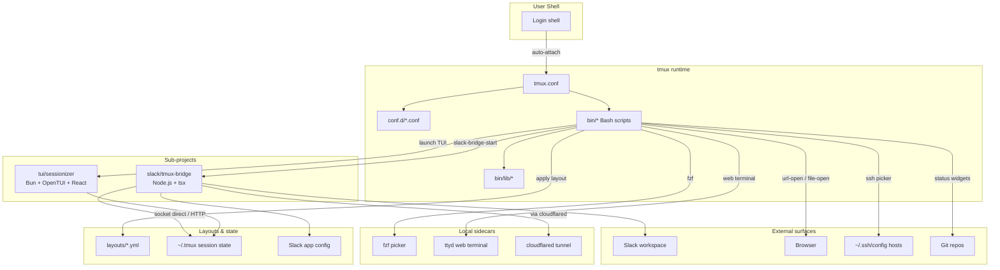

# TMUX SESSIONIZER


[](../../actions/workflows/ci.yml)
[](../../actions/workflows/10_pr-review.yml)
[](../../actions/workflows/11_security-pr-review.yml)
[](../../actions/workflows/12_dependabot-auto-merge.yml)
[](../../actions/workflows/13_pr-auto-merge.yml)
[](../../actions/workflows/14_bot-auto-fix.yml)
[](../../actions/workflows/15_merged-pr-cleanup.yml)
[](../../actions/workflows/24_release-notes.yml)
[](../../actions/workflows/25_release-publish.yml)

> **A Bash-first tmux configuration and session-management toolkit.**
> **Bash 중심의 tmux 설정 및 세션 관리 도구 모음입니다.**

---

## Table of Contents / 목차

- [Overview / 개요](#overview--개요)
- [Features / 주요 기능](#features--주요-기능)
- [Repository Structure / 저장소 구조](#repository-structure--저장소-구조)
- [Architecture / 아키텍처](#architecture--아키텍처)
- [Automation Inventory / 자동화 인벤토리](#automation-inventory--자동화-인벤토리)
- [Quick Start / 빠른 시작](#quick-start--빠른-시작)
- [Local Development / 로컬 개발](#local-development--로컬-개발)
- [Commands Reference / 명령어 레퍼런스](#commands-reference--명령어-레퍼런스)
- [Contribution Guide / 기여 가이드](#contribution-guide--기여-가이드)

---

## Overview / 개요

**EN:**
TMUX SESSIONIZER is a batteries-included, Bash-first tmux configuration repository designed to be symlinked into `~/.tmux`. The core philosophy is to keep the runtime surface in plain Bash, expose it through a focused set of `bin/*` commands, and only reach for richer stacks where they provide clear value: a Bun + OpenTUI session picker and a Node.js bridge that mirrors tmux sessions into Slack.

The repository is the home of three coordinated sub-projects:

1. **`tmux.conf` + `conf.d/`** — A modular tmux configuration loader using a Tokyo Night theme, a tree sidebar, a responsive statusbar, and a prefix-`C-a` keybinding set.
2. **`bin/*` (≈37 scripts)** — The execution surface. Every interactive workflow (session picker, sidebar, layout apply, git status, SSH picker, URL open, clipboard ring, command palette) is implemented as a small, single-purpose Bash command.
3. **Sub-projects** — `tui/sessionizer/` (Bun + OpenTUI full-screen session picker) and `slack/tmux-bridge/` (Node.js bridge syncing tmux ↔ Slack channels).

**KO:**
TMUX SESSIONIZER는 `~/.tmux`로 심볼릭 링크되어 사용되는, 기능이 풍부한 Bash 중심의 tmux 설정 저장소입니다. 핵심 철학은 런타임 표면을 순수 Bash로 유지하고, `bin/*` 명령어의 집중된 집합을 통해 노출하며, 명확한 가치를 제공하는 경우에만 더 풍부한 스택(Bun + OpenTUI 세션 피커, Slack 채널과 tmux 세션을 미러링하는 Node.js 브리지)을 사용하는 것입니다.

이 저장소는 세 가지 조정된 하위 프로젝트의 본거지입니다:

1. **`tmux.conf` + `conf.d/`** — Tokyo Night 테마, 트리 사이드바, 반응형 상태바, prefix-`C-a` 키 바인딩을 사용하는 모듈식 tmux 설정 로더.
2. **`bin/*` (약 37개 스크립트)** — 실행 표면. 모든 인터랙티브 워크플로우(세션 피커, 사이드바, 레이아웃 적용, git 상태, SSH 피커, URL 열기, 클립보드 링, 명령 팔레트)는 작고 단일 목적의 Bash 명령으로 구현됩니다.
3. **하위 프로젝트** — `tui/sessionizer/` (Bun + OpenTUI 풀스크린 세션 피커) 및 `slack/tmux-bridge/` (tmux ↔ Slack 채널을 동기화하는 Node.js 브리지).

---

## Features / 주요 기능

### Session Management / 세션 관리

| Feature | Description | 설명 |
| --- | --- | --- |
| **Fuzzy session picker** | `tmux-sessionizer` + `tmux-sessionizer-tui` jump-start any session | 퍼지 세션 피커로 어떤 세션이든 즉시 점프 |
| **Tree sidebar** | `tmux-sidebar` renders a hierarchical session/window/pane tree | 트리 사이드바로 세션/윈도우/패널 계층 구조 렌더링 |
| **Layout templates** | `tmux-layout-apply` instantiates YAML layout presets | YAML 레이아웃 프리셋을 즉시 적용 |
| **Session dashboard** | `tmux-session-dashboard` shows a tabular summary popup | 세션 대시보드는 표 형식 요약 팝업을 표시 |
| **Session cycle / jump / kill / rename** | MRU navigation and safe lifecycle ops | MRU 탐색 및 안전한 수명 주기 작업 |
| **Session export / branch log** | Reproduce sessions and audit branch history | 세션 재현 및 브랜치 히스토리 감사 |

### Statusbar & Widgets / 상태바 및 위젯

| Feature | Description | 설명 |
| --- | --- | --- |
| **Responsive statusbar** | `tmux-responsive` width-tiered rendering | 폭 계층화 렌더링 반응형 상태바 |
| **Git status** | `tmux-git-status` + `tmux-git-uncommitted` per session | 세션별 git 상태 + 커밋되지 않은 변경 추적 |
| **System stats** | `tmux-sys-stats` CPU load + MEM usage | CPU 부하 + 메모리 사용량 시스템 통계 |
| **Session icons** | `tmux-session-icon` maps Nerd Font glyphs | Nerd Font 글리프를 매핑하는 세션 아이콘 |

### Productivity Actions / 생산성 액션

| Feature | Description | 설명 |
| --- | --- | --- |
| **Command palette** | `tmux-command-palette` fzf-driven action picker | fzf 기반 액션 피커 |
| **URL / file open** | Extract pane URLs/paths and open externally | 패널에서 URL/경로 추출 후 외부에서 열기 |
| **SSH picker** | `tmux-ssh-picker` parses `~/.ssh/config` | `~/.ssh/config`를 파싱하는 SSH 피커 |
| **Clipboard ring** | `tmux-clipboard-history` browses tmux buffer ring | tmux 버퍼 링 탐색 |
| **Copy word / pane sync** | Smart cursor-word copy + synchronize-panes toggle | 스마트 커서 단어 복사 + 패널 동기화 토글 |
| **Config reload** | `tmux-config-reload` hot-reload with diff | diff와 함께 핫 리로드하는 설정 리로드 |
| **Long-command notify** | `tmux-notify-long-command` desktop notifications | 데스크톱 알림을 보내는 긴 명령 알림 |
| **Cheatsheet** | `tmux-cheatsheet` categorized keybinding popup | 분류된 키 바인딩 팝업 치트시트 |

### Sub-projects / 하위 프로젝트

| Project | Stack | Purpose |
| --- | --- | --- |
| **`tui/sessionizer`** | Bun + OpenTUI + React | Full-screen session picker with wizard |
| **`slack/tmux-bridge`** | Node.js + tsx | tmux ↔ Slack channel mirroring (socket-direct or HTTP-via-cloudflared) |

---

## Repository Structure / 저장소 구조

```text
.
├── AGENTS.md                   # Project knowledge base (auto-generated)
├── CONTRIBUTING.md             # Contribution guidelines
├── LICENSE                     # MIT license
├── OWNERS                      # Code owners
├── README.md                   # This file
├── sessionizer.conf            # SCAN_DIR + EXTRA_DIRS for session discovery
├── tmux.conf                   # Root loader: sources conf.d/*.conf
├── bin/                        # ≈37 Bash scripts (the execution surface)
│   ├── lib/                    # Shared library modules
│   │   ├── sidebar-colors
│   │   ├── sidebar-render
│   │   ├── tmux-sessionizer-common
│   │   └── tmux-sessionizer-wizard
│   ├── tmux-sessionizer        # fzf session picker + creation wizard
│   ├── tmux-sessionizer-tui    # Launch TUI sessionizer (Bun OpenTUI wrapper)
│   ├── tmux-sidebar*           # Tree sidebar engine + init + toggle
│   ├── tmux-session-*          # cycle, kill, rename, jump, sync, export, ...
│   ├── tmux-template-create    # Quick-create from preset templates
│   ├── tmux-layout-apply       # Apply YAML layout templates
│   ├── tmux-responsive         # Width-tiered statusbar rendering
│   ├── tmux-auto-attach        # Login-shell auto-attach flow
│   ├── tmux-opencode           # OpenCode session launcher
│   ├── tmux-command-palette    # fzf action picker
│   ├── tmux-url-open           # URL extraction from pane
│   ├── tmux-file-open          # File path extraction from pane
│   ├── tmux-ssh-picker         # SSH config host picker
│   ├── tmux-clipboard-history  # tmux buffer ring browser
│   ├── tmux-copy-word          # Smart word copy under cursor
│   ├── tmux-pane-sync          # Synchronize-panes toggle
│   ├── tmux-config-reload      # Reload config with settings diff
│   ├── tmux-notify-long-command # Desktop notification for long commands
│   ├── tmux-bash-preexec       # Sourceable shell preexec hook
│   ├── tmux-cheatsheet         # Categorized keybinding reference popup
│   ├── tmux-slack-bridge-start # Startup wrapper (socket direct / HTTP cloudflared)
│   ├── tmux-slack-bridge-setup # Interactive Slack app setup wizard
│   ├── tmux-git-status         # Git branch + dirty/ahead/behind/stash
│   ├── tmux-git-uncommitted    # Track uncommitted changes per session
│   ├── tmux-session-order      # MRU session ordering
│   ├── tmux-sys-stats          # CPU load + MEM usage
│   └── tmux-web-terminal       # ttyd web terminal launcher
├── conf.d/                     # Modular tmux configuration fragments
│   ├── 00-core.conf            # Terminal/perf baseline + env propagation
│   ├── 10-theme.conf           # Tokyo Night palette + pane border status
│   ├── 20-keys.conf            # Keybindings (prefix=C-a)
│   └── 25-sidebar.conf         # Sidebar binding
├── layouts/                    # YAML layout presets
│   ├── blacklist.yml
│   ├── default.yml
│   ├── proxmox.yml
│   ├── resume.yml
│   ├── safework.yml
│   ├── safework2.yml
│   └── splunk.yml
├── tui/
│   └── sessionizer/            # Bun + OpenTUI full-screen sessionizer
│       ├── AGENTS.md
│       ├── bunfig.toml
│       ├── package.json
│       ├── tsconfig.json
│       ├── bun.lock
│       ├── src/
│       │   ├── App.tsx
│       │   ├── index.tsx
│       │   ├── bun-env.d.ts
│       │   ├── actions/
│       │   ├── components/    # create-wizard, filter-input, preview-panel, ...
│       │   ├── hooks/
│       │   └── lib/           # config, create-session, dirs, state, theme, tmux
│       └── __tests__/          # bun:test specs
├── docs/                       # Design notes
│   ├── session-persistence-brainstorming.md
│   └── supermemory-governance.md
└── slack/
    └── tmux-bridge/            # Node.js tmux ↔ Slack bridge
        └── AGENTS.md
```

---

## Architecture / 아키텍처



The Bash-first design means a single `bin/*` script can compose any of the sidecars (`fzf`, `ttyd`, `cloudflared`) or sub-projects without losing ergonomics. The Slack bridge runs in **two modes**: direct socket access on the local machine, or HTTP-via-`cloudflared` when the bot lives on a remote homelab host reachable through the public endpoint [`https://bot.jclee.me`](https://bot.jclee.me). Layout templates and session state are persisted in plain YAML + tmux native state, keeping the entire toolchain inspectable.

---

## Automation Inventory / 자동화 인벤토리

This repository is operated end-to-end by **14 GitHub Actions workflows** plus the on-call bot (`github-bot`) which itself is hosted behind [`https://bot.jclee.me`](https://bot.jclee.me). PR review and security review are powered by [`qodo-ai/pr-agent`](https://github.com/qodo-ai/pr-agent).

### Workflow Catalog / 워크플로 카탈로그

| # | File | Purpose | 목적 |
| - | --- | --- | --- |
| 01 | `ci.yml` | Continuous integration: shellcheck + bash -n + Bun tests | 지속적 통합 (shellcheck, bash -n, Bun 테스트) |
| 02 | `01_branch-to-pr.yml` | Promote a long-lived branch into a PR with auto-body | 장기 브랜치를 본문이 자동 생성된 PR로 승격 |
| 03 | `02_issue-to-branch.yml` | Create a branch from an issue, link back, label | 이슈에서 브랜치를 생성하고 상호 링크 및 라벨링 |
| 04 | `10_pr-review.yml` | Automated PR review via `qodo-ai/pr-agent` | `qodo-ai/pr-agent` 기반 자동 PR 리뷰 |
| 05 | `11_security-pr-review.yml` | Security-focused PR review pass | 보안 중심 PR 리뷰 패스 |
| 06 | `12_dependabot-auto-merge.yml` | Auto-merge dependabot patches when green | dependabot 패치를 green 시 자동 머지 |
| 07 | `13_pr-auto-merge.yml` | Auto-merge PRs labelled `auto-merge` | `auto-merge` 라벨된 PR 자동 머지 |
| 08 | `14_bot-auto-fix.yml` | `github-bot` opens automated fix PRs on review comments | 리뷰 코멘트에 대해 자동 수정 PR을 여는 봇 |
| 09 | `15_merged-pr-cleanup.yml` | Delete merged feature branches | 머지된 기능 브랜치 정리 |
| 10 | `19_issue-backfill.yml` | Backfill missing issues from labelled commits | 라벨된 커밋에서 누락된 이슈 백필 |
| 11 | `24_release-notes.yml` | Aggregate changelog from merged PRs | 머지된 PR에서 changelog 집계 |
| 12 | `25_release-publish.yml` | Publish release artifacts and GitHub Release | 릴리스 아티팩트 및 GitHub Release 게시 |
| 13 | `29_downstream-health-check.yml` | Probe downstream consumers (claude-code, CLIProxyAPI) | 다운스트림 소비자 상태 점검 |
| 14 | `37_ci-failure-issues.yml` | Open/track issues when CI fails | CI 실패 시 이슈 오픈 및 추적 |

### Workflow Roles / 워크플로 역할

```mermaid
flowchart LR
    subgraph Inbound["Inbound"]
        A["01_branch-to-pr.yml"]
        B["02_issue-to-branch.yml"]
    end

    subgraph Review["Review &amp; Quality"]
        C["10_pr-review.yml"]
        D["11_security-pr-review.yml"]
    end

    subgraph Merge["Merge &amp; Cleanup"]
        E["13_pr-auto-merge.yml"]
        F["12_dependabot-auto-merge.yml"]
        G["14_bot-auto-fix.yml"]
        H["15_merged-pr-cleanup.yml"]
    end

    subgraph Hygiene["Repo hygiene"]
        I["19_issue-backfill.yml"]
        J["37_ci-failure-issues.yml"]
    end

    subgraph CI["CI &amp; Health"]
        K["ci.yml"]
        L["29_downstream-health-check.yml"]
    end

    subgraph Release["Release"]
        M["24_release-notes.yml"]
        N["25_release-publish.yml"]
    end

    Inbound --> Review --> Merge --> Release
    CI -.feeds.--> Hygiene
    Hygiene -.opens issues.--> Inbound
```

### External AI Surfaces / 외부 AI 표면

- **PR review / Security review:** [`qodo-ai/pr-agent`](https://github.com/qodo-ai/pr-agent) is invoked as a GitHub App and runs through `10_pr-review.yml` and `11_security-pr-review.yml`.
- **Bot auto-fix:** `14_bot-auto-fix.yml` drives the `github-bot` service, served at [`https://bot.jclee.me`](https://bot.jclee.me). The bot itself runs Claude Code for triage and the OpenAI-compatible inference endpoint at [`https://cliproxy.jclee.me/v1`](https://cliproxy.jclee.me/v1) for model routing.

---

## Quick Start / 빠른 시작

### Prerequisites / 사전 요구사항

| Tool | Minimum | 비고 |
| --- | --- | --- |
| `tmux` | 1.9+ | Prefix is `C-a` |
| `bash` | 4+ | All scripts target Bash 4+ |
| `fzf` | latest | Used by the majority of pickers |
| `git` | 2+ | Statusbar widgets |
| `bun` | latest | Only for `tui/sessionizer` |
| `node` / `tsx` | 20+ / latest | Only for `slack/tmux-bridge` |
| Nerd Font | any | For icons in sidebar / statusbar |

### Install / 설치

```bash
# 1. Clone
git clone https://github.com/<owner>/tmux-sessionizer.git ~/.tmux
cd ~/.tmux

# 2. Ensure config is symlinked (idempotent)
ln -sfn "$PWD/tmux.conf"     ~/.tmux.conf
ln -sfn "$PWD/sessionizer.conf" ~/.tmux.sessionizer.conf 2>/dev/null || true

# 3. Verify
bash -n bin/tmux-sessionizer
shellcheck bin/tmux-sessionizer  # optional

# 4. Start tmux (or reload with prefix-r)
tmux new-session -A -s main
# Inside tmux: prefix-r  (or:  ~/.tmux/bin/tmux-config-reload)
```

### First-Run Smoke Test / 첫 실행 스모크 테스트

```bash
# Inside tmux:
prefix + s       # cycle sessions
prefix + Tab     # toggle sidebar
prefix + g       # launch sessionizer (fzf)
prefix + G       # launch TUI sessionizer (Bun)
prefix + ?       # cheatsheet
```

---

## Local Development / 로컬 개발

### Working on `bin/*` Bash scripts / Bash 스크립트 작업

```bash
# Lint a single script
shellcheck bin/tmux-sessionizer

# Lint everything
find bin -type f -executable -exec shellcheck {} +

# Syntax check
find bin -type f -executable -exec bash -n {} +

# Test sessionizer against a scratch dir
SCAN_DIR=/tmp/scratch EXTRA_DIRS= ./bin/tmux-sessionizer --dry-run
```

### Working on `tui/sessionizer` / TUI 세션라이저 작업

```bash
cd tui/sessionizer

bun install
bun run dev         # hot-reload dev server
bun test            # run bun:test specs
bun run typecheck   # tsc --noEmit
```

### Working on `slack/tmux-bridge` / Slack 브리지 작업

```bash
cd slack/tmux-bridge
npm install
npm run dev
# or invoke via the wrapper:
../../bin/tmux-slack-bridge-start --mode socket
../../bin/tmux-slack-bridge-setup   # interactive wizard
```

### Writing a new `bin/*` command / 새 `bin/*` 명령어 작성

1. Create `bin/tmux-<verb>-<noun>` with `set -euo pipefail` at the top.
2. Source shared helpers from `bin/lib/` where appropriate.
3. Wire the command into `conf.d/20-keys.conf` with a clear mnemonic.
4. Document it under [Commands Reference](#commands-reference--명령어-레퍼런스).
5. Run `shellcheck` and `bash -n` before opening a PR.

---

## Commands Reference / 명령어 레퍼런스

> Bindings shown assume prefix `C-a`. Run `prefix + ?` inside tmux for the in-app cheatsheet.

### Session lifecycle / 세션 수명 주기

| Command | Default key | Description |
| --- | --- | --- |
| `tmux-sessionizer` | `prefix g` | Fuzzy session picker + creation wizard |
| `tmux-sessionizer-tui` | `prefix G` | Full-screen Bun/OpenTUI sessionizer |
| `tmux-session-cycle` | `prefix s / S` | Cycle sessions (PgUp/PgDn), excluding `opencode` |
| `tmux-session-jump` | — | MRU fzf session picker |
| `tmux-session-kill` | — | Safe session termination with confirmation |
| `tmux-session-rename` | — | Session rename with validation |
| `tmux-session-dashboard` | — | Tabular session summary popup |
| `tmux-session-export` | — | Export session layout to YAML |
| `tmux-session-branch-log` | — | Log session→branch on switch |
| `tmux-session-order` | — | Sort sessions by most recently active |
| `tmux-template-create` | — | Quick-create from preset templates |

### Sidebar / 사이드바

| Command | Default key | Description |
| --- | --- | --- |
| `tmux-sidebar` | — | Render the tree sidebar |
| `tmux-sidebar-init` | — | Initialize sidebar on session create |
| `tmux-sidebar-toggle` | `prefix Tab` | Toggle sidebar visibility |

### Layouts / 레이아웃

| Command | Default key | Description |
| --- | --- | --- |
| `tmux-layout-apply` | — | Apply a YAML layout preset to current session |

### Productivity / 생산성

| Command | Default key | Description |
| --- | --- | --- |
| `tmux-command-palette` | — | fzf action picker |
| `tmux-url-open` | — | Extract URL from pane and open |
| `tmux-file-open` | — | Extract file path from pane and open |
| `tmux-ssh-picker` | — | SSH host picker from `~/.ssh/config` |
| `tmux-clipboard-history` | — | Browse tmux buffer ring |
| `tmux-copy-word` | — | Smart word copy under cursor |
| `tmux-pane-sync` | — | Toggle synchronize-panes |
| `tmux-config-reload` | `prefix r` | Hot-reload config with settings diff |
| `tmux-notify-long-command` | — | Desktop notification for long commands |
| `tmux-bash-preexec` | — | Sourceable shell preexec hook |
| `tmux-cheatsheet` | `prefix ?` | Categorized keybinding reference |
| `tmux-web-terminal` | — | `ttyd` web terminal launcher |

### Status widgets / 상태 위젯

| Command | Description |
| --- | --- |
| `tmux-git-status` | Branch + dirty / ahead / behind / stash |
| `tmux-git-uncommitted` | Uncommitted-change tracker per session |
| `tmux-session-icon` | Nerd Font glyph mapper |
| `tmux-sys-stats` | CPU load + MEM usage |
| `tmux-responsive` | Width-tiered statusbar rendering |

### Environment / 환경

| Command | Description |
| --- | --- |
| `tmux-auto-attach` | Login-shell auto-attach flow |
| `tmux-opencode` | OpenCode session launcher |

### Slack bridge / Slack 브리지

| Command | Description |
| --- | --- |
| `tmux-slack-bridge-setup` | Interactive Slack app setup wizard |
| `tmux-slack-bridge-start` | Dual-mode starter (socket direct / HTTP-via-cloudflared) |

---

## Contribution Guide / 기여 가이드

Please read [`CONTRIBUTING.md`](./CONTRIBUTING.md) for the canonical rules. Highlights:

### Branch & PR conventions / 브랜치 및 PR 규칙

- Branch from `master`. Naming: `feat/<scope>`, `fix/<scope>`, `chore/<scope>`, `docs/<scope>`.
- The bot may open a PR for you via `01_branch-to-pr.yml` once your branch is pushed.
- Label `auto-merge` to opt into `13_pr-auto-merge.yml` after CI is green.
- Dependabot PRs auto-merge through `12_dependabot-auto-merge.yml` once checks pass.

### Review flow / 리뷰 흐름

- `10_pr-review.yml` and `11_security-pr-review.yml` will post automated reviews powered by [`qodo-ai/pr-agent`](https://github.com/qodo-ai/pr-agent).
- Address review comments; `14_bot-auto-fix.yml` may commit suggested fixes on your behalf when invoked.
- Merged feature branches are deleted by `15_merged-pr-cleanup.yml`.

### Releases / 릴리스

- `24_release-notes.yml` aggregates the changelog from merged PRs.
- `25_release-publish.yml` cuts a GitHub Release. Tag format: `vMAJOR.MINOR.PATCH`.

### Code style / 코드 스타일

- Bash: `set -euo pipefail`, `shellcheck` clean, prefer quoting, never parse `ls`.
- TypeScript (TUI / bridge): `bun test` clean, `tsc --noEmit` clean, prefer immutable updates.
- Keep new dependencies opt-in (TUI / bridge) — never add a runtime dep to `bin/*`.

### Owners / 소유자

See [`OWNERS`](./OWNERS) for current reviewers. The on-call bot is reachable at [`https://bot.jclee.me`](https://bot.jclee.me); the public OpenAI-compatible inference surface used by automation is [`https://cliproxy.jclee.me/v1`](https://cliproxy.jclee.me/v1).

---

## License / 라이선스

[MIT](./LICENSE) © TMUX SESSIONIZER contributors.