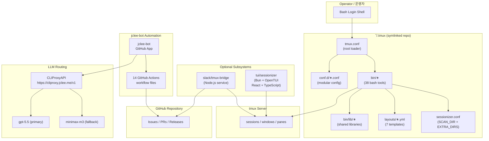

# TMUX SESSIONIZER / tmux 세션나이저


[](../../actions/workflows/ci.yml)
[](../../actions/workflows/01_branch-to-pr.yml)
[](../../actions/workflows/02_issue-to-branch.yml)
[](../../actions/workflows/10_pr-review.yml)
[](../../actions/workflows/11_security-pr-review.yml)
[](../../actions/workflows/12_dependabot-auto-merge.yml)
[](../../actions/workflows/13_pr-auto-merge.yml)
[](../../actions/workflows/14_bot-auto-fix.yml)
[](../../actions/workflows/15_merged-pr-cleanup.yml)
[](../../actions/workflows/19_issue-backfill.yml)
[](../../actions/workflows/24_release-notes.yml)
[](../../actions/workflows/25_release-publish.yml)
[](../../actions/workflows/29_downstream-health-check.yml)
[](../../actions/workflows/37_ci-failure-issues.yml/badge.svg)

## Overview / 개요

**EN:** A Bash-first tmux configuration and session-management toolkit designed to be symlinked as `~/.tmux`. The repository ships a complete operator environment: a root `tmux.conf` loader that sources modular `conf.d/*.conf` files, 38 executable `bin/*` tools covering session lifecycle, sidebar rendering, Git/Slack integration, and statusline composition, plus a nested interactive TUI sessionizer built on Bun + OpenTUI and a Node.js Slack↔tmux bridge. The system is maintained end-to-end by **jclee-bot**, a GitHub App that owns every mutating surface — from issue triage to release publishing.

**KR (한국어):** 본 저장소는 `~/.tmux` 심볼릭 링크로 사용할 수 있도록 설계된 Bash 우선 tmux 설정 및 세션 관리 툴킷입니다. 루트 `tmux.conf` 로더가 모듈식 `conf.d/*.conf` 파일들을 소싱하며, 38개의 `bin/*` 실행 도구(세션 수명주기, 사이드바 렌더링, Git/Slack 연동, 상태바 구성을 포함)와 Bun + OpenTUI 기반 인터랙티브 TUI 세션나이저, 그리고 Node.js로 작성된 Slack↔tmux 브리지를 함께 제공합니다. 이슈 분류부터 릴리스 게시까지 모든 변경 자동화는 GitHub App인 **jclee-bot**이 단독으로 소유합니다.

## Features / 주요 기능

### Session Management / 세션 관리

- **EN:** `tmux-sessionizer` (fzf + wizard), `tmux-session-cycle` (PgUp/PgDn rotation), `tmux-session-jump` (MRU picker), `tmux-session-kill` (safe terminate), `tmux-session-rename` (validated rename), `tmux-session-order` (most-recent-first sort), `tmux-session-dashboard` (popup table), `tmux-session-branch-log` (switch audit), `tmux-session-export` (YAML snapshot), `tmux-session-icon` (Nerd Font mapping), `tmux-session-sync` (Slack channel mirroring).
- **KR:** fzf 기반 세션나이저, PgUp/PgDn 회전, MRU 점프, 안전한 종료, 검증된 이름 변경, 최신 활동순 정렬, 팝업 대시보드, 브랜치 전환 감사 로그, YAML 익스포트, Nerd Font 아이콘 매핑, Slack 채널 동기화.

### Layouts and Templates / 레이아웃과 템플릿

- **EN:** Seven declarative YAML templates under `layouts/` (`default`, `blacklist`, `proxmox`, `resume`, `safework`, `safework2`, `splunk`) applied via `tmux-layout-apply` and `tmux-template-create`.
- **KR:** `layouts/` 하위 7개의 선언적 YAML 템플릿을 `tmux-layout-apply` 및 `tmux-template-create`로 적용.

### Sidebar / 사이드바

- **EN:** `tmux-sidebar` tree rendering engine with color/formatting libraries under `bin/lib/`, plus `tmux-sidebar-init` (auto-on session create) and `tmux-sidebar-toggle` (visibility).
- **KR:** `bin/lib/`의 컬러/포맷팅 라이브러리를 활용한 `tmux-sidebar` 트리 렌더링 엔진과 세션 생성 시 자동 초기화/가시성 토글.

### TUI Sessionizer / TUI 세션나이저

- **EN:** A React + TypeScript application under `tui/sessionizer/` (Bun runtime, OpenTUI rendering), featuring a session list, filter input, preview panel, kill-confirm dialog, rename dialog, and a 3-step creation wizard (directory → layout → name).
- **KR:** `tui/sessionizer/`의 React + TypeScript 앱(Bun 런타임, OpenTUI 렌더링): 세션 목록, 필터, 미리보기, 종료 확인, 이름 변경, 디렉터리→레이아웃→이름의 3단계 생성 위저드.

### Slack Bridge / Slack 브리지

- **EN:** `slack/tmux-bridge` Node.js service: dual-mode startup (direct socket / cloudflared HTTP) launched via `tmux-slack-bridge-start`, plus `tmux-slack-bridge-setup` interactive wizard for OAuth/manifest installation.
- **KR:** `slack/tmux-bridge` Node.js 서비스 — `tmux-slack-bridge-start`로 기동하는 듀얼 모드(직접 소켓 / cloudflared HTTP), `tmux-slack-bridge-setup` 대화형 OAuth/매니페스트 설치 마법사.

### Quality-of-Life / 운영 편의

- **EN:** `tmux-command-palette`, `tmux-url-open`, `tmux-file-open`, `tmux-ssh-picker`, `tmux-clipboard-history`, `tmux-copy-word`, `tmux-pane-sync`, `tmux-config-reload`, `tmux-notify-long-command`, `tmux-bash-preexec`, `tmux-cheatsheet`, `tmux-auto-attach`, `tmux-opencode`, `tmux-web-terminal`.
- **KR:** 명령 팔레트, URL/파일 추출, SSH 호스트 픽커, 클립보드 히스토리, 단어 복사, 동기화 패널 토글, 설정 리로드, 장기 명령 알림, preexec 훅, 키바인딩 치트시트, 로그인 자동 attach, OpenCode 실행, ttyd 웹 터미널.

### Statusline / 상태바

- **EN:** Composable widgets: `tmux-git-status`, `tmux-git-uncommitted`, `tmux-sys-stats`, `tmux-responsive` (width-tiered rendering).
- **KR:** 합성 가능한 위젯: Git 상태/커밋 미완료 추적, CPU·메모리 통계, 폭에 적응하는 `tmux-responsive` 렌더링.

## Architecture / 아키텍처

The system layers operator shell → tmux loader → modular conf → bash toolkit → optional TUI/Slack subsystems, all governed by jclee-bot on the GitHub side and an LLM router (CLIProxyAPI) for AI-backed automation decisions.

운영자 셸 → tmux 로더 → 모듈식 conf → bash 툴킷 → 선택형 TUI/Slack 서브시스템으로 적층되며, GitHub 측은 jclee-bot이, AI 자동화 결정은 LLM 라우터(CLIProxyAPI)가 관장합니다.



## jclee-bot Automation Surfaces / jclee-bot 자동화 영역

**EN:** Every mutating automation on this repository is owned by **jclee-bot** (a GitHub App). Workflow files in `.github/workflows/` are *implementation triggers* — they are not the source of truth. The authoritative automation contract lives in this section. jclee-bot routes LLM-backed decisions through CLIProxyAPI (`https://cliproxy.jclee.me/v1`) with `gpt-5.5` as the primary model and `minimax-m3` as fallback.

**KR (한국어):** 본 저장소의 모든 변경 자동화는 GitHub App인 **jclee-bot**이 단독 소유합니다. `.github/workflows/`의 워크플로 파일은 *구현 트리거*일 뿐 진실의 원천이 아닙니다. 자동화 계약의 진실은 본 섹션에 있으며, jclee-bot은 LLM 기반 결정을 CLIProxyAPI(`https://cliproxy.jclee.me/v1`)를 통해 라우팅하며 주 모델은 `gpt-5.5`, 대체 모델은 `minimax-m3`입니다.

### Issue Lifecycle / 이슈 수명주기

- **Issue → Branch (02_issue-to-branch):** jclee-bot classifies new issues, comments with the marker **`jclee-bot에의해자동화됨`** when it accepts ownership, and opens a working branch tied to the issue.
- **Backfill (19_issue-backfill):** retroactively labels/issues historical items.
- **CI Failure Issues (37_ci-failure-issues):** opens issues for sustained CI red builds owned by the bot.

### Pull Request Lifecycle / PR 수명주기

- **Branch → PR (01_branch-to-pr):** promotes bot-created branches into draft PRs.
- **PR Auto-Merge (13_pr-auto-merge):** merges PRs meeting policy (green CI, approvals).
- **Merged PR Cleanup (15_merged-pr-cleanup):** deletes merged remote branches and stale labels.

### Code Review / 코드 리뷰

- **PR Review (10_pr-review):** uses [qodo-ai/pr-agent](https://github.com/qodo-ai/pr-agent) for AI review comments.
- **Security PR Review (11_security-pr-review):** threat-model pass for sensitive paths.
- **Bot Auto-Fix (14_bot-auto-fix):** pushes follow-up commits for review findings on bot-owned PRs.

### Dependencies / 의존성

- **Dependabot Auto-Merge (12_dependabot-auto-merge):** jclee-bot authorises routine patch/minor Dependabot PRs.

### Release Engineering / 릴리스 엔지니어링

- **Release Notes (24_release-notes):** assembles changelog from PR labels.
- **Release Publish (25_release-publish):** cuts GitHub releases and tags.

### Operational / 운영

- **Downstream Health Check (29_downstream-health-check):** verifies consumers of public artifacts (`https://cliproxy.jclee.me`, `https://bot.jclee.me`) remain healthy.
- **CI (ci.yml):** lint/test gate; failure events feed 37.

## Go Tools / Go 도구

**EN:** This repository ships **zero** Go-based automation tools (`go.mod`/`go.sum` are absent; no `cmd/` directory; no Go files in any automation path). All automation is implemented as GitHub Actions workflows orchestrated by jclee-bot. If a future Go helper is introduced it must be added under a new top-level directory (e.g. `cmd/`) and documented here.

**KR:** 본 저장소는 **Go 기반 자동화 도구를 포함하지 않습니다**(`go.mod`/`go.sum` 없음, `cmd/` 디렉터리 없음, 자동화 경로에 Go 파일 없음). 모든 자동화는 jclee-bot이编排하는 GitHub Actions 워크플로로 구현됩니다. 향후 Go 도구가 추가될 경우 새로운 최상위 디렉터리(예: `cmd/`)에 배치하고 본 섹션에 문서화해야 합니다.

## Repository Structure / 저장소 구조

```text
.
├── AGENTS.md                      # Authoritative project knowledge base
├── CONTRIBUTING.md                # Contribution rules (bot-enforced)
├── LICENSE                        # MIT license
├── OWNERS                         # CODEOWNERS-equivalent ownership list
├── README.md                      # This file
├── sessionizer.conf               # SCAN_DIR + EXTRA_DIRS for session discovery
├── tmux.conf                      # Root tmux loader (sources conf.d/*.conf)
├── bin/                           # 38 bash execution surface
│   ├── tmux-sessionizer*          # fzf picker + creation wizard
│   ├── tmux-sessionizer-tui*      # Launch TUI sessionizer
│   ├── tmux-sidebar*              # Sidebar tree engine
│   ├── tmux-sidebar-init*         # Sidebar auto-init on session create
│   ├── tmux-sidebar-toggle*       # Sidebar visibility toggle
│   ├── tmux-session-cycle*        # PgUp/PgDn rotation (excludes opencode)
│   ├── tmux-session-kill*         # Safe terminate with confirmation
│   ├── tmux-session-rename*       # Rename with validation
│   ├── tmux-session-sync*         # Mirror sessions to Slack channels
│   ├── tmux-session-jump*         # MRU fzf picker
│   ├── tmux-session-icon*         # Nerd Font icon mapper
│   ├── tmux-session-export*       # Export layout to YAML
│   ├── tmux-session-branch-log*   # Log session→branch on switch
│   ├── tmux-session-dashboard*    # Formatted session popup
│   ├── tmux-session-order*        # Most-recently-active sort
│   ├── tmux-template-create*      # Quick-create from preset
│   ├── tmux-layout-apply*         # Apply YAML layout to session
│   ├── tmux-responsive*           # Width-tiered statusbar
│   ├── tmux-auto-attach*          # Login auto-attach flow
│   ├── tmux-opencode*             # OpenCode launcher
│   ├── tmux-command-palette*      # fzf action picker
│   ├── tmux-url-open*             # Extract URL from pane
│   ├── tmux-file-open*            # Extract file path from pane
│   ├── tmux-ssh-picker*           # SSH config host picker
│   ├── tmux-clipboard-history*    # Buffer ring browser
│   ├── tmux-copy-word*            # Smart word copy under cursor
│   ├── tmux-pane-sync*            # Synchronize-panes toggle
│   ├── tmux-config-reload*        # Reload config with diff
│   ├── tmux-notify-long-command*  # Desktop notify on long commands
│   ├── tmux-bash-preexec*         # Sourceable preexec hook
│   ├── tmux-cheatsheet*           # Categorized keybinding popup
│   ├── tmux-slack-bridge-start*   # Slack bridge dual-mode starter
│   ├── tmux-slack-bridge-setup*   # Slack app setup wizard
│   ├── tmux-git-status*           # Branch + dirty/ahead/behind/stash
│   ├── tmux-git-uncommitted*      # Per-session uncommitted tracker
│   ├── tmux-sys-stats*            # CPU + MEM for status bar
│   ├── tmux-web-terminal*         # ttyd web terminal launcher
│   └── lib/                       # Shared library modules
│       ├── sidebar-colors         # Sidebar color definitions
│       ├── sidebar-render         # Sidebar rendering engine
│       ├── tmux-sessionizer-common# Shared sessionizer functions
│       └── tmux-sessionizer-wizard# Creation wizard logic
├── layouts/                       # 7 YAML layout templates
│   ├── blacklist.yml
│   ├── default.yml
│   ├── proxmox.yml
│   ├── resume.yml
│   ├── safework.yml
│   ├── safework2.yml
│   └── splunk.yml
├── tui/
│   └── sessionizer/               # Bun + OpenTUI sessionizer
│       ├── AGENTS.md              # TUI subsystem knowledge base
│       ├── package.json
│       ├── tsconfig.json
│       ├── bunfig.toml
│       ├── bun.lock
│       ├── src/
│       │   ├── App.tsx
│       │   ├── index.tsx
│       │   ├── bun-env.d.ts
│       │   ├── lib/               # config, create-session, dirs,
│       │   │                      #   state, theme, tmux
│       │   ├── hooks/
│       │   │   └── use-keyboard-handler.ts
│       │   ├── actions/
│       │   │   └── session-actions.ts
│       │   └── components/        # create-wizard, filter-input,
│       │                          #   kill-confirm-dialog,
│       │                          #   preview-panel, rename-dialog,
│       │                          #   session-list,
│       │                          #   wizard-step-{dir,layout,name}.tsx
│       └── __tests__/             # config.test.ts, tmux.test.ts
├── docs/                          # Design and governance documents
│   ├── session-persistence-brainstorming.md
│   └── supermemory-governance.md
└── slack/
    └── tmux-bridge/               # Node.js Slack↔tmux bridge
        └── AGENTS.md              # Bridge subsystem knowledge base
```

## Quick Start / 빠른 시작

### EN — Install

1. **Prerequisites:** `tmux >= 1.9`, `bash >= 4`, `fzf`, optionally `bun` (TUI) and `node` (Slack bridge).
2. **Clone and symlink:**
   ```bash
   git clone <repo-url> ~/src/tmux
   ln -sfn ~/src/tmux ~/.tmux
   ```
3. **Wire tmux:** in your shell rc, ensure tmux uses this config:
   ```bash
   echo 'source-file ~/.tmux/tmux.conf' > ~/.tmux.conf
   ```
4. **Make bin/ available** (or rely on `PATH=$HOME/.tmux/bin:$PATH`).
5. **Smoke test:** `tmux new-session -d -s _smoke && tmux kill-session -t _smoke`.

### KR — 설치

1. **사전 요구사항:** `tmux >= 1.9`, `bash >= 4`, `fzf`, 선택적으로 `bun`(TUI)과 `node`(Slack 브리지).
2. **클론 후 심볼릭 링크:**
   ```bash
   git clone <repo-url> ~/src/tmux
   ln -sfn ~/src/tmux ~/.tmux
   ```
3. **tmux 연결:** 셸 rc에 위 한 줄을 추가.
4. **`bin/` PATH 등록** 또는 `PATH=$HOME/.tmux/bin:$PATH` 사용.
5. **스모크 테스트:** 위 `tmux new-session ... kill-session` 명령 실행.

## Local Development / 로컬 개발

### TUI Sessionizer / TUI 세션나이저

```bash
cd tui/sessionizer
bun install
bun run dev          # OpenTUI dev mode
bun test             # runs config.test.ts and tmux.test.ts
bun run build        # production bundle
```

TypeScript path aliases and `bun-env.d.ts` provide Bun runtime globals; configuration is centralized in `src/lib/config.ts`, theme tokens in `src/lib/theme.ts`, and tmux RPC bindings in `src/lib/tmux.ts`.

### Slack Bridge / Slack 브리지

```bash
cd slack/tmux-bridge
# Follow bridge-specific AGENTS.md; Node version pinned per package.json
npm install
npm run dev
```

### Bash Tools / Bash 도구

- Lint individual scripts with `shellcheck bin/<name>`.
- Validate `tmux.conf` syntax: `tmux -f tmux.conf new-session -d -s _syntax && tmux kill-session -t _syntax`.
- Run CI locally via `act` (optional): `act -W .github/workflows/ci.yml`.

### Hooks into jclee-bot / jclee-bot 연동

Push to a feature branch and open a PR — jclee-bot will:
1. Comment with PR review (`10_pr-review`).
2. Run security review on sensitive paths (`11_security-pr-review`).
3. Apply auto-fix commits where applicable (`14_bot-auto-fix`).
4. Auto-merge on green (`13_pr-auto-merge`) and clean up (`15_merged-pr-cleanup`).

For issues, drop the label `bot:automate` to receive the `jclee-bot에의해자동화됨` marker and a branch will be opened automatically.

## Commands Reference / 명령어 레퍼런스

| Category / 카테고리 | Command / 명령 | Purpose / 목적 |
|---|---|---|
| Session picker / 세션 선택 | `tmux-sessionizer` | fzf session picker + creation wizard |
| Session picker / 세션 선택 | `tmux-sessionizer-tui` | Launch Bun/OpenTUI sessionizer |
| Session picker / 세션 선택 | `tmux-session-jump` | MRU fzf session jump |
| Session picker / 세션 선택 | `tmux-session-cycle` | PgUp/PgDn session rotation |
| Session lifecycle / 세션 수명주기 | `tmux-session-kill` | Safe terminate with confirmation |
| Session lifecycle / 세션 수명주기 | `tmux-session-rename` | Rename with validation |
| Session lifecycle / 세션 수명주기 | `tmux-session-order` | Sort by most-recently-active |
| Session lifecycle / 세션 수명주기 | `tmux-session-branch-log` | Log session→branch on switch |
| Session lifecycle / 세션 수명주기 | `tmux-session-dashboard` | Formatted session table popup |
| Session lifecycle / 세션 수명주기 | `tmux-session-export` | Export layout to YAML |
| Session lifecycle / 세션 수명주기 | `tmux-session-icon` | Nerd Font icon mapper |
| Session lifecycle / 세션 수명주기 | `tmux-session-sync` | Mirror sessions to Slack channels |
| Layouts / 레이아웃 | `tmux-template-create` | Quick-create from preset |
| Layouts / 레이아웃 | `tmux-layout-apply` | Apply YAML layout to session |
| Sidebar / 사이드바 | `tmux-sidebar` | Tree rendering engine |
| Sidebar / 사이드바 | `tmux-sidebar-init` | Auto-init on session create |
| Sidebar / 사이드바 | `tmux-sidebar-toggle` | Visibility toggle |
| Sidebar / 사이드바 | `tmux-sidebar` libraries | `bin/lib/sidebar-{colors,render}` |
| Picker UX / 픽커 UX | `tmux-command-palette` | fzf action picker |
| Picker UX / 픽커 UX | `tmux-url-open` | Extract URL from pane |
| Picker UX / 픽커 UX | `tmux-file-open` | Extract file path from pane |
| Picker UX / 픽커 UX | `tmux-ssh-picker` | SSH config host picker |
| Picker UX / 픽커 UX | `tmux-clipboard-history` | Buffer ring browser |
| Picker UX / 픽커 UX | `tmux-copy-word` | Smart word copy under cursor |
| Pane ops / 패널 조작 | `tmux-pane-sync` | Synchronize-panes toggle |
| Pane ops / 패널 조작 | `tmux-responsive` | Width-tiered statusbar |
| Pane ops / 패널 조작 | `tmux-config-reload` | Reload config with diff |
| Statusline / 상태바 | `tmux-git-status` | Branch + dirty/ahead/behind/stash |
| Statusline / 상태바 | `tmux-git-uncommitted` | Per-session uncommitted tracker |
| Statusline / 상태바 | `tmux-sys-stats` | CPU + MEM for statusbar |
| Statusline / 상태바 | `tmux-notify-long-command` | Desktop notify on long commands |
| Statusline / 상태바 | `tmux-bash-preexec` | Sourceable preexec hook |
| Launchers / 런처 | `tmux-auto-attach` | Login auto-attach |
| Launchers / 런처 | `tmux-opencode` | OpenCode launcher |
| Launchers / 런처 | `tmux-web-terminal` | ttyd web terminal launcher |
| Reference / 레퍼런스 | `tmux-cheatsheet` | Categorized keybinding popup |
| Slack / Slack | `tmux-slack-bridge-start` | Dual-mode (socket/HTTP) starter |
| Slack / Slack | `tmux-slack-bridge-setup` | OAuth/manifest setup wizard |

> **Note / 참고:** All scripts are POSIX-leaning Bash (not pure POSIX `sh`). They assume `~/.tmux` symlink resolution and rely on `bin/lib/*` for shared helpers — do not invoke scripts from outside the repo without preserving the relative `lib/` path.

## Contributing / 기여 가이드

### EN

1. **Fork** and create a feature branch (`git checkout -b feat/<slug>`).
2. **Match style:** Bash scripts use 2-space indent, `set -euo pipefail` where safe, and source helpers from `bin/lib/`.
3. **Add tests:** TUI changes require Bun tests in `tui/sessionizer/__tests__/`; Bash changes should be exercised by `ci.yml`.
4. **Open a PR** against `master`. jclee-bot will auto-label, run reviews, and propose auto-fixes; **do not bypass the bot's PR review by force-pushing after reviews are requested**.
5. **Wait for CI green** and at least one approval; jclee-bot will auto-merge once policy is satisfied.
6. **Issues:** use the issue templates; adding the `bot:automate` label requests the `jclee-bot에의해자동화됨` flow.

### KR (한국어)

1. **포크** 후 기능 브랜치 생성 (`git checkout -b feat/<slug>`).
2. **스타일 준수:** Bash 스크립트는 2-space 들여쓰기, 가능한 경우 `set -euo pipefail`, 헬퍼는 `bin/lib/`에서 소싱.
3. **테스트 추가:** TUI 변경은 `tui/sessionizer/__tests__/`의 Bun 테스트 필수, Bash 변경은 `ci.yml`에서 검증.
4. **`master` 대상으로 PR 오픈.** jclee-bot이 자동 라벨링, 리뷰, 자동 수정 제안을 수행합니다. **리뷰 요청 후 force-push로 봇 리뷰를 우회하지 마십시오.**
5. **CI 통과 + 승인 1건 이상**을 기다리면 정책 충족 시 jclee-bot이 자동 병합합니다.
6. **이슈:** 이슈 템플릿 사용, `bot:automate` 라벨 추가로 `jclee-bot에의해자동화됨` 흐름을 요청.

---

**Model / 모델:** This README was generated by `gpt-5.5` (primary), routed through [CLIProxyAPI](https://cliproxy.jclee.me/v1) with `minimax-m3` as fallback. Maintainer bot: **jclee-bot**. Public endpoints: [cliproxy.jclee.me](https://cliproxy.jclee.me), [bot.jclee.me](https://bot.jclee.me).