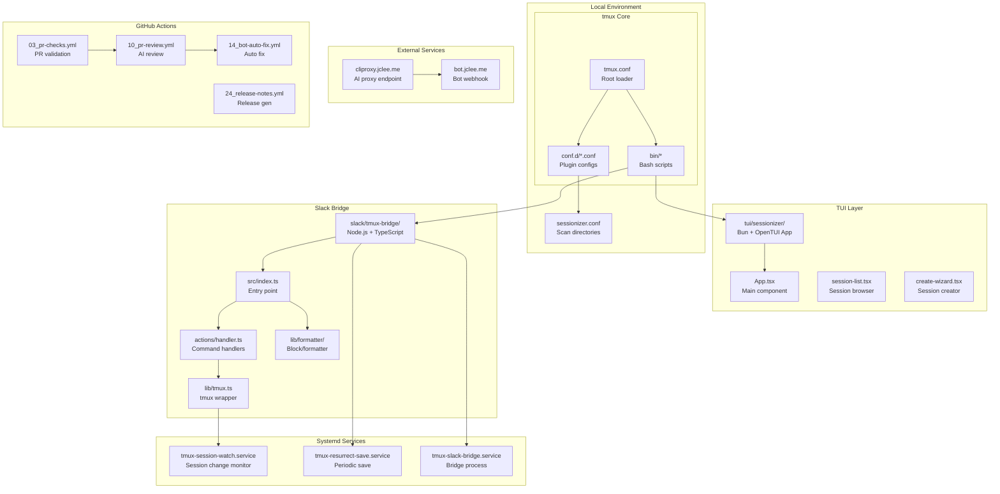
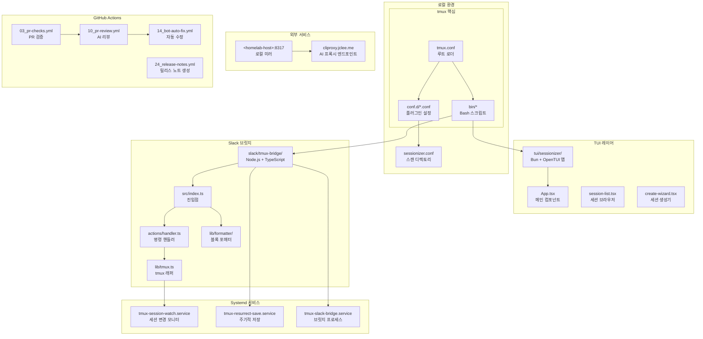

# TMUX SESSIONIZER

```markdown
# TMUX SESSIONIZER

[](https://github.com/jclee941/.github/actions/workflows/ci.yml)
[](https://github.com/jclee941/.github/releases)
[](LICENSE)
[](https://bun.sh)
[](https://www.typescriptlang.org/)

> Bash-first tmux configuration and session-management toolkit

---

## Table of Contents

- [Overview](#overview)
- [Features](#features)
- [Architecture](#architecture)
- [Automation Inventory](#automation-inventory)
- [Quick Start](#quick-start)
- [Local Development](#local-development)
- [Commands Reference](#commands-reference)
- [Contribution Guide](#contribution-guide)
- [개요 (Korean)](#개요-korean)
- [기능 (Korean)](#기능-korean)
- [아키텍처 (Korean)](#아키텍처-korean)
- [자동화 인벤토리 (Korean)](#자동화-인벤토리-korean)
- [빠른 시작 (Korean)](#빠른-시작-korean)
- [로컬 개발 (Korean)](#로컬-개발-korean)
- [명령어 참고자료 (Korean)](#명령어-참고자료-korean)
- [기여 가이드 (Korean)](#기여-가이드-korean)

---

## Overview

**TMUX SESSIONIZER** is a comprehensive tmux configuration system designed for developers who work with multiple projects and sessions. It provides a unified interface for session discovery, creation, and management, with deep integrations for Slack, system services, and terminal UI applications.

The project is structured as a symlinked `~/.tmux` directory with a plugin-style architecture where core behavior lives in `conf.d/*.conf` and `bin/*` scripts. A nested Bun/OpenTUI sessionizer TUI runs at `tui/sessionizer`, and a Node.js Slack bridge operates at `slack/tmux-bridge`.

### Key Components

| Component | Technology | Purpose |
|-----------|------------|---------|
| Core Config | tmux.conf | Root loader, sources `conf.d/*.conf` |
| Session Scripts | Bash + fzf | Session discovery, creation, management |
| TUI Application | Bun + OpenTUI | Interactive terminal UI for session management |
| Slack Bridge | Node.js + TypeScript | Real-time Slack channel ↔ tmux session sync |
| Systemd Services | unit files | Background services for session persistence |

---

## Features

- **Session Discovery**: Find and attach to existing tmux sessions via fzf picker
- **Session Creation Wizard**: Interactive step-by-step session creation with directory selection, layout options, and naming
- **Slack Integration**: Bidirectional sync between tmux sessions and Slack channels via `slack/tmux-bridge`
- **Sidebar Navigation**: Tree-based project navigation with keybinding hints
- **Session Management**: Create, rename, kill, and cycle through sessions
- **Layout Templates**: Apply pre-defined YAML layout templates to sessions
- **Systemd Integration**: Background services for session resurrect, watching, and web terminal
- **TUI Application**: Bun/OpenTUI-based interactive terminal user interface
- **Git Integration**: Branch tracking, git status per session
- **Responsive Status Bar**: Width-tiered statusbar rendering based on terminal size

---

## Architecture



---

## Automation Inventory

### GitHub Actions Workflows (33 total)

#### Issue Management

| Workflow File | Purpose |
|---------------|---------|
| `02_issue-to-branch.yml` | Auto-create branch from issue |
| `18_issue-management.yml` | Issue lifecycle automation |
| `19_issue-backfill.yml` | Backfill issue metadata |
| `37_ci-failure-issues.yml` | Auto-create issue from CI failure |
| `91_issue-classification.yml` | Classify and label issues |
| `43_reusable-issue-management.yml` | Reusable issue workflow |

#### Pull Request Automation

| Workflow File | Purpose |
|---------------|---------|
| `01_branch-to-pr.yml` | Convert branch to PR |
| `03_pr-checks.yml` | PR validation checks |
| `09_semantic-pr.yml` | Enforce semantic PR titles |
| `10_pr-review.yml` | AI-powered PR review (qodo-ai/pr-agent) |
| `13_pr-auto-merge.yml` | Auto-merge on approval |
| `14_bot-auto-fix.yml` | Bot-triggered auto-fix |
| `15_merged-pr-cleanup.yml` | Post-merge cleanup |
| `12_dependabot-auto-merge.yml` | Dependabot auto-merge |
| `44_reusable-pr-checks.yml` | Reusable PR checks |
| `security/11_pr-review.yml` | Security-focused PR review |

#### Documentation & Release

| Workflow File | Purpose |
|---------------|---------|
| `20_readme-gen.yml` | README generation |
| `21_docs-sync.yml` | Docs synchronization |
| `24_release-notes.yml` | Auto-generate release notes |
| `25_release-publish.yml` | Publish release |
| `42_reusable-docs-sync.yml` | Reusable docs sync workflow |

#### Security & Compliance

| Workflow File | Purpose |
|---------------|---------|
| `04_actionlint.yml` | Workflow linting |
| `05_gitleaks.yml` | Secrets scanning |
| `06_codeql.yml` | CodeQL analysis |
| `07_dependency-review.yml` | Dependency vulnerability review |
| `08_scorecard.yml` | OpenSSF scorecard |
| `45_reusable-gitleaks.yml` | Reusable gitleaks workflow |

#### CI/CD & Health

| Workflow File | Purpose |
|---------------|---------|
| `ci.yml` | Main CI pipeline |
| `29_downstream-health-check.yml` | Downstream repo health |
| `60_ci-auto-heal.yml` | Auto-heal failing CI |
| `auto-merge.yml` | Generic auto-merge |
| `labeler.yml` | PR label automation |
| `welcome.yml` | New contributor welcome |

### Automation Tools

| Tool | Version | Purpose |
|------|---------|---------|
| [pr-agent](https://qodo-ai.github.io/pr-agent/) | latest | AI-powered PR review and automation |
| [gitleaks](https://github.com/gitleaks/gitleaks) | latest | Secrets detection in code |
| [actionlint](https://github.com/rhysd/actionlint) | latest | GitHub Actions workflow linting |
| [CodeQL](https://codeql.github.com/) | latest | Semantic code analysis |

### External Endpoints

| Endpoint | Purpose |
|----------|---------|
| `https://cliproxy.jclee.me/v1` | AI/LLM proxy for pr-agent and other automation |
| `https://bot.jclee.me` | Bot webhook handler |

---

## Quick Start

### Prerequisites

- tmux (v3.0+)
- Bash (v4.0+)
- fzf (v0.42+)
- Bun (v1.0+)
- Node.js (v18+, for slack-bridge)

### Installation

```bash
# Clone the repository
git clone https://github.com/jclee941/.github ~/.tmux

# Create symlink
ln -sf ~/.tmux ~/.tmux

# Install Bun dependencies for TUI
cd ~/.tmux/tui/sessionizer
bun install

# Install Node dependencies for Slack bridge
cd ~/.tmux/slack/tmux-bridge
npm install
```

### Basic Usage

```bash
# Launch session picker (fzf-based)
tmux-sessionizer

# Launch TUI sessionizer
tmux-sessionizer-tui

# Create new session with wizard
tmux new-session -t mysession

# Sync sessions with Slack
tmux-session-sync

# Start Slack bridge
tmux-slack-bridge-start
```

---

## Local Development

### Repository Structure

```
tmux-sessionizer/
├── AGENTS.md                 # Agent instructions
├── CONTRIBUTING.md           # Contribution guidelines
├── LICENSE                   # MIT License
├── OWNERS                    # Code owners
├── README.md                 # This file
├── sessionizer.conf          # Session discovery config
├── tmux.conf                 # Root tmux configuration
├── tui/
│   └── sessionizer/          # Bun/OpenTUI TUI application
│       ├── package.json
│       ├── tsconfig.json
│       ├── bunfig.toml
│       ├── __tests__/
│       │   ├── config.test.ts
│       │   └── tmux.test.ts
│       └── src/
│           ├── App.tsx
│           ├── index.tsx
│           ├── lib/
│           ├── actions/
│           ├── components/
│           └── hooks/
├── wezterm/
│   └── wezterm.lua           # Wezterm terminal config
├── systemd/
│   ├── tmux-session-watch.path
│   ├── tmux-session-watch.service
│   ├── tmux-resurrect-save.service
│   ├── tmux-resurrect-save.sh
│   ├── tmux-server.service
│   ├── tmux-slack-bridge.service
│   └── tmux-web-terminal.service
└── slack/
    └── tmux-bridge/          # Node.js Slack bridge
        ├── package.json
        ├── tsconfig.json
        ├── vitest.config.ts
        ├── __tests__/
        └── src/
            ├── index.ts
            ├── types.ts
            ├── lib/
            ├── actions/
            └── commands/
```

### Running Tests

```bash
# TUI tests
cd tui/sessionizer
bun test

# Slack bridge tests
cd slack/tmux-bridge
npm test

# Or with vitest
cd slack/tmux-bridge
npx vitest run
```

### Configuration

- `sessionizer.conf` - Configure scan directories for session discovery
- `tmux.conf` - Main tmux configuration (edit with care)
- `tui/sessionizer/src/lib/config.ts` - TUI configuration
- `slack/tmux-bridge/src/lib/config.ts` - Slack bridge configuration

---

## Commands Reference

### Core Session Scripts (bin/)

| Command | Description |
|---------|-------------|
| `tmux-sessionizer` | fzf-based session picker and creation wizard |
| `tmux-sessionizer-tui` | Launch Bun/OpenTUI TUI sessionizer |
| `tmux-sidebar` | Tree sidebar display engine |
| `tmux-sidebar-toggle` | Toggle sidebar visibility |
| `tmux-session-cycle` | PgUp/PgDn session rotation |
| `tmux-session-kill` | Safe session termination |
| `tmux-session-rename` | Session rename with validation |
| `tmux-session-sync` | Sync tmux sessions with Slack |
| `tmux-session-jump` | MRU fzf session picker |
| `tmux-session-export` | Export session layout to YAML |
| `tmux-git-status` | Git branch + status in status bar |
| `tmux-git-uncommitted` | Track uncommitted changes |
| `tmux-session-dashboard` | Formatted session table popup |
| `tmux-template-create` | Quick-create session from templates |
| `tmux-layout-apply` | Apply YAML layout templates |
| `tmux-url-open` | URL extraction from pane |
| `tmux-file-open` | File path extraction from pane |
| `tmux-ssh-picker` | SSH config host picker |
| `tmux-clipboard-history` | tmux buffer ring browser |
| `tmux-command-palette` | fzf action picker |
| `tmux-notify-long-command` | Desktop notification for long commands |
| `tmux-cheatsheet` | Keybinding reference popup |
| `tmux-slack-bridge-start` | Start Slack bridge (dual mode) |
| `tmux-slack-bridge-setup` | Interactive Slack app setup |
| `tmux-web-terminal` | ttyd web terminal launcher |

### Library Modules (bin/lib/)

| Module | Purpose |
|--------|---------|
| `tmux-sessionizer-common` | Shared sessionizer functions |
| `tmux-sessionizer-wizard` | Creation wizard logic |
| `sidebar-colors` | Sidebar color definitions |
| `sidebar-render` | Sidebar rendering engine |

---

## Contribution Guide

### Workflows for Contributors

1. **Fork** the repository
2. **Create** a feature branch from `main`
3. **Commit** changes with semantic commit messages
4. **Open** a Pull Request with the `10_pr-review.yml` workflow auto-review
5. **Address** review feedback
6. **Merge** after approval via `13_pr-auto-merge.yml`

### Code Standards

- Bash scripts: shellcheck compliance
- TypeScript: strict mode enabled, full type coverage
- Configuration: no hardcoded credentials or RFC1918 IPs
- Tests: all new functionality requires tests

### Security

- All PRs trigger `05_gitleaks.yml` and `06_codeql.yml`
- Secrets must use GitHub Actions secrets
- External endpoints use environment variables

---

# 개요 (Korean)

**TMUX SESSIONIZER**는 여러 프로젝트와 세션으로 작업하는 개발자를 위해 설계된 종합 tmux 구성 시스템입니다. 세션 검색, 생성, 관리를 위한 통합 인터페이스를 제공하며 Slack, 시스템 서비스 및 터미널 UI 애플리케이션과 긴밀하게 통합되어 있습니다.

이 프로젝트는 `~/.tmux`로 심볼릭 링크되는 symlinked 디렉토리로 구성되어 있으며, 플러그인 스타일 아키텍처를 채택하고 있습니다. 핵심 동작은 `conf.d/*.conf`와 `bin/*` 스크립트에 있으며, `tui/sessionizer`에는 중첩된 Bun/OpenTUI 세션 관리 UI가, `slack/tmux-bridge`에는 Node.js Slack 브릿지가 운영됩니다.

### 주요 구성 요소

| 구성 요소 | 기술 | 목적 |
|-----------|------|------|
| 핵심 설정 | tmux.conf | 루트 로더, `conf.d/*.conf` 소싱 |
| 세션 스크립트 | Bash + fzf | 세션 검색, 생성, 관리 |
| TUI 애플리케이션 | Bun + OpenTUI | 세션 관리용 대화형 터미널 UI |
| Slack 브릿지 | Node.js + TypeScript | Slack 채널 ↔ tmux 세션 실시간 동기화 |
| systemd 서비스 | unit 파일 | 세션 영속성을 위한后台 서비스 |

---

## 기능 (Korean)

- **세션 검색**: fzf 피커를 통해 기존 tmux 세션 찾기 및 연결
- **세션 생성 마법사**: 디렉토리 선택, 레이아웃 옵션, 이름 지정이 포함된 대화형 단계별 세션 생성
- **Slack 통합**: `slack/tmux-bridge`를 통한 tmux 세션과 Slack 채널 간 양방향 동기화
- **사이드바 네비게이션**: 키바인딩 힌트가 포함된 트리 기반 프로젝트 탐색
- **세션 관리**: 세션 생성, 이름 변경, 종료, 순환
- **레이아웃 템플릿**: 세션에 미리 정의된 YAML 레이아웃 템플릿 적용
- **systemd 통합**: 세션 복원, 모니터링, 웹 터미널을 위한后台 서비스
- **TUI 애플리케이션**: Bun/OpenTUI 기반 대화형 터미널 사용자 인터페이스
- **Git 통합**: 브랜치 추적, 세션별 git 상태
- **응답형 상태 표시줄**: 터미널 크기에 따른 너비 계층 상태바 렌더링

---

## 아키텍처 (Korean)



---

## 자동화 인벤토리 (Korean)

### GitHub Actions 워크플로우 (총 33개)

#### 이슈 관리

| 워크플로우 파일 | 목적 |
|---------------|------|
| `02_issue-to-branch.yml` | 이슈에서 자동 브랜치 생성 |
| `18_issue-management.yml` | 이슈 수명주기 자동화 |
| `19_issue-backfill.yml` | 이슈 메타데이터 백필 |
| `37_ci-failure-issues.yml` | CI 실패 시 자동 이슈 생성 |
| `91_issue-classification.yml` | 이슈 분류 및 라벨링 |
| `43_reusable-issue-management.yml` | 재사용 가능 이슈 워크플로우 |

#### 풀 리퀘스트 자동화

| 워크플로우 파일 | 목적 |
|---------------|------|
| `01_branch-to-pr.yml` | 브랜치를 PR로 변환 |
| `03_pr-checks.yml` | PR 검증 체크 |
| `09_semantic-pr.yml` | 시맨틱 PR 제목 강제 |
| `10_pr-review.yml` | AI 기반 PR 리뷰 (qodo-ai/pr-agent) |
| `13_pr-auto-merge.yml` | 승인 시 자동 병합 |
| `14_bot-auto-fix.yml` | 봇 트리거 자동 수정 |
| `15_merged-pr-cleanup.yml` | 병합 후 정리 |
| `12_dependabot-auto-merge.yml` | Dependabot 자동 병합 |
| `44_reusable-pr-checks.yml` | 재사용 가능 PR 체크 |
| `security/11_pr-review.yml` | 보안 중심 PR 리뷰 |

#### 문서 및 릴리스

| 워크플로우 파일 | 목적 |
|---------------|------|
| `20_readme-gen.yml` | README 생성 |
| `21_docs-sync.yml` | 문서 동기화 |
| `24_release-notes.yml` | 자동 릴리스 노트 생성 |
| `25_release-publish.yml` | 릴리스 게시 |
| `42_reusable-docs-sync.yml` | 재사용 가능 문서 동기화 워크플로우 |

#### 보안 및 컴플라이언스

| 워크플로우 파일 | 목적 |
|---------------|------|
| `04_actionlint.yml` | 워크플로우 린팅 |
| `05_gitleaks.yml` | 시크릿 스캐닝 |
| `06_codeql.yml` | CodeQL 분석 |
| `07_dependency-review.yml` | 의존성 취약점 리뷰 |
| `08_scorecard.yml` | OpenSSF 스코어카드 |
| `45_reusable-gitleaks.yml` | 재사용 가능 gitleaks 워크플로우 |

#### CI/CD 및 상태 확인

| 워크플로우 파일 | 목적 |
|---------------|------|
| `ci.yml` | 메인 CI 파이프라인 |
| `29_downstream-health-check.yml` | 다운스트림 repo 상태 확인 |
| `60_ci-auto-heal.yml` | 실패하는 CI 자동 복구 |
| `auto-merge.yml` | 범용 자동 병합 |
| `labeler.yml` | PR 라벨 자동화 |
| `welcome.yml` | 새로운 기여자 환영 |

### 자동화 도구

| 도구 | 버전 | 목적 |
|------|------|------|
| [pr-agent](https://qodo-ai.github.io/pr-agent/) | latest | AI 기반 PR 리뷰 및 자동화 |
| [gitleaks](https://github.com/gitleaks/gitleaks) | latest | 코드 내 시크릿 감지 |
| [actionlint](https://github.com/rhysd/actionlint) | latest | GitHub Actions 워크플로우 린팅 |
| [CodeQL](https://codeql.github.com/) | latest | 시맨틱 코드 분석 |

### 외부 엔드포인트

| 엔드포인트 | 목적 |
|------------|------|
| `https://cliproxy.jclee.me/v1` | pr-agent 및 기타 자동화용 AI/LLM 프록시 |
| `https://bot.jclee.me` | 봇 웹훅 핸들러 |

---

## 빠른 시작 (Korean)

### 전제 조건

- tmux (v3.0+)
- Bash (v4.0+)
- fzf (v0.42+)
- Bun (v1.0+)
- Node.js (v18+, slack-bridge용)

### 설치

```bash
# 저장소克隆
git clone https://github.com/jclee941/.github ~/.tmux

# 심볼릭 링크 생성
ln -sf ~/.tmux ~/.tmux

# TUI용 Bun 의존성 설치
cd ~/.tmux/tui/sessionizer
bun install

# Slack 브릿지용 Node 의존성 설치
cd ~/.tmux/slack/tmux-bridge
npm install
```

### 기본 사용법

```bash
# 세션 피커 실행 (fzf 기반)
tmux-sessionizer

# TUI 세션 관리자 실행
tmux-sessionizer-tui

# 마법사로 새 세션 생성
tmux new-session -t mysession

# 세션과 Slack 동기화
tmux-session-sync

# Slack 브릿지 시작
tmux-slack-bridge-start
```

---

## 로컬 개발 (Korean)

### 저장소 구조

```
tmux-sessionizer/
├── AGENTS.md                 # 에이전트 지침
├── CONTRIBUTING.md           # 기여 지침
├── LICENSE                   # MIT 라이선스
├── OWNERS                    # 코드 소유자
├── README.md                 # 본 파일
├── sessionizer.conf          # 세션 검색 설정
├── tmux.conf                 # 루트 tmux 설정
├── tui/
│   └── sessionizer/          # Bun/OpenTUI TUI 애플리케이션
│       ├── package.json
│       ├── tsconfig.json
│       ├── bunfig.toml
│       ├── __tests__/
│       │   ├── config.test.ts
│       │   └── tmux.test.ts
│       └── src/
│           ├── App.tsx
│           ├── index.tsx
│           ├── lib/
│           ├── actions/
│           ├── components/
│           └── hooks/
├── wezterm/
│   └── wezterm.lua           # Wezterm 터미널 설정
├── systemd/
│   ├── tmux-session-watch.path
│   ├── tmux-session-watch.service
│   ├── tmux-resurrect-save.service
│   ├── tmux-resurrect-save.sh
│   ├── tmux-server.service
│   ├── tmux-slack-bridge.service
│   └── tmux-web-terminal.service
└── slack/
    └── tmux-bridge/          # Node.js Slack 브릿지
        ├── package.json
        ├── tsconfig.json
        ├── vitest.config.ts
        ├── __tests__/
        └── src/
            ├── index.ts
            ├── types.ts
            ├── lib/
            ├── actions/
            └── commands/
```

### 테스트 실행

```bash
# TUI 테스트
cd tui/sessionizer
bun test

# Slack 브릿지 테스트
cd slack/tmux-bridge
npm test

# 또는 vitest로
cd slack/tmux-bridge
npx vitest run
```

### 설정

- `sessionizer.conf` - 세션 검색용 스캔 디렉토리 설정
- `tmux.conf` - 메인 tmux 설정 (수정 시 주의)
- `tui/sessionizer/src/lib/config.ts` - TUI 설정
- `slack/tmux-bridge/src/lib/config.ts` - Slack 브릿지 설정

---

## 명령어 참고자료 (Korean)

### 핵심 세션 스크립트 (bin/)

| 명령어 | 설명 |
|--------|------|
| `tmux-sessionizer` | fzf 기반 세션 피커 및 생성 마법사 |
| `tmux-sessionizer-tui` | Bun/OpenTUI TUI 세션 관리자 실행 |
| `tmux-sidebar` | 트리 사이드바 표시 엔진 |
| `tmux-sidebar-toggle` | 사이드바 가시성 토글 |
| `tmux-session-cycle` | PgUp/PgDn 세션 순환 |
| `tmux-session-kill` | 안전한 세션 종료 |
| `tmux-session-rename` | 검증이 포함된 세션 이름 변경 |
| `tmux-session-sync` | tmux 세션과 Slack 동기화 |
| `tmux-session-jump` | MRU fzf 세션 피커 |
| `tmux-session-export` | 세션 레이아웃을 YAML로 내보내기 |
| `tmux-git-status` | 상태바에 Git 브랜치 + 상태 표시 |
| `tmux-git-uncommitted` | 미커밋 변경사항 추적 |
| `tmux-session-dashboard` | 포맷된 세션 테이블 팝업 |
| `tmux-template-create` | 템플릿에서 빠른 세션 생성 |
| `tmux-layout-apply` | YAML 레이아웃 템플릿 적용 |
| `tmux-url-open` | 페인에서 URL 추출 |
| `tmux-file-open` | 페인에서 파일 경로 추출 |
| `tmux-ssh-picker` | SSH 설정 호스트 피커 |
| `tmux-clipboard-history` | tmux 버퍼 링 브라우저 |
| `tmux-command-palette` | fzf 액션 피커 |
| `tmux-notify-long-command` | 긴 명령에 대한桌面 알림 |
| `tmux-cheatsheet` | 키바인딩 참조 팝업 |
| `tmux-slack-bridge-start` | Slack 브릿지 시작 (듀얼 모드) |
| `tmux-slack-bridge-setup` | 대화형 Slack 앱 설정 |
| `tmux-web-terminal` | ttyd 웹 터미널 실행 |

### 라이브러리 모듈 (bin/lib/)

| 모듈 | 목적 |
|------|------|
| `tmux-sessionizer-common` | 공유 세션 관리 함수 |
| `tmux-sessionizer-wizard` | 생성 마법사 로직 |
| `sidebar-colors` | 사이드바 색상 정의 |
| `sidebar-render` | 사이드바 렌더링 엔진 |

---

## 기여 가이드 (Korean)

### 기여자를 위한 워크플로우

1. 저장소를 **Fork** 합니다
2. `main`에서 기능 브랜치를 **생성** 합니다
3. 시맨틱 커밋 메시지로 변경사항을 **커밋** 합니다
4. `10_pr-review.yml` 워크플로우 자동 리뷰와 함께 **Pull Request를 오픈** 합니다
5. 리뷰 피드백을 **반영** 합니다
6. `13_pr-auto-merge.yml`를 통해 승인 후 **머지** 합니다

### 코드 표준

- Bash 스크립트: shellcheck 준수
- TypeScript: 스트릭트 모드 활성화, 전체 타입 커버리지
- 설정: 하드코딩된 자격증명 또는 RFC1918 IP 금지
- 테스트: 모든 새 기능에는 테스트 필요

### 보안

- 모든 PR은 `05_gitleaks.yml`와 `06_codeql.yml`를トリ거합니다
- 시크릿은 GitHub Actions 시크릿을 사용해야 합니다
- 외부 엔드포인트는 환경 변수를 사용합니다

---

## License

MIT License - See [LICENSE](LICENSE) for details.
