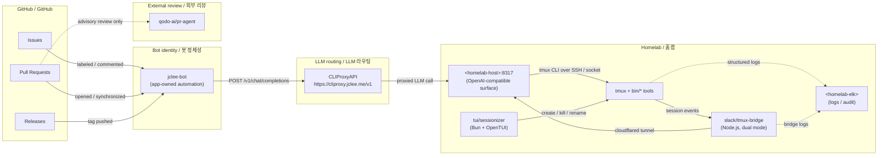

# TMUX SESSIONIZER / tmux 세션나이저


> A Bash-first tmux configuration and session-management toolkit, symlinked as `~/.tmux`, with a Bun/OpenTUI sessionizer, a Node.js Slack bridge, and a fully automated GitHub lifecycle owned by **jclee-bot**.
>
> Bash 우선 tmux 설정 및 세션 관리 툴킷. `~/.tmux`로 심볼릭 링크되며, Bun/OpenTUI 세션나이저, Node.js Slack 브리지, 그리고 **jclee-bot**이 완전히 소유하는 GitHub 자동화 라이프사이클을 함께 제공한다.

---

## Overview / 개요

**English.** TMUX SESSIONIZER is a homelab-grade tmux distribution built around a single rule: keep the loader thin and put behavior in small, composable, individually testable Bash tools. The `tmux.conf` at the root is just a `source` chain that pulls in modular `conf.d/*.conf` fragments; the real surface area lives in `bin/` — more than forty command-line tools that handle session discovery, sidebar rendering, dashboards, layout templates, Git awareness, Slack bridging, URL and file picking, status-bar widgets, SSH host picking, clipboard history, web terminal launching, and more.

Two companion applications extend that Bash surface without replacing it. `tui/sessionizer/` is a Bun + OpenTUI terminal UI that provides an interactive, themeable creation wizard and live preview for new sessions. `slack/tmux-bridge/` is a Node.js bridge that synchronizes tmux sessions with a Slack workspace, supporting both direct socket connections and `cloudflared` HTTP tunnels.

All mutating GitHub automation — branches, PRs, merges, releases, security reviews, issue triage, Dependabot handling, and post-merge cleanup — is owned by **jclee-bot** and routed through the public endpoint `https://cliproxy.jclee.me/v1` via the CLIProxyAPI LLM router. There are no Go automation tools in this repository; the entire automation surface is Bash + TypeScript/TSX + GitHub Actions.

**한국어.** TMUX SESSIONIZER는 단 하나의 원칙 — *로더는 얇게, 동작은 작고 조합 가능한 Bash 도구들로* — 위에서 구축된 홈랩급 tmux 배포판이다. 루트의 `tmux.conf`는 단지 모듈식 `conf.d/*.conf` 조각들을 source하는 체인일 뿐이며, 실제 표면적은 `bin/` 디렉터리에 산재한 40여 개의 명령줄 도구들이다. 이 도구들은 세션 디스커버리, 사이드바 렌더링, 대시보드, 레이아웃 템플릿, Git 인지, Slack 브리징, URL/파일 픽킹, 상태 표시줄 위젯, SSH 호스트 픽킹, 클립보드 히스토리, 웹 터미널 실행 등을 담당한다.

`tui/sessionizer/`는 Bun + OpenTUI 기반의 테마 적용이 가능한 인터랙티브 TUI로, 신규 세션을 위한 생성 위저드와 라이브 미리보기를 제공한다. `slack/tmux-bridge/`는 tmux 세션을 Slack 워크스페이스와 동기화하는 Node.js 브리지로, 직접 소켓 연결과 `cloudflared` HTTP 터널을 모두 지원한다.

모든 변형(mutating) GitHub 자동화 — 브랜치 생성, PR, 머지, 릴리스, 보안 리뷰, 이슈 트리아지, Dependabot 처리, 머지 후 정리 — 는 **jclee-bot**이 완전히 소유하며, CLIProxyAPI LLM 라우터를 통해 공개 엔드포인트 `https://cliproxy.jclee.me/v1`로 라우팅된다. 이 저장소에는 Go 자동화 도구가 없으며, 전체 자동화 표면은 Bash + TypeScript/TSX + GitHub Actions로 구성된다.

---

## Features / 주요 기능

### Bash surface / Bash 표면

- **Session discovery and lifecycle.** `tmux-sessionizer` provides an `fzf`-driven session picker and a creation wizard. Companion tools cover the rest of the lifecycle: `tmux-session-cycle` (PgUp/PgDn rotation excluding OpenCode), `tmux-session-kill` (safe termination with confirmation), `tmux-session-rename` (validated rename), `tmux-session-jump` (MRU picker), `tmux-session-order` (most-recently-active sort), and `tmux-session-dashboard` (formatted table popup).
- **Layout templates.** Declarative YAML templates under `layouts/` are applied by `tmux-layout-apply` and instantiated by `tmux-template-create`. Presets include `default`, `resume`, `proxmox`, `safework`, `safework2`, `splunk`, and a `blacklist` filter.
- **Sidebar engine.** `tmux-sidebar`, `tmux-sidebar-init`, and `tmux-sidebar-toggle` render a tree-style sidebar with shared `lib/sidebar-colors` and `lib/sidebar-render` modules.
- **Git awareness.** `tmux-git-status` and `tmux-git-uncommitted` surface branch, dirty/ahead/behind/stash state, and per-session uncommitted-change tracking. `tmux-session-branch-log` records session→branch transitions.
- **Status bar widgets.** `tmux-responsive` provides width-tiered rendering; `tmux-sys-stats` shows CPU load and memory; `tmux-session-icon` maps sessions to Nerd Font glyphs.
- **Pickers and launchers.** `tmux-ssh-picker` (SSH config host picker), `tmux-clipboard-history` (buffer ring), `tmux-copy-word` (smart word copy), `tmux-file-open` and `tmux-url-open` (pane extraction via fzf), `tmux-web-terminal` (ttyd launcher), `tmux-auto-attach` (login shell auto-attach).
- **Operational tooling.** `tmux-config-reload` (settings diff on reload), `tmux-pane-sync` (synchronize-panes toggle), `tmux-notify-long-command` (desktop notification for long commands), `tmux-bash-preexec` (sourceable preexec hook for command timing), `tmux-cheatsheet` (categorized keybinding popup), `tmux-command-palette` (fzf action picker), `tmux-session-export` (export session layout to YAML).
- **OpenCode integration.** `tmux-opencode` is a dedicated launcher, deliberately excluded from `tmux-session-cycle` rotation.

### TUI application / TUI 애플리케이션

- Built with **Bun + OpenTUI** and React (TSX).
- Interactive creation wizard with directory → layout → name steps (`wizard-step-dir`, `wizard-step-layout`, `wizard-step-name`).
- Live preview panel, filter input, rename dialog, and kill-confirm dialog.
- Persisted state, themeable via `lib/theme.ts`.
- Unit tests under `__tests__/` for `config.ts` and `tmux.ts`.

### Slack bridge / Slack 브리지

- Node.js bridge synchronizing tmux sessions with a Slack workspace.
- **Dual transport mode**: direct Unix socket (low latency, LAN/homelab) and `cloudflared` HTTP tunnel (works from anywhere).
- Interactive setup wizard via `tmux-slack-bridge-setup` and lifecycle wrapper via `tmux-slack-bridge-start`.

---

## Architecture / 아키텍처



**Reading the diagram.** Mutating GitHub events flow from GitHub to **jclee-bot**, which is the single identity that owns every write operation (branch creation, PR authoring, merging, release publishing, post-merge cleanup, Dependabot auto-merge, security triage). jclee-bot does not call a model directly; it talks to **CLIProxyAPI** at `https://cliproxy.jclee.me/v1`, which in turn proxies to the homelab-hosted OpenAI-compatible surface at `<homelab-host>:8317`. From there, the LLM (gpt-5.5 primary, minimax-m3 fallback) drives `tmux` via the Bash surface, the TUI, or the Slack bridge. Advisory PR review is delegated to `qodo-ai/pr-agent` in read-only mode; it never mutates repository state.

**다이어그램 해석.** 변형 이벤트는 GitHub → **jclee-bot**으로 흐른다. jclee-bot은 모든 쓰기 작업(브랜치 생성, PR 작성, 머지, 릴리스 발행, 머지 후 정리, Dependabot 자동 머지, 보안 트리아지)을 단독으로 소유한다. jclee-bot은 모델을 직접 호출하지 않고 `https://cliproxy.jclee.me/v1`의 **CLIProxyAPI**에 요청하며, CLIProxyAPI는 홈랩의 OpenAI 호환 표면 `<homelab-host>:8317`로 프록시한다. LLM(1차: gpt-5.5, 폴백: minimax-m3)은 Bash 표면, TUI, Slack 브리지를 통해 tmux를 구동한다. 자문형 PR 리뷰는 읽기 전용으로 `qodo-ai/pr-agent`에 위임되며, 저장소 상태를 변경하지 않는다.

---

## jclee-bot automation surfaces / jclee-bot 자동화 표면

All GitHub-side mutation in this repository is owned by the **jclee-bot** GitHub App. Workflows are *implementation triggers* — the source of truth for what the bot is allowed to do is the surface described below.

| Surface / 표면 | Owner / 소유자 | Behavior / 동작 |
|---|---|---|
| Branch creation from issues / 이슈 기반 브랜치 생성 | jclee-bot | Creates a feature branch when an issue receives the appropriate label. The issue body is then updated by jclee-bot with a status comment. **jclee-bot에의해자동화됨** |
| PR opening / PR 열기 | jclee-bot | Opens a PR linked to the source issue with a generated description. |
| PR review and revision / PR 리뷰 및 수정 | jclee-bot | Pushes fix-up commits in response to CI failures and review feedback. |
| Dependabot auto-merge / Dependabot 자동 머지 | jclee-bot | Merges patch/minor Dependabot PRs after CI passes and review is clean. |
| Security PR review / 보안 PR 리뷰 | jclee-bot | Performs an additional security-focused review pass; defers to humans on findings. |
| Issue backfill and triage / 이슈 백필 및 트리아지 | jclee-bot | Adds labels, applies the **jclee-bot에의해자동화됨** marker comment, and routes to owners. |
| CI failure → issue / CI 실패 → 이슈 | jclee-bot | Files a tracking issue with logs and a retry checklist when CI fails on `master`. |
| Bot auto-fix loop / 봇 자체 수정 루프 | jclee-bot | Iteratively resolves its own failures within a bounded retry budget. |
| Release notes and publishing / 릴리스 노트 및 발행 | jclee-bot | Generates notes from PR titles and publishes the release tag. |
| Post-merge cleanup / 머지 후 정리 | jclee-bot | Deletes merged feature branches and stale remote refs. |
| Downstream health check / 다운스트림 헬스 체크 | jclee-bot | Verifies the CLIProxyAPI endpoint at `https://cliproxy.jclee.me/v1` is healthy before mutating operations. |

The 14 GitHub Actions workflow files under `.github/workflows/` are triggers and wiring for these surfaces; they are not the source of truth. The source of truth is the table above plus the bot's reviewable commits.

이 저장소의 GitHub 측 모든 변형 작업은 **jclee-bot** GitHub App이 소유한다. GitHub Actions 워크플로우는 트리거와 배선일 뿐이며, 진실의 원천은 위 표와 봇의 리뷰 가능한 커밋이다.

---

## Go tools / Go 도구

This repository declares **zero Go automation tools** (`GO_TOOLS_COUNT=0`).

There is no `go.mod`, no `cmd/` tree, and no Go-based CLI in `bin/`. All automation in this project is implemented in Bash, TypeScript/TSX (TUI), JavaScript/Node.js (Slack bridge), and YAML (GitHub Actions workflows). If you need a Go-side automation helper, it should live in a separate repository; do not introduce one here without an explicit decision in `CONTRIBUTING.md`.

이 저장소는 Go 자동화 도구를 0개 보유한다(`GO_TOOLS_COUNT=0`). `go.mod`, `cmd/` 트리, Go 기반 CLI는 존재하지 않는다. 모든 자동화는 Bash, TypeScript/TSX(TUI), JavaScript/Node.js(Slack 브리지), YAML(GitHub Actions)로 구현된다.

---

## Repository structure / 저장소 구조

```
.
├── AGENTS.md                       # Project knowledge base (generated)
├── CONTRIBUTING.md                 # Contribution guidelines
├── LICENSE                         # MIT license
├── OWNERS                          # Code ownership roster
├── README.md                       # This document
├── sessionizer.conf                # SCAN_DIR + EXTRA_DIRS for session discovery
├── tmux.conf                       # Root loader; sources conf.d/*.conf
├── bin/                            # Bash execution surface (40+ tools)
│   ├── tmux-auto-attach
│   ├── tmux-bash-preexec
│   ├── tmux-cheatsheet
│   ├── tmux-clipboard-history
│   ├── tmux-command-palette
│   ├── tmux-config-reload
│   ├── tmux-copy-word
│   ├── tmux-file-open
│   ├── tmux-git-status
│   ├── tmux-git-uncommitted
│   ├── tmux-layout-apply
│   ├── tmux-notify-long-command
│   ├── tmux-opencode
│   ├── tmux-pane-sync
│   ├── tmux-responsive
│   ├── tmux-session-branch-log
│   ├── tmux-session-cycle
│   ├── tmux-session-dashboard
│   ├── tmux-session-export
│   ├── tmux-session-icon
│   ├── tmux-session-jump
│   ├── tmux-session-kill
│   ├── tmux-session-order
│   ├── tmux-session-rename
│   ├── tmux-session-sync
│   ├── tmux-sessionizer
│   ├── tmux-sessionizer-tui
│   ├── tmux-sidebar
│   ├── tmux-sidebar-init
│   ├── tmux-sidebar-toggle
│   ├── tmux-slack-bridge-setup
│   ├── tmux-slack-bridge-start
│   ├── tmux-ssh-picker
│   ├── tmux-sys-stats
│   ├── tmux-template-create
│   ├── tmux-url-open
│   └── tmux-web-terminal
├── bin/lib/                        # Shared library modules
│   ├── sidebar-colors
│   ├── sidebar-render
│   ├── tmux-sessionizer-common
│   └── tmux-sessionizer-wizard
├── layouts/                        # YAML layout templates
│   ├── blacklist.yml
│   ├── default.yml
│   ├── proxmox.yml
│   ├── resume.yml
│   ├── safework.yml
│   ├── safework2.yml
│   └── splunk.yml
├── tui/
│   └── sessionizer/                # Bun + OpenTUI sessionizer
│       ├── AGENTS.md
│       ├── bun.lock
│       ├── bunfig.toml
│       ├── package.json
│       ├── tsconfig.json
│       ├── src/
│       │   ├── App.tsx
│       │   ├── bun-env.d.ts
│       │   ├── index.tsx
│       │   ├── actions/
│       │   ├── components/
│       │   ├── hooks/
│       │   └── lib/
│       └── __tests__/
├── docs/                           # Design notes
│   ├── session-persistence-brainstorming.md
│   └── supermemory-governance.md
└── slack/
    └── tmux-bridge/                # Node.js Slack bridge
        └── AGENTS.md
```

The CI checkout path `_bot-scripts/` referenced in workflow comments is **transient only** — it is created and removed within a single workflow run and is never a real directory in this repository.

워크플로 코멘트에서 언급되는 `_bot-scripts/` 체크아웃 경로는 **일회성 전이 경로**이며, 단일 워크플로 실행 내에서 생성·삭제된다. 이 저장소의 실제 디렉터리가 아니다.

---

## Quick start / 빠른 시작

### 1. Install / 설치

```bash
# Clone
git clone https://github.com/<owner>/tmux-sessionizer.git
cd tmux-sessionizer

# Symlink as ~/.tmux
ln -sfn "$(pwd)" "$HOME/.tmux"

# Ensure tmux.conf is sourced
grep -q 'source-file ~/.tmux/tmux.conf' "$HOME/.tmux.conf" \
  || echo 'source-file ~/.tmux/tmux.conf' >> "$HOME/.tmux.conf"
```

### 2. Configure session discovery / 세션 디스커버리 설정

Edit `sessionizer.conf` and set `SCAN_DIR` to a directory containing your project worktrees, plus any `EXTRA_DIRS` you want included.

```bash
export SCAN_DIR="$HOME/code"
export EXTRA_DIRS="$HOME/notes $HOME/sandbox"
```

### 3. Launch / 실행

```bash
# Inside tmux: open the session picker (default prefix: C-a)
# Press: C-a + s

# Or run a tool directly
~/.tmux/bin/tmux-sessionizer

# Or launch the TUI
~/.tmux/bin/tmux-sessionizer-tui
```

### 4. Optional: Slack bridge / 선택: Slack 브리지

```bash
~/.tmux/bin/tmux-slack-bridge-setup   # one-time
~/.tmux/bin/tmux-slack-bridge-start   # foreground or backgrounded
```

---

## Local development / 로컬 개발

### Bash surface / Bash 표면

- Each `bin/tmux-*` script should be self-contained and sourceable from `tmux.conf` or interactively.
- Reuse helpers from `bin/lib/`. Do not duplicate logic across `bin/tmux-*`.
- Keep scripts under 200 lines where possible; split if a tool grows past that.
- Test manually by sourcing `tmux.conf` in a scratch server: `tmux -L test new-session -d && tmux -L test source-file tmux.conf`.

### TUI (`tui/sessionizer/`) / TUI 개발

```bash
cd tui/sessionizer
bun install
bun run dev          # OpenTUI dev mode
bun test             # runs __tests__/config.test.ts and __tests__/tmux.test.ts
bun run typecheck
```

Conventions: TSX components live under `src/components/`, keyboard wiring in `src/hooks/use-keyboard-handler.ts`, persistence in `src/lib/state.ts`, and tmux CLI adapters in `src/lib/tmux.ts`.

### Slack bridge (`slack/tmux-bridge/`) / Slack 브리지 개발

```bash
cd slack/tmux-bridge
npm install
npm run dev          # tsx watch
npm test             # if defined locally; otherwise smoke-test against a tmux server
```

The bridge supports two transports: a direct Unix socket for low latency on the homelab LAN, and a `cloudflared` HTTP tunnel for off-LAN access. Choose at startup; do not switch mid-session.

---

## Commands reference / 명령어 레퍼런스

This is a curated subset — see `bin/` for the full set.

### Session lifecycle / 세션 라이프사이클

| Command / 명령 | Purpose / 용도 |
|---|---|
| `tmux-sessionizer` | fzf session picker + creation wizard |
| `tmux-sessionizer-tui` | launch the Bun/OpenTUI TUI |
| `tmux-session-cycle` | rotate sessions with PgUp/PgDn (excludes OpenCode) |
| `tmux-session-jump` | MRU fzf picker |
| `tmux-session-kill` | safe termination with confirmation |
| `tmux-session-rename` | validated rename |
| `tmux-session-order` | sort by most recently active |
| `tmux-session-dashboard` | formatted table popup |
| `tmux-session-export` | export layout to YAML |
| `tmux-session-branch-log` | log session→branch transitions |
| `tmux-session-icon` | map session name to Nerd Font icon |

### Sidebar / 사이드바

| Command / 명령 | Purpose / 용도 |
|---|---|
| `tmux-sidebar` | render tree sidebar |
| `tmux-sidebar-init` | initialize sidebar on session create |
| `tmux-sidebar-toggle` | toggle visibility |

### Layouts / 레이아웃

| Command / 명령 | Purpose / 용도 |
|---|---|
| `tmux-template-create` | quick-create from `layouts/*.yml` preset |
| `tmux-layout-apply` | apply YAML layout to current session |

### Git awareness / Git 인지

| Command / 명령 | Purpose / 용도 |
|---|---|
| `tmux-git-status` | branch + dirty/ahead/behind/stash |
| `tmux-git-uncommitted` | per-session uncommitted-change tracking |

### Pickers and launchers / 픽커 및 런처

| Command / 명령 | Purpose / 용도 |
|---|---|
| `tmux-ssh-picker` | SSH config host picker |
| `tmux-file-open` | file path extraction from pane |
| `tmux-url-open` | URL extraction from pane |
| `tmux-clipboard-history` | buffer ring browser |
| `tmux-copy-word` | smart word copy under cursor |
| `tmux-opencode` | OpenCode session launcher |
| `tmux-auto-attach` | login shell auto-attach |
| `tmux-web-terminal` | ttyd web terminal launcher |

### Operational / 운영

| Command / 명령 | Purpose / 용도 |
|---|---|
| `tmux-config-reload` | reload with settings diff |
| `tmux-pane-sync` | synchronize-panes toggle |
| `tmux-notify-long-command` | desktop notification for long commands |
| `tmux-bash-preexec` | sourceable preexec hook |
| `tmux-cheatsheet` | categorized keybinding popup |
| `tmux-command-palette` | fzf action picker |
| `tmux-responsive` | width-tiered statusbar rendering |
| `tmux-sys-stats` | CPU load + memory for status bar |

### Slack / Slack

| Command / 명령 | Purpose / 용도 |
|---|---|
| `tmux-slack-bridge-setup` | interactive Slack app setup wizard |
| `tmux-slack-bridge-start` | startup wrapper (socket direct or HTTP tunnel) |
| `tmux-session-sync` | sync tmux sessions with Slack channels |

---

## Contribution guide / 기여 가이드

Read `CONTRIBUTING.md` before opening a PR. The short version:

1. **Discuss first.** Open an issue describing the change. Issues labeled for automation will be picked up by **jclee-bot**, which will create a branch, open a PR, and iterate; human-only changes should be requested by opting out of the bot label.
2. **Keep the Bash surface small and orthogonal.** Prefer a new `bin/tmux-*` tool over modifying an existing one if the use case diverges.
3. **Do not hardcode hostnames or IPs.** Use placeholders (`<homelab-host>`, `<homelab-elk>`) and the public endpoint `https://cliproxy.jclee.me/v1` in docs and examples.
4. **Do not introduce Go tooling** without an explicit decision documented in `CONTRIBUTING.md`. This repository is intentionally Bash + TS/TSX + JS/Node.js + YAML only.
5. **TUI changes require unit tests** under `tui/sessionizer/__tests__/` and a screenshot or recorded run in the PR description.
6. **Bridge changes must not regress dual-transport behavior.** Both direct socket and `cloudflared` HTTP tunnel must continue to work.
7. **Ownership.** See `OWNERS` for the current review roster. Bot-authored PRs from jclee-bot still require human approval before merge unless they are in the Dependabot auto-merge allowlist.

External review of bot-authored PRs is delegated to [qodo-ai/pr-agent](https://github.com/qodo-ai/pr-agent) in advisory mode. The advisory review never merges; merge authority rests with `OWNERS`.

### Endpoints used by automation / 자동화가 사용하는 엔드포인트

- LLM router: [cliproxy.jclee.me](https://cliproxy.jclee.me) — public OpenAI-compatible endpoint backing jclee-bot.
- Bot identity dashboard: [bot.jclee.me](https://bot.jclee.me) — operational status for jclee-bot.
- External PR review: [qodo-ai/pr-agent](https://github.com/qodo-ai/pr-agent) — read-only advisory review.

---

## License / 라이선스

MIT. See `LICENSE`.