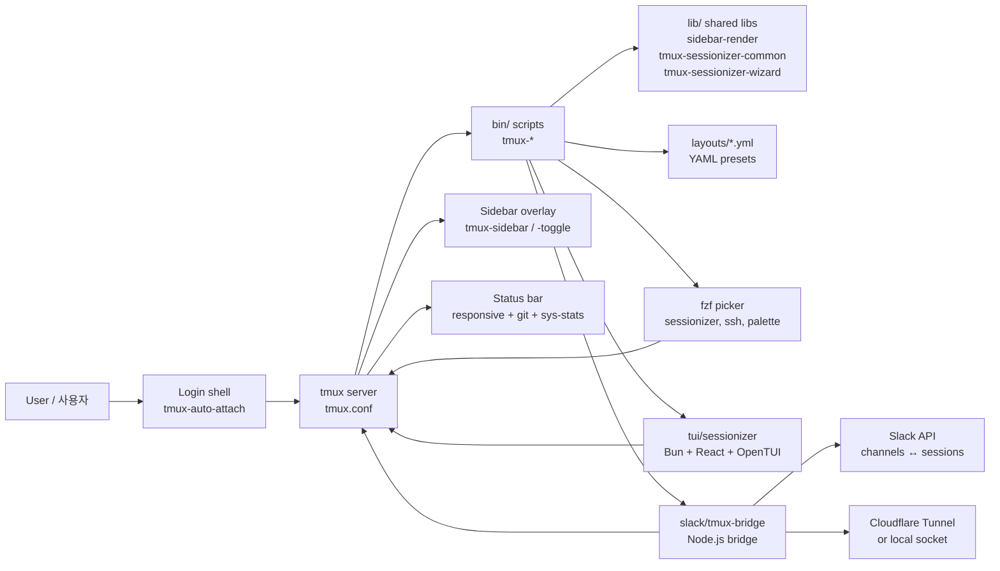

# tmux Productivity Suite / tmux 생산성 도구 모음

> A curated, opinionated tmux configuration plus a complete ecosystem of companion tools, shared libraries, declarative YAML layouts, a Bun/React/TypeScript TUI, and a Slack bridge — all designed for power users working across many projects and remote hosts.
>
> 큐레이션된 tmux 설정과 함께 동작하는 풍부한 생태계(보조 도구, 공유 라이브러리, 선언적 YAML 레이아웃, Bun/React/TypeScript 기반 TUI, Slack 브리지)를 한 저장소에 담은, 다수 프로젝트와 원격 호스트를 다루는 파워 유저용 환경입니다.

---

## Table of Contents / 목차

- [Overview / 개요](#overview--개요)
- [Features / 기능](#features--기능)
- [Architecture / 아키텍처](#architecture--아키텍처)
- [Repository Layout / 저장소 구조](#repository-layout--저장소-구조)
- [Quick Start / 빠른 시작](#quick-start--빠른-시작)
- [Configuration / 설정](#configuration--설정)
- [Commands Reference / 명령어 레퍼런스](#commands-reference--명령어-레퍼런스)
- [Layouts / 레이아웃](#layouts--레이아웃)
- [TUI Sessionizer / 터미널 UI 세션나이저](#tui-sessionizer--터미널-ui-세션나이저)
- [Slack Bridge / 슬랙 브리지](#slack-bridge--슬랙-브리지)
- [Local Development / 로컬 개발](#local-development--로컬-개발)
- [Testing / 테스트](#testing--테스트)
- [Contributing / 기여](#contributing--기여)
- [License / 라이선스](#license--라이선스)

---

## Overview / 개요

This repository bundles a battle-tested `tmux.conf`, a `sessionizer.conf` for project discovery, and a curated set of companion binaries under `bin/`. It ships shared shell libraries under `lib/`, project-style window layouts under `layouts/`, a modern Terminal UI (`tui/sessionizer/`), and a Slack ↔ tmux bridge (`slack/tmux-bridge/`).

이 저장소는 실전에서 검증된 `tmux.conf`, 프로젝트 검색을 위한 `sessionizer.conf`, 그리고 `bin/` 디렉터리의 큐레이션된 보조 바이너리들을 함께 제공합니다. `lib/`의 공유 셸 라이브러리, `layouts/`의 프로젝트형 윈도우 레이아웃, 모던 터미널 UI(`tui/sessionizer/`), 그리고 Slack ↔ tmux 브리지(`slack/tmux-bridge/`)가 한 곳에서 동작합니다.

### Who is this for? / 사용 대상

| Audience / 대상 | Use case / 활용 사례 |
| --- | --- |
| Multi-project developers / 다수 프로젝트 개발자 | Jump between repos, save layouts per project, fast session creation / 저장소 간 빠른 이동, 프로젝트별 레이아웃, 빠른 세션 생성 |
| DevOps / SRE engineers / DevOps · SRE 엔지니어 | SSH host picking, remote pane management, declarative layout deployment / SSH 호스트 선택, 원격 페인 관리, 선언적 레이아웃 배포 |
| Open-source maintainers / 오픈소스 메인테이너 | Template sessions for reproducible setups, sidebar-driven context switching / 재현 가능한 템플릿 세션, 사이드바 기반 컨텍스트 전환 |
| Distributed teams / 분산 팀 | Slack channel ↔ tmux session sync, web terminal sharing / Slack 채널 ↔ tmux 세션 동기화, 웹 터미널 공유 |

---

## Features / 기능

### Core tmux configuration / 핵심 tmux 설정
- **Single prefix key (`C-a`)** with vim-style navigation, mouse support, true color, and 256-color fallback / 단일 프리픽스 키(`C-a`), vim 스타일 탐색, 마우스 지원, true color 및 256 color 폴백
- **Tokyo Night-inspired palette** with pane border status and per-pane theming / Tokyo Night 스타일 팔레트, 페인 보더 상태, 페인별 테마
- **Status bar** with responsive width tiers (compact / normal / wide), git status, system stats, session icons (Nerd Fonts) / 반응형 너비 단계별 상태 표시줄, git 상태, 시스템 통계, Nerd Font 아이콘
- **Auto-attach** on login shell so you never lose your session / 로그인 셸에서 자동 attach

### Session management / 세션 관리
- **Sessionizer** — `fzf`-driven project picker with templates and creation wizard / `fzf` 기반 프로젝트 피커, 템플릿 및 생성 위저드 지원
- **TUI Sessionizer** — full-screen terminal UI (Bun + React + OpenTUI) with preview, filter, and rename flows / 풀스크린 터미널 UI, 미리보기·필터·이름 변경 기능
- **Session cycling** with `PgUp` / `PgDn`, **MRU jump** picker, safe **kill** with confirmation / `PgUp`/`PgDn` 세션 순환, MRU 점프 피커, 확인 후 안전 종료
- **Sidebar** — tree-style session/window/pane navigator with toggleable visibility / 트리 스타일 세션/윈도우/페인 내비게이터, 토글 가능
- **Dashboard** — formatted session table popup / 서식 있는 세션 테이블 팝업
- **Sync, rename, order, branch log, icon** — full lifecycle utilities / 동기화·이름 변경·정렬·브랜치 로그·아이콘 등 전체 라이프사이클 유틸

### Productivity helpers / 생산성 도구
- **Command palette** — `fzf` action picker for common operations / 공통 작업을 위한 `fzf` 액션 피커
- **Clipboard history, copy-word, URL open, file open** — text & link handling / 클립보드 히스토리, 단어 복사, URL/파일 열기
- **SSH picker** — browse `~/.ssh/config` and open panes / `~/.ssh/config` 탐색 후 페인 열기
- **Pane sync toggle** — broadcast input to multiple panes / 여러 페인으로 입력 동시 전달
- **Cheatsheet, config reload, notify-long-command, responsive status, sys stats** — quality-of-life extras / 키바인딩 치트시트, 설정 리로드, 긴 명령 알림, 반응형 상태표시줄, 시스템 통계

### Layouts / 레이아웃
- **YAML layout templates** for sessions and windows / 세션/윈도우용 YAML 레이아웃 템플릿
- Built-in presets for general work, resume, Proxmox, SafeWork, SafeWork 2, Splunk / 일반 작업, 이력서, Proxmox, SafeWork, SafeWork 2, Splunk 프리셋
- **Blacklist layout** to deny/filter discovered projects / 프로젝트 검색 차단용 블랙리스트 레이아웃

### Integrations / 통합
- **Slack bridge** — bidirectional mapping between Slack channels and tmux sessions (socket-direct or HTTP via Cloudflare Tunnel) / Slack 채널 ↔ tmux 세션 양방향 매핑 (소켓 직접 또는 Cloudflare Tunnel HTTP)
- **Git awareness** — branch, dirty, ahead/behind, stash per session / 세션별 브랜치·변경·ahead/behind·stash 추적
- **Web terminal** — `ttyd`-based shareable web terminal launcher / `ttyd` 기반 공유 가능한 웹 터미널

---

## Architecture / 아키텍처

The suite is intentionally shell-first. Bash scripts in `bin/` orchestrate `tmux` itself, with shared logic factored into `lib/`. The TUI and Slack bridge live in separate runtimes because they each have richer requirements (interactive UI, persistent network connection).

본 도구 모음은 의도적으로 셸 우선 구조입니다. `bin/`의 Bash 스크립트가 `tmux` 자체를 오케스트레이션하며, 공통 로직은 `lib/`로 분리됩니다. TUI와 Slack 브리지는 각각 인터랙티브 UI와 지속 네트워크 연결 요구사항 때문에 별도 런타임으로 구성됩니다.



### Runtime boundaries / 런타임 경계

| Component / 구성 요소 | Runtime / 런타임 | Purpose / 목적 |
| --- | --- | --- |
| `tmux.conf`, `bin/*`, `lib/*` | bash + tmux | Core session orchestration / 핵심 세션 오케스트레이션 |
| `layouts/*.yml` | data only | Declarative session blueprints / 선언적 세션 청사진 |
| `tui/sessionizer/` | Bun + TypeScript + React | Full-screen interactive session UI / 풀스크린 인터랙티브 세션 UI |
| `slack/tmux-bridge/` | Node.js + tsx | Persistent Slack ↔ tmux bridge / 영구 Slack ↔ tmux 브리지 |

---

## Repository Layout / 저장소 구조

```
.
├── AGENTS.md                  # Project knowledge base for automation agents
├── CONTRIBUTING.md            # Contribution guidelines
├── LICENSE                    # License terms
├── OWNERS                     # Code ownership listing
├── README.md                  # This document
├── sessionizer.conf           # Project discovery configuration (SCAN_DIR, EXTRA_DIRS)
├── tmux.conf                  # Root tmux configuration (sources conf.d/*.conf)
├── bin/                       # Executable companion scripts (tmux-*)
│   ├── tmux-auto-attach
│   ├── tmux-bash-preexec
│   ├── tmux-cheatsheet
│   ├── tmux-clipboard-history
│   ├── tmux-command-palette
│   ├── tmux-config-reload
│   ├── tmux-copy-word
│   ├── tmux-file-open
│   ├── tmux-git-status
│   ├── tmux-git-uncommitted
│   ├── tmux-layout-apply
│   ├── tmux-notify-long-command
│   ├── tmux-opencode
│   ├── tmux-pane-sync
│   ├── tmux-responsive
│   ├── tmux-session-branch-log
│   ├── tmux-session-cycle
│   ├── tmux-session-dashboard
│   ├── tmux-session-export
│   ├── tmux-session-icon
│   ├── tmux-session-jump
│   ├── tmux-session-kill
│   ├── tmux-session-order
│   ├── tmux-session-rename
│   ├── tmux-session-sync
│   ├── tmux-sessionizer
│   ├── tmux-sessionizer-tui
│   ├── tmux-sidebar
│   ├── tmux-sidebar-init
│   ├── tmux-sidebar-toggle
│   ├── tmux-slack-bridge-setup
│   ├── tmux-slack-bridge-start
│   ├── tmux-ssh-picker
│   ├── tmux-sys-stats
│   ├── tmux-template-create
│   ├── tmux-url-open
│   └── tmux-web-terminal
├── lib/                       # Shared shell libraries
│   ├── sidebar-colors
│   ├── sidebar-render
│   ├── tmux-sessionizer-common
│   └── tmux-sessionizer-wizard
├── layouts/                   # Declarative YAML window/session layouts
│   ├── blacklist.yml
│   ├── default.yml
│   ├── proxmox.yml
│   ├── resume.yml
│   ├── safework.yml
│   ├── safework2.yml
│   └── splunk.yml
├── tui/
│   └── sessionizer/           # Bun + React + TypeScript terminal UI
│       ├── AGENTS.md
│       ├── bun.lock
│       ├── bunfig.toml
│       ├── package.json
│       ├── tsconfig.json
│       ├── src/               # App entry, components, hooks, actions, lib
│       └── __tests__/         # Vitest/Bun test suites
├── docs/                      # Design notes and governance
│   ├── session-persistence-brainstorming.md
│   └── supermemory-governance.md
└── slack/
    └── tmux-bridge/           # Node.js Slack ↔ tmux bridge
        └── AGENTS.md
```

---

## Quick Start / 빠른 시작

### 1. Prerequisites / 필수 구성

- **tmux** 3.2+
- **bash** 4+
- **fzf** for picker UIs
- **git**, **ssh**, standard coreutils
- (Optional, for TUI) **Bun** 1.x
- (Optional, for Slack bridge) **Node.js** 18+, `tsx`
- (Optional, for web terminal) **ttyd**
- (Optional, for remote bridge) **cloudflared**

### 2. Install / 설치

Symlink (or copy) the repository to `~/.tmux` so paths resolve naturally:

저장소를 `~/.tmux`에 심볼릭 링크(또는 복사)하여 경로가 자연스럽게 해석되도록 합니다.

```bash
git clone <your-fork-url> ~/code/tmux-suite
ln -s ~/code/tmux-suite ~/.tmux

# Ensure tmux loads this config by adding to ~/.tmux.conf if needed:
# echo 'source-file ~/.tmux/tmux.conf' > ~/.tmux.conf
```

### 3. First launch / 첫 실행

```bash
# Start (or attach to) tmux
tmux

# Inside tmux, pick or create a session from any project directory
# prefix + s   (configured in 20-keys.conf)
# or run:      tmux-sessionizer

# Launch the TUI variant
tmux-sessionizer-tui
```

### 4. Optional: Slack bridge / 선택: Slack 브리지

```bash
tmux-slack-bridge-setup      # Interactive wizard for app credentials
tmux-slack-bridge-start      # Start bridge (socket or HTTP mode)
```

---

## Configuration / 설정

### `tmux.conf`

The root file sources modular config under `conf.d/` (e.g. `00-core.conf`, `10-theme.conf`, `20-keys.conf`, `25-sidebar.conf`). It establishes the prefix key, terminal baseline, and helper bindings.

루트 파일은 `conf.d/` 하위의 모듈형 설정(예: `00-core.conf`, `10-theme.conf`, `20-keys.conf`, `25-sidebar.conf`)을 로드합니다. 프리픽스 키, 터미널 베이스라인, 헬퍼 바인딩을 정의합니다.

### `sessionizer.conf`

Drives `tmux-sessionizer` discovery:

```bash
# Directories to scan for git repos / git 저장소를 스캔할 디렉터리
SCAN_DIR=(
  "$HOME/code"
  "$HOME/work"
)

# Extra ad-hoc directories / 추가 임의 디렉터리
EXTRA_DIRS=(
  "$HOME/notes"
)
```

Adjust these to match your local project layout. The blacklist layout (`layouts/blacklist.yml`) further filters projects by name pattern.

로컬 프로젝트 구조에 맞게 조정하세요. 블랙리스트 레이아웃(`layouts/blacklist.yml`)이 이름 패턴으로 프로젝트를 추가로 필터링합니다.

### Environment variables / 환경 변수

| Variable / 변수 | Used by / 사용처 | Purpose / 용도 |
| --- | --- | --- |
| `EDITOR` | sessionizer, open scripts | Preferred editor / 기본 편집기 |
| `FZF_DEFAULT_OPTS` | all `fzf` pickers | Picker styling / 피커 스타일 |
| `SLACK_BOT_TOKEN` | slack-bridge | Slack API authentication / Slack API 인증 |
| `SLACK_APP_TOKEN` | slack-bridge (socket mode) | App-level token for socket mode / 소켓 모드용 앱 토큰 |

---

## Commands Reference / 명령어 레퍼런스

All binaries live under `bin/` and are conventionally invokable by name. Most are also wired into the `tmux.conf` keybindings.

모든 바이너리는 `bin/`에 있으며 관례상 이름으로 호출합니다. 대부분 `tmux.conf` 키바인딩으로도 등록되어 있습니다.

### Sessions / 세션

| Command / 명령어 | Description / 설명 |
| --- | --- |
| `tmux-sessionizer` | `fzf` project picker + creation wizard / `fzf` 프로젝트 피커 및 생성 위저드 |
| `tmux-sessionizer-tui` | Launch TUI sessionizer (Bun) / TUI 세션나이저 실행 (Bun) |
| `tmux-session-jump` | Most-recently-used session picker / MRU 세션 피커 |
| `tmux-session-cycle [dir]` | Rotate sessions with `PgUp` / `PgDn` / `PgUp`/`PgDn`으로 세션 순환 |
| `tmux-session-kill` | Kill session with confirmation / 확인 후 세션 종료 |
| `tmux-session-rename` | Rename session with validation / 유효성 검사 후 세션 이름 변경 |
| `tmux-session-order` | Sort sessions by recent activity / 최근 활동 기준 세션 정렬 |
| `tmux-session-dashboard` | Formatted session table popup / 서식 있는 세션 테이블 팝업 |
| `tmux-session-export` | Export current session layout to YAML / 현재 세션 레이아웃을 YAML로 내보내기 |
| `tmux-session-branch-log` | Log session→branch on switch / 전환 시 세션→브랜치 로깅 |
| `tmux-session-icon` | Map session name to Nerd Font icon / 세션명을 Nerd Font 아이콘으로 매핑 |
| `tmux-session-sync` | Sync tmux sessions with Slack channels / tmux 세션과 Slack 채널 동기화 |
| `tmux-template-create` | Create session from preset template / 프리셋 템플릿으로 세션 생성 |
| `tmux-layout-apply` | Apply YAML layout to a session / YAML 레이아웃을 세션에 적용 |
| `tmux-auto-attach` | Auto-attach flow for login shells / 로그인 셸 자동 attach |
| `tmux-opencode` | OpenCode session launcher / OpenCode 세션 실행 |

### Sidebar / 사이드바

| Command / 명령어 | Description / 설명 |
| --- | --- |
| `tmux-sidebar` | Render the tree sidebar / 트리 사이드바 렌더링 |
| `tmux-sidebar-init` | Initialize sidebar on session creation / 세션 생성 시 사이드바 초기화 |
| `tmux-sidebar-toggle` | Toggle sidebar visibility / 사이드바 표시 전환 |

### Productivity / 생산성

| Command / 명령어 | Description / 설명 |
| --- | --- |
| `tmux-command-palette` | `fzf` action picker for common ops / 공통 작업용 `fzf` 액션 피커 |
| `tmux-clipboard-history` | Browse tmux paste buffer ring / tmux 붙여넣기 버퍼 링 탐색 |
| `tmux-copy-word` | Smart word copy under cursor / 커서 아래 단어 스마트 복사 |
| `tmux-url-open` | Extract URL from pane and open / 페인에서 URL 추출 후 열기 |
| `tmux-file-open` | Extract file path from pane and open / 페인에서 파일 경로 추출 후 열기 |
| `tmux-ssh-picker` | `~/.ssh/config` host picker / `~/.ssh/config` 호스트 피커 |
| `tmux-pane-sync` | Toggle synchronized-panes / 동기화된 페인 토글 |
| `tmux-url-open` | (alias of URL handler) / URL 핸들러 별칭 |

### Status & shell / 상태 표시줄 & 셸

| Command / 명령어 | Description / 설명 |
| --- | --- |
| `tmux-responsive` | Width-tiered statusbar rendering / 너비 등급별 상태표시줄 렌더링 |
| `tmux-sys-stats` | CPU/MEM stats for status bar / 상태표시줄용 CPU/MEM 통계 |
| `tmux-git-status` | Branch + dirty/ahead/behind/stash / 브랜치, 변경, ahead/behind, stash |
| `tmux-git-uncommitted` | Track uncommitted changes per session / 세션별 미커밋 변경 추적 |
| `tmux-config-reload` | Reload tmux config with settings diff / 설정 리로드 (차이 표시) |
| `tmux-notify-long-command` | Desktop notification for long-running commands / 장기 실행 명령 데스크톱 알림 |
| `tmux-bash-preexec` | Sourceable preexec hook for timing / 소스 가능한 명령 타이밍 훅 |
| `tmux-cheatsheet` | Categorized keybinding reference / 카테고리별 키바인딩 참고 |
| `tmux-web-terminal` | Launch `ttyd` web terminal / `ttyd` 웹 터미널 실행 |

### Slack bridge / Slack 브리지

| Command / 명령어 | Description / 설명 |
| --- | --- |
| `tmux-slack-bridge-setup` | Interactive wizard for Slack app credentials / Slack 앱 자격 증명 위저드 |
| `tmux-slack-bridge-start` | Start the bridge (socket direct or HTTP via Cloudflare Tunnel) / 브리지 시작 (소켓 직접 또는 Cloudflare Tunnel HTTP) |

---

## Layouts / 레이아웃

Layouts are YAML files under `layouts/` describing window and pane arrangements. Use `tmux-layout-apply` to instantiate one against an existing session, or `tmux-template-create` to spin up a new session from a template.

레이아웃은 `layouts/`의 YAML 파일로, 윈도우 및 페인 배치를 정의합니다. `tmux-layout-apply`로 기존 세션에 적용하거나, `tmux-template-create`로 템플릿에서 새 세션을 생성할 수 있습니다.

| File / 파일 | Purpose / 용도 |
| --- | --- |
| `default.yml` | Reasonable default for general projects / 일반 프로젝트용 기본값 |
| `blacklist.yml` | Filters/denies projects by name pattern / 이름 패턴으로 프로젝트 차단 |
| `resume.yml` | Layout tailored for resume/portfolio work / 이력서/포트폴리오 작업용 |
| `proxmox.yml` | Proxmox virtualization operations / Proxmox 가상화 운영 |
| `safework.yml` | SafeWork environment setup / SafeWork 환경 구성 |
| `safework2.yml` | SafeWork variant 2 / SafeWork 변형 2 |
| `splunk.yml` | Splunk dashboard / query layout / Splunk 대시보드/쿼리 레이아웃 |

Each file follows a consistent schema (windows, panes, commands). Inspect any file for the canonical shape.

각 파일은 일관된 스키마(windows, panes, commands)를 따릅니다. 정식 형태는 임의의 파일을 참조하세요.

---

## TUI Sessionizer / 터미널 UI 세션나이저

`tui/sessionizer/` is a Bun-powered React terminal UI built on OpenTUI. It is a richer alternative to the `fzf`-based `tmux-sessionizer`.

`tui/sessionizer/`는 OpenTUI 기반의 Bun 기반 React 터미널 UI입니다. `fzf` 기반 `tmux-sessionizer`의 풍부한 대안입니다.

### Run / 실행

```bash
cd tui/sessionizer
bun install
bun run dev          # development
bun run start        # launch TUI
bun run test         # run test suite
```

### Features / 기능

- **Session list** with live filter input / 라이브 필터 입력이 가능한 세션 목록
- **Preview panel** showing session details / 세션 세부 정보를 보여주는 미리보기 패널
- **Create wizard** with multi-step directory / layout / name flow / 디렉터리·레이아웃·이름의 다단계 생성 위저드
- **Rename dialog** and **kill confirmation dialog** / 이름 변경 및 종료 확인 다이얼로그
- **Keyboard-driven** via a dedicated hook for efficient navigation / 효율적인 탐색을 위한 전용 훅 기반 키보드 조작

### Source layout / 소스 구조

```
tui/sessionizer/
├── src/
│   ├── index.tsx              # Entry point
│   ├── App.tsx                # Root component
│   ├── bun-env.d.ts           # Bun type ambient declarations
│   ├── lib/                   # Pure helpers (config, theme, tmux, state, dirs, create-session)
│   ├── hooks/                 # Keyboard handler hook
│   ├── actions/               # Session-level actions
│   └── components/            # List, filter, preview, dialogs, wizard steps
└── __tests__/                 # Unit tests for config + tmux modules
```

### Build / 빌드

The TUI ships a `bunfig.toml` and `tsconfig.json` configured for JSX + strict TypeScript. Use `bun run build` if your local scripts add a build step.

TUI는 JSX + 엄격 TypeScript용 `bunfig.toml`, `tsconfig.json`을 포함합니다. 빌드 단계가 필요한 경우 `bun run build`를 사용하세요.

---

## Slack Bridge / 슬랙 브리지

`slack/tmux-bridge/` connects Slack channels to tmux sessions. It runs as a long-lived Node.js process and can communicate with the Slack API either directly over a socket (Socket Mode) or via HTTP through a Cloudflare Tunnel.

`slack/tmux-bridge/`는 Slack 채널을 tmux 세션에 연결합니다. 장시간 실행되는 Node.js 프로세스로 동작하며, 소켓 모드(직접) 또는 Cloudflare Tunnel(HTTP)을 통해 Slack API와 통신할 수 있습니다.

### Setup / 설정

```bash
# 1. Create your Slack app and obtain tokens
#    https://api.slack.com/apps
# 2. Run the interactive wizard
tmux-slack-bridge-setup
# 3. Start the bridge
tmux-slack-bridge-start
```

### Modes / 모드

| Mode / 모드 | When to use / 사용 시점 |
| --- | --- |
| **Socket direct** | Local-only or LAN deployments, no inbound firewall / 로컬 또는 LAN, 인바운드 방화벽 없음 |
| **HTTP via Cloudflare Tunnel** | Remote/cloud tmux hosts without exposing ports / 포트를 열지 않고 원격/클라우드 tmux 호스트 연결 |

### Mapping / 매핑

`tmux-session-sync` performs the actual mapping between Slack channels and tmux sessions. Configure it to:

- Mirror channel names → session names / 채널 이름 → 세션 이름 미러링
- Auto-create sessions for new channels / 새 채널에 대한 자동 세션 생성
- Tear down sessions when channels archive / 채널 아카이브 시 세션 종료

---

## Local Development / 로컬 개발

### Editing core tmux config / 핵심 tmux 설정 편집

```bash
# Edit a module
$EDITOR conf.d/20-keys.conf

# Reload inside tmux
prefix + r
# or:
tmux-config-reload
```

### Adding a new `bin/` script / 새 `bin/` 스크립트 추가

1. Place the executable in `bin/` with a `tmux-` prefix / `bin/`에 `tmux-` 접두사로 실행 파일 배치
2. Make it executable: `chmod +x bin/tmux-your-script` / 실행 권한 부여
3. Reuse helpers from `lib/` (e.g. `source "$HOME/.tmux/lib/sidebar-render"`) / `lib/` 헬퍼 재사용
4. Optionally wire it into `conf.d/20-keys.conf` / 필요 시 `conf.d/20-keys.conf`에 바인딩 추가
5. Document it under [Commands Reference](#commands-reference--명령어-레퍼런스) / 본 README의 명령어 레퍼런스에 추가

### TUI development / TUI 개발

```bash
cd tui/sessionizer
bun install
bun run dev
```

Hot-reload is handled by Bun's built-in watcher. New components belong in `src/components/`; cross-cutting logic in `src/lib/` or `src/hooks/`.

Bun 내장 워처가 핫 리로드를 처리합니다. 새 컴포넌트는 `src/components/`에, 횡단 관심사 로직은 `src/lib/` 또는 `src/hooks/`에 두세요.

### Slack bridge development / Slack 브리지 개발

```bash
cd slack/tmux-bridge
npm install
npm run dev      # tsx watch
```

Tokens should be loaded from environment variables or a local `.env` (not committed).

토큰은 환경 변수 또는 커밋되지 않는 로컬 `.env`에서 로드하세요.

---

## Testing / 테스트

### Shell scripts / 셸 스크립트

Most `bin/` scripts are pure bash and lend themselves to lightweight shell testing (`bats` is recommended). A baseline test pattern:

대부분의 `bin/` 스크립트는 순수 bash이며 가벼운 셸 테스트(`bats` 권장)에 적합합니다.

```bash
# Example: assert a session exists
[ "$(tmux has-session -t mytest 2>/dev/null; echo $?)" = "0" ]
```

### TUI Sessionizer / TUI 세션나이저

```bash
cd tui/sessionizer
bun run test
```

Unit tests live under `__tests__/` and cover pure helpers (`config.ts`, `tmux.ts`). Add new tests alongside the modules they exercise.

단위 테스트는 `__tests__/`에 있으며 순수 헬퍼(`config.ts`, `tmux.ts`)를 다룹니다. 새 테스트는 해당 모듈과 같은 위치에 추가하세요.

### Slack bridge / Slack 브리지

CI lives in `.gitlab-ci.yml` for the Slack bridge; replicate locally with:

Slack 브리지의 CI는 `.gitlab-ci.yml`에 있습니다. 로컬에서는 다음과 같이 재현할 수 있습니다.

```bash
cd slack/tmux-bridge
npm run lint
npm run test
```

---

## Contributing / 기여

Contributions are welcome. See [`CONTRIBUTING.md`](./CONTRIBUTING.md) for full guidelines. In short:

기여를 환영합니다. 자세한 내용은 [`CONTRIBUTING.md`](./CONTRIBUTING.md)를 참조하세요. 요약하면:

1. **Open an issue** describing the change and motivation / 변경 사항과 동기를 설명하는 이슈 열기
2. **Fork and branch** from `master` / `master`에서 브랜치 생성
3. **Keep commits focused** and write descriptive messages / 커밋은 단일 주제에 집중, 명확한 메시지 작성
4. **Match existing style** — bash `set -euo pipefail`, TypeScript strict, Prettier-formatted / 기존 스타일 준수 (bash `set -euo pipefail`, TypeScript strict, Prettier 포맷)
5. **Add or update tests** for behavior changes / 동작 변경에 대한 테스트 추가/갱신
6. **Update `README.md`** if you add a new command or layout / 새 명령/레이아웃 추가 시 `README.md` 갱신
7. **Sign off** your commits if the project requires DCO / DCO가 필요한 경우 커밋 사인오프

Code ownership is tracked in [`OWNERS`](./OWNERS); reviewers from that file should approve substantial changes.

코드 소유권은 [`OWNERS`](./OWNERS)에 기록되어 있으며, 주요 변경 사항은 해당 파일의 리뷰어 승인이 필요합니다.

---

## License / 라이선스

See [`LICENSE`](./LICENSE) for terms.

자세한 내용은 [`LICENSE`](./LICENSE)를 참조하세요.