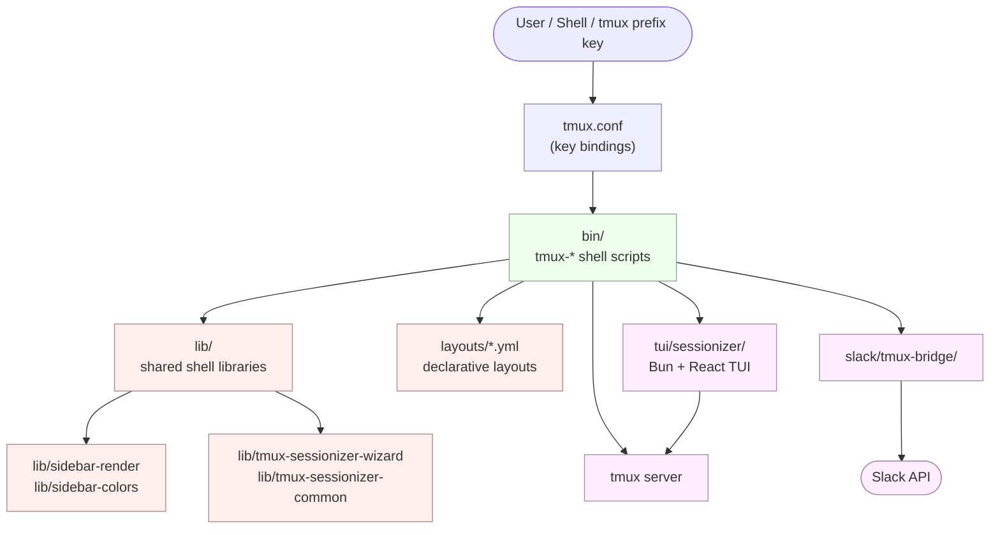

# tmux Productivity Suite / tmux 생산성 도구 모음

> A curated, opinionated tmux configuration plus a complete ecosystem of companion tools, libraries, layouts, a TUI, and a Slack bridge for power users.
>
> 파워 유저를 위한 큐레이션된 tmux 설정과 함께 제공되는 종합 도구·라이브러리·레이아웃·TUI·Slack 브리지 생태계입니다.

---

## Overview / 개요

This repository provides a battle-tested tmux configuration (`tmux.conf`) and an extensive set of companion shell scripts, shared libraries, declarative YAML layouts, a TypeScript-based Terminal UI (TUI), and a Slack bridge. Together they form a complete environment for project-oriented development, system administration, and remote collaboration — all from a single tmux session.

이 저장소는 실전에서 검증된 tmux 설정(`tmux.conf`)과 풍부한 생태계를 이루는 셸 스크립트, 공유 라이브러리, 선언적 YAML 레이아웃, TypeScript 기반 터미널 UI(TUI), 그리고 Slack 브리지를 함께 제공합니다. 프로젝트 중심의 개발, 시스템 운영, 원격 협업에 필요한 모든 것을 단일 tmux 세션 안에서 제공합니다.

### Who is this for? / 사용 대상

| Audience / 대상 | Use case / 활용 사례 |
| --- | --- |
| Multi-project developers / 다수 프로젝트 개발자 | Jump between repos, save layouts per project, fast session creation / 저장소 간 빠른 이동, 프로젝트별 레이아웃 |
| DevOps / SRE engineers / DevOps·SRE 엔지니어 | SSH picker, per-host layouts, system stats, long-command notifications |
| Remote-first teams / 원격 우선 팀 | Slack bridge for sharing terminal access / 터미널 공유 |
| tmux power users / tmux 파워 유저 | TUI sessionizer, sidebar, command palette, pane synchronization |

---

## Features / 기능

### Session management / 세션 관리
- **Project-aware session creation** with `tmux-sessionizer` — fuzzy-find a directory and create or attach a session
- **TUI mode** via `tmux-sessionizer-tui` — Bun + React + TypeScript interface with preview, create-wizard, kill-confirm and rename dialogs
- **Cycle, jump, kill, rename, reorder, sync** helpers (`tmux-session-cycle`, `tmux-session-jump`, `tmux-session-kill`, `tmux-session-rename`, `tmux-session-order`, `tmux-session-sync`)
- **Session dashboard** (`tmux-session-dashboard`) for an at-a-glance overview of active sessions
- **Export/import** session state (`tmux-session-export`), **per-session branch logs** (`tmux-session-branch-log`), and **session icons** (`tmux-session-icon`)

### Layouts / 레이아웃
- **Declarative YAML layouts** in `layouts/` for reproducible windows and panes (`default.yml`, `resume.yml`, `safework.yml`, `safework2.yml`, `splunk.yml`, `proxmox.yml`)
- **Per-host blacklists** (`layouts/blacklist.yml`) to suppress panes on unsupported environments
- **Apply layouts** with `tmux-layout-apply`, **generate new ones** with `tmux-template-create`

### Sidebar & navigation / 사이드바 & 탐색
- **Persistent sidebar** rendered by `tmux-sidebar` using shared libraries in `lib/sidebar-render` and `lib/sidebar-colors`
- **Initialize** the sidebar on a new session (`tmux-sidebar-init`) and **toggle** it on demand (`tmux-sidebar-toggle`)
- **Responsive sizing** via `tmux-responsive` for small terminals

### Clipboard, copy & links / 클립보드·복사·링크
- **Clipboard history** with `tmux-clipboard-history`
- **Word-level copy** with `tmux-copy-word`
- **URL opening** with `tmux-url-open` and **file opening** with `tmux-file-open`

### Git integration / Git 통합
- **Inline status** indicator with `tmux-git-status`
- **Uncommitted-changes warning** with `tmux-git-uncommitted`

### Notifications & monitoring / 알림 & 모니터링
- **Long-command completion notifications** via `tmux-notify-long-command` (desktop or remote)
- **System statistics overlay** via `tmux-sys-stats` (CPU, memory, load)

### Productivity helpers / 생산성 도우미
- **Command palette** (`tmux-command-palette`) for fuzzy-launching any suite tool
- **Cheatsheet** (`tmux-cheatsheet`) for in-terminal key reference
- **Pane synchronization** (`tmux-pane-sync`) to broadcast input to every pane
- **Auto-attach** to your last tmux session on shell start (`tmux-auto-attach`)
- **Bash preexec hook** (`tmux-bash-preexec`) for accurate command timing and notification triggers

### Remote & collaboration / 원격 & 협업
- **SSH picker** (`tmux-ssh-picker`) to fuzzy-connect to known hosts
- **Web terminal** (`tmux-web-terminal`) for browser-based access to your tmux
- **Slack bridge** in `slack/tmux-bridge/` to share terminal sessions into a Slack channel
  - `tmux-slack-bridge-setup` — one-time install
  - `tmux-slack-bridge-start` — start the bridge for the current session

### AI-assisted coding / AI 코딩 지원
- **`tmux-opencode`** integration for running AI coding sessions in a dedicated pane

---

## Repository layout / 저장소 구조

```
.
├── AGENTS.md                       # AI assistant guidance (internal)
├── CONTRIBUTING.md                 # Contribution guidelines
├── LICENSE
├── OWNERS                          # CODEOWNERS
├── README.md
├── sessionizer.conf                # Configuration for tmux-sessionizer
├── tmux.conf                       # Main tmux configuration (source this)
├── bin/                            # All user-facing tmux-* commands
├── lib/                            # Shared shell libraries
│   ├── sidebar-colors
│   ├── sidebar-render
│   ├── tmux-sessionizer-common
│   └── tmux-sessionizer-wizard
├── layouts/                        # Declarative YAML window/pane layouts
│   ├── blacklist.yml
│   ├── default.yml
│   ├── proxmox.yml
│   ├── resume.yml
│   ├── safework.yml
│   ├── safework2.yml
│   └── splunk.yml
├── tui/
│   └── sessionizer/                # Bun + React + TypeScript TUI
│       ├── bun.lock
│       ├── bunfig.toml
│       ├── package.json
│       ├── tsconfig.json
│       ├── src/
│       │   ├── App.tsx
│       │   ├── index.tsx
│       │   ├── actions/
│       │   ├── components/
│       │   ├── hooks/
│       │   └── lib/
│       └── __tests__/              # Bun test suite
├── docs/
│   ├── session-persistence-brainstorming.md
│   └── supermemory-governance.md
└── slack/
    └── tmux-bridge/                # Slack ↔ tmux bridge
```

---

## Architecture / 아키텍처

The suite is layered so that the shell scripts in `bin/` are thin wrappers that compose shared libraries in `lib/`, read YAML layouts, and call into `tmux` itself. The TUI is a separate TypeScript process spawned on demand, and the Slack bridge is an independent worker that connects a tmux session to a Slack channel.



---

## Quick start / 빠른 시작

### Prerequisites / 사전 요구사항

| Tool / 도구 | Why / 용도 | Install / 설치 예시 |
| --- | --- | --- |
| `tmux` ≥ 3.0 | Core multiplexer / 핵심 멀티플렉서 | `brew install tmux` / `apt install tmux` |
| `fzf` | Fuzzy finding for sessionizer, picker, palette | `brew install fzf` / `apt install fzf` |
| `bash` ≥ 4 | Most scripts target bash | Pre-installed on Linux/macOS |
| `bun` (optional) | Only needed for the TUI / TUI 전용 | `curl -fsSL https://bun.sh/install | bash` |
| `git` | Git status helpers / Git 상태 도우미 | Pre-installed |

### Install / 설치

```bash
# Clone the repo
git clone <your-fork-or-source-url> ~/code/tmux-productivity
cd ~/code/tmux-productivity

# Symlink the scripts onto your PATH
mkdir -p ~/.local/bin
ln -sf "$PWD"/bin/tmux-* ~/.local/bin/

# Make sure ~/.local/bin is on your PATH
echo 'export PATH="$HOME/.local/bin:$PATH"' >> ~/.bashrc
```

### Wire tmux.conf into your shell / tmux.conf 연결

Add the following to your `~/.bashrc`, `~/.zshrc`, or equivalent:

```bash
# tmux Productivity Suite
if [ -f "$HOME/code/tmux-productivity/tmux.conf" ]; then
    alias tmux="tmux -f $HOME/code/tmux-productivity/tmux.conf"
fi

# Auto-attach when starting a new shell inside an SSH session
[ -x "$HOME/.local/bin/tmux-auto-attach" ] && eval "$(tmux-auto-attach --export)"
```

Or, if you prefer to source it directly:

```bash
TMUX_PROD="$HOME/code/tmux-productivity"
ln -sf "$TMUX_PROD/tmux.conf" ~/.tmux.conf
```

### First launch / 첫 실행

```bash
tmux new -s playground
# Inside tmux, press your prefix (default: Ctrl-b) then:
#   - s       open the sidebar
#   - g       open the sessionizer
#   - ?       open the cheatsheet
#   - :       reload config with tmux-config-reload
```

---

## Configuration / 설정

| File / 파일 | Purpose / 용도 |
| --- | --- |
| `tmux.conf` | Main tmux configuration: key bindings, options, status line, theme. Source or pass with `-f`. |
| `sessionizer.conf` | Configuration for `tmux-sessionizer`: search roots, excluded directories, default session naming. |
| `layouts/*.yml` | Declarative window/pane layouts (see [Layouts](#layouts--레이아웃)). |
| `layouts/blacklist.yml` | Layouts or panes to skip on specific hosts. |
| `tui/sessionizer/bunfig.toml` | Bun runtime configuration for the TUI. |
| `tui/sessionizer/tsconfig.json` | TypeScript compiler options for the TUI. |

Most shell scripts accept `--help` for inline documentation of environment variables they read (e.g. `TMUX_SESSIONIZER_DIRS`, `TMUX_SIDEBAR_WIDTH`).

---

## Commands reference / 명령어 레퍼런스

All commands live under `bin/` and follow the `tmux-*` naming convention. Run any of them with `--help` for usage.

### Sessions / 세션

| Command / 명령어 | Description / 설명 |
| --- | --- |
| `tmux-sessionizer` | Fuzzy-find a directory and create or attach a tmux session for it. |
| `tmux-sessionizer-tui` | Launch the Bun + React TUI sessionizer (preview, wizard, kill-confirm, rename). |
| `tmux-session-cycle` | Cycle through sessions forward/backward in a key binding. |
| `tmux-session-jump` | Quickly jump to a session by partial name. |
| `tmux-session-kill` | Kill one or more sessions with confirmation. |
| `tmux-session-rename` | Rename the current session (and optionally its working directory). |
| `tmux-session-order` | Reorder sessions deterministically. |
| `tmux-session-sync` | Mirror the active pane across sessions. |
| `tmux-session-dashboard` | Show a one-screen dashboard of every session. |
| `tmux-session-export` | Export session metadata for backup or migration. |
| `tmux-session-branch-log` | Append the current session name to a per-branch log file. |
| `tmux-session-icon` | Pick an icon for the current session (used by the sidebar). |

### Layouts / 레이아웃

| Command / 명령어 | Description / 설명 |
| --- | --- |
| `tmux-layout-apply` | Apply a layout from `layouts/<name>.yml` to the current session. |
| `tmux-template-create` | Scaffold a new YAML layout from the current window's structure. |

### Sidebar & UI / 사이드바 & UI

| Command / 명령어 | Description / 설명 |
| --- | --- |
| `tmux-sidebar` | Render the sidebar popup using `lib/sidebar-render` + `lib/sidebar-colors`. |
| `tmux-sidebar-init` | Initialize sidebar data on a new session. |
| `tmux-sidebar-toggle` | Toggle sidebar visibility. |
| `tmux-responsive` | Recalculate pane sizes for the current terminal dimensions. |
| `tmux-command-palette` | Fuzzy-launch any `tmux-*` tool from a single binding. |
| `tmux-cheatsheet` | Print the local cheatsheet inside a tmux popup. |
| `tmux-config-reload` | Reload `tmux.conf` and all key bindings without losing sessions. |

### Clipboard, copy & links / 클립보드·복사·링크

| Command / 명령어 | Description / 설명 |
| --- | --- |
| `tmux-clipboard-history` | Open a clipboard history picker. |
| `tmux-copy-word` | Yank the word under the cursor without leaving copy-mode. |
| `tmux-url-open` | Open the URL under the cursor in your default browser. |
| `tmux-file-open` | Open the file under the cursor in your editor. |

### Git / Git

| Command / 명령어 | Description / 설명 |
| --- | --- |
| `tmux-git-status` | Show the current branch and dirty state in the status line. |
| `tmux-git-uncommitted` | Warn or block if a session has uncommitted changes. |

### Notifications & monitoring / 알림 & 모니터링

| Command / 명령어 | Description / 설명 |
| --- | --- |
| `tmux-notify-long-command` | Send a desktop notification when a long-running command finishes. |
| `tmux-sys-stats` | Display CPU, memory, and load averages. |

### Pane & shell / 패널 & 셸

| Command / 명령어 | Description / 설명 |
| --- | --- |
| `tmux-pane-sync` | Toggle synchronized panes (broadcast input). |
| `tmux-bash-preexec` | Sourceable bash pre-exec hook for accurate command timing. |
| `tmux-auto-attach` | Auto-create or re-attach to a tmux session on shell start. |

### Remote & AI / 원격 & AI

| Command / 명령어 | Description / 설명 |
| --- | --- |
| `tmux-ssh-picker` | Fuzzy-pick an SSH host and connect in a new pane/window. |
| `tmux-web-terminal` | Start a web-based terminal exposing your tmux session. |
| `tmux-opencode` | Launch an AI coding session in a dedicated pane. |
| `tmux-slack-bridge-setup` | One-time setup of the Slack ↔ tmux bridge. |
| `tmux-slack-bridge-start` | Start the bridge for the current tmux session. |

### Shared libraries / 공유 라이브러리

| Library / 라이브러리 | Purpose / 용도 |
| --- | --- |
| `lib/sidebar-colors` | Theme palette and color helpers for the sidebar. |
| `lib/sidebar-render` | Sidebar layout and rendering primitives. |
| `lib/tmux-sessionizer-common` | Shared sessionizer helpers (directory discovery, naming). |
| `lib/tmux-sessionizer-wizard` | Multi-step create-session wizard used by the TUI. |

---

## Local development / 로컬 개발

### Editing shell scripts / 셸 스크립트 수정

```bash
# 1. Edit a script
$EDITOR bin/tmux-sessionizer

# 2. Make it executable (if needed)
chmod +x bin/tmux-sessionizer

# 3. Reload tmux inside any running session
prefix + : then run: source-file ~/code/tmux-productivity/tmux.conf
# Or just run
tmux-config-reload
```

### Editing the TUI / TUI 수정

```bash
cd tui/sessionizer

# Install dependencies
bun install

# Run the TUI against your live tmux server
bun run dev

# Type-check
bunx tsc --noEmit

# Run the test suite
bun test
```

The TUI talks to your live tmux server through the helpers in `src/lib/tmux.ts`, so you can develop against a real session. Use `tmux-sessionizer-tui --dry-run` if available, or run inside a throwaway session.

### Editing layouts / 레이아웃 수정

```bash
# Apply a layout to your current session
tmux-layout-apply safework

# Generate a new layout from your current window
tmux-template-create my-new-layout
# Edit the resulting YAML in layouts/my-new-layout.yml
```

### Working on the Slack bridge / Slack 브리지 개발

```bash
cd slack/tmux-bridge
# See slack/tmux-bridge/AGENTS.md for component-specific guidance.
```

---

## Testing / 테스트

The TUI ships with a Bun-based test suite:

```bash
cd tui/sessionizer
bun test                 # Run all tests in __tests__/
bun test --watch         # Re-run on file changes
bun test __tests__/tmux.test.ts
```

Test coverage lives in `tui/sessionizer/__tests__/`:

- `config.test.ts` — configuration parsing and defaults
- `tmux.test.ts` — tmux server interaction helpers

Shell scripts are designed to be exercised manually against a real tmux server; a smoke-test recipe is to open a clean session and run each `bin/tmux-*` command once with `--help` to verify it executes.

---

## Contributing / 기여

Contributions are welcome! Please read [`CONTRIBUTING.md`](./CONTRIBUTING.md) for the project's coding style, commit conventions, and review process. The `OWNERS` file lists current maintainers.

When adding a new tool, please:

1. Place the script in `bin/` with a `tmux-*` name.
2. Support `--help` and exit cleanly on `Ctrl-C`.
3. Reuse helpers from `lib/` instead of duplicating logic.
4. Add a row to the [Commands reference](#commands-reference--명령어-레퍼런스) section of this README.
5. For TUI changes, add tests under `tui/sessionizer/__tests__/`.

`AGENTS.md` files in this repository are internal notes for AI coding assistants; they are not part of the user-facing product.

---

## License / 라이선스

This project is released under the license described in [`LICENSE`](./LICENSE).