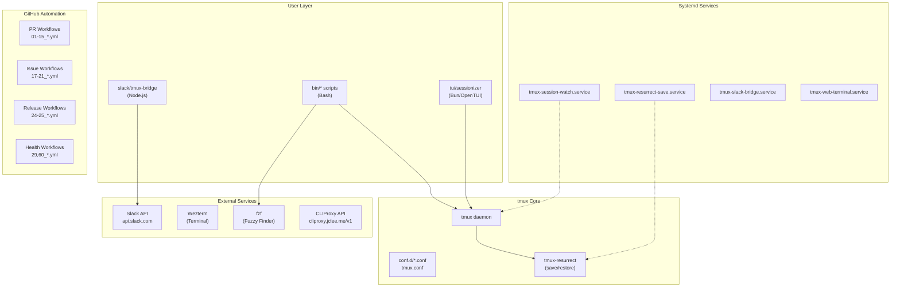

# TMUX SESSIONIZER

<!-- Logo Tagline -->
> bash-first tmux configuration and session-management toolkit

---

## Overview

**TMUX SESSIONIZER** is a comprehensive tmux configuration system designed for developers who work with multiple projects and sessions. It provides a unified interface for session discovery, creation, and management, with deep integrations for Slack, system services, and terminal UI applications.

The project is structured as a symlinked `~/.tmux` directory with a plugin-style architecture where core behavior lives in `conf.d/*.conf` and `bin/*` scripts. A nested Bun/OpenTUI sessionizer TUI runs at `tui/sessionizer`, and a Node.js Slack bridge operates at `slack/tmux-bridge`.

---

## 개요 (Korean)

**TMUX SESSIONIZER**는 여러 프로젝트와 세션으로 작업하는 개발자를 위해 설계된 종합 tmux 구성 시스템입니다. Slack, 시스템 서비스 및 터미널 UI 애플리케이션과의 심층 통합을 통해 세션 검색, 생성 및 관리를 위한 통합 인터페이스를 제공합니다.

프로젝트는 심볼릭 링크된 `~/.tmux` 디렉토리로 구조화되어 있으며, 플러그인 스타일 아키텍처에서 핵심 동작은 `conf.d/*.conf` 및 `bin/*` 스크립트에 있습니다. 중첩된 Bun/OpenTUI 세션라이저 TUI는 `tui/sessionizer`에서 실행되고, Node.js Slack 브리지는 `slack/tmux-bridge`에서 운영됩니다.

---

## Features

### Session Management

- **Intelligent Session Discovery**: Auto-scan configured directories for git repositories and project folders
- **Fuzzy Session Picker**: fzf-based session selection with preview and instant filtering
- **Session Creation Wizard**: Interactive multi-step wizard for new session setup
- **MRU Session Jump**: Quickly access most recently used sessions
- **Session Templates**: Create sessions from predefined layout templates
- **Session Export/Import**: Save and restore session window/pane layouts as YAML

### Terminal UI (TUI) Application

- **OpenTUI-based Interface**: Modern terminal user interface built with Bun and OpenTUI
- **Preview Panel**: Real-time preview of session contents and windows
- **Kill Confirmation**: Safe session termination with confirmation dialogs
- **Rename Support**: Rename existing sessions with validation
- **Layout Selection**: Visual layout picker for new sessions

### Slack Integration

- **Real-time Channel Bridge**: Bi-directional sync between tmux sessions and Slack channels
- **Session Notifications**: Desktop notifications for session events
- **Modal Interface**: Interactive Slack modals for session management
- **Command Handler**: Slash commands for tmux operations from Slack

### System Services

- **Automatic Session Saving**: Periodic tmux resurrect saves via systemd timers
- **Session Watch**: Monitor and notify on session state changes
- **Web Terminal**: ttyd-based web terminal accessible via cloudflared tunnel

---

## Architecture



---

## Automation Inventory

### GitHub Actions Workflows

#### Pull Request Workflows

| File | Purpose |
|------|---------|
| `01_branch-to-pr.yml` | Create PR from branch with auto-description |
| `03_pr-checks.yml` | Run tests, lint, and validation on PRs |
| `04_actionlint.yml` | Lint GitHub Actions workflow files |
| `05_gitleaks.yml` | Scan for secrets/credentials in code |
| `06_codeql.yml` | CodeQL security analysis |
| `07_dependency-review.yml` | Review dependency changes for vulnerabilities |
| `08_scorecard.yml` | OpenSSF Scorecard security assessment |
| `09_semantic-pr.yml` | Enforce semantic PR title conventions |
| `10_pr-review.yml` | AI-powered PR review via PR Agent |
| `13_pr-auto-merge.yml` | Auto-merge PRs on CI success |
| `14_bot-auto-fix.yml` | Auto-fix linting/code issues |
| `15_merged-pr-cleanup.yml` | Cleanup after PR merge |
| `security/11_pr-review.yml` | Security-focused PR review |

#### Issue Management Workflows

| File | Purpose |
|------|---------|
| `02_issue-to-branch.yml` | Create branch from issue |
| `18_issue-management.yml` | Issue labeling and triage |
| `19_issue-backfill.yml` | Backfill issue metadata |
| `37_ci-failure-issues.yml` | Create issues from CI failures |
| `91_issue-classification.yml` | Classify and route issues |

#### Release Workflows

| File | Purpose |
|------|---------|
| `24_release-notes.yml` | Generate release notes |
| `25_release-publish.yml` | Publish release artifacts |

#### Health & Maintenance Workflows

| File | Purpose |
|------|---------|
| `29_downstream-health-check.yml` | Monitor downstream dependencies |
| `60_ci-auto-heal.yml` | Auto-heal failing CI runs |

#### Documentation Workflows

| File | Purpose |
|------|---------|
| `20_readme-gen.yml` | Generate/update README |
| `21_docs-sync.yml` | Sync documentation across repos |
| `42_reusable-docs-sync.yml` | Reusable docs sync template |

#### Dependency Management Workflows

| File | Purpose |
|------|---------|
| `12_dependabot-auto-merge.yml` | Auto-merge Dependabot PRs |

#### Reusable Workflows (Templates)

| File | Purpose |
|------|---------|
| `44_reusable-pr-checks.yml` | Reusable PR validation template |
| `45_reusable-gitleaks.yml` | Reusable secret scanning template |
| `43_reusable-issue-management.yml` | Reusable issue triage template |

#### Other Workflows

| File | Purpose |
|------|---------|
| `auto-merge.yml` | General auto-merge logic |
| `ci.yml` | Primary CI pipeline |
| `labeler.yml` | Auto-label issues/PRs |
| `welcome.yml` | Welcome new contributors |

### Automation Models

- **README Generation**: `minimax-m2.7` (primary), `gpt-5.5` (fallback via CLIProxy API)

---

## Quick Start

### Prerequisites

- tmux (>= 3.0)
- bash (>= 4.0)
- fzf (>= 0.25)
- Bun (for TUI application)
- Git

### Installation

```bash
# Clone the repository
git clone https://github.com/jclee941/.github ~/.tmux

# Create symlink
ln -sf ~/.tmux/tmux.conf ~/.tmux.conf
ln -sf ~/.tmux/sessionizer.conf ~/.sessionizer.conf

# Install TUI dependencies
cd ~/.tmux/tui/sessionizer
bun install

# Install Slack bridge dependencies
cd ~/.tmux/slack/tmux-bridge
bun install

# Reload tmux configuration
tmux source-file ~/.tmux.conf
```

### Configuration

Edit `sessionizer.conf` to configure scan directories:

```bash
SCAN_DIRS=(
    "$HOME/projects"
    "$HOME/work"
    "$HOME/personal"
)

EXTRA_DIRS=(
    "/var/www"
)
```

---

## Local Development

### Repository Structure

```
tmux-sessionizer/
├── tmux.conf                # Root tmux configuration
├── sessionizer.conf         # Session discovery settings
├── bin/                     # Bash executable scripts (30+ commands)
│   ├── tmux-sessionizer     # Main session picker
│   ├── tmux-sessionizer-tui # TUI launcher
│   ├── tmux-sidebar-*       # Sidebar utilities
│   ├── tmux-session-sync    # Slack sync
│   └── ...                  # 25+ more scripts
├── conf.d/                  # Modular tmux config snippets
├── tui/
│   └── sessionizer/         # Bun/OpenTUI application
│       ├── src/
│       │   ├── components/  # React components
│       │   ├── lib/         # Utilities
│       │   ├── actions/     # Session actions
│       │   └── hooks/       # Custom hooks
│       └── __tests__/       # Unit tests
├── slack/
│   └── tmux-bridge/         # Node.js Slack integration
│       ├── src/
│       │   ├── lib/         # Core libraries
│       │   ├── actions/     # Slack action handlers
│       │   └── commands/    # Slash command handlers
│       └── __tests__/       # Integration tests
├── systemd/                 # Systemd service files
└── wezterm/                 # Wezterm configuration
```

### Running Tests

```bash
# TUI tests
cd tui/sessionizer
bun test

# Slack bridge tests
cd slack/tmux-bridge
bun test

# All tests (from repo root)
bun test ./tui/sessionizer ./slack/tmux-bridge
```

### Development Workflows

```bash
# Watch mode for TUI
cd tui/sessionizer
bun dev

# Lint all bash scripts
shellcheck bin/*

# Lint GitHub Actions
actionlint

# Validate tmux config
tmux source-file ~/.tmux.conf -n
```

---

## Commands Reference

### Session Management

| Command | Description |
|---------|-------------|
| `tmux-sessionizer` | Main fzf-based session picker with creation wizard |
| `tmux-sessionizer-tui` | Launch OpenTUI-based session manager |
| `tmux-session-jump` | MRU-based session quick switch |
| `tmux-session-kill` | Safely terminate sessions with confirmation |
| `tmux-session-rename` | Rename sessions with validation |
| `tmux-session-export` | Export session layout to YAML |
| `tmux-layout-apply` | Apply YAML layout to session |
| `tmux-template-create` | Create session from preset template |

### Sidebar

| Command | Description |
|---------|-------------|
| `tmux-sidebar` | Tree view of current session windows |
| `tmux-sidebar-toggle` | Toggle sidebar visibility |
| `tmux-sidebar-init` | Initialize sidebar on session creation |

### Slack Integration

| Command | Description |
|---------|-------------|
| `tmux-session-sync` | Sync sessions with Slack channels |
| `tmux-slack-bridge-start` | Start Slack bridge service |
| `tmux-slack-bridge-setup` | Interactive Slack app setup |

### Utilities

| Command | Description |
|---------|-------------|
| `tmux-git-status` | Show git branch and status in status bar |
| `tmux-session-cycle` | Cycle sessions with PgUp/PgDn |
| `tmux-responsive` | Responsive status bar rendering |
| `tmux-command-palette` | fzf action picker |
| `tmux-url-open` | Extract and open URLs from pane |
| `tmux-file-open` | Extract and open file paths from pane |
| `tmux-ssh-picker` | fzf-based SSH host selector |
| `tmux-clipboard-history` | Browse tmux buffer history |
| `tmux-cheatsheet` | Keybinding reference popup |

---

## Systemd Services

### Service Files

| Service | Description |
|---------|-------------|
| `tmux-resurrect-save.service` | Periodic session saving |
| `tmux-session-watch.service` | Monitor session changes |
| `tmux-slack-bridge.service` | Slack bridge daemon |
| `tmux-web-terminal.service` | ttyd web terminal |

### Installation

```bash
# Link service files
mkdir -p ~/.config/systemd/user
ln -sf ~/.tmux/systemd/*.service ~/.config/systemd/user/
ln -sf ~/.tmux/systemd/*.path ~/.config/systemd/user/

# Enable and start
systemctl --user daemon-reload
systemctl --user enable --now tmux-session-watch.path
systemctl --user enable --now tmux-slack-bridge.service
```

---

## Contributing

Contributions are welcome! Please read [CONTRIBUTING.md](./CONTRIBUTING.md) for guidelines.

### Commit Convention

This project follows [Semantic Commit Messages](https://www.conventionalcommits.org/):

```
feat(session): add fuzzy search filtering
fix(sidebar): resolve render crash on empty session
docs(readme): update architecture diagram
chore(deps): upgrade fzf to 0.48.0
```

### Pull Request Process

1. Fork the repository
2. Create a feature branch from `master`
3. Make your changes following the shell style guide
4. Ensure all tests pass: `bun test`
5. Submit a PR with a semantic title
6. Await review from maintainers

### Getting Help

- Check [AGENTS.md](./AGENTS.md) for project knowledge base
- Review bin scripts in `bin/` for command implementations
- Consult `conf.d/` for tmux configuration details

---

## License

See [LICENSE](./LICENSE) file for details.
