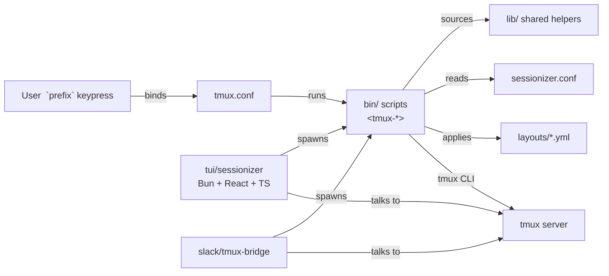

# tmux Productivity Suite / tmux 생산성 도구 모음

> A curated, opinionated tmux configuration plus a complete ecosystem of companion tools, shared libraries, declarative YAML layouts, a Bun/React/TypeScript TUI, and a Slack bridge — all designed for power users working across many projects and remote hosts.
>
> 큐레이션된 tmux 설정과, 함께 동작하는 풍부한 생태계(보조 도구, 공유 라이브러리, 선언적 YAML 레이아웃, Bun/React/TypeScript 기반 TUI, Slack 브리지)를 한 저장소에 담은, 다수 프로젝트와 원격 호스트를 다루는 파워 유저용 환경입니다.

---

## Table of Contents / 목차

- [Overview / 개요](#overview--개요)
- [Features / 기능](#features--기능)
- [Architecture / 아키텍처](#architecture--아키텍처)
- [Repository Layout / 저장소 구조](#repository-layout--저장소-구조)
- [Quick Start / 빠른 시작](#quick-start--빠른-시작)
- [Configuration / 설정](#configuration--설정)
- [Commands Reference / 명령어 레퍼런스](#commands-reference--명령어-레퍼런스)
- [TUI Sessionizer / 터미널 UI 세션나이저](#tui-sessionizer--터미널-ui-세션나이저)
- [Slack Bridge / 슬랙 브리지](#slack-bridge--슬랙-브리지)
- [Local Development / 로컬 개발](#local-development--로컬-개발)
- [Testing / 테스트](#testing--테스트)
- [Contributing / 기여](#contributing--기여)
- [License / 라이선스](#license--라이선스)

---

## Overview / 개요

This repository bundles a battle-tested `tmux.conf`, a `sessionizer.conf` for project discovery, and a curated set of companion binaries under `bin/`. It ships shared shell libraries under `lib/`, project-style window layouts under `layouts/`, a modern Terminal UI (`tui/sessionizer/`), and a Slack ↔ tmux bridge (`slack/tmux-bridge/`).

이 저장소는 실전에서 검증된 `tmux.conf`, 프로젝트 검색을 위한 `sessionizer.conf`, 그리고 `bin/` 디렉터리의 큐레이션된 보조 바이너리들을 함께 제공합니다. `lib/`의 공유 셸 라이브러리, `layouts/`의 프로젝트형 윈도우 레이아웃, 모던 터미널 UI(`tui/sessionizer/`), 그리고 Slack ↔ tmux 브리지(`slack/tmux-bridge/`)가 한 곳에서 동작합니다.

### Who is this for? / 사용 대상

| Audience / 대상 | Use case / 활용 사례 |
| --- | --- |
| Multi-project developers / 다수 프로젝트 개발자 | Jump between repos, save layouts per project, fast session creation / 저장소 간 빠른 이동, 프로젝트별 레이아웃 |
| DevOps / SRE engineers / DevOps·SRE 엔지니어 | SSH picker, per-host layouts, system stats, long-command notifications |
| Remote-first teams / 원격 우선 팀 | Slack bridge for sharing terminal access from chat / 채팅에서 터미널 공유 |
| tmux power users / tmux 파워 유저 | TUI sessionizer, sidebar, command palette, pane synchronization |

---

## Features / 기능

### Session management / 세션 관리
- **`tmux-sessionizer`** — project-aware session creation. Fuzzy-find a directory and attach or create a tmux session.
- **`tmux-sessionizer-tui`** — Bun + React + TypeScript TUI with live preview, create wizard, kill-confirm, and rename dialogs.
- **`tmux-session-cycle`**, **`tmux-session-jump`**, **`tmux-session-kill`**, **`tmux-session-rename`**, **`tmux-session-order`**, **`tmux-session-dashboard`**, **`tmux-session-icon`**, **`tmux-session-branch-log`**, **`tmux-session-export`**, **`tmux-session-sync`** — full session lifecycle controls.
- **`tmux-auto-attach`** — attach to a session automatically based on heuristics when tmux starts.

### Layouts and templates / 레이아웃과 템플릿
- **`tmux-layout-apply`** — apply declarative window layouts from YAML.
- **`tmux-template-create`** — bootstrap a new project template from the `layouts/` directory.
- Built-in layouts: `default`, `proxmox`, `resume`, `safework`, `safework2`, `splunk`, `blacklist`.

### Sidebar, palette, and navigation / 사이드바·팔레트·내비게이션
- **`tmux-sidebar`**, **`tmux-sidebar-init`**, **`tmux-sidebar-toggle`** — interactive session/window sidebar (powered by `lib/sidebar-render` and `lib/sidebar-colors`).
- **`tmux-command-palette`** — fuzzy command palette bound inside tmux.
- **`tmux-cheatsheet`** — searchable keybinding cheatsheet.
- **`tmux-responsive`** — auto-fit pane sizes to terminal dimensions.

### Git, files, and editing / Git·파일·편집
- **`tmux-git-status`**, **`tmux-git-uncommitted`** — surface git state in the status line or sidebar.
- **`tmux-file-open`**, **`tmux-copy-word`**, **`tmux-url-open`** — quick file/word/URL operations.
- **`tmux-opencode`** — open a buffer in the user's editor of choice.

### System and notifications / 시스템과 알림
- **`tmux-sys-stats`** — live CPU/RAM/load status in the status line.
- **`tmux-notify-long-command`** — desktop notification when long-running commands finish.

### Multi-host and remote work / 다중 호스트와 원격 작업
- **`tmux-ssh-picker`** — fuzzy-pick hosts from `~/.ssh/config` and open them in a new window.
- **`tmux-pane-sync`** — synchronize input across multiple panes for pair sessions.
- **`tmux-web-terminal`** — expose the current session through a web terminal.

### Slack bridge / 슬랙 브리지
- **`tmux-slack-bridge-setup`**, **`tmux-slack-bridge-start`** — connect Slack channels to tmux sessions; share terminal context with teammates from chat.

### Configuration tooling / 설정 도구
- **`tmux-config-reload`** — reload `tmux.conf` without losing the session.
- **`tmux-clipboard-history`** — recall previous clipboard entries inside tmux.
- **`tmux-bash-preexec`** — preexec hook for shell-aware features.

---

## Architecture / 아키텍처

The suite is layered: a single `tmux.conf` activates keybindings and binds them to small, focused shell scripts in `bin/`. Those scripts source shared helpers from `lib/`, read `sessionizer.conf` for project discovery, and consume declarative layouts from `layouts/`. The TUI sessionizer and the Slack bridge sit on top as optional, installable surfaces that call the same primitives (`tmux new-session`, `tmux send-keys`, etc.) over a stable contract.

이 스위트는 계층 구조를 가집니다. 단일 `tmux.conf`가 키 바인딩을 활성화하고 이를 `bin/`의 작고 단일 책임인 셸 스크립트와 연결합니다. 그 스크립트들은 `lib/`의 공유 헬퍼를 소싱하고, `sessionizer.conf`로 프로젝트를 검색하며, `layouts/`의 선언적 레이아웃을 사용합니다. TUI 세션나이저와 슬랙 브리지는 같은 프리미티브(`tmux new-session`, `tmux send-keys` 등)를 안정적인 인터페이스로 호출하는 선택형 최상위 인터페이스입니다.



Key contracts:

- `tmux.conf` is the single entry point. Every keybinding delegates to a script in `bin/`.
- `lib/*.sh` libraries (`sidebar-colors`, `sidebar-render`, `tmux-sessionizer-common`, `tmux-sessionizer-wizard`) are pure shell and contain no side effects on import.
- `layouts/*.yml` declare windows, panes, and commands. `tmux-layout-apply` is the sole consumer.
- `tui/sessionizer/` and `slack/tmux-bridge/` never bypass `bin/`; they call into the same scripts to keep behavior consistent.

핵심 계약:

- `tmux.conf`는 단일 진입점이며, 모든 키 바인딩은 `bin/`의 스크립트로 위임됩니다.
- `lib/*.sh` 라이브러리는 임포트 시 부수효과가 없는 순수 셸 코드입니다.
- `layouts/*.yml`은 윈도우·페인·명령을 선언하며, `tmux-layout-apply`가 유일한 소비자입니다.
- `tui/sessionizer/`와 `slack/tmux-bridge/`는 `bin/`을 우회하지 않으며, 일관된 동작을 위해 동일한 스크립트를 호출합니다.

---

## Repository Layout / 저장소 구조

```
.
├── AGENTS.md
├── CONTRIBUTING.md
├── LICENSE
├── OWNERS
├── README.md
├── sessionizer.conf
├── tmux.conf
├── bin/                          # All tmux-* companion scripts
│   ├── tmux-auto-attach
│   ├── tmux-bash-preexec
│   ├── tmux-cheatsheet
│   ├── tmux-clipboard-history
│   ├── tmux-command-palette
│   ├── tmux-config-reload
│   ├── tmux-copy-word
│   ├── tmux-file-open
│   ├── tmux-git-status
│   ├── tmux-git-uncommitted
│   ├── tmux-layout-apply
│   ├── tmux-notify-long-command
│   ├── tmux-opencode
│   ├── tmux-pane-sync
│   ├── tmux-responsive
│   ├── tmux-session-branch-log
│   ├── tmux-session-cycle
│   ├── tmux-session-dashboard
│   ├── tmux-session-export
│   ├── tmux-session-icon
│   ├── tmux-session-jump
│   ├── tmux-session-kill
│   ├── tmux-session-order
│   ├── tmux-session-rename
│   ├── tmux-session-sync
│   ├── tmux-sessionizer
│   ├── tmux-sessionizer-tui
│   ├── tmux-sidebar
│   ├── tmux-sidebar-init
│   ├── tmux-sidebar-toggle
│   ├── tmux-slack-bridge-setup
│   ├── tmux-slack-bridge-start
│   ├── tmux-ssh-picker
│   ├── tmux-sys-stats
│   ├── tmux-template-create
│   ├── tmux-url-open
│   └── tmux-web-terminal
├── lib/                          # Shared shell libraries
│   ├── sidebar-colors
│   ├── sidebar-render
│   ├── tmux-sessionizer-common
│   └── tmux-sessionizer-wizard
├── layouts/                      # Declarative window layouts
│   ├── blacklist.yml
│   ├── default.yml
│   ├── proxmox.yml
│   ├── resume.yml
│   ├── safework.yml
│   ├── safework2.yml
│   └── splunk.yml
├── tui/
│   └── sessionizer/              # Bun + React + TypeScript TUI
│       ├── AGENTS.md
│       ├── bunfig.toml
│       ├── package.json
│       ├── tsconfig.json
│       ├── src/
│       │   ├── App.tsx
│       │   ├── index.tsx
│       │   ├── bun-env.d.ts
│       │   ├── actions/
│       │   ├── components/
│       │   ├── hooks/
│       │   └── lib/
│       └── __tests__/
│           ├── config.test.ts
│           └── tmux.test.ts
├── docs/
│   ├── session-persistence-brainstorming.md
│   └── supermemory-governance.md
└── slack/
    └── tmux-bridge/              # Slack ↔ tmux integration
        └── AGENTS.md
```

---

## Quick Start / 빠른 시작

### 1. Prerequisites / 사전 요구사항

- tmux 3.2+ (earlier versions may work but are not tested)
- bash 4+ and zsh (for some helpers, e.g. `tmux-bash-preexec`)
- `fzf`, `ripgrep`, `git`
- For the TUI: [Bun](https://bun.sh) 1.x
- For the Slack bridge: a Slack workspace and a bot token with chat scopes

### 2. Install / 설치

```bash
# Clone and symlink into your dotfiles
git clone https://github.com/<your-org>/tmux-productivity-suite.git ~/src/tmux-suite

# Link tmux.conf and sessionizer.conf
ln -sf ~/src/tmux-suite/tmux.conf        ~/.tmux.conf
ln -sf ~/src/tmux-suite/sessionizer.conf ~/.config/tmux/sessionizer.conf

# Make every script executable
chmod +x ~/src/tmux-suite/bin/* ~/src/tmux-suite/lib/*

# Add bin/ and lib/ to PATH (example for ~/.bashrc)
export PATH="$HOME/src/tmux-suite/bin:$PATH"
export TMUX_SUITE_LIB="$HOME/src/tmux-suite/lib"
```

Inside tmux, press `prefix + r` (or run `tmux-config-reload`) to activate the suite.

### 3. First run / 첫 실행

```bash
# Pick a project and create a session
tmux-sessionizer

# Or use the TUI
tmux-sessionizer-tui

# Apply a layout
tmux-layout-apply default

# Open the sidebar
tmux-sidebar-toggle
```

---

## Configuration / 설정

### `tmux.conf`

The main configuration file. It is small on purpose — most logic lives in `bin/` and `lib/`. Edit it to add or rebind keys; new bindings should call a script in `bin/` rather than embedding inline shell.

### `sessionizer.conf`

Drives `tmux-sessionizer` and `tmux-sessionizer-tui`. Typical contents include:

```yaml
search_paths:
  - ~/src
  - ~/work
  - ~/forks
max_depth: 4
ignored:
  - node_modules
  - .git
  - target
  - dist
default_layout: default
session_prefix: ""
```

### Layout files (`layouts/*.yml`)

Each YAML file declares a set of windows and panes with optional commands. Example skeleton:

```yaml
name: default
windows:
  - name: editor
    panes:
      - command: $EDITOR
      - command: git status -sb
  - name: shell
    panes:
      - command: ""
  - name: logs
    panes:
      - command: tail -F /tmp/app.log
```

Apply with `tmux-layout-apply <layout-name>` (without the `.yml` extension).

### Sidebar libraries

`lib/sidebar-colors` and `lib/sidebar-render` are sourced by `tmux-sidebar` and friends. They expose functions like `tmux_sidebar_render` and color helpers that can be customized per theme.

### TUI sessionizer

The TUI reads `sessionizer.conf` and respects the same `search_paths`. Theme tokens live in `tui/sessionizer/src/lib/theme.ts`.

---

## Commands Reference / 명령어 레퍼런스

All binaries live in `bin/` and follow the naming convention `tmux-<verb>`. Most accept `-h`/`--help` for usage.

### Sessions

| Command | Description / 설명 |
| --- | --- |
| `tmux-sessionizer` | Fuzzy-find a directory and attach/create a session / 디렉터리 퍼지 검색 후 세션 생성·접속 |
| `tmux-sessionizer-tui` | Launch the Bun/React TUI / TUI 실행 |
| `tmux-auto-attach` | Auto-attach based on current directory or env / 현재 디렉터리 기준 자동 접속 |
| `tmux-session-cycle` | Cycle to next/previous session / 세션 순환 |
| `tmux-session-jump` | Jump to a session by name / 이름으로 점프 |
| `tmux-session-kill` | Kill current or named session / 세션 종료 |
| `tmux-session-rename` | Rename a session / 세션 이름 변경 |
| `tmux-session-order` | Reorder sessions / 세션 순서 재정렬 |
| `tmux-session-dashboard` | Show a dashboard view / 대시보드 보기 |
| `tmux-session-icon` | Set or show a session icon / 세션 아이콘 설정 |
| `tmux-session-branch-log` | Log of git branches used per session / 세션별 브랜치 로그 |
| `tmux-session-export` | Export session metadata to JSON / 세션 메타데이터 내보내기 |
| `tmux-session-sync` | Sync a session to another host / 다른 호스트로 세션 동기화 |

### Layouts and templates

| Command | Description / 설명 |
| --- | --- |
| `tmux-layout-apply <name>` | Apply a layout from `layouts/` / 레이아웃 적용 |
| `tmux-template-create <name>` | Create a new layout template / 새 레이아웃 템플릿 생성 |

### Sidebar and palette

| Command | Description / 설명 |
| --- | --- |
| `tmux-sidebar` | Render the sidebar / 사이드바 렌더링 |
| `tmux-sidebar-init` | One-shot sidebar initialization / 사이드바 초기화 |
| `tmux-sidebar-toggle` | Toggle sidebar visibility / 사이드바 토글 |
| `tmux-command-palette` | Open the fuzzy command palette / 명령 팔레트 열기 |
| `tmux-cheatsheet` | Show the keybinding cheatsheet / 키 바인딩 치트시트 |
| `tmux-responsive` | Reflow panes to current terminal size / 현재 크기에 맞춰 페인 리플로우 |

### Editing, git, files

| Command | Description / 설명 |
| --- | --- |
| `tmux-git-status` | Render git status / git 상태 표시 |
| `tmux-git-uncommitted` | Show only uncommitted changes / 커밋 안 된 변경만 표시 |
| `tmux-file-open` | Fuzzy-open a file in the editor / 파일 퍼지 열기 |
| `tmux-copy-word` | Yank the word under the cursor / 커서 단어 복사 |
| `tmux-url-open` | Open the URL under the cursor / 커서 위 URL 열기 |
| `tmux-opencode` | Open the current buffer in $EDITOR / 현재 버퍼를 에디터로 열기 |

### System, notifications, remote

| Command | Description / 설명 |
| --- | --- |
| `tmux-sys-stats` | CPU/RAM/load in the status line / 상태 표시줄 시스템 정보 |
| `tmux-notify-long-command` | Desktop notification after long commands / 장시간 명령 알림 |
| `tmux-ssh-picker` | Fuzzy-pick an SSH host / SSH 호스트 퍼지 선택 |
| `tmux-pane-sync` | Synchronize input across panes / 페인 입력 동기화 |
| `tmux-web-terminal` | Expose session via web terminal / 웹 터미널로 노출 |

### Configuration and helpers

| Command | Description / 설명 |
| --- | --- |
| `tmux-config-reload` | Reload `tmux.conf` without losing state / 설정 리로드 |
| `tmux-clipboard-history` | Recall previous clipboard entries / 클립보드 이력 |
| `tmux-bash-preexec` | Preexec hook loader / preexec 훅 로더 |

### Slack bridge

| Command | Description / 설명 |
| --- | --- |
| `tmux-slack-bridge-setup` | One-time setup of the Slack bridge / 슬랙 브리지 1회 설정 |
| `tmux-slack-bridge-start` | Start the bridge daemon / 브리지 데몬 시작 |

---

## TUI Sessionizer / 터미널 UI 세션나이저

The TUI lives in `tui/sessionizer/` and is built with Bun, React, and TypeScript. It launches inside the terminal and exposes:

- A session list with live preview (commands, layout, git branch).
- A create wizard with steps for directory, layout, and name (`components/create-wizard.tsx`).
- A filter input (`components/filter-input.tsx`).
- Inline dialogs: kill-confirm, rename.
- Keyboard handling in `hooks/use-keyboard-handler.ts`.
- A pure data layer in `src/lib/` (`config.ts`, `dirs.ts`, `tmux.ts`, `state.ts`).
- Theme tokens in `src/lib/theme.ts`.

### Build and run / 빌드와 실행

```bash
cd tui/sessionizer
bun install
bun run dev        # development
bun run build      # production bundle
bun run start      # run the bundled TUI
```

The TUI shells out to the same `bin/` scripts as the keybindings, so behavior is consistent across surfaces.

---

## Slack Bridge / 슬랙 브리지

`slack/tmux-bridge/` exposes tmux sessions to Slack channels so teammates can watch or steer terminals from chat.

```bash
# One-time setup: writes a config file and registers the bot
tmux-slack-bridge-setup

# Start the bridge daemon (foreground or via systemd)
tmux-slack-bridge-start
```

The bridge intentionally calls into `bin/` rather than reimplementing tmux operations. See `slack/tmux-bridge/AGENTS.md` for protocol details and `docs/session-persistence-brainstorming.md` for cross-host persistence notes.

---

## Local Development / 로컬 개발

### Shell scripts

- All scripts target POSIX bash with optional zsh extensions; no shebang tricks beyond `#!/usr/bin/env bash`.
- Use `set -euo pipefail` at the top of new scripts.
- Source shared helpers with `. "$TMUX_SUITE_LIB/<library>"` rather than hard-coding paths.
- Keep new scripts in `bin/` self-contained: parse args, validate, then call `tmux` or compose other `tmux-*` commands.

### Libraries

- `lib/*.sh` files must be side-effect free on import. Define functions only.
- Add new helpers to an existing library when they fit, or create a new library under `lib/` and source it explicitly.

### TUI

- TypeScript strict mode is enabled (`tsconfig.json`).
- Bun is the runtime and bundler. No Node-specific APIs.
- Tests live in `tui/sessionizer/__tests__/` and use `bun test`.

### Adding a new script

1. Create `bin/tmux-<verb>` and make it executable.
2. If it needs helpers, add them to `lib/` or extend an existing library.
3. Bind it from `tmux.conf` (or instruct users to do so).
4. Document it in this README under the appropriate category.

---

## Testing / 테스트

### Shell

A lightweight smoke test loop is recommended:

```bash
# Lint every script
shellcheck bin/* lib/*

# Validate tmux.conf syntactically
tmux -f tmux.conf new-session -d \; source-file tmux.conf \; kill-server
```

### TUI

```bash
cd tui/sessionizer
bun test
```

Existing test files:

- `__tests__/config.test.ts` — config parsing and defaults.
- `__tests__/tmux.test.ts` — tmux command assembly.

### Layouts

YAML validity can be checked with any YAML linter; an optional `tmux-layout-apply --dry-run` is recommended when iterating on layouts.

---

## Contributing / 기여

Please read [`CONTRIBUTING.md`](./CONTRIBUTING.md) and [`AGENTS.md`](./AGENTS.md) before opening a pull request. Code owners are listed in [`OWNERS`](./OWNERS).

- Keep changes scoped: a new script, a new layout, or a small TUI improvement — not all three at once.
- Follow the conventions in `bin/` and `lib/`.
- Update this README when adding or renaming user-facing commands.
- Add tests for non-trivial logic in `tui/sessionizer/`.

기여 전 [`CONTRIBUTING.md`](./CONTRIBUTING.md)와 [`AGENTS.md`](./AGENTS.md)를 읽어 주세요. 코드 오너는 [`OWNERS`](./OWNERS)에 명시되어 있습니다.

- 변경 범위를 최소화하세요 (스크립트 1개, 레이아웃 1개, TUI 소폭 개선 등).
- `bin/`과 `lib/`의 컨벤션을 따르세요.
- 사용자 대상 명령을 추가/변경할 때 본 README를 함께 갱신하세요.
- `tui/sessionizer/`의 비자명한 로직에는 테스트를 추가하세요.

---

## License / 라이선스

This project is released under the terms described in [`LICENSE`](./LICENSE).

본 프로젝트는 [`LICENSE`](./LICENSE)에 명시된 조건 하에 배포됩니다.