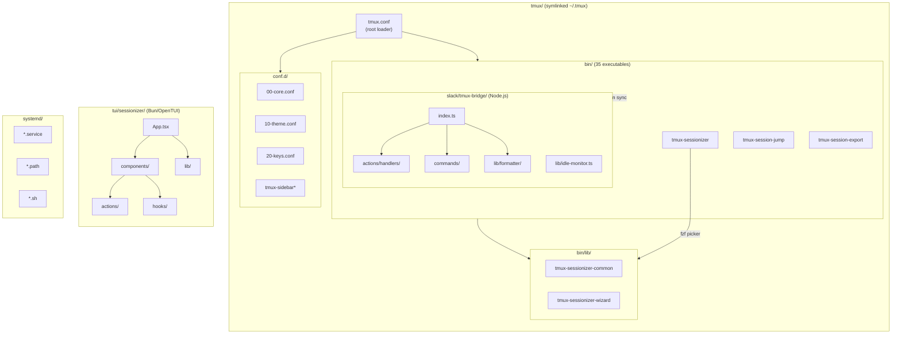

# TMUX SESSIONIZER

<!-- Logo Tagline -->
> bash-first tmux configuration and session-management toolkit

---

## Overview

**TMUX SESSIONIZER** is a comprehensive tmux configuration system designed for developers who work with multiple projects and sessions. It provides a unified interface for session discovery, creation, and management, with deep integrations for Slack, system services, and terminal UI applications.

The project is structured as a symlinked `~/.tmux` directory with a plugin-style architecture where core behavior lives in `conf.d/*.conf` and `bin/*` scripts. A nested Bun/OpenTUI sessionizer TUI runs at `tui/sessionizer`, and a Node.js Slack bridge operates at `slack/tmux-bridge`.

---

## 개요 (Korean)

**TMUX SESSIONIZER**는 여러 프로젝트와 세션으로 작업하는 개발자를 위해 설계된 종합 tmux 구성 시스템입니다. Slack, 시스템 서비스 및 터미널 UI 애플리케이션과의 심층 통합을 통해 세션 검색, 생성 및 관리를 위한 통합 인터페이스를 제공합니다.

프로젝트는 심볼릭 링크된 `~/.tmux` 디렉토리로 구조화되어 있으며, 플러그인 스타일 아키텍처에서 핵심 동작은 `conf.d/*.conf` 및 `bin/*` 스크립트에 있습니다. 중첩된 Bun/OpenTUI 세션라이저 TUI는 `tui/sessionizer`에서 실행되고, Node.js Slack 브리지는 `slack/tmux-bridge`에서 운영됩니다.

---

## Features

### Session Management

- **Intelligent Session Discovery**: Auto-scan configured directories for git repositories and project folders
- **Fuzzy Session Picker**: fzf-based session selection with preview and instant filtering
- **Session Creation Wizard**: Interactive multi-step wizard for new session setup
- **MRU Session Jump**: Quickly access most recently used sessions
- **Session Templates**: Create sessions from predefined layout templates
- **Session Export/Import**: Save and restore session window/pane layouts as YAML

### Terminal UI (TUI) Application

- **OpenTUI-based Interface**: Modern terminal user interface built with Bun and OpenTUI
- **Preview Panel**: Real-time preview of session contents and windows
- **Kill Confirmation**: Safe session termination with confirmation dialogs
- **Rename Support**: Rename existing sessions with validation
- **Layout Selection**: Visual layout picker for new windows

### Slack Integration

- **Bi-directional Slack Bridge**: Sync tmux sessions with Slack channels
- **Session Status Updates**: Automatic posting of session activity to Slack
- **Channel Synchronization**: Keep Slack channels in sync with tmux session states
- **Interactive Slash Commands**: Handle Slack slash commands for session management
- **Modal Support**: Interactive modal dialogs for session operations

### System Integration

- **Systemd Services**: Background services for session persistence and monitoring
- **Resurrect Support**: Automatic session save/restore using tmux-resurrect
- **Session Watching**: File system watcher for automatic session management
- **Web Terminal**: ttyd-based web terminal access to tmux sessions

---

## Architecture



---

## Automation Inventory

### GitHub Actions Workflows

#### CI/CD Workflows

| File | Purpose |
|------|---------|
| `01_branch-to-pr.yml` | Auto-create PR from branch |
| `02_issue-to-branch.yml` | Auto-create branch from issue |
| `03_pr-checks.yml` | PR validation checks (reusable) |
| `04_actionlint.yml` | Workflow file linting |
| `05_gitleaks.yml` | Secrets scanning (reusable) |
| `06_codeql.yml` | CodeQL security analysis |
| `07_dependency-review.yml` | Dependency vulnerability review |
| `08_scorecard.yml` | OpenSSF Scorecard assessment |
| `09_semantic-pr.yml` | Semantic PR title validation |
| `13_pr-auto-merge.yml` | Auto-merge approved PRs |
| `60_ci-auto-heal.yml` | Auto-heal failing CI pipelines |
| `ci.yml` | Main CI pipeline |
| `labeler.yml` | Auto-label PRs/issues |

#### Code Review & Automation

| File | Purpose |
|------|---------|
| `10_pr-review.yml` | PR review automation (reusable) |
| `14_bot-auto-fix.yml` | Bot-triggered auto-fixes |
| `security/11_pr-review.yml` | Security-focused PR review |

#### Release & Publishing

| File | Purpose |
|------|---------|
| `24_release-notes.yml` | Generate release notes |
| `25_release-publish.yml` | Publish release artifacts |

#### Dependency Management

| File | Purpose |
|------|---------|
| `12_dependabot-auto-merge.yml` | Auto-merge Dependabot PRs |

#### Repository Maintenance

| File | Purpose |
|------|---------|
| `15_merged-pr-cleanup.yml` | Cleanup after PR merge |
| `18_issue-management.yml` | Issue state management (reusable) |
| `19_issue-backfill.yml` | Backfill issue metadata |
| `20_readme-gen.yml` | Auto-generate README |
| `21_docs-sync.yml` | Sync documentation |
| `29_downstream-health-check.yml` | Check downstream dependencies |
| `37_ci-failure-issues.yml` | Auto-create issues for CI failures |
| `42_reusable-docs-sync.yml` | Reusable docs sync workflow |
| `43_reusable-issue-management.yml` | Reusable issue management |
| `44_reusable-pr-checks.yml` | Reusable PR checks |
| `45_reusable-gitleaks.yml` | Reusable gitleaks workflow |

#### Automation Triggers

| File | Purpose |
|------|---------|
| `auto-merge.yml` | General auto-merge handler |
| `welcome.yml` | New contributor welcome message |

### Core Automation Tools

#### Bash Scripts (`bin/`)

| Script | Lines | Purpose |
|--------|-------|---------|
| `tmux-sessionizer` | 144 | fzf session picker + creation wizard |
| `tmux-sessionizer-tui` | - | Launch TUI sessionizer |
| `tmux-sidebar` | 68 | Tree sidebar display engine |
| `tmux-sidebar-init` | - | Sidebar initialization |
| `tmux-sidebar-toggle` | - | Toggle sidebar visibility |
| `tmux-session-cycle` | - | PgUp/PgDn session rotation |
| `tmux-session-kill` | - | Safe session termination |
| `tmux-session-rename` | - | Session rename with validation |
| `tmux-session-sync` | 137 | Sync tmux with Slack channels |
| `tmux-session-jump` | 19 | MRU fzf session picker |
| `tmux-session-icon` | 21 | Nerd Font icon mapper |
| `tmux-session-export` | 50 | Export session layout to YAML |
| `tmux-session-branch-log` | 17 | Log session→branch on switch |
| `tmux-session-dashboard` | 75 | Formatted session table popup |
| `tmux-template-create` | 53 | Quick-create from templates |
| `tmux-layout-apply` | 94 | Apply YAML layout templates |
| `tmux-responsive` | 67 | Width-tiered statusbar rendering |
| `tmux-slack-bridge-start` | 124 | Bridge startup wrapper |
| `tmux-slack-bridge-setup` | 154 | Interactive Slack setup wizard |
| `tmux-git-status` | 28 | Git branch + status for statusbar |
| `tmux-git-uncommitted` | 74 | Track uncommitted changes |
| `tmux-session-order` | 8 | Sessions sorted by MRU |
| `tmux-sys-stats` | 13 | CPU/MEM for statusbar |
| `tmux-web-terminal` | 36 | ttyd web terminal launcher |
| `tmux-opencode` | - | OpenCode session launcher |
| `tmux-command-palette` | 46 | fzf action picker |
| `tmux-url-open` | 18 | URL extraction via fzf |
| `tmux-file-open` | 38 | File path extraction via fzf |
| `tmux-ssh-picker` | 23 | SSH config host picker |
| `tmux-clipboard-history` | 22 | tmux buffer ring browser |
| `tmux-copy-word` | 17 | Smart word copy |
| `tmux-pane-sync` | 16 | Synchronize-panes toggle |
| `tmux-config-reload` | 15 | Reload config with diff |
| `tmux-notify-long-command` | 16 | Desktop notification for long commands |
| `tmux-bash-preexec` | 31 | Sourcing preexec hook |
| `tmux-cheatsheet` | 87 | Keybinding reference popup |

#### Shared Libraries (`bin/lib/`)

| Library | Purpose |
|---------|---------|
| `tmux-sessionizer-common` | Shared sessionizer functions |
| `tmux-sessionizer-wizard` | Creation wizard logic |
| `sidebar-colors` | Sidebar color definitions |
| `sidebar-render` | Sidebar rendering engine |

---

## Quick Start

### Prerequisites

- **tmux** ≥ 3.0
- **bash** ≥ 4.0
- **fzf** ≥ 0.25.0
- **Bun** ≥ 1.0 (for TUI)
- **Node.js** ≥ 18 (for Slack bridge)

### Installation

```bash
# Clone repository
git clone https://github.com/<owner>/tmux-sessionizer.git ~/.tmux

# Create symlink (if not already symlinked)
ln -sf ~/.tmux ~/.tmux

# Reload tmux configuration
tmux source-file ~/.tmux/tmux.conf
```

### Session Discovery Configuration

Edit `sessionizer.conf` to configure scan directories:

```bash
# Default: scan home directory for git repos
SCAN_DIR="$HOME"
EXTRA_DIRS=()
```

### Launching Sessionizer

```bash
# fzf-based picker
tmux-sessionizer

# TUI application
tmux-sessionizer-tui

# MRU quick jump
tmux-session-jump
```

---

## Local Development

### Repository Structure

```
tmux-sessionizer/
├── tmux.conf              # Root tmux configuration
├── sessionizer.conf       # Session discovery settings
├── bin/                   # Executable scripts (35 files)
├── bin/lib/               # Shared library modules
├── conf.d/                # tmux config fragments
├── tui/
│   └── sessionizer/       # Bun/OpenTUI TUI application
├── slack/
│   └── tmux-bridge/       # Node.js Slack integration
├── wezterm/               # Wezterm terminal config
└── systemd/               # Systemd service files
```

### TUI Development

```bash
cd tui/sessionizer

# Install dependencies
bun install

# Run tests
bun test

# Start development server
bun run dev

# Build production bundle
bun run build
```

### Slack Bridge Development

```bash
cd slack/tmux-bridge

# Install dependencies
bun install  # or: npm install

# Run tests
bun test     # or: npm test

# Start bridge (development)
bun run dev  # or: npm run dev

# Production build
bun run build
```

### Running Tests

```bash
# TUI tests
cd tui/sessionizer && bun test

# Slack bridge tests
cd slack/tmux-bridge && bun test

# All tests (from root)
make test  # if Makefile exists
```

---

## Commands Reference

### Session Management

| Command | Description |
|---------|-------------|
| `tmux-sessionizer` | Main session picker with fzf |
| `tmux-session-jump` | Jump to most recently used session |
| `tmux-session-kill` | Kill session with confirmation |
| `tmux-session-rename` | Rename session interactively |
| `tmux-session-export` | Export current layout to YAML |
| `tmux-layout-apply` | Apply YAML layout to session |
| `tmux-template-create` | Create from preset template |

### Sidebar Commands

| Command | Description |
|---------|-------------|
| `tmux-sidebar` | Show tree sidebar |
| `tmux-sidebar-toggle` | Toggle sidebar visibility |
| `tmux-sidebar-init` | Initialize sidebar for new session |

### Slack Integration

| Command | Description |
|---------|-------------|
| `tmux-session-sync` | Sync session state to Slack |
| `tmux-slack-bridge-start` | Start Slack bridge service |
| `tmux-slack-bridge-setup` | Interactive Slack app setup |

### Utility Commands

| Command | Description |
|---------|-------------|
| `tmux-session-cycle` | Cycle through sessions (PgUp/PgDn) |
| `tmux-session-icon` | Get icon for session name |
| `tmux-session-dashboard` | Show session dashboard popup |
| `tmux-git-status` | Show git status in statusbar format |
| `tmux-opencode` | Launch session in OpenCode |
| `tmux-command-palette` | Show fzf action picker |
| `tmux-url-open` | Extract and open URLs from pane |
| `tmux-ssh-picker` | Pick SSH host from config |
| `tmux-clipboard-history` | Browse tmux buffer history |
| `tmux-cheatsheet` | Show keybinding cheatsheet |

---

## Configuration

### tmux.conf

The root configuration sources all `conf.d/*.conf` files in order:

```
tmux.conf
├── conf.d/00-core.conf      # Terminal baseline, env propagation
├── conf.d/10-theme.conf     # Tokyo Night palette, pane borders
├── conf.d/20-keys.conf      # Keybindings (prefix: C-a)
├── conf.d/25-sidebar.conf   # Sidebar integration
└── ...                      # Additional modules
```

### sessionizer.conf

```bash
# Directories to scan for sessions
SCAN_DIR="$HOME"

# Additional directories
EXTRA_DIRS=()

# Session naming patterns
NAME_PATTERN="*"
```

### Environment Variables

| Variable | Default | Description |
|----------|---------|-------------|
| `TMUX_SESSIONIZER_SCAN_DIR` | `$HOME` | Base directory to scan |
| `TMUX_SESSIONIZER_FZF_OPTS` | `` | Additional fzf options |
| `TMUX_SLACK_WEBHOOK_URL` | - | Slack webhook for notifications |
| `TMUX_SLACK_CHANNEL` | - | Default Slack channel |

---

## Contribution Guide

### Contributing Workflows

This project uses automated workflows for contribution management:

1. **Issue to Branch**: `02_issue-to-branch.yml` automatically creates branches from issues
2. **Branch to PR**: `01_branch-to-pr.yml` converts branches to PRs
3. **PR Checks**: `03_pr-checks.yml` validates PRs before review
4. **PR Review**: `10_pr-review.yml` provides automated code review
5. **Auto Merge**: `13_pr-auto-merge.yml` merges approved PRs

### Development Standards

- All bash scripts must pass `shellcheck`
- All workflows must pass `actionlint`
- Commit messages follow conventional commits
- PR titles follow semantic format

### Running Linters Locally

```bash
# Lint workflow files
actionlint

# Lint bash scripts
shellcheck bin/*

# Scan for secrets
gitleaks detect --source .
```

### Submitting Changes

1. Create issue describing the change
2. Wait for branch creation (automation)
3. Develop on branch
4. Open PR with semantic title
5. Await automated checks and review
6. Auto-merge when approved

---

## External Integrations

### OpenCode Integration

- **Endpoint**: `https://bot.jclee.me`
- Sessions can be launched directly in OpenCode

### CLI Proxy API

- **Endpoint**: `https://cliproxy.jclee.me/v1`
- Used for AI-assisted code review and automation

### qodo-ai/pr-agent

- **Repository**: `qodo-ai/pr-agent`
- PR review and automation powered by AI

---

## License

See [LICENSE](./LICENSE) file for details.

---

## Owners

See [OWNERS](./OWNERS) file for project maintainers.
